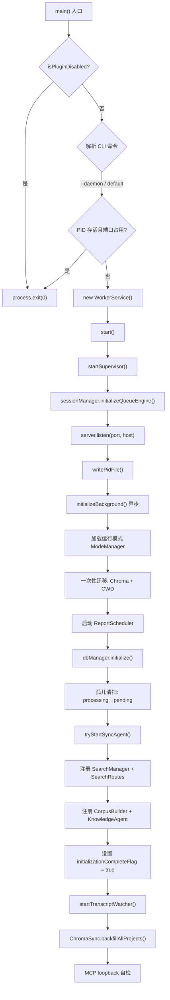
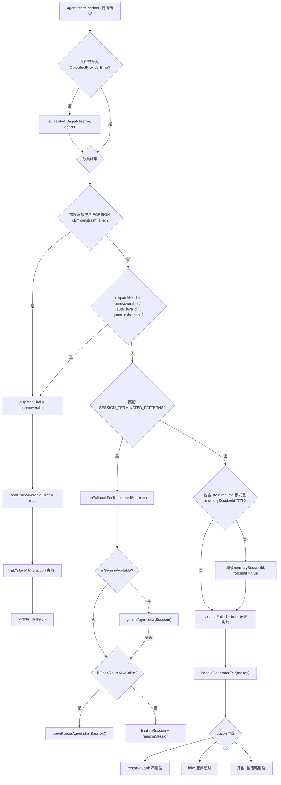
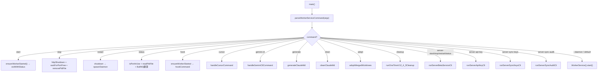

# worker-service.ts 需求说明

> 源文件：src/services/worker-service.ts ｜ 类型：源码 ｜ 行数：1673 ｜ 所属模块：worker-service ｜ 分析日期：2026-07-23

## 1. 文件定位总述

WorkerService 是 claude-mem 系统的核心进程入口与编排中枢。它以 Express HTTP 服务器形式运行在用户本地端口上，承载全部 REST API 路由（会话、搜索、查看器、设置、同步、报告等），同时负责 AI Provider（Claude/Gemini/OpenRouter/Qwen）的会话生命周期管理、后台任务调度（Chroma 同步、Transcript 监听、定时报告、Worktree 领养）以及 SyncAgent 启停。文件也是 CLI 入口，通过 `main()` 函数解析命令行参数分发为 `start`/`stop`/`restart`/`status`/`hook`/`server-*` 等子命令。在调用链中，它上承 Hook 层（通过 `ensureWorkerStarted` 保证 HTTP 服务可用），下启各 Worker 子模块（DatabaseManager、SessionManager、各 Provider、SearchManager 等）以及基础设施层（ProcessManager、HealthMonitor、GracefulShutdown）。

## 2. 功能需求

### 2.1 HTTP 服务器生命周期

| 编号 | 需求描述（系统应当…） | 触发条件 / 输入 | 处理规则与输出 | 证据 |
|------|----------------------|----------------|---------------|------|
| FR-Lifecycle-01 | 系统应当启动 Worker 进程并监听指定端口和绑定地址 | CLI 子命令 `--daemon` 或 `start` | 读取 `getWorkerPort()` / `resolveBindAddress()` 计算端口和地址；启动 Supervisor、初始化 QueueEngine、创建 HTTP Server 监听；写入 PID 文件；向 Supervisor 注册进程；输出启动日志 | `src/services/worker-service.ts:369-402` |
| FR-Lifecycle-02 | 系统应当在启动前拒绝重复实例 | PID 文件已存在且进程存活，或端口已被占用 | 读取 PID 文件并调用 `verifyPidFileOwnership`；检查 `isPortInUse`；若已运行则直接 `process.exit(0)` | `src/services/worker-service.ts:1583-1596` |
| FR-Lifecycle-03 | 系统应当按顺序执行后台初始化：模式加载 → 一次性迁移 → 报告调度器 → 数据库初始化 → 搜索服务注册 → Transcript 监听 → Chroma 回填 → MCP 自检 | `start()` 调用后异步触发 | `initializeBackground()` 按上述顺序依次执行；每个阶段独立捕获异常不影响后续阶段；DB 初始化完成后设置 `initializationCompleteFlag = true` 并 resolve Promise | `src/services/worker-service.ts:404-556` |
| FR-Lifecycle-04 | 系统应当在关闭时依次停止：settings watcher、transcript watcher、报告调度器，然后执行优雅关闭（HTTP Server、SessionManager、MCP Client、DB、Chroma） | `shutdown()` 被调用 | 移除 settings.json 文件监听、停止 TranscriptWatcher、停止 ReportScheduler、调用 `performGracefulShutdown` | `src/services/worker-service.ts:979-1001` |

### 2.2 路由注册与请求守卫

| 编号 | 需求描述（系统应当…） | 触发条件 / 输入 | 处理规则与输出 | 证据 |
|------|----------------------|----------------|---------------|------|
| FR-Routes-01 | 系统应当在 Server 模式下对所有路由前置 `serverApiGate` 中间件 | 角色 `role === 'server'` | `registerRoutes()` 中在所有业务路由前挂载 `serverApiGate(adminSessions, serverAccessToken)`，实现默认拒绝策略 | `src/services/worker-service.ts:290-292` |
| FR-Routes-02 | 系统应当在数据库初始化未完成时对 `/api` 和 `/v1` 路径的请求返回 503 | 请求到达 `/api` 或 `/v1` 路径且 `initializationCompleteFlag === false`（排除 `/chroma/status`、`/health`、`/readiness`、`/version`） | 返回 `503` JSON `{ error: 'Service initializing', message: 'Database is still initializing, please retry' }` | `src/services/worker-service.ts:311-328` |
| FR-Routes-03 | 系统应当在上下文注入请求初始化未完成时返回空内容 | GET `/api/context/inject` 请求且 `initializationCompleteFlag === false` 或 `searchRoutes` 未就绪 | 返回 `200` JSON `{ content: [{ type: 'text', text: '' }] }` | `src/services/worker-service.ts:301-309` |
| FR-Routes-04 | 系统应当注册以下路由组：ViewerRoutes、SessionRoutes、DataRoutes、ReportRoutes、DailyReportRoutes、SettingsRoutes、LogsRoutes、MemoryRoutes、ServerV1Routes、ChromaRoutes、AdminRoutes、SyncStatusRoutes、SearchRoutes、CorpusRoutes | 构造函数调用 `registerRoutes()` | 逐一创建路由实例并注册到 Server；SearchRoutes 在 DB 初始化后才注册 | `src/services/worker-service.ts:279-367` |
| FR-Routes-05 | 系统应当在 Server 模式下额外注册 UsersRoutes、AuthRoutes、SyncRoutes；Client 模式下不注册 | `isServerMode === true` | 条件注册，注释说明在 Client 模式下跳过以避免返回误导性的单用户列表 | `src/services/worker-service.ts:353-366` |

### 2.3 AI 会话处理

| 编号 | 需求描述（系统应当…） | 触发条件 / 输入 | 处理规则与输出 | 证据 |
|------|----------------------|----------------|---------------|------|
| FR-Session-01 | 系统应当根据当前配置选择活跃的 AI Provider（Qwen > OpenRouter > Gemini > Claude，前两者需 `isQwenSelected/isOpenRouterSelected` 且 `isAvailable`） | 调用 `getActiveAgent()` | 按优先级链返回 Provider 实例；Qwen 可用则优先（不论是否 selected） | `src/services/worker-service.ts:652-666` |
| FR-Session-02 | 系统应当启动会话处理器，驱动 AI Provider 执行会话生成 | 调用 `startSessionProcessor(session, source)` | 重置已中止的 AbortController；调用 `agent.startSession()`；记录 `lastGeneratorActivity`；通过 `.catch().finally()` 处理错误和退出 | `src/services/worker-service.ts:701-827` |
| FR-Session-03 | 系统应当对不可恢复错误（unrecoverable/auth_invalid/quota_exhausted）终止生成器且不重启 | 生成器抛出 ClassifiedProviderError 且 kind 为上述之一 | 设置 `hadUnrecoverableError = true`；记录 `lastAiInteraction`；日志标记 `will NOT restart` | `src/services/worker-service.ts:748-766` |
| FR-Session-04 | 系统应当对 SQLite 外键约束失败直接判定为不可恢复（不依赖 Provider 分类器） | 错误消息包含 `FOREIGN KEY constraint failed` | 在分类器之前拦截，将 `dispatchKind` 设为 `'unrecoverable'` | `src/services/worker-service.ts:742-746` |
| FR-Session-05 | 系统应当检测会话终止错误并触发备用处理流程（Gemini → OpenRouter → 放弃并清理） | 错误匹配 `SESSION_TERMINATED_PATTERNS` 中的模式 | 调用 `runFallbackForTerminatedSession`；依次尝试 Gemini 和 OpenRouter；最终调用 `finalizeSession` 并移除 | `src/services/worker-service.ts:768-774, 845-890` |
| FR-Session-06 | 系统应当检测过时恢复失败并清除 `memorySessionId` 以触发全新启动 | 错误消息包含 `aborted by user` 或 `No conversation found` 且 `session.memorySessionId` 存在 | 将 DB 中 `memorySessionId` 置 null；设置 `session.forceInit = true` | `src/services/worker-service.ts:777-788` |
| FR-Session-07 | 系统应当在生成器退出时通过 `handleGeneratorExit` 进行统一收尾 | 生成器 Promise settled | 翻译中止原因（`restart-guard`/`idle`/原始 reason）；调用 `handleGeneratorExit` 传入重启回调 | `src/services/worker-service.ts:803-826` |
| FR-Session-08 | 系统应当在启动时将所有 `status = 'processing'` 的 pending_messages 重置为 `pending`（孤儿清扫） | DB 初始化完成后 | 执行 UPDATE SQL 扫描并重置；记录被回收的行数 | `src/services/worker-service.ts:474-482` |

### 2.4 同步代理（SyncAgent）

| 编号 | 需求描述（系统应当…） | 触发条件 / 输入 | 处理规则与输出 | 证据 |
|------|----------------------|----------------|---------------|------|
| FR-Sync-01 | 系统应当在 Client 模式下、同步启用且上游 URL 非空时启动 SyncAgent | `initializeBackground()` 中的同步初始化阶段 | 调用 `tryStartSyncAgent()`；读取 settings.json 中的同步配置（upstream URL、interval、batch size、auth mode 等）；创建 SyncAgent 并启动 | `src/services/worker-service.ts:492-498, 906-947` |
| FR-Sync-02 | 系统应当在首次启动 SyncAgent 失败时（配置不完整）监听 settings.json 变更，待配置就绪后自动重试 | `tryStartSyncAgent()` 返回 false | 调用 `watchSyncSettings()`；通过 `watchFile` 轮询 settings.json（间隔 1000ms，去抖 200ms）；成功后自动停止监听 | `src/services/worker-service.ts:955-977` |
| FR-Sync-03 | 系统应当将 SyncAgent 配置参数做安全边界约束 | 读取 intervalMs / batchSize / retryMax | `intervalMs` 下限 5000；`batchSize` 下限 1；`retryMax` 下限 0；`authMode` 只接受 `none/apikey/jwt/mtls` 四选一，否则回退为 `none` | `src/services/worker-service.ts:922-928` |

### 2.5 Transcript 监听

| 编号 | 需求描述（系统应当…） | 触发条件 / 输入 | 处理规则与输出 | 证据 |
|------|----------------------|----------------|---------------|------|
| FR-Transcript-01 | 系统应当根据配置决定是否启动 Transcript 监听器 | `startTranscriptWatcher(settings)` 被调用 | 检查 `CLAUDE_MEM_TRANSCRIPTS_ENABLED !== 'false'`；检查配置文件存在性；过滤 Codex 原生 hook 已覆盖的 watch；活跃 watch 为 0 时跳过；启动失败时静默降级 | `src/services/worker-service.ts:590-650` |

### 2.6 定时报告调度

| 编号 | 需求描述（系统应当…） | 触发条件 / 输入 | 处理规则与输出 | 证据 |
|------|----------------------|----------------|---------------|------|
| FR-Report-01 | 系统应当在后台初始化时启动报告调度器 | `initializeBackground()` | 创建 `ReportScheduler(dbManager)` 并调用 `start()`；失败不阻塞其他初始化步骤 | `src/services/worker-service.ts:427-432` |

### 2.7 Chroma 向量同步

| 编号 | 需求描述（系统应当…） | 触发条件 / 输入 | 处理规则与输出 | 证据 |
|------|----------------------|----------------|---------------|------|
| FR-Chroma-01 | 系统应当根据 `CLAUDE_MEM_CHROMA_ENABLED` 设置决定是否初始化 ChromaMcpManager | `initializeBackground()` 中 Chroma 部分 | 设置不为 `'false'` 时创建 `ChromaMcpManager.getInstance()`（懒连接）；禁用时记录日志并跳过 | `src/services/worker-service.ts:463-469` |
| FR-Chroma-02 | 系统应当在初始化完成后异步执行全项目 Chroma 回填 | `initializationCompleteFlag = true` 之后 | 调用 `ChromaSync.backfillAllProjects()`；失败仅记录日志不阻塞 | `src/services/worker-service.ts:537-543` |

### 2.8 MCP 自检

| 编号 | 需求描述（系统应当…） | 触发条件 / 输入 | 处理规则与输出 | 证据 |
|------|----------------------|----------------|---------------|------|
| FR-MCP-01 | 系统应当在初始化完成后执行 MCP Server 的 loopback 自检连接 | `mcpServerPath` 文件存在 | 启动 StdioClientTransport 连接本进程的 MCP Server；设置 60 秒超时；连接成功后立即关闭 transport；失败仅记录 debug/warn 日志 | `src/services/worker-service.ts:558-588` |

### 2.9 CLI 命令分发

| 编号 | 需求描述（系统应当…） | 触发条件 / 输入 | 处理规则与输出 | 证据 |
|------|----------------------|----------------|---------------|------|
| FR-CLI-01 | 系统应当解析并分发以下命令：`start`/`stop`/`restart`/`status`/`hook`/`cursor`/`gemini-cli`/`generate`/`clean`/`adopt`/`cleanup`/`server-*`/`--daemon` | CLI 入口 `main()` | 通过 `parseWorkerServiceCommand` 解析 argv；按 switch-case 分发；每个命令完成后 `process.exit(0)` | `src/services/worker-service.ts:1349-1623` |
| FR-CLI-02 | 系统应当在插件被禁用时静默退出（对 start/hook/restart/--daemon 命令） | `isPluginDisabledInClaudeSettings()` 返回 true | 直接 `process.exit(0)` | `src/services/worker-service.ts:1352-1355` |
| FR-CLI-03 | 系统应当处理 Server API Key 的 create/list/revoke 子命令 | `server api-key create|list|revoke` | 直接打开 SQLite DB 创建/列出/撤销 API Key；输出 JSON 到 stdout | `src/services/worker-service.ts:1127-1192` |
| FR-CLI-04 | 系统应当处理 Sync Keys 的 create/list/revoke 子命令（T-30） | `server sync-keys create|list|revoke` | 创建时要求 `--user <LABEL>` 参数；Key 绑定 `sync:push` scope 和 `boundUserLabel` | `src/services/worker-service.ts:1194-1263` |
| FR-CLI-05 | 系统应当处理 Sync Audit 查询（T-27） | `server sync-audit --user <LABEL> [--since DATE] [--until DATE]` | 查询 `sync_inbox` 表按 user_label 和 source_table 分组聚合；输出人类可读的汇总表格 | `src/services/worker-service.ts:1265-1347` |
| FR-CLI-06 | 系统应当处理 Worktree Adoption | `adopt [--dry-run] [--branch <branch>] [--cwd <path>]` | 调用 `adoptMergedWorktrees`；输出扫描结果统计（扫描数、合并分支、领养数等） | `src/services/worker-service.ts:1527-1562` |
| FR-CLI-07 | 系统应当在 status 命令中额外查询 BullMQ 队列健康状态 | `status` 命令且队列引擎为 BullMQ | 通过 HTTP 请求 `/api/health` 获取 Redis 连接信息并输出 | `src/services/worker-service.ts:1626-1658` |

### 2.10 SSE 广播

| 编号 | 需求描述（系统应当…） | 触发条件 / 输入 | 处理规则与输出 | 证据 |
|------|----------------------|----------------|---------------|------|
| FR-SSE-01 | 系统应当在处理队列有变化时广播处理状态 | SessionManager 触发 `onPendingMutate` 回调 | 查询活跃工作量（`getTotalActiveWork`）和活跃会话数；通过 SSE 广播 `{ type: 'processing_status', isProcessing, queueDepth }` | `src/services/worker-service.ts:1003-1021` |

## 3. 业务规则与约束

### 3.1 角色（Client/Server）差异规则

- **绑定地址规则**（`src/services/worker-service.ts:139-153`）：Client 模式始终绑定到 `WORKER_HOST` 默认值（127.0.0.1），防止意外暴露到局域网。Server 模式优先读取 `CLAUDE_MEM_SERVER_BIND_HOST` 设置，回退到 `WORKER_HOST`。非回环地址绑定会触发警告日志。
- **路由可见性规则**（`src/services/worker-service.ts:282, 353-366`）：Server 模式下所有路由前置 `serverApiGate` 实现默认拒绝；额外注册 UsersRoutes、AuthRoutes、SyncRoutes。Client 模式下不注册这些路由，避免返回误导性数据。
- **SyncAgent 仅 Client 模式可用**（`src/services/worker-service.ts:912`）：`role !== 'client'` 时跳过 SyncAgent 启动。

### 3.2 Provider 选择优先级

优先级链定义于 `getActiveAgent()`（`src/services/worker-service.ts:652-666`）：
1. `isQwenSelected() && isQwenAvailable()` → QwenProvider
2. `isOpenRouterSelected() && isOpenRouterAvailable()` → OpenRouterProvider
3. `isGeminiSelected() && isGeminiAvailable()` → GeminiProvider
4. `isQwenAvailable()`（不要求 selected）→ QwenProvider（推断：作为 Claude 的高可用备选）
5. 兜底 → ClaudeProvider（SDK）

### 3.3 错误分类与恢复策略

Provider 错误通过 `ClassifiedProviderError.kind` 分发（`src/services/worker-service.ts:734-766`）：
- **unrecoverable / auth_invalid / quota_exhausted**：终止生成器，不重启，记录 `lastAiInteraction` 失败状态
- **FK 约束失败**：优先于 Provider 分类器拦截，直接判定为 unrecoverable（`src/services/worker-service.ts:742-746`）
- **会话终止模式**（`src/services/worker-service.ts:829-835`）：触发备用 Provider 链（Gemini → OpenRouter → 放弃）
- **过时恢复模式**（`src/services/worker-service.ts:777-788`）：清除 `memorySessionId` 强制全新启动
- **其他错误**：标记 `sessionFailed = true`，由 `handleGeneratorExit` 处理重启逻辑

### 3.4 启动安全约束

- **去重保护**（`src/services/worker-service.ts:1583-1596`）：PID 存活 + 端口占用双重检查；`verifyPidFileOwnership` 验证 PID 进程归属。
- **未处理异常策略**（`src/services/worker-service.ts:1598-1606`）：`unhandledRejection` 仅记录日志；`uncaughtException` 仅记录日志且不退出——保持 HTTP 服务可用。
- **端口冲突降级**（`src/services/worker-service.ts:1610-1621`）：`EADDRINUSE` 时检查端口上是否已有健康服务，若有则静默退出（另一个 worker 已占用）。

### 3.5 初始化屏障

- 所有 `/api` 和 `/v1` 路径（除 `/chroma/status`/`/health`/`/readiness`/`/version`）在 `initializationCompleteFlag === false` 时返回 503（`src/services/worker-service.ts:311-328`）。
- `initializationComplete` Promise 用于协调 worktree 领养等后续任务在 DB 就绪后执行（`src/services/worker-service.ts:439-461`）。

## 4. 对外暴露

### 4.1 导出符号

| 符号 | 类型 | 用途 |
|------|------|------|
| `WorkerService` | class | 核心服务类，实现 `WorkerRef` 接口 |
| `StatusOutput` | interface | CLI 状态输出结构体 |
| `buildStatusOutput()` | function | 构造 CLI 状态输出 JSON |
| `ensureWorkerStarted()` | async function | 确保 Worker 进程启动的入口 |
| `isPluginDisabledInClaudeSettings` | re-export | 从 `plugin-state.js` 再导出（`src/services/worker-service.ts:22-23`） |

### 4.2 公开属性（public）

| 属性 | 类型 | 用途 |
|------|------|------|
| `sseBroadcaster` | SSEBroadcaster | 公开的 SSE 广播器实例（`src/services/worker-service.ts:168`） |
| `syncAgent` | `{ scheduleSoon(): void } \| undefined` | 延迟赋值的同步代理，调用方必须使用 `?.scheduleSoon()`（`src/services/worker-service.ts:188`） |

### 4.3 HTTP 路由端点

WorkerService 通过 `registerRoutes()` 注册了以下路由组（共约 15 个 Route 类），覆盖 `/api/*` 和 `/v1/*` 路径空间：

| 路由组 | 典型路径 | 模式可见性 |
|--------|---------|-----------|
| ChromaRoutes | `/chroma/*` | 全模式 |
| AdminRoutes | `/api/admin/*` | 全模式 |
| SyncStatusRoutes | `/api/sync/status` | 全模式（`src/services/worker-service.ts:299`） |
| ViewerRoutes | `/api/viewer/*` | 全模式 |
| SessionRoutes | `/api/sessions/*` | 全模式 |
| DataRoutes | `/api/data/*` | 全模式（Server 模式下需鉴权） |
| ReportRoutes | `/api/reports/*` | 全模式 |
| DailyReportRoutes | `/api/daily-reports/*` | 全模式 |
| SettingsRoutes | `/api/settings/*` | 全模式 |
| LogsRoutes | `/api/logs/*` | 全模式 |
| MemoryRoutes | `/api/memory/*` | 全模式 |
| ServerV1Routes | `/v1/*` | 全模式 |
| SearchRoutes | 搜索端点 | 全模式（DB 初始化后注册） |
| CorpusRoutes | `/api/corpus/*` | 全模式 |
| UsersRoutes | `/api/users/*` | 仅 Server |
| AuthRoutes | `/api/auth/*` | 仅 Server |
| SyncRoutes | `/api/sync/ingest` | 仅 Server |
| BetterAuthRoutes | 认证回调 | 全模式（preBodyParser） |

### 4.4 CLI 子命令

| 命令 | 功能 |
|------|------|
| `start` | 确保 Worker 启动，输出 status JSON |
| `stop` | HTTP 关闭 + 等待端口释放 + 删除 PID |
| `restart` | 关闭 → 等端口释放 → 守护进程重启 |
| `status` | 检查端口和 PID 状态，BullMQ 下额外查队列健康 |
| `hook <platform> <event>` | 确保 Worker 启动后执行 hook 命令 |
| `cursor <subcommand>` | Cursor IDE hooks 安装/管理 |
| `gemini-cli <subcommand>` | Gemini CLI hooks 安装/管理 |
| `generate [--dry-run]` | 生成 CLAUDE.md |
| `clean [--dry-run]` | 清理 CLAUDE.md |
| `adopt [--dry-run] [--branch] [--cwd]` | 领养已合并 worktree |
| `cleanup [--dry-run]` | 执行 v12.4.3 版本清理 |
| `server start/stop/restart/status` | Server 模式生命周期管理 |
| `server api-key create/list/revoke` | Server API Key CRUD |
| `server sync-keys create/list/revoke` | Sync Key CRUD（绑定用户） |
| `server sync-audit --user [--since] [--until]` | 同步入箱审计查询 |
| `--daemon`（默认） | 以守护进程模式启动 WorkerService |

## 5. 依赖关系

### 5.1 上游调用方

- **Hook 层**：通过 `ensureWorkerStarted()` 确保进程可用后发送 HTTP 请求
- **CLI 入口**：`main()` 直接运行 WorkerService
- **bun-runner.js**：作为构建产物的 Node.js 入口脚本

### 5.2 内部模块依赖

```
worker-service.ts
├── src/services/worker/ (核心子模块)
│   ├── DatabaseManager          ← 数据库连接与迁移
│   ├── SessionManager           ← 会话生命周期与队列
│   ├── SSEBroadcaster           ← SSE 事件推送
│   ├── ClaudeProvider            ← Anthropic SDK 封装
│   ├── GeminiProvider           ← Gemini CLI 封装
│   ├── OpenRouterProvider        ← OpenRouter API 封装
│   ├── QwenProvider              ← Qwen API 封装
│   ├── PaginationHelper          ← 分页查询
│   ├── SettingsManager          ← 设置读写
│   ├── SearchManager            ← 搜索编排
│   ├── FormattingService        ← 格式化
│   ├── TimelineService          ← 时间线
│   ├── SessionEventBroadcaster  ← 会话事件广播
│   ├── SessionCompletionHandler ← 会话完成处理
│   ├── KnowledgeAgent           ← 知识代理
│   ├── CorpusStore/Builder      ← 语料库
│   ├── SearchOrchestrator       ← 搜索编排器
│   └── events/                  ← 事件处理
├── src/services/worker/http/routes/ (HTTP 路由层)
│   ├── ViewerRoutes, SessionRoutes, DataRoutes, SearchRoutes
│   ├── SettingsRoutes, LogsRoutes, MemoryRoutes, ReportRoutes
│   ├── DailyReportRoutes, UsersRoutes, SyncRoutes, SyncStatusRoutes
│   ├── CorpusRoutes, ChromaRoutes, AdminRoutes, AuthRoutes
│   └── middleware/serverApiGate  ← Server 模式鉴权中间件
├── src/services/worker/reports/ReportScheduler
├── src/services/infrastructure/ (进程与基础设施)
│   ├── ProcessManager           ← PID/守护进程管理
│   ├── HealthMonitor            ← 端口健康检查
│   └── GracefulShutdown         ← 优雅关闭
├── src/services/sync/ (同步)
│   ├── ChromaMcpManager         ← Chroma MCP 管理
│   ├── ChromaSync               ← Chroma 同步
│   └── SyncAgent                ← 上游同步代理
├── src/services/transcripts/    ← Transcript 监听
├── src/server/auth/             ← 认证路由与 API Key 服务
├── src/services/server/Server  ← Express HTTP 服务器封装
├── src/supervisor/              ← 进程监控与信号处理
├── src/shared/                  ← 共享工具（路径/端口/设置/插件状态）
├── src/cli/                     ← CLI 子命令（hook-command, claude-md-commands）
└── src/integrations/            ← IDE 集成（Cursor, Gemini CLI）
```

### 5.3 外部依赖

| 依赖 | 用途 |
|------|------|
| `@modelcontextprotocol/sdk` | MCP Client，用于 MCP loopback 自检 |
| `bun:sqlite` | SQLite 数据库（通过 DatabaseManager 间接使用） |
| `child_process.spawn` | 守护进程和 server-beta-service 子进程 |

## 6. 数据结构

### 6.1 StatusOutput 接口

```typescript
// src/services/worker-service.ts:114-119
interface StatusOutput {
  continue: true;        // 固定 true，指示 Claude Code 继续
  suppressOutput: true; // 固定 true，抑制原始输出
  status: 'ready' | 'error';
  message?: string;
}
```

### 6.2 lastAiInteraction 状态

```typescript
// src/services/worker-service.ts:193-198
private lastAiInteraction: {
  timestamp: number;   // 最后交互时间戳
  success: boolean;    // 是否成功
  provider: string;     // Provider 名称（类名）
  error?: string;       // 失败时的错误消息
} | null = null;
```

### 6.3 resolveBindAddress 返回值

```typescript
// src/services/worker-service.ts:139
{ host: string; role: 'client' | 'server'; advertised: boolean }
// advertised = host 不在 LOOPBACK_HOSTS 集合中
```

### 6.4 SESSION_TERMINATED_PATTERNS

```typescript
// src/services/worker-service.ts:829-835
private static readonly SESSION_TERMINATED_PATTERNS = [
  'process aborted by user',
  'processtransport',
  'not ready for writing',
  'session generator failed',
  'claude code process',
] as const;
```

## 7. 复杂逻辑图示

### 7.1 Worker 启动流程



启动流程分为同步阶段（F1-F4 确保端口和 PID 就位）和异步阶段（F5 后台初始化 DB、搜索、同步等）。后台初始化通过 `initializationCompleteFlag` 屏障控制路由可用性。

### 7.2 会话生成器错误处理流程



错误处理采用多层分类策略：外键约束最优先拦截，Provider 分类器次之，模式匹配兜底。会话终止错误有独立的备用 Provider 链。

### 7.3 CLI 命令分发



## 8. 逆向备注

1. **双份 `isPluginDisabledInClaudeSettings` 导出**（`src/services/worker-service.ts:22-23`）：同一符号以 `export {}` 和 `export { from }` 两种方式导出，推断为历史遗留或满足不同消费者的导入风格需求。

2. **`resolveBindAddress()` 多次调用**：构造函数中（`src/services/worker-service.ts:200` 通过 Server 创建）和 `registerRoutes()`（`src/services/worker-service.ts:282`）分别独立调用 `resolveBindAddress()`，每次都重新读 settings 文件。推断：启动期间 settings 不会被修改，两次调用结果一致，但属于冗余 I/O。

3. **`initializationCompleteFlag` 与 `initializationComplete` Promise 双重机制**：布尔标志用于 HTTP 中间件快速判断，Promise 用于 `.then()` 链式编排（worktree 领养）。两者在 `src/services/worker-service.ts:531-532` 同一时刻被设置和 resolve。

4. **`packageVersion` 构建时常量**（`src/services/worker-service.ts:25-26`）：通过 `declare const __DEFAULT_PACKAGE_VERSION__` 注入，运行时回退为 `'0.0.0-dev'`，推断构建脚本（`build-hooks.js`）负责注入实际版本号。

5. **Qwen 可用时不要求 selected**（`src/services/worker-service.ts:662-664`）：`getActiveAgent()` 中 Qwen 的第二个分支只检查 `isQwenAvailable()` 不检查 `isQwenSelected()`，与 Gemini/OpenRouter 的双重检查不一致。推断为刻意设计——Qwen 作为高可用兜底 Provider。

6. **`runFallbackForTerminatedSession` 中 Gemini 优先于 OpenRouter**（`src/services/worker-service.ts:859-886`）：备用 Provider 链的优先级与主选择链不同（主链 Qwen > OpenRouter > Gemini），推断备用场景下优先选择免费/本地模型。

7. **`--daemon` 和 default 合并处理**（`src/services/worker-service.ts:1581-1582`）：`--daemon` 显式标记和未识别命令都走同一路径，推断默认行为就是守护进程模式。

8. **注释与代码一致**：未发现注释描述与实际代码行为不一致的情况。

9. **`fatal error in main` 时 exit(0)**（`src/services/worker-service.ts:1670`）：`main()` 顶层 catch 使用 `process.exit(0)` 而非非零退出码，与注释"Exit Code Strategy"中"Worker/hook errors exit with code 0"一致。

10. **SyncAgent 配置参数中 `accessToken` 和 `apiKey` 同时存在**（`src/services/worker-service.ts:929-935`）：分别对应 `CLAUDE_MEM_SYNC_ACCESS_TOKEN` 和 `CLAUDE_MEM_SYNC_API_KEY` 设置，但在 `authMode` 为 `none` 时两者都可能传入 undefined。实际使用取决于 SyncAgent 内部的 auth mode 分发。
