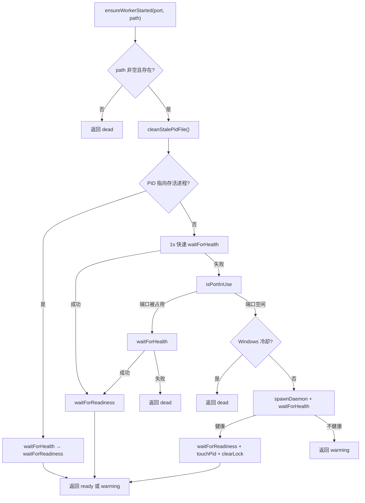

# worker-spawner.ts 需求说明

> 源文件：src/services/worker-spawner.ts ｜ 类型：源码 ｜ 行数：154 ｜ 所属模块：services ｜ 分析日期：2026-07-23

## 1. 文件定位总述

worker-spawner.ts 是 worker 守护进程的核心启动模块，负责确保 worker 服务在任何 hook 调用前处于可用状态。它通过多阶段检测策略（PID 文件→健康探测→端口占用→守护进程spawn）判断 worker 是否需要启动，并在 Windows 平台上实现冷却锁机制避免反复启动失败导致的资源浪费。该模块是所有 hook 的前置依赖，每次 hook 调用前都会执行 `ensureWorkerStarted`。

## 2. 功能需求

| 编号 | 需求描述（系统应当…） | 触发条件 / 输入 | 处理规则与输出 | 证据 |
|------|----------------------|----------------|---------------|------|
| FR-ws-01 | 系统应当在 hook 调用前确保 worker 已启动 | 调用 `ensureWorkerStarted(port, workerScriptPath)` | 多阶段检测后决定返回 `ready`、`warming` 或 `dead` | `worker-spawner.ts:70-153` |
| FR-ws-02 | 系统应当通过 PID 文件检测现有 worker | ensureWorkerStarted 入口 | 调用 `cleanStalePidFile()`；若 PID 指向存活进程，等待其健康可用；若进程存活但不健康返回 `warming` | `worker-spawner.ts:87-99` |
| FR-ws-03 | 系统应当通过快速健康探测判断 worker 是否已运行 | PID 文件不存在或无存活进程 | 以 1s 短超时探测 `/api/health`，成功则等待 `/api/readiness` | `worker-spawner.ts:101-109` |
| FR-ws-04 | 系统应当检测端口占用并等待健康 | 快速探测失败时 | 调用 `isPortInUse`；端口被占用时等待健康探测；超时返回 `dead` | `worker-spawner.ts:111-123` |
| FR-ws-05 | 系统应当在 Windows 上实现启动冷却锁 | 调用 shouldSkipSpawnOnWindows | 2分钟冷却窗口内不再尝试启动；通过 `.worker-start-attempted` 文件的 mtime 判断 | `worker-spawner.ts:19, 25-40` |
| FR-ws-06 | 系统应当作为守护进程启动 worker | 所有检测均表明 worker 未运行 | 调用 `spawnDaemon` 启动 → 等待健康 → 等待就绪 → 记录 PID 文件 → 清除冷却锁 | `worker-spawner.ts:130-152` |
| FR-ws-07 | 系统应当在 worker 脚本不存在时返回 dead | workerScriptPath 为空或文件不存在 | 记录错误日志并返回 `dead` | `worker-spawner.ts:74-85` |
| FR-ws-08 | 系统应当标记和清除 Windows 冷却锁 | 启动尝试前后 | 启动前 `markWorkerSpawnAttempted`（创建标记文件）；成功后 `clearWorkerSpawnAttempted`（删除标记文件） | `worker-spawner.ts:42-66` |

## 3. 业务规则与约束

- **检测优先级**：PID 文件存活检测 → 1s 快速健康探测 → 端口占用+健康等待 → 冷却锁检查 → spawn。`worker-spawner.ts:87-153`
- **Windows 冷却窗口**：2 分钟（`WINDOWS_SPAWN_COOLDOWN_MS = 2 * 60 * 1000`）。`worker-spawner.ts:19`
- **超时配置**：使用 `getPlatformTimeout(HOOK_TIMEOUTS.*)` 根据平台动态调整超时。`worker-spawner.ts:90-98, 101-109, 114, 138, 144`
- **readiness 超时不阻塞**：即使 readiness 超时，只要 health 通过即返回 `warming` 而非 `dead`。`worker-spawner.ts:104-106`
- **返回值语义**：`ready`（完全就绪）、`warming`（进程存活但未完全就绪）、`dead`（无法启动或健康检查失败）。`worker-spawner.ts:68`

## 4. 对外暴露

| 名称 | 类型 | 说明 |
|------|------|------|
| `WorkerStartResult` | type | `'ready' \| 'warming' \| 'dead'` |
| `ensureWorkerStarted(port, workerScriptPath)` | async function | 确保 worker 已启动的核心入口 |

## 5. 依赖关系

- **内部依赖**：`./infrastructure/ProcessManager.js`（cleanStalePidFile, spawnDaemon, touchPidFile, getPlatformTimeout）、`./infrastructure/HealthMonitor.js`（isPortInUse, waitForHealth, waitForReadiness）、`./shared/hook-constants.js`（HOOK_TIMEOUTS）、`./shared/SettingsDefaultsManager.js`（CLAUDE_MEM_DATA_DIR）
- **被依赖**：所有 hook 的 worker 启动前置逻辑（通过 `worker-service` 的 ensureWorker 间接调用）

## 6. 数据结构

**WorkerStartResult 类型**：`src/services/worker-spawner.ts:68`

| 值 | 含义 |
|------|------|
| `ready` | Worker 进程存活且 `/api/readiness` 通过 |
| `warming` | Worker 进程存活但 readiness 未通过或超时 |
| `dead` | Worker 无法启动或健康检查在超时内未通过 |

## 7. 复杂逻辑图示

Worker 启动的多阶段决策流程：从最快/最轻量的检测逐步升级到最重的 spawn 操作，每一阶段都有明确的成功/失败分支。

## 8. 逆向备注

- Windows 冷却锁机制仅通过文件 mtime 判断，在系统时钟回拨时可能失效。
- `markWorkerSpawnAttempted` 和 `clearWorkerSpawnAttempted` 中的 catch 为空（无日志），注释说明为"best-effort"。`worker-spawner.ts:49, 62`
- `shouldSkipSpawnOnWindows` 的 catch 块仅 debug 日志不阻止启动，冷却锁是"尽力而为"的防护。`worker-spawner.ts:32-40`
