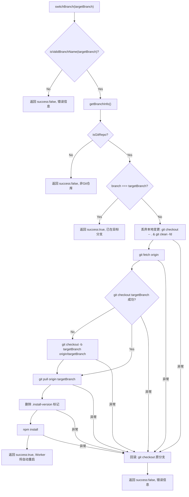

# BranchManager.ts 需求说明

> 源文件：src/services/worker/BranchManager.ts ｜ 类型：源码 ｜ 行数：257 ｜ 所属模块：worker（分支管理） ｜ 分析日期：2026-07-23

## 1. 文件定位总述

BranchManager 是 claude-mem Worker 的 Git 分支管理模块，负责查询当前已安装插件所在的 Git 分支状态、切换分支以及拉取最新更新。它通过 `child_process` 的 `spawnSync` 同步执行 git 和 npm 命令，操作目标是 `MARKETPLACE_ROOT`（已安装插件的路径）。模块对外提供三个核心能力——查询分支信息、切换分支、拉取更新，被上层 API 路由调用以实现插件的版本通道切换（如从 main 切换到 beta）。模块设计了失败后的自动回滚机制，确保切换失败时不会停留在不可用状态。

## 2. 功能需求

| 编号 | 需求描述（系统应当…） | 触发条件 / 输入 | 处理规则与输出 | 证据 |
|------|----------------------|----------------|---------------|------|
| FR-branch-01 | 系统应当检测已安装插件是否为 Git 仓库，并返回当前分支信息 | 调用 `getBranchInfo()` | 检查 `INSTALLED_PLUGIN_PATH/.git` 是否存在；若非 Git 仓库返回 `isGitRepo=false, canSwitch=false`；若是，执行 `git rev-parse --abbrev-ref HEAD` 和 `git status --porcelain` 获取分支名和脏状态；分支名以 `beta` 开头则标记 `isBeta=true` | `src/services/worker/BranchManager.ts:80-121` |
| FR-branch-02 | 系统应当在验证通过后执行分支切换，包括丢弃本地变更、拉取远程、检出目标分支并重新安装依赖 | 调用 `switchBranch(targetBranch)`，传入目标分支名 | 先校验分支名合法性（`isValidBranchName`），再检查是否已在目标分支上；执行流程：`git checkout -- .` → `git clean -fd` → `git fetch origin` → `git checkout targetBranch`（本地不存在则追踪远程）→ `git pull origin targetBranch` → 删除 `.install-version` 标记 → `npm install` | `src/services/worker/BranchManager.ts:123-206` |
| FR-branch-03 | 系统应当在当前分支上拉取最新代码并重新安装依赖 | 调用 `pullUpdates()` | 先丢弃本地变更（`git checkout -- .`），然后 `git fetch origin` → `git pull origin <currentBranch>` → 删除安装标记 → `npm install` | `src/services/worker/BranchManager.ts:208-255` |
| FR-branch-04 | 系统应当在分支切换失败时自动回滚到原分支 | 切换过程中 git 或 npm 命令抛出异常 | catch 块中尝试 `git checkout` 回到 `info.branch`，若回滚也失败则记录错误日志但不再次抛出 | `src/services/worker/BranchManager.ts:192-199` |
| FR-branch-05 | 系统应当校验分支名格式，拒绝非法输入 | `switchBranch` 或 `pullUpdates` 接收到分支名字符串 | 正则 `/^[a-zA-Z0-9][a-zA-Z0-9._/-]*$/` 且不包含 `..`；非法返回 `success: false` | `src/services/worker/BranchManager.ts:10-16` |
| FR-branch-06 | 系统应当对 Git 和 npm 命令设置超时保护 | 执行任何 git/npm 命令 | Git 命令超时 300 秒（`GIT_COMMAND_TIMEOUT_MS`），npm install 超时 600 秒（`NPM_INSTALL_TIMEOUT_MS`）；超时抛出异常进入错误处理 | `src/services/worker/BranchManager.ts:18-19` |
| FR-branch-07 | 系统应当在 Windows 和非 Windows 平台均能正确执行 npm 命令 | 调用 `execNpm` | Windows 使用 `npm.cmd`，其他平台使用 `npm` | `src/services/worker/BranchManager.ts:58-59` |

## 3. 业务规则与约束

1. **分支名安全约束**：分支名必须以字母或数字开头，仅允许字母、数字、点、下划线、斜杠、连字符，且禁止 `..` 路径穿越。`src/services/worker/BranchManager.ts:10-16`
2. **脏工作区处理**：切换分支前强制丢弃所有本地修改（`git checkout -- .`）和未跟踪文件（`git clean -fd`），不做任何用户确认。`src/services/worker/BranchManager.ts:155-156`
3. **安装标记清理**：分支切换和拉取更新时，若存在 `.install-version` 文件则删除它。推断：该标记用于版本检查机制，删除后触发重新检测。`src/services/worker/BranchManager.ts:172-175`
4. **幂等性**：若当前已在目标分支上，`switchBranch` 直接返回 `success: true`，不执行任何 git 操作。`src/services/worker/BranchManager.ts:140-145`
5. **回滚不保证成功**：回滚到原分支的失败仅记录日志，不会向上层抛出二次异常。`src/services/worker/BranchManager.ts:196-199`
6. **shell=false**：所有 `spawnSync` 调用均设置 `shell: false`，防止命令注入。`src/services/worker/BranchManager.ts:43,66`

## 4. 对外暴露

| 名称 | 类型 | 签名 | 说明 |
|------|------|------|------|
| `BranchInfo` | interface | `{ branch, isBeta, isGitRepo, isDirty, canSwitch, error? }` | 分支信息结构体 |
| `SwitchResult` | interface | `{ success, branch?, message?, error? }` | 切换/拉取结果结构体 |
| `getBranchInfo` | function | `() => BranchInfo` | 获取当前分支信息 |
| `switchBranch` | function | `(targetBranch: string) => Promise<SwitchResult>` | 切换到目标分支 |
| `pullUpdates` | function | `() => Promise<SwitchResult>` | 在当前分支拉取更新 |
| `isValidBranchName` | function (内部) | `(branchName: string) => boolean` | 分支名校验（未导出） |

## 5. 依赖关系

- **上游依赖**：`MARKETPLACE_ROOT`（来自 `src/shared/paths.js`）—— 已安装插件的根目录路径
- **上游依赖**：`logger`（来自 `src/utils/logger.js`）
- **运行时依赖**：`child_process.spawnSync`（Git 和 npm 命令执行）
- **运行时依赖**：`fs.existsSync / unlinkSync`（文件检查和删除）

## 6. 数据结构

- **BranchInfo** (`src/services/worker/BranchManager.ts:21-28`)：`branch`（当前分支名或 null）、`isBeta`（是否 beta 分支）、`isGitRepo`（是否 Git 仓库）、`isDirty`（工作区是否有未提交变更）、`canSwitch`（是否可以切换）、`error`（错误信息）
- **SwitchResult** (`src/services/worker/BranchManager.ts:30-35`)：`success`（是否成功）、`branch`（目标分支名）、`message`（描述信息）、`error`（错误信息）

## 7. 复杂逻辑图示

上图为分支切换的核心流程。步骤按顺序执行，任何一步异常都触发回滚到原分支。

## 8. 逆向备注

1. **模块级常量位置**：`INSTALLED_PLUGIN_PATH` 在模块顶层赋值为 `MARKETPLACE_ROOT`，`src/services/worker/BranchManager.ts:8`。
2. **同步执行设计**：所有 Git/npm 命令均通过 `spawnSync` 同步执行，会阻塞 Node.js 事件循环。这与模块位于 Worker 进程中有关，Worker 进程本身就是单一任务执行环境。
3. **`canSwitch` 始终为 true**：当 `isGitRepo=true` 时，`canSwitch` 硬编码为 `true`，不考虑其他因素（如进程权限等）。`src/services/worker/BranchManager.ts:119`
4. **`pullUpdates` 不检查脏状态**：与 `switchBranch` 不同，`pullUpdates` 在拉取前执行 `git checkout -- .` 丢弃变更，但不告知调用方是否有未提交工作。`src/services/worker/BranchManager.ts:230`
5. **推断（依据：代码注释和结构）**：模块属于 Worker 的版本通道管理能力，配合前端 Viewer 和 API 路由，允许用户在 main 和 beta 等分支间切换插件版本。
