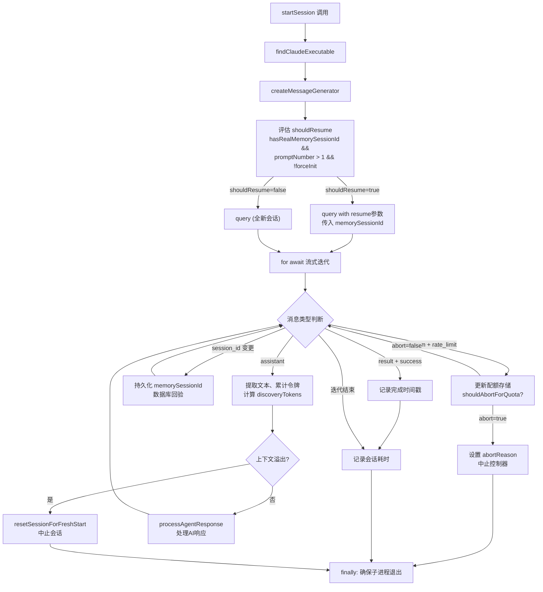
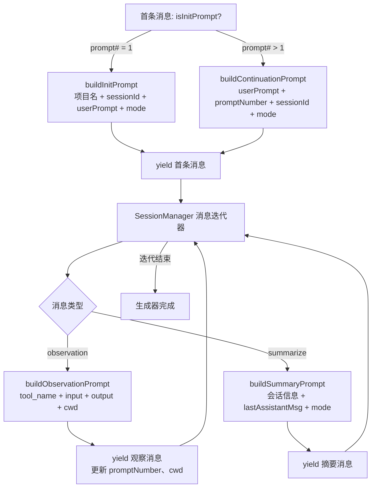

# ClaudeProvider.ts 需求说明

> 源文件：src/services/worker/ClaudeProvider.ts ｜ 类型：源码 ｜ 行数：517 ｜ 所属模块：worker ｜ 分析日期：2026-07-23

## 1. 文件定位总述

本文件是 claude-mem Worker 的 AI 推理核心提供者，封装了与 Claude Agent SDK（`@anthropic-ai/claude-agent-sdk`）的完整交互流程。它承担两大职责：其一，`classifyClaudeError` 函数将 SDK/Anthropic API 返回的各类错误分类为可恢复（transient）与不可恢复（unrecoverable）等级别，驱动上层重试策略；其二，`ClaudeProvider` 类管理 SDK 会话的完整生命周期——包括查找 Claude 可执行文件、构建消息流（初始化/观察/摘要）、发起 SDK query 流式迭代、捕获 memorySessionId、检测上下文溢出、执行令牌计量及配额守卫，最终将 AI 响应委托给 `processAgentResponse` 处理。该类是 Worker 处理管线中连接 AI 推理与业务持久化的关键桥梁。

## 2. 功能需求

| 编号 | 需求描述（系统应当…） | 触发条件 / 输入 | 处理规则与输出 | 证据 |
|------|----------------------|----------------|---------------|------|
| FR-CP-01 | 系统应当对 Claude SDK/Anthropic API 返回的错误进行分类，区分不可恢复错误（可执行文件缺失、认证失败、上下文溢出、400 错误）、可恢复错误（5xx 服务错误、过载、未知错误）、配额耗尽和速率限制四类 | SDK 调用抛出异常 | classifyClaudeError 按优先级匹配错误特征，返回 ClassifiedProviderError（含 kind 和 cause） | `src/services/worker/ClaudeProvider.ts:50-158` |
| FR-CP-02 | 系统应当在检测到 HTTP 400 错误且错误信息包含 "effort parameter" 时，输出一次性警告日志提示用户移除泄露的 CLAUDE_CODE_EFFORT_LEVEL 环境变量，并将错误分类为不可恢复 | Anthropic API 返回 400 + effort 相关信息 | 通过模块级守卫 `effortHintLogged` 确保整个 Worker 进程生命周期内仅触发一次警告 | `src/services/worker/ClaudeProvider.ts:121-135,38-41` |
| FR-CP-03 | 系统应当启动一个 SDK 查询会话：定位并验证 Claude 可执行文件、构建用户消息生成器、配置隔离环境与 OAuth 凭证、按并发上限排队等候、调用 query() 发起流式推理 | Worker 接收到 ActiveSession | 查找 Claude 可执行文件；构建消息生成器；根据 session 状态决定新建或恢复会话；设置 disallowedTools 黑名单（13 种工具）；启动 query 流式迭代 | `src/services/worker/ClaudeProvider.ts:175-418` |
| FR-CP-04 | 系统应当根据会话状态智能决定是新建 SDK 会话还是恢复已有会话：仅在 memorySessionId 真实存在、lastPromptNumber > 1 且未强制初始化时恢复 | 评估 shouldResume 条件 | hasRealMemorySessionId && lastPromptNumber > 1 && !forceInit → resume with memorySessionId；否则 fresh start | `src/services/worker/ClaudeProvider.ts:201-238` |
| FR-CP-05 | 系统应当在 SDK 流式迭代过程中捕获并持久化 memorySessionId，实现 content_session（Claude Code 会话）与 memory_session（SDK 内部会话）的双向绑定 | SDK 返回含 session_id 的消息 | 将 session_id 写入 ActiveSession 和数据库，并进行数据库回验校验一致性 | `src/services/worker/ClaudeProvider.ts:290-313` |
| FR-CP-06 | 系统应当在流式迭代中拦截配额超限事件，根据认证方式（API-key 用户豁免）和配额窗口状态决定是否中止会话 | SDK 推送 type=system、subtype=rate_limit 的系统事件 | 更新全局配额存储，调用 shouldAbortForQuota 判断，触发中止则记录 abortReason 并中断循环 | `src/services/worker/ClaudeProvider.ts:260-288` |
| FR-CP-07 | 系统应当在检测到上下文溢出（"prompt is too long" 或 "context window"）时重置会话状态以强制下次从头开始 | AI 响应文本包含溢出关键词 | 调用 resetSessionForFreshStart 清空 memorySessionId、设置 forceInit=true、设置 abortReason='overflow' 并中止 | `src/services/worker/ClaudeProvider.ts:321-328,368-373` |
| FR-CP-08 | 系统应当在检测到 "Invalid API key" 时立即抛出异常中断会话 | AI 响应文本包含 "Invalid API key" | throw new Error，提示用户检查配置 | `src/services/worker/ClaudeProvider.ts:376-378` |
| FR-CP-09 | 系统应当在每次 AI 响应后计算发现令牌数（discoveryTokens），并连同文本内容、时间戳等委托给 processAgentResponse 处理 | 收到 type=assistant 的消息 | 提取文本内容、累计令牌用量、计算本次 discoveryTokens、调用 processAgentResponse | `src/services/worker/ClaudeProvider.ts:315-391` |
| FR-CP-10 | 系统应当在 SDK 会话完成后记录会话耗时，并确保 SDK 子进程退出 | for await 循环正常结束或中断 | 记录 duration 日志；在 finally 块中检查子进程状态，若未退出则等待 5 秒后强制终止 | `src/services/worker/ClaudeProvider.ts:406-417` |
| FR-CP-11 | 系统应当构建异步消息生成器，依次产出初始化提示词、观察提示词和摘要提示词，作为 SDK query 的输入流 | SDK query 开始执行 | 首条消息为 init/continuation prompt；后续从 SessionManager 的消息迭代器中读取 observation/summarize 消息并转换为 prompt | `src/services/worker/ClaudeProvider.ts:420-509` |
| FR-CP-12 | 系统应当在消息生成器中追踪子代理身份（agentId、agentType）和工作目录（cwd） | 从消息迭代器收到消息 | 更新 session.pendingAgentId、session.pendingAgentType、cwdTracker.lastCwd | `src/services/worker/ClaudeProvider.ts:452-458` |
| FR-CP-13 | 系统应当在 SDK 成功完成时（result subtype=success）记录 prompt 完成时间戳，供后续统计使用 | 收到 type=result、subtype=success 的消息 | 调用 updatePromptCompletedAt 写入当前时间，来源标记为 'sdk_result' | `src/services/worker/ClaudeProvider.ts:394-404` |

## 3. 业务规则与约束

1. **工具黑名单**：SDK 子进程被禁止使用 13 种 Claude Code 工具（Bash、Read、Write、Edit、Grep、Glob、WebFetch、WebSearch、Task、NotebookEdit、AskUserQuestion、TodoWrite），以防止 AI 代理对用户文件系统产生副作用。`src/services/worker/ClaudeProvider.ts:182-195`
2. **并发控制**：通过 `waitForSlot` 实现最大并发 Agent 数限制，默认 2，可通过 `CLAUDE_MEM_MAX_CONCURRENT_AGENTS` 配置。`src/services/worker/ClaudeProvider.ts:213-214`
3. **环境隔离**：SDK 子进程使用 `buildIsolatedEnvWithFreshOAuth` + `sanitizeEnv` 构建的隔离环境，不继承宿主进程的环境变量（特别是不泄露 CLAUDE_CODE_EFFORT_LEVEL）。`src/services/worker/ClaudeProvider.ts:216,251`
4. **MCP 服务器禁用**：SDK 子进程配置 mcpServers: {} 和 strictMcpConfig: true，确保记忆处理过程中不连接任何 MCP 服务器。`src/services/worker/ClaudeProvider.ts:252-254`
5. **重试策略依据**：classifyClaudeError 的分类结果驱动上层重试——unrecoverable 类不重试，transient 类按指数退避重试，rate_limit 类按 Retry-After 重试，quota_exhausted 类直接终止。`src/services/worker/ClaudeProvider.ts:50-158`
6. **模型选择**：优先使用 session.modelOverride，其次读取 settings.json 中的 CLAUDE_MEM_MODEL 配置。`src/services/worker/ClaudeProvider.ts:181,511-515`
7. **effort 警告去重**：通过模块级变量 `effortHintLogged` 确保整个 Worker 进程中 effort 参数警告仅输出一次，避免日志刷屏。`src/services/worker/ClaudeProvider.ts:38-41,121`
8. **API-key 用户配额豁免**：配额守卫在判断 abort 时区分认证方式，API-key 用户（已授权按次付费）豁免配额检查。`src/services/worker/ClaudeProvider.ts:264`

## 4. 对外暴露

| 导出项 | 类型 | 说明 |
|--------|------|------|
| `ClaudeProvider` | class | AI 推理会话管理器，提供 startSession 方法 |
| `classifyClaudeError` | function | 错误分类函数，将 SDK/API 异常映射为 ClassifiedProviderError |
| `__resetEffortHintLatchForTesting` | function | 测试用工具函数，重置 effort 警告去重锁存器 | `src/services/worker/ClaudeProvider.ts:39-41` |

## 5. 依赖关系

- **上游依赖**：
  - `./DatabaseManager.js`（DatabaseManager）— 会话持久化
  - `./SessionManager.js`（SessionManager）— 消息迭代器、消息管理
  - `../../sdk/prompts.js`（buildInitPrompt, buildObservationPrompt, buildSummaryPrompt, buildContinuationPrompt）— 提示词构建
  - `../../shared/SettingsDefaultsManager.js` — 配置读取
  - `../../shared/EnvManager.js`（buildIsolatedEnvWithFreshOAuth）— 环境隔离
  - `../../shared/find-claude-executable.js`（findClaudeExecutable）— Claude 可执行文件定位
  - `../../supervisor/process-registry.js`（createSdkSpawnFactory, getSdkProcessForSession, ensureSdkProcessExit, waitForSlot）— 进程注册与并发控制
  - `../../supervisor/env-sanitizer.js`（sanitizeEnv）— 环境变量清洗
  - `./RateLimitStore.js`（globalRateLimitStore, shouldAbortForQuota）— 配额守卫
  - `./agents/index.js`（processAgentResponse）— AI 响应处理
  - `./domain/ModeManager.js`（ModeManager）— 工作模式
  - `@anthropic-ai/claude-agent-sdk`（query）— Claude Agent SDK 核心 API
  - `./provider-errors.js`（ClassifiedProviderError）— 错误分类类型

- **下游消费者**：Worker 服务层调用 ClaudeProvider.startSession 发起 AI 处理；错误分类结果被重试逻辑消费

## 6. 数据结构

### ClassifiedProviderError 分类体系

| kind 值 | 含义 | 触发条件 |
|---------|------|---------|
| `unrecoverable` | 不可恢复，不应重试 | 可执行文件缺失(ENOENT)、认证失败(401/403)、上下文溢出、HTTP 400、invalid_request_error |
| `auth_invalid` | 认证无效 | 401/403 状态码或 "Invalid API key" 等认证错误字符串 |
| `transient` | 可恢复，应重试 | OverloadedError、529 状态、5xx 服务错误、未知错误（默认） |
| `rate_limit` | 速率限制 | HTTP 429 |
| `quota_exhausted` | 配额耗尽 | 消息含 "quota exceeded" |

### SDK query 配置结构

```
query({
  prompt: AsyncIterableIterator<SDKUserMessage>,
  options: {
    model: string,
    cwd: string,
    resume?: string,           // memorySessionId（恢复时传入）
    disallowedTools: string[],
    abortController: AbortController,
    pathToClaudeCodeExecutable: string,
    spawnClaudeCodeProcess: Function,
    env: Record<string, string>,
    mcpServers: {},
    settingSources: [],
    strictMcpConfig: true,
  }
})
```

## 7. 复杂逻辑图示

下图展示 ClaudeProvider.startSession 的核心处理流程，包括会话恢复决策、消息生成、流式迭代和异常处理：



消息生成器流程：



## 8. 逆向备注

1. **双重溢出检测**：代码中对 "prompt is too long" 和 "context window" 做了两处检测——一处检测 response textContent（321-327 行），另一处再次检测 textContent（368-373 行）。两处检测逻辑相似但行为略有不同（前者直接 return，后者 throw Error），推断是历史遗留的防御性编程，实际运行中任一处命中都会终止会话。`src/services/worker/ClaudeProvider.ts:321-328,368-373`
2. **invalid_request_error 无状态码处理**：当 SDK 包装层丢失 .status 字段时，仅凭 message 中包含 "invalid_request_error" 或 "model identifier is invalid" 就分类为 unrecoverable。注释引用 #2656 issue，说明这是一个已知的 SDK 行为问题。`src/services/worker/ClaudeProvider.ts:140-148`
3. **effort 参数警告的间接触发路径**：警告逻辑位于 classifyClaudeError 中而非 startSession 主流程中，但 classifyClaudeError 并未被 startSession 内部直接调用。推断上层调用者在捕获异常后会调用 classifyClaudeError 进行分类，从而间接触发警告。`src/services/worker/ClaudeProvider.ts:110-135`
4. **观察 ID 硬编码为 0**：buildObservationPrompt 中 id 参数硬编码为 0，注释说明 "Not used in prompt"。`src/services/worker/ClaudeProvider.ts:467`
5. **token 用量累计包含 cache_creation**：cumulativeInputTokens 在累计时额外加上了 cache_creation_input_tokens，导致总输入令牌数可能大于 API 返回的 input_tokens 值。`src/services/worker/ClaudeProvider.ts:339-340`
