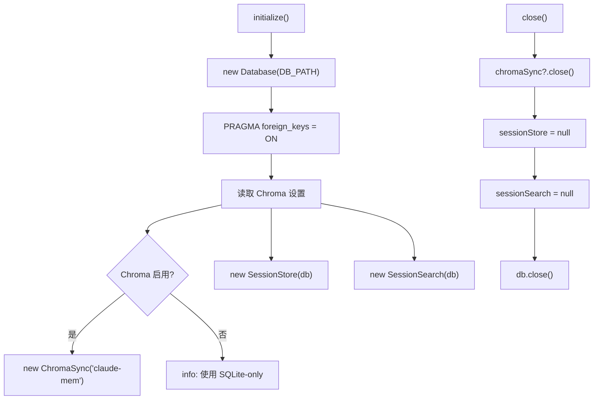

# DatabaseManager.ts 需求说明

> 源文件：src/services/worker/DatabaseManager.ts | 类型：源码 | 行数：93 | 所属模块：worker | 分析日期：2026-07-23

## 1. 文件定位总述

DatabaseManager 是 Worker 的数据库基础设施管理器，负责 SQLite 数据库连接的创建、初始化和生命周期管理，以及 SessionStore、SessionSearch、ChromaSync 等数据访问组件的实例化与缓存。它是 Worker 中所有需要数据库访问的模块的统一入口，通过单例模式管理共享的数据库连接。

## 2. 功能需求

| 编号 | 需求描述（系统应当…） | 触发条件 / 输入 | 处理规则与输出 | 证据 |
|------|----------------------|----------------|---------------|------|
| FR-DBMgr-01 | 系统应当初始化数据库连接和相关存储组件 | 调用 `initialize()` | 创建 SQLite 数据库连接（`DB_PATH`），启用外键约束（`PRAGMA foreign_keys = ON`）；实例化 SessionStore 和 SessionSearch；根据 `CLAUDE_MEM_CHROMA_ENABLED` 设置决定是否创建 ChromaSync | `src/services/worker/DatabaseManager.ts:17-33` |
| FR-DBMgr-02 | 系统应当关闭数据库连接和所有关联组件 | 调用 `close()` | 依次关闭 ChromaSync（如存在）、置空 SessionStore/SessionSearch、关闭数据库连接；所有步骤按顺序执行 | `src/services/worker/DatabaseManager.ts:35-49` |
| FR-DBMgr-03 | 系统应当提供数据库组件的安全访问器 | 调用 `getSessionStore()`/`getSessionSearch()`/`getConnection()` | 未初始化时抛出 `Error('Database not initialized')` | `src/services/worker/DatabaseManager.ts:51-74` |
| FR-DBMgr-04 | 系统应当提供可选的 ChromaSync 访问 | 调用 `getChromaSync()` | 可能返回 null（Chroma 禁用时），不抛出异常 | `src/services/worker/DatabaseManager.ts:65-67` |
| FR-DBMgr-05 | 系统应当提供按数据库 ID 获取会话的便捷方法 | 调用 `getSessionById(sessionDbId)` | 委托给 `sessionStore.getSessionById()`，不存在时抛出 Error | `src/services/worker/DatabaseManager.ts:76-91` |

## 3. 业务规则与约束

- **外键约束**：初始化时执行 `PRAGMA foreign_keys = ON`，确保 SQLite 外键约束生效。`src/services/worker/DatabaseManager.ts:19`
- **Chroma 条件初始化**：仅当 `CLAUDE_MEM_CHROMA_ENABLED` 不为 'false' 时创建 ChromaSync 实例。`src/services/worker/DatabaseManager.ts:24-29`
- **Chroma 禁用日志**：Chroma 被禁用时记录 info 日志，明确说明使用 SQLite-only 搜索。`src/services/worker/DatabaseManager.ts:29`
- **初始化顺序**：close 时先关闭 ChromaSync 再关闭数据库连接，避免 Chroma 在数据库关闭后尝试写入。`src/services/worker/DatabaseManager.ts:36-48`

## 4. 对外暴露

| 名称 | 类型 | 说明 |
|------|------|------|
| `initialize()` | async 方法 | 初始化数据库和组件 |
| `close()` | async 方法 | 关闭所有数据库资源 |
| `getSessionStore()` | 方法 | 获取 SessionStore（未初始化抛异常） |
| `getSessionSearch()` | 方法 | 获取 SessionSearch（未初始化抛异常） |
| `getChromaSync()` | 方法 | 获取 ChromaSync（可能返回 null） |
| `getConnection()` | 方法 | 获取原始 Database 连接 |

## 5. 依赖关系

- **bun:sqlite**（Database）：SQLite 数据库
- **SessionStore**（`../sqlite/SessionStore.js`）：会话数据存储
- **SessionSearch**（`../sqlite/SessionSearch.js`）：会话搜索
- **ChromaSync**（`../sync/ChromaSync.js`）：Chroma 向量同步
- **SettingsDefaultsManager**（`../../shared/SettingsDefaultsManager.js`）：读取 Chroma 启用设置
- **DB_PATH / USER_SETTINGS_PATH**（`../../shared/paths.js`）：数据库和设置文件路径

## 6. 数据结构

不适用（管理器类，不定义新数据结构。`getSessionById` 返回的对象结构见代码）。

## 7. 复杂逻辑图示

初始化流程创建数据库连接后依次创建各数据组件，ChromaSync 根据配置条件创建。关闭流程按反序释放资源。

## 8. 逆向备注

- `DBSession` 类型从 `../worker-types.js` 导入但在本文件中未显式使用。推断：（可能为 TypeScript 类型检查所需，或从早期版本遗留）。
