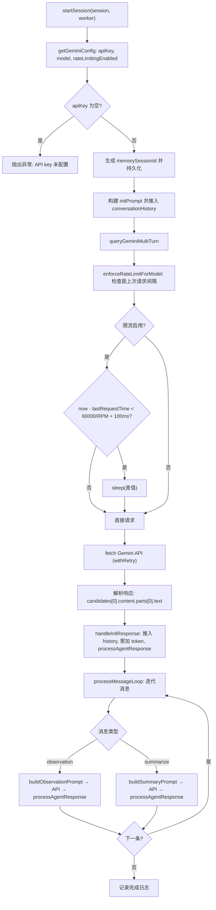

# GeminiProvider.ts 需求说明

> 源文件：`src/services/worker/GeminiProvider.ts` ｜ 类型：源码 ｜ 行数：549 ｜ 所属模块：worker（LLM 提供商适配） ｜ 分析日期：2026-07-23

## 1. 文件定位总述

GeminiProvider 是 claude-mem worker 的 Google Gemini LLM 适配层，功能定位与 OpenRouterProvider 对称：接收本地观测和摘要消息，通过 Gemini REST API 进行多轮对话推理，将响应交由 Agent 处理器持久化。相较于 OpenRouterProvider，GeminiProvider 额外内置了**客户端限流机制**（基于模型 RPM 上限的节流等待），并对支持的模型做了白名单校验。该文件同样导出错误分类函数，将 Gemini 特有的错误信号（如 resource_exhausted、API_KEY_INVALID）映射为统一的 ClassifiedProviderError 分级体系。

## 2. 功能需求

| 编号 | 需求描述（系统应当…） | 触发条件 / 输入 | 处理规则与输出 | 证据 |
|------|----------------------|----------------|---------------|------|
| FR-GEM-01 | 系统应当启动一个完整的 Gemini AI 会话生命周期：初始化 → 逐条消息处理 → 完成 | 调用 `startSession(session, worker)` | 发送 init prompt 获取初始化响应，迭代消息队列处理 observation 和 summarize 消息，输出会话耗时日志 | `GeminiProvider.ts:190-249` |
| FR-GEM-02 | 系统应当为会话生成合成 memorySessionId 并持久化 | session.memorySessionId 为空 | 生成 `gemini-${contentSessionId}-${timestamp}` 格式 ID，写入 session 并调用 updateMemorySessionId | `GeminiProvider.ts:197-201` |
| FR-GEM-03 | 系统应当根据 prompt 编号选择初始提示或续接提示 | session.lastPromptNumber === 1 | 首次调用 `buildInitPrompt()`，续接调用 `buildContinuationPrompt()`；推入 conversationHistory | `GeminiProvider.ts:205-209` |
| FR-GEM-04 | 系统应当将 observation 消息转为观测提示后调用 Gemini API | 消息类型为 observation | 调用 `buildObservationPrompt()`，推入 history，调用 `queryGeminiMultiTurn()` 获取响应并处理 | `GeminiProvider.ts:278-323` |
| FR-GEM-05 | 系统应当将 summarize 消息转为摘要提示后调用 Gemini API | 消息类型为 summarize | 调用 `buildSummaryPrompt()`，推入 history，调用 `queryGeminiMultiTurn()` 获取响应并处理 | `GeminiProvider.ts:325-366` |
| FR-GEM-06 | 系统应当将 conversationHistory 转换为 Gemini 原生格式（role: user/model, parts: [{text}]）并发起 API 调用 | 每轮对话前 | assistant 映射为 "model"，其余映射为 "user"；发送到 `{GEMINI_API_URL}/{model}:generateContent?key={apiKey}` | `GeminiProvider.ts:416-501` |
| FR-GEM-07 | 系统应当对对话历史执行截断以控制 token 用量和消息数量 | conversationHistory 超过阈值 | 从最近消息向前遍历保留，最多 MAX_CONTEXT_MESSAGES 条且估算 token 不超过 MAX_ESTIMATED_TOKENS；使用 `estimateTokens()`（外部共享函数）而非本地字符除法 | `GeminiProvider.ts:378-414` |
| FR-GEM-08 | 系统应当在 API 调用前执行客户端限流 | 限流启用且距上次请求间隔不足 | 根据模型 RPM 上限计算最小延迟 `60000/rpm + 100ms`，等待至满足间隔后更新 lastRequestTime | `GeminiProvider.ts:141-159` |
| FR-GEM-09 | 系统应当对 Gemini API 调用进行带退避的重试 | API 调用失败且可恢复 | 通过 `withRetry()` 包装 fetch；携带 priorRequestId 请求头用于跨重试去重 | `GeminiProvider.ts:446-490` |
| FR-GEM-10 | 系统应当将 Gemini HTTP 错误分类为统一错误分级 | fetch 返回非 2xx 或抛出异常 | body 含 quota exceeded/resource_exhausted → quota_exhausted；429 → rate_limit；401/403 含 api key 关键词 → auth_invalid；400 → unrecoverable；5xx → transient；无状态 → transient | `GeminiProvider.ts:47-115` |
| FR-GEM-11 | 系统应当正确中止已取消的会话 | 收到 abort 类错误 | `handleGeminiError()` 中检测 `isAbortError(error)`，直接抛出 | `GeminiProvider.ts:368-376` |
| FR-GEM-12 | 系统应当累加 token 用量统计到会话对象 | 每次获得 API 响应后 | 按 totalTokens 的 70% 计输入、30% 计输出，累加到 session 对象 | `GeminiProvider.ts:224-226,312-314,354-356` |
| FR-GEM-13 | 系统应当验证配置的模型名是否在白名单内，无效时回退到默认模型 | settings.CLAUDE_MEM_GEMINI_MODEL 配置 | 遍历 validModels 列表校验，不在列表内则 warn 日志并回退到 `gemini-2.5-flash` | `GeminiProvider.ts:511-530` |
| FR-GEM-14 | 系统应当暴露 Gemini 可用性和选中状态查询函数 | 外部模块查询 | `isGeminiAvailable()` 检查 API key 配置；`isGeminiSelected()` 检查 CLAUDE_MEM_PROVIDER 是否为 "gemini" | `GeminiProvider.ts:538-548` |

## 3. 业务规则与约束

| 编号 | 规则描述 | 证据 |
|------|---------|------|
| BR-GEM-01 | Gemini API 基础 URL 固定为 `https://generativelanguage.googleapis.com/v1/models`，完整请求 URL 为 `{baseUrl}/{model}:generateContent?key={apiKey}` | `GeminiProvider.ts:21,439` |
| BR-GEM-02 | API Key 优先级：settings.CLAUDE_MEM_GEMINI_API_KEY > 环境变量 GEMINI_API_KEY | `GeminiProvider.ts:507` |
| BR-GEM-03 | 默认模型为 `gemini-2.5-flash` | `GeminiProvider.ts:509` |
| BR-GEM-04 | 白名单模型：gemini-2.5-flash-lite, gemini-2.5-flash, gemini-2.5-pro, gemini-2.0-flash, gemini-2.0-flash-lite, gemini-3-flash, gemini-3-flash-preview | `GeminiProvider.ts:117-124,511-519` |
| BR-GEM-05 | RPM 限流表：gemini-2.5-flash-lite=10, gemini-2.5-flash=10, gemini-2.5-pro=5, gemini-2.0-flash=15, gemini-2.0-flash-lite=30, gemini-3-flash=10, gemini-3-flash-preview=5 | `GeminiProvider.ts:126-134` |
| BR-GEM-06 | 限流默认启用（settings.CLAUDE_MEM_GEMINI_RATE_LIMITING_ENABLED !== 'false' 时启用） | `GeminiProvider.ts:532` |
| BR-GEM-07 | 默认最大上下文消息数 20，默认最大估算 token 数 100000 | `GeminiProvider.ts:138-139` |
| BR-GEM-08 | API 请求 temperature=0.3，maxOutputTokens=4096 | `GeminiProvider.ts:458-459` |
| BR-GEM-09 | 限流使用模块级变量 `lastRequestTime` 跟踪上次请求时间，非实例级（多实例共享状态） | `GeminiProvider.ts:136` |
| BR-GEM-10 | quota_exhausted 判断包括 "resource_exhausted"（Gemini 特有错误码），即使状态码为 500 也适用 | `GeminiProvider.ts:61-66` |
| BR-GEM-11 | 空响应处理：observation 和 summarize 的空响应只记 warn 日志并跳过（不调用 processAgentResponse），与 OpenRouterProvider 行为不同 | `GeminiProvider.ts:318-322,360-365` |
| BR-GEM-12 | token 分配比例同 OpenRouterProvider：70% input / 30% output（硬编码近似值） | `GeminiProvider.ts:224-226` |

## 4. 对外暴露

| 导出项 | 类型 | 说明 | 证据 |
|--------|------|------|------|
| `GeminiProvider` | class | 主类，持有 DatabaseManager 和 SessionManager | `GeminiProvider.ts:181-536` |
| `classifyGeminiError()` | function | Gemini 错误分类为 ClassifiedProviderError | `GeminiProvider.ts:47-115` |
| `GeminiModel` | type | 支持的 Gemini 模型名联合类型 | `GeminiProvider.ts:117-124` |
| `isGeminiAvailable()` | function | 检查 Gemini API key 是否配置 | `GeminiProvider.ts:538-542` |
| `isGeminiSelected()` | function | 检查当前是否选择 Gemini 提供商 | `GeminiProvider.ts:544-548` |

## 5. 依赖关系

| 方向 | 依赖项 | 说明 |
|------|--------|------|
| 内部模块 | `processAgentResponse`, `isAbortError` (./agents/index.js) | Agent 响应处理与中止判断 |
| 内部模块 | `withRetry` (./retry.js) | 重试包装器 |
| 内部模块 | `ClassifiedProviderError` (./provider-errors.js) | 统一错误分级 |
| 内部模块 | prompt 构建函数 (../../sdk/prompts.js) | 提示词构建 |
| 内部模块 | `ModeManager`, `ModeConfig` (../domain/) | 模式管理 |
| 内部模块 | `SettingsDefaultsManager`, `getCredential`, `paths` | 配置和凭据 |
| 内部模块 | `estimateTokens` (../../shared/timeline-formatting.js) | Token 估算（共享函数） |
| 外部服务 | Gemini REST API | LLM 推理服务 |

## 6. 数据结构

**GeminiModel**（导出类型）

| 值 | 说明 |
|-----|------|
| gemini-2.5-flash-lite | 轻量快速模型 |
| gemini-2.5-flash | 默认快速模型 |
| gemini-2.5-pro | 高能力模型 |
| gemini-2.0-flash | 上代快速模型 |
| gemini-2.0-flash-lite | 上代轻量模型 |
| gemini-3-flash | 新代快速模型 |
| gemini-3-flash-preview | 新代快速预览模型 |

**GEMINI_RPM_LIMITS**（RPM 限流映射表）

| 模型 | RPM | 对应最小延迟（约） |
|------|-----|------------------|
| gemini-2.5-flash-lite | 10 | ~6.1s |
| gemini-2.5-flash | 10 | ~6.1s |
| gemini-2.5-pro | 5 | ~12.1s |
| gemini-2.0-flash | 15 | ~4.1s |
| gemini-2.0-flash-lite | 30 | ~2.1s |
| gemini-3-flash | 10 | ~6.1s |
| gemini-3-flash-preview | 5 | ~12.1s |

**GeminiResponse**（内部类型）

| 字段 | 类型 | 说明 |
|------|------|------|
| candidates | Array<{content?: {parts?: Array<{text?}>}}> | 响应候选项 |
| usageMetadata | {promptTokenCount?, candidatesTokenCount?, totalTokenCount?} | Token 用量 |

**GeminiContent**（内部类型）

| 字段 | 类型 | 说明 |
|------|------|------|
| role | 'user' \| 'model' | Gemini 原生角色 |
| parts | Array<{text: string}> | 内容片段 |

## 7. 复杂逻辑图示

以下流程图展示 GeminiProvider 的限流机制与会话处理流程：

**说明：** GeminiProvider 相比 OpenRouterProvider 的关键差异在于限流环节——每次 API 调用前先检查与上次请求的时间间隔，若不足则主动等待。限流使用模块级变量 `lastRequestTime`，在单进程场景下可正确工作，但多实例并发时可能不够精确。

## 8. 逆向备注

| 编号 | 备注 | 证据 |
|------|------|------|
| RN-01 | 限流变量 `lastRequestTime` 为模块级（非实例级），意味着多个 GeminiProvider 实例共享同一个限流状态。在 worker 单例场景下无影响，但若未来多实例并发则限流计算不准确 | `GeminiProvider.ts:136` |
| RN-02 | `parseRetryAfterMs` 与 OpenRouterProvider 中同名函数完全重复，推断各 Provider 独立编写未共享工具函数 | `GeminiProvider.ts:27-39` |
| RN-03 | `estimateTokens` 从共享模块 `../../shared/timeline-formatting.js` 导入，而 OpenRouterProvider 使用本地实现的 `estimateTokens`（4 字符/token），两者可能使用不同的估算算法 | `GeminiProvider.ts:9,386` |
| RN-04 | GeminiProvider 的空响应处理策略更保守：observation 和 summarize 空响应仅记 warn 日志不调用 processAgentResponse；OpenRouterProvider 则仍调用（传空字符串）。推断这是对 Gemini 空响应更频繁的适配 | `GeminiProvider.ts:316-322,359-365` |
| RN-05 | 截断逻辑中，GeminiProvider 使用 `truncated.length > 0` 条件保护截断判断，而 OpenRouterProvider 没有——这意味着 Gemini 至少保留一条消息（最新的一条），OpenRouter 可能全部截断为空数组 | `GeminiProvider.ts:398` |
| RN-06 | Gemini 请求 URL 将 API key 作为 query 参数传递（`?key={apiKey}`），而非 OpenRouter 的 Bearer token 方式，这是 Gemini REST API 的设计规范 | `GeminiProvider.ts:439` |
| RN-07 | startSession 中 init 失败时调用 `return this.handleGeminiError()`（handleGeminiError 返回 never），而 OpenRouterProvider 使用 `await this.handleSessionError()`（返回 never）再 return。二者语义一致但代码风格略异 | `GeminiProvider.ts:219,368-376` |
