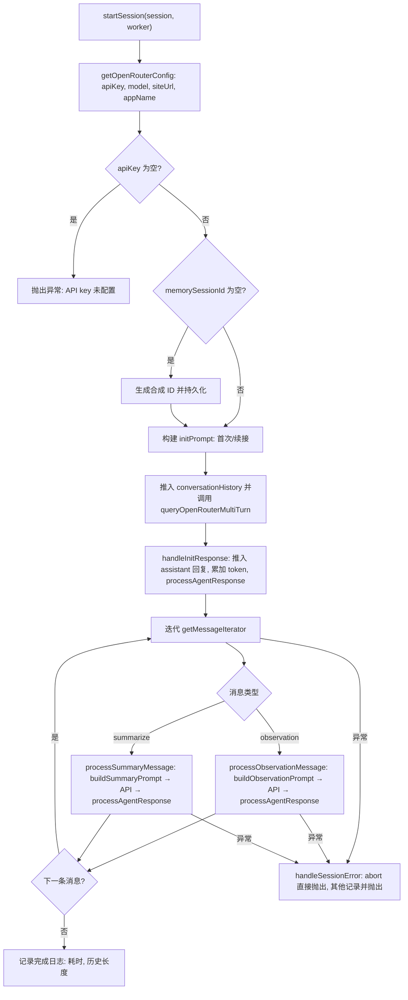

# OpenRouterProvider.ts 需求说明

> 源文件：`src/services/worker/OpenRouterProvider.ts` ｜ 类型：源码 ｜ 行数：550 ｜ 所属模块：worker（LLM 提供商适配） ｜ 分析日期：2026-07-23

## 1. 文件定位总述

OpenRouterProvider 是 claude-mem worker 的 OpenRouter LLM 适配层，负责通过 OpenRouter API 代理将本地的观测（observation）和摘要（summarize）消息送交大模型处理，获取结构化响应后交由 Agent 响应处理器（processAgentResponse）持久化。它采用多轮对话模式维护 conversationHistory，将初始化、每条观测、每条摘要分别作为一轮用户消息追加后发起 API 调用。该文件还导出错误分类函数 `classifyOpenRouterError`，将 HTTP 状态码和响应体语义映射为统一的 `ClassifiedProviderError` 错误分级体系，驱动上层重试策略。

## 2. 功能需求

| 编号 | 需求描述（系统应当…） | 触发条件 / 输入 | 处理规则与输出 | 证据 |
|------|----------------------|----------------|---------------|------|
| FR-OR-01 | 系统应当启动一个完整的 AI 会话生命周期：初始化 → 逐条消息处理 → 完成 | 调用 `startSession(session, worker)` | 先发送 init prompt 获取初始化响应，然后迭代消息队列逐条处理 observation 和 summarize 类型消息，最终输出会话耗时和消息轮次日志 | `OpenRouterProvider.ts:147-205` |
| FR-OR-02 | 系统应当为会话生成合成 memorySessionId 并持久化 | session.memorySessionId 为空 | 生成 `openrouter-${contentSessionId}-${timestamp}` 格式的 ID，写入 session 对象并调用 updateMemorySessionId 持久化 | `OpenRouterProvider.ts:154-158` |
| FR-OR-03 | 系统应当根据 prompt 编号选择初始提示或续接提示 | session.lastPromptNumber === 1 时为首次 | 首次调用 `buildInitPrompt()`，续接调用 `buildContinuationPrompt()`；将结果作为 user 消息推入 conversationHistory | `OpenRouterProvider.ts:163-167` |
| FR-OR-04 | 系统应当将 observation 类型的消息转为观测提示后调用 OpenRouter API | 消息类型为 observation | 调用 `buildObservationPrompt()` 构建提示，推入 history，调用 `queryOpenRouterMultiTurn()` 获取响应，处理响应并累加 token 统计 | `OpenRouterProvider.ts:268-312` |
| FR-OR-05 | 系统应当将 summarize 类型的消息转为摘要提示后调用 OpenRouter API | 消息类型为 summarize | 调用 `buildSummaryPrompt()` 构建提示，推入 history，调用 `queryOpenRouterMultiTurn()` 获取响应，处理响应并累加 token 统计 | `OpenRouterProvider.ts:314-353` |
| FR-OR-06 | 系统应当将 conversationHistory 转换为 OpenAI 兼容消息格式并调用 API | 每轮对话前 | 将 assistant 角色映射为 "assistant"、user/system 均映射为 "user"，发送到 OpenRouter API 端点；temperature=0.3，max_tokens=4096 | `OpenRouterProvider.ts:407-522` |
| FR-OR-07 | 系统应当对对话历史执行截断以控制 token 用量和消息数量 | conversationHistory 超过阈值 | 从最近消息向前遍历，保留最多 MAX_CONTEXT_MESSAGES 条且估算 token 不超过 MAX_ESTIMATED_TOKENS 的消息；触发截断时记录 warn 日志 | `OpenRouterProvider.ts:369-405` |
| FR-OR-08 | 系统应当对 OpenRouter API 调用进行带退避的重试 | API 调用失败且错误可恢复 | 通过 `withRetry()` 包装 fetch 调用；携带 priorRequestId 请求头用于跨重试去重 | `OpenRouterProvider.ts:434-489` |
| FR-OR-09 | 系统应当将 OpenRouter HTTP 错误分类为统一的错误分级 | fetch 返回非 2xx 或抛出网络异常 | body 中含 quota/credits 关键词 → quota_exhausted；429 → rate_limit（提取 Retry-After）；401/403 → auth_invalid；400/404 → unrecoverable；5xx → transient；无状态 → transient | `OpenRouterProvider.ts:43-108` |
| FR-OR-10 | 系统应当正确中止已取消的会话 | 收到 abort 类错误 | `handleSessionError()` 中检测 `isAbortError(error)`，直接抛出不做额外处理 | `OpenRouterProvider.ts:355-363` |
| FR-OR-11 | 系统应当累加 token 用量统计到会话对象 | 每次获得 API 响应后 | 按 totalTokens 的 70% 计为输入、30% 计为输出，累加到 session.cumulativeInputTokens / cumulativeOutputTokens | `OpenRouterProvider.ts:221-222,303-305,345-347` |
| FR-OR-12 | 系统应当在高 token 用量时发出告警 | totalTokens > 50000 | 记录 warn 级别日志，包含 totalTokens 和估算成本 | `OpenRouterProvider.ts:513-518` |
| FR-OR-13 | 系统应当暴露 OpenRouter 可用性和选中状态查询函数 | 外部模块查询 | `isOpenRouterAvailable()` 检查 API key 是否配置；`isOpenRouterSelected()` 检查 CLAUDE_MEM_PROVIDER 是否为 "openrouter" | `OpenRouterProvider.ts:539-549` |

## 3. 业务规则与约束

| 编号 | 规则描述 | 证据 |
|------|---------|------|
| BR-OR-01 | OpenRouter API 端点固定为 `https://openrouter.ai/api/v1/chat/completions` | `OpenRouterProvider.ts:20` |
| BR-OR-02 | API Key 优先级：settings.CLAUDE_MEM_OPENROUTER_API_KEY > 环境变量 OPENROUTER_API_KEY；缺失时抛出异常阻止会话启动 | `OpenRouterProvider.ts:151,528` |
| BR-OR-03 | 默认模型为 `xiaomi/mimo-v2-flash:free`（免费模型） | `OpenRouterProvider.ts:530` |
| BR-OR-04 | 默认最大上下文消息数 20，默认最大估算 token 数 100000，token 估算系数为 4 字符/token | `OpenRouterProvider.ts:110-112` |
| BR-OR-05 | API 请求温度固定 0.3（低温度，适合结构化抽取），max_tokens 固定 4096 | `OpenRouterProvider.ts:449-450` |
| BR-OR-06 | 请求头携带 HTTP-Referer（默认 GitHub 项目地址）和 X-Title（默认 "claude-mem"），以及跨重试的 x-claude-mem-prior-request-id | `OpenRouterProvider.ts:441-445` |
| BR-OR-07 | token 成本估算使用固定费率：input $3/M tokens，output $15/M tokens | `OpenRouterProvider.ts:502` |
| BR-OR-08 | 200 响应中 body.error 存在时仍视为错误（OpenRouter 规范允许 200 内嵌错误） | `OpenRouterProvider.ts:478-486` |
| BR-OR-09 | observation 处理时若 memorySessionId 未设置则抛出异常终止处理 | `OpenRouterProvider.ts:284-286` |
| BR-OR-10 | conversationHistory 中所有消息的 role 仅被映射为 user 或 assistant（无 system 角色），assistant 保持不变，其余均为 user | `OpenRouterProvider.ts:407-411` |
| BR-OR-11 | 消息处理错误不导致会话对象状态污染——异常被捕获后统一通过 handleSessionError 处理，abort 错误直接抛出 | `OpenRouterProvider.ts:172-180,188-196` |

## 4. 对外暴露

| 导出项 | 类型 | 说明 | 证据 |
|--------|------|------|------|
| `OpenRouterProvider` | class | 主类，持有 DatabaseManager 和 SessionManager，对外暴露 startSession() | `OpenRouterProvider.ts:138-537` |
| `classifyOpenRouterError()` | function | 将 OpenRouter API 错误分类为 ClassifiedProviderError（quota_exhausted / rate_limit / auth_invalid / unrecoverable / transient） | `OpenRouterProvider.ts:43-108` |
| `isOpenRouterAvailable()` | function | 检查 OpenRouter API key 是否已配置 | `OpenRouterProvider.ts:539-543` |
| `isOpenRouterSelected()` | function | 检查当前是否选择 OpenRouter 作为 LLM 提供商 | `OpenRouterProvider.ts:545-549` |

## 5. 依赖关系

| 方向 | 依赖项 | 说明 |
|------|--------|------|
| 内部模块 | `processAgentResponse` (./agents/index.js) | 处理 LLM 响应，持久化观测/摘要 |
| 内部模块 | `withRetry` (./retry.js) | 带退避的重试包装器 |
| 内部模块 | `ClassifiedProviderError` (./provider-errors.js) | 统一错误分级类型 |
| 内部模块 | `isAbortError` (./agents/index.js) | 判断是否为中止错误 |
| 内部模块 | `buildInitPrompt`, `buildContinuationPrompt`, `buildObservationPrompt`, `buildSummaryPrompt` (../../sdk/prompts.js) | 提示词构建 |
| 内部模块 | `ModeManager`, `ModeConfig` (../domain/) | 模式管理 |
| 内部模块 | `SettingsDefaultsManager`, `getCredential`, `USER_SETTINGS_PATH` | 配置和凭据管理 |
| 外部服务 | OpenRouter API (`https://openrouter.ai/api/v1/chat/completions`) | LLM 推理服务 |

## 6. 数据结构

**OpenAIMessage**（内部类型）

| 字段 | 类型 | 说明 |
|------|------|------|
| role | 'user' \| 'assistant' \| 'system' | 消息角色 |
| content | string | 消息内容 |

**OpenRouterResponse**（内部类型）

| 字段 | 类型 | 说明 |
|------|------|------|
| choices | Array<{message?, finish_reason?}> | API 响应选项 |
| usage | {prompt_tokens?, completion_tokens?, total_tokens?} | token 用量 |
| error | {message?, code?} | 嵌入式错误（200 状态码也可能包含） |

## 7. 复杂逻辑图示

以下流程图展示 `startSession` 的会话生命周期：

**说明：** 会话从配置加载和 ID 生成开始，经过初始化调用后进入消息迭代循环。每条消息按类型分派处理，最终记录完成日志或处理异常。整个生命周期内 conversationHistory 持续增长，由 truncateHistory 在每次 API 调用前截断以控制成本。

## 8. 逆向备注

| 编号 | 备注 | 证据 |
|------|------|------|
| RN-01 | token 分配比例（70% input / 30% output）为硬编码近似值，未根据实际 usage 字段中的 prompt_tokens/completion_tokens 分配 | `OpenRouterProvider.ts:221-222` |
| RN-02 | 截断策略从历史末尾向前保留（保留最近消息），而非从中间截断，可能导致上下文不连贯 | `OpenRouterProvider.ts:385-401` |
| RN-03 | `buildContinuationPrompt` 的调用条件为 `lastPromptNumber === 1` 时用 initPrompt，否则用 continuationPrompt，与 OpenRouterProvider 中 lastPromptNumber 的含义略有不对称 | `OpenRouterProvider.ts:163-165` |
| RN-04 | `parseRetryAfterMs` 为文件级私有函数，但功能与 GeminiProvider 中的同名函数完全重复，推断二者独立编写未共享 | `OpenRouterProvider.ts:25-37` |
| RN-05 | observation 和 summarize 处理中若 API 返回空内容，行为不一致：observation 仍调用 processAgentResponse（传空字符串），summary 也同样处理；但初始化空响应只记日志不调用 processAgentResponse | `OpenRouterProvider.ts:218-232,308-311,349-352` |
