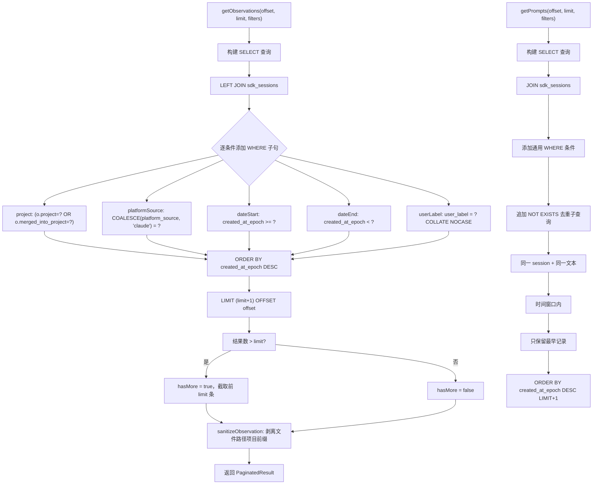

# PaginationHelper.ts 需求说明

> 源文件：`src/services/worker/PaginationHelper.ts` ｜ 类型：源码 ｜ 行数：340 ｜ 所属模块：worker ｜ 分析日期：2026-07-23

## 1. 文件定位总述

PaginationHelper 是 claude-mem Worker HTTP API 的分页查询引擎。它封装了对 observations、session_summaries、user_prompts 三张核心表的分页检索逻辑，支持按项目、平台来源、时间范围、用户标签等多维过滤，并采用"多取一条"策略实现 hasMore 分页游标。此外，它对 observations 的文件路径字段进行项目前缀剥离，返回相对路径以提升前端展示可读性。

## 2. 功能需求

| 编号 | 需求描述（系统应当…） | 触发条件 / 输入 | 处理规则与输出 | 证据 |
|------|----------------------|----------------|---------------|------|
| FR-PAG-OBS-01 | 系统应当分页查询观测记录 | 提供 offset/limit 和可选过滤条件 | 查询 observations 表，LEFT JOIN sdk_sessions；支持按项目（含 merged_into_project）、platform_source、日期范围（半开区间 [start, end)）、userLabel 过滤；不指定项目时排除观察者会话项目；结果按 created_at_epoch DESC 排序；返回 PaginatedResult | `PaginationHelper.ts:55-137` |
| FR-PAG-OBS-02 | 系统应当对观测记录的文件路径剥离项目前缀 | 查询返回的 observations 含 files_read/files_modified | 以 `/<项目叶名>/` 为标记，移除该标记之前的部分；解析失败的 JSON 字符串保持原样 | `PaginationHelper.ts:16-53` |
| FR-PAG-SUM-01 | 系统应当分页查询会话摘要 | 提供 offset/limit 和可选过滤条件 | 查询 session_summaries 表，JOIN sdk_sessions；过滤逻辑同 FR-PAG-OBS-01；返回 PaginatedResult\<Summary\> | `PaginationHelper.ts:139-213` |
| FR-PAG-PROMPT-01 | 系统应当分页查询用户提示记录 | 提供 offset/limit 和可选过滤条件 | 查询 user_prompts 表，JOIN sdk_sessions；过滤逻辑同 FR-PAG-OBS-01；额外使用 NOT EXISTS 子查询去重：同一 content_session_id + 同一 prompt_text 在 `USER_PROMPT_DEDUPE_WINDOW_MS` 时间窗口内的重复记录只保留最早一条 | `PaginationHelper.ts:215-308` |
| FR-PAG-GEN-01 | 系统应当使用"多取一条"策略实现分页游标 | 所有分页查询 | 实际查询 `limit + 1` 条记录；返回结果截取前 `limit` 条，若总数 > limit 则 hasMore 为 true | `PaginationHelper.ts:123-131,201-212,296-307` |

## 3. 业务规则与约束

- **日期过滤为半开区间**：`created_at_epoch >= start AND created_at_epoch < end`，调用方负责在自己的时区中计算天的边界（`PaginationHelper.ts:103-111`）。
- **观察者会话排除**：不指定项目时，所有查询默认排除 `OBSERVER_SESSIONS_PROJECT` 的记录（`PaginationHelper.ts:96-98,175-177,253-255`）。
- **platform_source 默认值**：使用 `COALESCE(s.platform_source, 'claude')` 处理 NULL 值（`PaginationHelper.ts:71,100,154,179,231`）。
- **用户标签过滤不区分大小写**：使用 `COLLATE NOCASE` 进行 userLabel 匹配（`PaginationHelper.ts:115,193,273`）。
- **用户提示去重窗口**：基于 `USER_PROMPT_DEDUPE_WINDOW_MS` 常量的时间窗口去重（`PaginationHelper.ts:274-290`），同一会话同一文本在窗口内只保留最早的记录。
- **摘要查询使用 INNER JOIN**：与 observations 的 LEFT JOIN 不同，summaries 使用 JOIN sdk_sessions（`PaginationHelper.ts:165`），推断：（摘要记录必须有对应的 session 记录）。
- **文件路径剥离逻辑**：使用项目名称的叶子部分（最后一个 `/` 后的段）作为标记（`PaginationHelper.ts:17`），适用于项目路径含多个层级的情况。

## 4. 对外暴露

| 公开方法 | 签名 | 说明 |
|---------|------|------|
| `getObservations` | `(offset, limit, project?, platformSource?, dateStartEpoch?, dateEndEpoch?, userLabel?) => PaginatedResult<Observation>` | 分页查询观测 |
| `getSummaries` | `(offset, limit, project?, platformSource?, dateStartEpoch?, dateEndEpoch?, userLabel?) => PaginatedResult<Summary>` | 分页查询摘要 |
| `getPrompts` | `(offset, limit, project?, platformSource?, dateStartEpoch?, dateEndEpoch?, userLabel?) => PaginatedResult<UserPrompt>` | 分页查询用户提示 |

## 5. 依赖关系

**内部依赖**：
- `src/services/worker/DatabaseManager.ts` → `DatabaseManager`（`PaginationHelper.ts:3`）
- `src/utils/logger.ts` → 日志（`PaginationHelper.ts:4`）
- `src/shared/paths.ts` → `OBSERVER_SESSIONS_PROJECT`（`PaginationHelper.ts:5`）
- `src/shared/user-prompts.ts` → `USER_PROMPT_DEDUPE_WINDOW_MS`（`PaginationHelper.ts:6`）
- `src/services/worker-types.ts` → `PaginatedResult`/`Observation`/`Summary`/`UserPrompt`（`PaginationHelper.ts:7`）

## 6. 数据结构

**PaginatedResult<T>**（泛型分页结果）：
```typescript
interface PaginatedResult<T> {
  items: T[];       // 当前页数据
  hasMore: boolean;  // 是否有下一页
  offset: number;    // 当前偏移
  limit: number;     // 每页大小
}
```

**三条查询共用的过滤参数**：
- `project?: string` — 项目标识
- `platformSource?: string` — 平台来源
- `dateStartEpoch?: number` — 起始时间（epoch 秒）
- `dateEndEpoch?: number` — 结束时间（epoch 秒）
- `userLabel?: string` — 用户标签

## 7. 复杂逻辑图示



上图展示了分页查询的核心流程和用户提示去重逻辑。所有查询采用统一的过滤条件模式，用户提示额外通过 NOT EXISTS 子查询在指定时间窗口内去除重复记录。

## 8. 逆向备注

- 私有方法 `paginate<T>`（`PaginationHelper.ts:310-339`）是一个通用分页模板方法，但实际未被子查询方法调用——三个公开方法各自构建 SQL。推断：（该方法是早期抽象或预留，后续因各表过滤逻辑差异较大而改为独立实现）。
- `getSummaries` 使用 INNER JOIN 而 `getObservations` 使用 LEFT JOIN（`PaginationHelper.ts:88 vs 165`），差异意味着摘要必须关联到 session 才有效，而观测允许无 session。
- 文件路径剥离中 `stripProjectPath` 的标记为 `/<leaf>/`（`PaginationHelper.ts:18`），当项目名含 `/` 时取最后一段。若文件路径中项目名出现多次（如 `/proj/proj/file.ts`），只会匹配第一个出现的标记。
