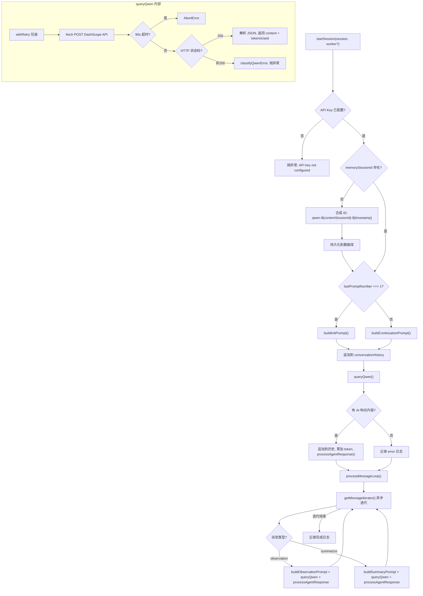

# QwenProvider.ts 需求说明

> 源文件：src/services/worker/QwenProvider.ts ｜ 类型：源码 ｜ 行数：409 ｜ 所属模块：worker ｜ 分析日期：2026-07-23

## 1. 文件定位总述

QwenProvider 是 Claude-Mem 的 AI 供应商实现之一，通过阿里云 DashScope 兼容模式 API 驱动 observation（工具调用观察记录）和 summary（会话摘要）的生成。它在 Worker 进程中运行，与 GeminiProvider 遵循相同的 REST 调用模式，复用已有的 prompt 构建、XML 解析和结果存储管线。QwenProvider 管理 Qwen 模型的会话生命周期：从初始化（构建 memorySessionId、发送 init prompt）、消息循环（消费 observation/summarize 队列消息、逐条调用 API），到错误处理和 abort 恢复。凭证采用三级回退策略：环境变量 > settings.json > 凭据存储。

## 2. 功能需求

| 编号 | 需求描述（系统应当…） | 触发条件 / 输入 | 处理规则与输出 | 证据 |
|------|----------------------|----------------|---------------|------|
| FR-SESSION-01 | 系统应当在启动 Qwen 会话时自动校验 API Key 是否已配置，未配置则抛异常终止 | 调用 `startSession()` | 检查三级回退后的 API Key，为空则抛出包含配置指引的错误 | `QwenProvider.ts:117-122` |
| FR-SESSION-02 | 系统应当在会话首次启动时合成 memorySessionId，格式为 `qwen-${contentSessionId}-${timestamp}`，并持久化到数据库 | `session.memorySessionId` 为空时 | 调用 `dbManager.getSessionStore().updateMemorySessionId()` 写入合成 ID | `QwenProvider.ts:125-129` |
| FR-SESSION-03 | 系统应当根据 prompt 序号决定使用 init prompt 还是 continuation prompt 构建 AI 初始对话 | 会话启动时 | `lastPromptNumber === 1` 时使用 `buildInitPrompt`，否则使用 `buildContinuationPrompt` | `QwenProvider.ts:133-135` |
| FR-SESSION-04 | 系统应当在会话初始化完成后进入消息循环，异步迭代消费队列中的 observation 和 summarize 消息 | init 响应处理后 | 通过 `sessionManager.getMessageIterator()` 获取异步迭代器，在循环中处理每条消息 | `QwenProvider.ts:173-197` |
| FR-OBS-01 | 系统应当在收到 observation 消息时，构建 observation prompt、追加到对话历史、调用 Qwen API、处理 AI 响应并存储 | 队列消息 `type === 'observation'` | 使用 `buildObservationPrompt` 构建 prompt，调用 `processAgentResponse` 处理响应 | `QwenProvider.ts:199-243` |
| FR-OBS-02 | 系统应当在 observation 消息处理时同步更新 prompt 序号 | observation 消息携带 `prompt_number` | 将 `message.prompt_number` 赋值给 `session.lastPromptNumber` | `QwenProvider.ts:208-210` |
| FR-SUM-01 | 系统应当在收到 summarize 消息时，构建 summary prompt（含会话元数据和 last_assistant_message）、调用 Qwen API 并处理响应 | 队列消息 `type === 'summarize'` | 使用 `buildSummaryPrompt` 构建 prompt，调用 `processAgentResponse` 处理响应 | `QwenProvider.ts:245-285` |
| FR-QUERY-01 | 系统应当通过 HTTP POST 调用 DashScope 兼容模式 API，使用 OpenAI 消息格式，请求参数固定 temperature=0.3、max_tokens=4096 | 每次需要 AI 生成时 | 向 `https://dashscope.aliyuncs.com/compatible-mode/v1/chat/completions` 发送请求，携带 Bearer Token | `QwenProvider.ts:289-344` |
| FR-QUERY-02 | 系统应当对 Qwen API 调用实施 90 秒超时控制 | 每次 fetch 请求 | 通过 `AbortController` 设置 `AI_TIMEOUT_MS = 90000` 毫秒超时 | `QwenProvider.ts:21, 304` |
| FR-QUERY-03 | 系统应当对 Qwen API 调用实施重试机制（由 `withRetry` 工具函数提供） | 每次 API 调用 | 使用 `withRetry` 包装 fetch 逻辑，标签为 `Qwen ${model}` | `QwenProvider.ts:302-335` |
| FR-TOKEN-01 | 系统应当在每次 API 响应后累加 token 用量，按 70% 输入 / 30% 输出的比例估算分摊 | 收到 API 响应后 | `cumulativeInputTokens += floor(total * 0.7)`，`cumulativeOutputTokens += floor(total * 0.3)` | `QwenProvider.ts:148-150, 231-233, 273-275` |
| FR-CFG-01 | 系统应当支持通过三级回退获取 API Key：环境变量 `CLAUDE_MEM_REPORT_QWEN_API_KEY` > settings.json 同名键 > `getCredential()` 凭据存储 | 每次需要 API Key 时 | 依次检查三个来源，取第一个非空值 | `QwenProvider.ts:351-354` |
| FR-CFG-02 | 系统应当支持从 settings.json 中读取自定义模型名称，若不在白名单中则回退到默认模型 `qwen3-max` | 加载配置时 | 白名单为 `qwen3-max, qwen3-235b-a22b, qwen-plus, qwen-turbo`，未知模型 warn 后回退 | `QwenProvider.ts:356-365` |
| FR-ERR-01 | 系统应当根据 HTTP 状态码将 Qwen API 错误分类为：认证失败（401/403）、速率限制（429）、请求错误（400）、服务端错误（5xx）、网络错误 | API 返回非 200 状态码或网络异常 | 返回 `ClassifiedProviderError`，附带 `kind` 字段（auth_invalid / rate_limit / unrecoverable / transient） | `QwenProvider.ts:62-102` |
| FR-CHK-01 | 系统应当提供 Qwen 可用性检查函数，有 API Key 即判定为可用 | 外部调用 `isQwenAvailable()` | 依次检查环境变量、settings.json、凭据存储三级来源 | `QwenProvider.ts:384-398` |
| FR-CHK-02 | 系统应当提供 Qwen 是否被选为当前 Provider 的检查函数 | 外部调用 `isQwenSelected()` | 检查 settings.json 中 `CLAUDE_MEM_PROVIDER` 值是否为 `qwen`（不区分大小写） | `QwenProvider.ts:401-408` |

## 3. 业务规则与约束

- **默认模型**：`qwen3-max`（`QwenProvider.ts:20`）。
- **API 端点固定**：`https://dashscope.aliyuncs.com/compatible-mode/v1/chat/completions`（`QwenProvider.ts:19`）。
- **请求参数硬编码**：temperature 固定 0.3，max_tokens 固定 4096，不支持通过 settings.json 动态调整（`QwenProvider.ts:318-319`）。
- **Token 估算比例固定**：70% 输入 / 30% 输出（`QwenProvider.ts:149-150`），未区分实际输入/输出 token 数。
- **对话历史完全保留**：所有 user/assistant 消息均追加到 `conversationHistory` 数组，会话期间不截断（`QwenProvider.ts:137, 147, 225, 230, 267, 272`）。
- **Abort 错误特殊处理**：当收到 abort 错误时记录 warn 日志后重新抛出，不视为致命错误（`QwenProvider.ts:373-376`）。
- **空响应容忍**：init、observation、summary 三个阶段的空 AI 响应分别处理：init 空 response 记录 error；observation/summary 空 response 记录 warn 并跳过（队列消息保留）（`QwenProvider.ts:152-154, 238-242, 280-284`）。
- **模型白名单**：仅支持 4 个 Qwen 模型（`QwenProvider.ts:357`），超出白名单回退不中断。

## 4. 对外暴露

| 导出项 | 类型 | 说明 |
|--------|------|------|
| `QwenProvider` | class | 主类，构造参数为 `DatabaseManager` 和 `SessionManager` |
| `classifyQwenError(input)` | `(object) => ClassifiedProviderError` | HTTP 错误分类函数 |
| `QwenModel` | type | 模型联合类型：`qwen3-max \| qwen3-235b-a22b \| qwen-plus \| qwen-turbo` |
| `isQwenAvailable()` | `() => boolean` | Qwen 可用性检查 |
| `isQwenSelected()` | `() => boolean` | Qwen 是否被选为当前 Provider |

**QwenProvider 实例方法**：
- `startSession(session, worker?)` — 启动会话的公开入口方法

## 5. 依赖关系

**内部依赖**：
- `DatabaseManager`（`QwenProvider.ts:1`）— 数据库操作
- `SessionManager`（`QwenProvider.ts:2`）— 消息队列迭代
- `prompts.ts` — prompt 构建函数（`buildInitPrompt`, `buildObservationPrompt`, `buildSummaryPrompt`, `buildContinuationPrompt`）（`QwenProvider.ts:4`）
- `SettingsDefaultsManager` — settings.json 读取（`QwenProvider.ts:5`）
- `EnvManager` — 凭据获取（`QwenProvider.ts:6`）
- `paths.ts` — `USER_SETTINGS_PATH`（`QwenProvider.ts:7`）
- `worker-types.ts` — `ActiveSession`, `ConversationMessage` 类型（`QwenProvider.ts:8`）
- `ModeManager` — 当前活跃模式获取（`QwenProvider.ts:9`）
- `agents/index.ts` — `processAgentResponse`, `isAbortError`, `WorkerRef`（`QwenProvider.ts:11-15`）
- `provider-errors.ts` — `ClassifiedProviderError`（`QwenProvider.ts:16`）
- `retry.ts` — `withRetry`（`QwenProvider.ts:17`）

**外部依赖**：
- 无外部 npm 包，纯使用全局 `fetch` API

## 6. 数据结构

### QwenRequest（`QwenProvider.ts:30-35`）

DashScope 请求体，OpenAI 兼容格式：

| 字段 | 类型 | 说明 |
|------|------|------|
| model | string | Qwen 模型名称 |
| messages | Array<{ role, content }> | 对话历史 |
| temperature | number | 固定 0.3 |
| max_tokens | number | 固定 4096 |

### QwenResponse（`QwenProvider.ts:38-41`）

| 字段 | 类型 | 说明 |
|------|------|------|
| choices | Array<{ message?: { content?: string } }> | AI 响应选项 |
| usage | { total_tokens?: number } | Token 用量 |

### ClassifiedProviderError 分类规则（`QwenProvider.ts:62-102`）

| HTTP 状态码 | 错误 kind | 含义 |
|-------------|-----------|------|
| 401, 403 | auth_invalid | 认证失败 |
| 429 | rate_limit | 速率限制 |
| 400 | unrecoverable | 请求错误，不可恢复 |
| 500-599 | transient | 服务端错误，可重试 |
| 无状态码（网络错误） | transient | 网络错误，可重试 |
| 其他 | unrecoverable | 未知错误，不可恢复 |

## 7. 复杂逻辑图示

QwenProvider 的会话生命周期：初始化 → 消息循环 → 完成。每条消息处理均经过 prompt 构建 → API 调用 → 响应处理三阶段。

## 8. 逆向备注

- `startSession` 在处理 init query 失败和 message loop 失败时使用了 `return this.handleQwenError(error, session, worker)`（`QwenProvider.ts:143, 161`），而 `handleQwenError` 的返回类型为 `never`（`QwenProvider.ts:372`），推断 `return` 在此为类型系统兼容性写法，实际执行时总会抛出异常。
- `toOpenAiMessages` 中将所有非 `assistant` 角色映射为 `user`（`QwenProvider.ts:46`），推断 conversationHistory 中不存在 `system` 等其他角色，或这些角色通过 prompt 内容本身处理而非消息角色。
- `_worker` 参数在 `handleQwenError` 中未被使用（`QwenProvider.ts:372`），推断该参数保留为未来扩展预留。
- Observation 消息中 `tool_name` 和 `tool_input` 使用 `!` 非空断言（`QwenProvider.ts:218-219`），推断上游保证这两项一定存在，但代码中未做防御性检查。
- `isQwenAvailable()` 在 settings 文件读取失败时 catch 后继续尝试凭据存储（`QwenProvider.ts:392-393`），而 `isQwenSelected()` 在相同场景下直接返回 false（`QwenProvider.ts:406），两者对 settings 不可读的处理策略不一致。
