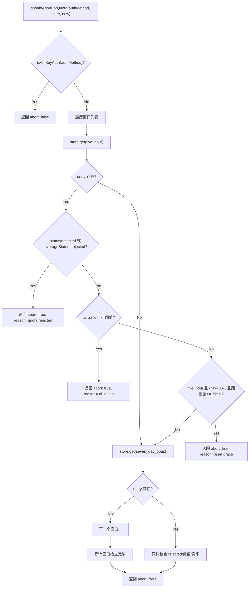

# RateLimitStore.ts 需求说明

> 源文件：src/services/worker/RateLimitStore.ts ｜ 类型：源码 ｜ 行数：224 ｜ 所属模块：worker（速率限制管理） ｜ 分析日期：2026-07-23

## 1. 文件定位总述

RateLimitStore 是 claude-mem Worker 的 API 速率限制状态管理和配额保护模块，负责捕获 Claude Agent SDK 报告的订阅配额快照、存储在内存中，并提供配额耗尽判断逻辑以决定是否应中止 SDK 消费。模块采用"last-write-wins per bucket"的内存存储模型，每个配额窗口（5 小时、7 天、Opus 7 天、Sonnet 7 天、超量）独立维护最新快照。核心决策函数 `shouldAbortForQuota` 根据当前认证方式（API Key 免限制、订阅用户受阈值保护）和各窗口的使用率/拒绝状态决定是否中止，防止后台记忆处理工作消耗用户的订阅配额而影响交互式会话。

## 2. 功能需求

| 编号 | 需求描述（系统应当…） | 触发条件 / 输入 | 处理规则与输出 | 证据 |
|------|----------------------|----------------|---------------|------|
| FR-rl-01 | 系统应当记录速率限制快照，按配额窗口类型分桶存储 | 调用 `set(info)`，传入 SDK 返回的 RateLimitInfo | 以 `rateLimitType` 为桶键（缺失时用 `'default'`），存储 info 副本并附加 `observedAt` 时间戳；last-write-wins 策略 | `src/services/worker/RateLimitStore.ts:63-67` |
| FR-rl-02 | 系统应当查询单个配额窗口的最新快照 | 调用 `get(type)` | 按 type 从 Map 中取值；type 为 undefined 时返回 `'default'` 桶 | `src/services/worker/RateLimitStore.ts:70-73` |
| FR-rl-03 | 系统应当返回所有桶条目，按 observedAt 降序排列 | 调用 `getAll()` | 将所有条目按 `observedAt` 从新到旧排序返回 | `src/services/worker/RateLimitStore.ts:76-80` |
| FR-rl-04 | 系统应当返回各标准窗口的最新快照概览 | 调用 `getMostRecentByWindow()` | 返回包含 five_hour/seven_day/seven_day_opus/seven_day_sonnet/overage 五个可选字段的聚合对象 | `src/services/worker/RateLimitStore.ts:83-97` |
| FR-rl-05 | 系统应当根据认证方式和配额状态决定是否中止 SDK 消费 | 调用 `shouldAbortForQuota(authMethod, store, now)` | API Key 用户不中止；订阅用户按窗口逐一检查：先检查 rejected 状态、再检查 utilization 阈值、最后检查 5 小时窗口的重置宽限期 | `src/services/worker/RateLimitStore.ts:140-211` |
| FR-rl-06 | 系统应当识别 API Key 认证方式 | `isApiKeyAuth(authMethod)` | 将 authMethod 转小写，匹配以 `api key` 开头或等于 `api_key` | `src/services/worker/RateLimitStore.ts:219-223` |

## 3. 业务规则与约束

1. **内存存储，重启重置**：所有速率限制数据存储在进程内存 Map 中，Worker 重启后数据丢失。这是设计决策——SDK 会在下次请求时推送新快照。`src/services/worker/RateLimitStore.ts:24`
2. **配额窗口阈值**：各窗口有不同的使用率阈值——five_hour: 95%、seven_day_opus: 93%、seven_day_sonnet: 92%、seven_day: 93%、overage: 95%。超过阈值则中止。`src/services/worker/RateLimitStore.ts:117-123`
3. **Provider 拒绝优先级最高**：无论 utilization 数值如何，只要 status='rejected'（或 overage 窗口的 overageStatus='rejected'），立即中止。`src/services/worker/RateLimitStore.ts:170-179`
4. **重置宽限期**：仅适用于 5 小时窗口，条件为 utilization >= 85% 且距重置时间 <= 15 分钟时触发中止。逻辑是在窗口即将重置前避免消耗最后几个百分点。`src/services/worker/RateLimitStore.ts:126-128,193-207`
5. **API Key 豁免**：API Key 用户按调用计费，已授权消费，不受配额阈值保护。`src/services/worker/RateLimitStore.ts:147-149`
6. **窗口检查顺序**：five_hour → seven_day_opus → seven_day_sonnet → seven_day → overage。任一窗口命中即返回中止，不继续检查后续窗口。`src/services/worker/RateLimitStore.ts:151-157`

## 4. 对外暴露

| 名称 | 类型 | 签名 | 说明 |
|------|------|------|------|
| `RateLimitWindow` | type | `'five_hour' \| 'seven_day' \| 'seven_day_opus' \| 'seven_day_sonnet' \| 'overage'` | 配额窗口类型联合 |
| `RateLimitInfo` | interface | `{ status?, resetsAt?, rateLimitType?, utilization?, overageStatus?, overageResetsAt?, isUsingOverage?, surpassedThreshold? }` | SDK 速率限制信息 |
| `RateLimitEntry` | interface | `RateLimitInfo & { observedAt: number }` | 带观察时间戳的速率限制条目 |
| `RateLimitBucketKey` | type | `RateLimitWindow \| 'default'` | 桶键类型 |
| `RateLimitStore` | class | — | 速率限制存储类 |
| `globalRateLimitStore` | const | `RateLimitStore` 实例 | 进程级单例 |
| `shouldAbortForQuota` | function | `(authMethod, store, now?) => { abort, reason?, window? }` | 配额中止决策 |
| `isApiKeyAuth` | function | `(authMethod: string) => boolean` | API Key 认证检测 |

共 3 个类型、3 个接口、1 个类（含 1 个单例实例）、2 个函数。

## 5. 依赖关系

- **上游依赖**：无外部模块依赖，纯逻辑模块
- **下游被调用**：被 Worker 的 SDK 消费循环调用（设置速率限制快照 + 检查是否应中止）
- **推断**：`RateLimitInfo` 的形状来源于 `@anthropic-ai/claude-agent-sdk` 的 `query()` 流中 `system` 类型事件的 `rate_limit_info` 字段，但代码注释标注为"currently undocumented"

## 6. 数据结构

- **UTILIZATION_THRESHOLDS** (`src/services/worker/RateLimitStore.ts:117-123`)：各窗口的 utilization 中止阈值映射
- **RESET_GRACE_MS** (`src/services/worker/RateLimitStore.ts:126`)：重置宽限期 15 分钟（900000ms）
- **RESET_GRACE_UTILIZATION_FLOOR** (`src/services/worker/RateLimitStore.ts:128`)：宽限期生效的最低 utilization（85%）
- **RateLimitStore 内部状态**：`Map<RateLimitBucketKey, RateLimitEntry>`，keyed by 窗口类型

## 7. 复杂逻辑图示

上图展示了配额中止决策的完整判断流程。API Key 用户在入口即豁免；订阅用户按窗口逐一检查，命中任一条件即中止。

## 8. 逆向备注

1. **速率限制信息来源为未文档化字段**：代码注释明确指出 `rate_limit_info` 的形状为"currently undocumented"，来自 meridian 项目的代理模式。`src/services/worker/RateLimitStore.ts:8-24`
2. **设计来源标注**：注释提及 "Pattern adapted from meridian's proxy/rateLimitStore.ts"，表明该设计借鉴了 meridian 项目的实现。`src/services/worker/RateLimitStore.ts:25`
3. **Sonnet 阈值最低**：seven_day_sonnet 的阈值为 92%，低于其他窗口（93%-95%）。推断：Sonnet 模型的配额更紧张，需要更早触发保护。`src/services/worker/RateLimitStore.ts:120`
4. **宽限期仅限 five_hour**：重置宽限期逻辑仅对 five_hour 窗口生效，7 天窗口不适用。推断：5 小时窗口滚动重置频率高，15 分钟内即将重置的场景常见；7 天窗口重置不频繁，此优化无意义。`src/services/worker/RateLimitStore.ts:194`
5. **`set` 方法防御性编程**：接受 `undefined` 和 `null` 输入但不报错，仅静默忽略。`src/services/worker/RateLimitStore.ts:63-64`
6. **`clear` 方法标注为测试用**：注释明确说明 "used by tests for isolation"。`src/services/worker/RateLimitStore.ts:103-104`
