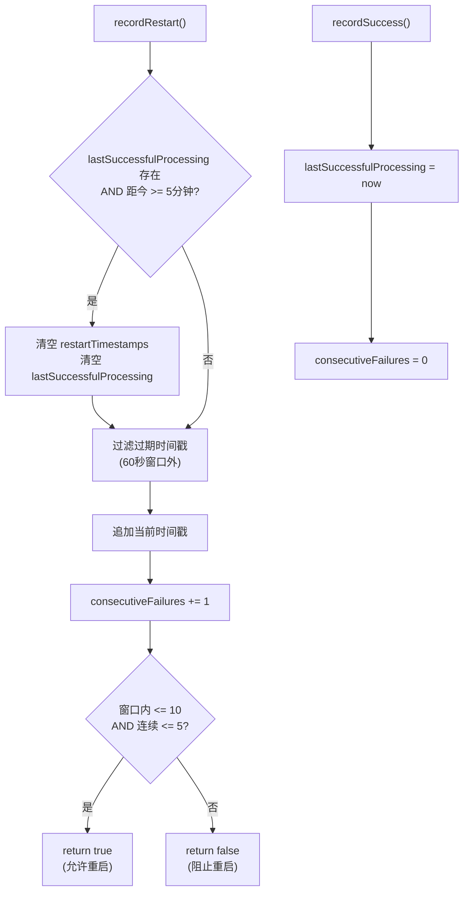

# RestartGuard.ts 需求说明

> 源文件：src/services/worker/RestartGuard.ts ｜ 类型：源码 ｜ 行数：59 ｜ 所属模块：worker ｜ 分析日期：2026-07-23

## 1. 文件定位总述

本文件是 Worker 进程的防雪崩重启保护器，通过滑动窗口和连续失败计数两个维度限制 AI 处理的自动重启频率。它记录每次重启的时间戳和连续失败次数，在成功处理后重置计数器。当重启频率或连续失败次数超过阈值时，阻止进一步重启以防止无限循环。成功处理后的衰减机制允许在正常工作恢复后重新开放重启配额。

## 2. 功能需求

| 编号 | 需求描述（系统应当…） | 触发条件 / 输入 | 处理规则与输出 | 证据 |
|------|----------------------|----------------|---------------|------|
| FR-RG-01 | 系统应当记录每次重启事件并判断是否允许继续重启 | 调用 `recordRestart()` | 清理过期时间戳，追加当前时间戳，递增连续失败计数，返回是否在配额内 | `src/services/worker/RestartGuard.ts:12-31` |
| FR-RG-02 | 系统应当在 AI 处理成功后重置失败计数器 | 调用 `recordSuccess()` | 记录成功时间戳，将连续失败计数归零 | `src/services/worker/RestartGuard.ts:33-36` |
| FR-RG-03 | 系统应当提供查询当前窗口内重启次数的能力 | 访问 `restartsInWindow` 属性 | 返回 60 秒窗口内的重启次数（过滤过期时间戳后统计） | `src/services/worker/RestartGuard.ts:38-41` |
| FR-RG-04 | 系统应当在成功处理后经过衰减时间后自动清除重启历史 | `recordRestart()` 被调用时，距离上次成功已超过 `DECAY_AFTER_SUCCESS_MS` | 清空 `restartTimestamps` 数组和 `lastSuccessfulProcessing` | `src/services/worker/RestartGuard.ts:15-19` |

## 3. 业务规则与约束

| 编号 | 规则描述 | 证据 |
|------|---------|------|
| BR-RG-01 | 滑动窗口时长：60 秒（`RESTART_WINDOW_MS = 60_000`） | `src/services/worker/RestartGuard.ts:2` |
| BR-RG-02 | 窗口内最大重启次数：10 次（`MAX_WINDOWED_RESTARTS = 10`） | `src/services/worker/RestartGuard.ts:3` |
| BR-RG-03 | 最大连续失败次数：5 次（`MAX_CONSECUTIVE_FAILURES = 5`） | `src/services/worker/RestartGuard.ts:4` |
| BR-RG-04 | 成功后衰减时间：5 分钟（`DECAY_AFTER_SUCCESS_MS = 5 * 60_000`） | `src/services/worker/RestartGuard.ts:5` |
| BR-RG-05 | 两个条件取 AND：窗口内重启数和连续失败数均未超限才允许重启 | `src/services/worker/RestartGuard.ts:28-30` |

## 4. 对外暴露

| 导出项 | 类型 | 用途 |
|--------|------|------|
| `RestartGuard` | 类 | 防雪崩重启保护器 |

**公开成员**：
| 成员 | 类型 | 用途 |
|------|------|------|
| `recordRestart()` | 方法 | 记录重启，返回是否允许继续 |
| `recordSuccess()` | 方法 | 记录成功，重置失败计数 |
| `restartsInWindow` | 只读属性 | 当前窗口内重启次数 |
| `windowMs` | 只读属性 | 窗口时长（60000） |
| `maxRestarts` | 只读属性 | 窗口内最大重启次数（10） |
| `consecutiveFailuresSinceSuccess` | 只读属性 | 当前连续失败次数 |
| `maxConsecutiveFailures` | 只读属性 | 最大连续失败次数（5） |

## 5. 依赖关系

- **上游依赖**：无
- **下游消费者**：推断被 Worker 的 AI 处理循环引用，在每次处理失败时检查是否允许重启

## 6. 数据结构

不适用（内部状态为简单的时间戳数组和计数器）。

## 7. 复杂逻辑图示

图示说明：`recordRestart` 先衰减历史、再过滤窗口、最后判断双维度配额；`recordSuccess` 重置状态。

## 8. 逆向备注

- 衰减机制（5 分钟后清空历史）意味着在正常工作 5 分钟后，重启配额完全恢复。这是一个相对积极的恢复策略。
- 连续失败计数器在 `recordRestart` 中递增、在 `recordSuccess` 中归零，但如果 `recordSuccess` 从未被调用（进程崩溃），计数器会在下次启动时从零开始（因为内存状态丢失）。
