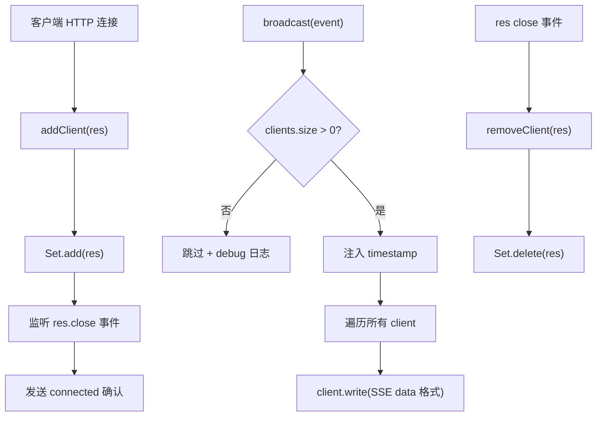

# SSEBroadcaster.ts 需求说明

> 源文件：src/services/worker/SSEBroadcaster.ts ｜ 类型：源码 ｜ 行数：50 ｜ 所属模块：worker ｜ 分析日期：2026-07-23

## 1. 文件定位总述

本文件是 Worker 的 Server-Sent Events（SSE）推送核心组件，管理已连接客户端集合并支持事件广播。`SSEBroadcaster` 类通过 Express 的 `Response` 对象维护客户端连接池，在客户端连接时自动发送确认消息，在断开时自动清理，并在广播时为每个事件注入时间戳后推送给所有已连接客户端。该组件是 Viewer UI 实时更新能力的基础设施。

## 2. 功能需求

| 编号 | 需求描述（系统应当…） | 触发条件 / 输入 | 处理规则与输出 | 证据 |
|------|----------------------|----------------|---------------|------|
| FR-SSE-01 | 系统应当支持注册新的 SSE 客户端连接 | 调用 `addClient(res)` | 将 Response 加入客户端集合，监听 `close` 事件自动移除，立即发送 `{ type: 'connected', timestamp }` 确认消息 | `src/services/worker/SSEBroadcaster.ts:9-18` |
| FR-SSE-02 | 系统应当支持移除已断开的客户端 | 调用 `removeClient(res)` 或客户端触发 `close` 事件 | 从集合中删除指定 Response，记录 debug 日志 | `src/services/worker/SSEBroadcaster.ts:20-23` |
| FR-SSE-03 | 系统应当将事件广播给所有已连接客户端 | 调用 `broadcast(event)` | 注入当前时间戳，序列化为 SSE `data:` 格式，逐个客户端写入；无客户端时跳过并记录日志 | `src/services/worker/SSEBroadcaster.ts:25-39` |
| FR-SSE-04 | 系统应当提供查询当前客户端数量的能力 | 调用 `getClientCount()` | 返回集合大小 | `src/services/worker/SSEBroadcaster.ts:41-43` |

## 3. 业务规则与约束

| 编号 | 规则描述 | 证据 |
|------|---------|------|
| BR-SSE-01 | SSE 数据格式为 `data: ${JSON.stringify(event)}\n\n`，符合 SSE 协议标准 | `src/services/worker/SSEBroadcaster.ts:32` |
| BR-SSE-02 | 广播操作为同步（void），不等待客户端写入完成，不处理写入错误 | `src/services/worker/SSEBroadcaster.ts:36-38` |
| BR-SSE-03 | 客户端集合使用 `Set<SSEClient>`，确保每个连接只注册一次 | `src/services/worker/SSEBroadcaster.ts:7` |
| BR-SSE-04 | 广播时自动注入 `timestamp` 字段（`Date.now()`），每个客户端收到的事件携带相同时间戳 | `src/services/worker/SSEBroadcaster.ts:31` |

## 4. 对外暴露

| 导出项 | 类型 | 用途 |
|--------|------|------|
| `SSEBroadcaster` | 类 | SSE 客户端管理和事件广播 |

**公开方法**：
| 方法 | 用途 |
|------|------|
| `addClient(res)` | 注册新客户端 |
| `removeClient(res)` | 移除客户端 |
| `broadcast(event)` | 广播事件 |
| `getClientCount()` | 获取客户端数量 |

## 5. 依赖关系

- **上游依赖**：`express`（`Response` 类型）、`../../utils/logger.js`、`../worker-types.js`（`SSEEvent`, `SSEClient` 类型）
- **下游消费者**：推断被 Worker HTTP 服务引用，作为 SSE 端点的广播引擎；被 `ObservationBroadcaster` 间接引用

## 6. 数据结构

```typescript
// SSE 事件（通用）
interface SSEEvent {
  type: string;
  timestamp?: number;
  [key: string]: any;
}

// SSE 客户端 = Express Response
type SSEClient = Response;
```

## 7. 复杂逻辑图示



图示说明：客户端注册时自动监听断开事件以清理；广播时注入时间戳后逐客户端推送。

## 8. 逆向备注

- 广播写入不处理错误（如客户端连接已断开但 `close` 事件未及时触发），依赖 Set 的 `close` 事件监听做延迟清理。
- `sendToClient` 为私有方法，仅用于发送连接确认消息。
