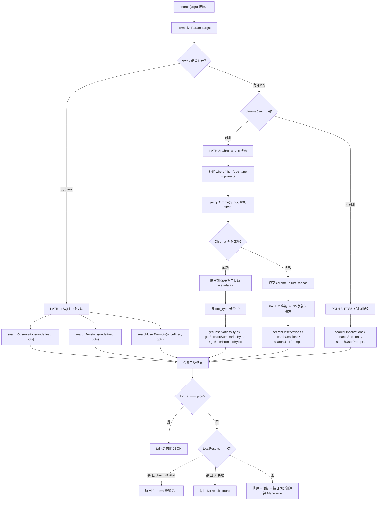
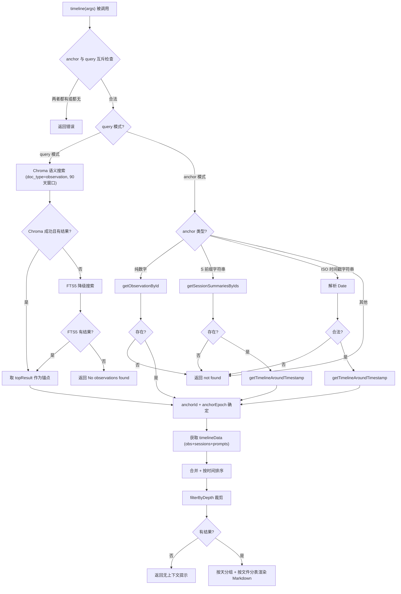
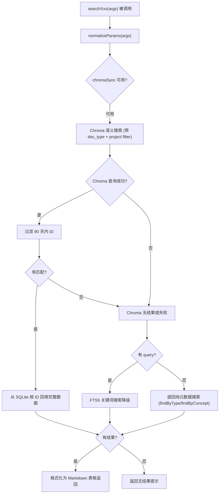

# SearchManager.ts 需求说明

> 源文件：src/services/worker/SearchManager.ts | 类型:源码 | 行数: 1659 | 所属模块: worker-service (搜索管理) | 分析日期: 2026-07-23

## 1. 文件定位总述

SearchManager 是 claude-mem Worker HTTP API 层的搜索调度核心，承担"统一搜索入口"的角色。它聚合了 ChromaDB 语义搜索与 SQLite FTS5 关键词搜索两条检索路径，并为外部 Skill/Route 提供一整套面向观察记录(Observation)、会话摘要(SessionSummary)、用户提示(UserPrompt)三类数据的查询能力。该类不直接处理 HTTP 请求路由，而是被 Worker Service 实例化后以方法调用形式暴露给 API 路由层。其内部持有 `SearchOrchestrator`（策略编排器）和 `TimelineBuilder`（时间线构建器）两个协作对象，同时依赖 `SessionSearch`（FTS5 搜索）、`SessionStore`（数据存取）、`ChromaSync`（向量搜索）以及 `FormattingService`/`TimelineService`（格式化与过滤）。SearchManager 自身还保留了一套完整的"内联"搜索逻辑（未委托给 Orchestrator），两条路径并行存在，推断为历史演进遗留。

## 2. 功能需求

| 编号 | 需求描述（系统应当...） | 触发条件 / 输入 | 处理规则与输出 | 证据 |
|------|----------------------|----------------|---------------|------|
| FR-SEARCH-01 | 系统应当支持跨三类文档类型（observations/sessions/prompts）的统一搜索，结果按日期分组并以 Markdown 表格呈现 | 调用 `search(args)` 方法，传入 `query`（可选）、`type`、`format`、日期范围、项目等参数 | 三路搜索（见 FR-SEARCH-02）；无 `query` 时走纯 SQLite 过滤；`format=json` 返回结构化 JSON；默认按日期降序排列、默认限制 20 条；输出含 obs/sessions/prompts 各自计数 | `SearchManager.ts:140-413` |
| FR-SEARCH-02 | 系统应当在搜索时按优先级选择检索引擎：有 query 且 Chroma 可用时走 Chroma 语义搜索；Chroma 不可用走 FTS5；无 query 时直接 SQLite 过滤 | `search()` 内部，依据 `query` 是否存在及 `this.chromaSync` 是否为 null | PATH 1: 无 query -> SQLite 纯过滤；PATH 2: Chroma 可用 -> Chroma 语义搜索 + 90 天窗口过滤 + 按需日期范围裁剪；PATH 3: Chroma 不可用 -> FTS5 关键词搜索。Chroma 失败时自动降级到 FTS5 | `SearchManager.ts:149-293` |
| FR-SEARCH-03 | 系统应当对搜索参数进行标准化处理，兼容单数/复数别名、字符串到数组转换、日期范围合并、布尔值字符串解析 | 调用任何接受 `args` 的公开方法前，内部先调用 `normalizeParams(args)` | `filePath` -> `files`；`concept` -> `concepts`；逗号分隔的 `concepts/files/obs_type/type` 字符串拆分为数组；`dateStart/dateEnd` 合并为 `dateRange` 对象；`isFolder` 字符串 `'true'/'false'` 转为布尔值 | `SearchManager.ts:93-138` |
| FR-SEARCH-04 | 系统应当在 Chroma 语义搜索失败时，向调用方返回降级提示信息 | Chroma 搜索抛出异常且最终结果为 0 | 返回 `ResultFormatter.formatChromaFailureMessage()` 生成的文本，区分连接错误（`ChromaUnavailableError`）与其他错误 | `SearchManager.ts:306-314`, `SearchManager.ts:255-262` |
| FR-SEARCH-05 | 系统应当支持以"锚点"(anchor) 或语义查询(query) 为中心，获取前后 N 条记录的时间线上下文 | 调用 `timeline(args)`，传入 `anchor`（数字ID/S前缀会话ID/ISO时间戳）或 `query`，以及 `depth_before`/`depth_after` | anchor 与 query 互斥，均缺失时返回错误；query 模式先 Chroma 搜索最佳匹配 obs 作为锚点再取时间线；anchor 模式解析锚点类型后直接取时间线；结果按时间排序后用 `timelineService.filterByDepth` 裁剪；输出 Markdown 含按天分组、按文件分表的 timeline 视图 | `SearchManager.ts:424-686` |
| FR-SEARCH-06 | 系统应当支持按类型过滤获取"决策"(decision) 类型的观察记录，优先使用 Chroma 语义排序 | 调用 `decisions(args)` | 有 query 时 Chroma 语义搜索 + type=decision 元数据过滤；无 query 时先元数据搜索再用 Chroma 语义重排序（metadata-first + semantic ranking）；Chroma 不可用时退回纯元数据搜索 | `SearchManager.ts:688-758` |
| FR-SEARCH-07 | 系统应当支持搜索"变更"(change) 相关的观察记录，综合 type=change 和 concept=change/what-changed 两个维度 | 调用 `changes(args)` | 通过 `findByType('change')` 和 `findByConcept('change')`、`findByConcept('what-changed')` 三路召回候选集合并去重，再用 Chroma 语义重排序；无 Chroma 时直接按 `created_at_epoch` 降序排列 | `SearchManager.ts:760-834` |
| FR-SEARCH-08 | 系统应当支持搜索"工作原理"(how-it-works) 概念相关的观察记录 | 调用 `howItWorks(args)` | 先元数据搜索 `findByConcept('how-it-works')`，再用 Chroma 查询 "how it works architecture" 进行语义重排序；无 Chroma 时退回纯元数据搜索 | `SearchManager.ts:836-885` |
| FR-SEARCH-09 | 系统应当提供专用的观察记录搜索方法，仅搜索 observations 类型，支持项目过滤和 90 天窗口 | 调用 `searchObservations(args)` | Chroma 可用时以 `doc_type=observation` 过滤查询，结果取 90 天内最近记录；Chroma 失败或无结果时 FTS5 降级；默认限制 20 条 | `SearchManager.ts:887-960` |
| FR-SEARCH-10 | 系统应当提供专用的会话摘要搜索方法，仅搜索 session_summary 类型 | 调用 `searchSessions(args)` | 逻辑与 FR-SEARCH-09 一致，doc_type 换为 `session_summary`，结果通过 `getSessionSummariesByIds` 回填 | `SearchManager.ts:962-1035` |
| FR-SEARCH-11 | 系统应当提供专用的用户提示搜索方法，仅搜索 user_prompt 类型 | 调用 `searchUserPrompts(args)` | 逻辑与 FR-SEARCH-09 一致，doc_type 换为 `user_prompt`，FTS5 降级仅在 `query` 非空时触发 | `SearchManager.ts:1037-1110` |
| FR-SEARCH-12 | 系统应当根据项目上下文获取最近 N 个会话的摘要上下文，供 SessionStart hook 注入 | 调用 `getRecentContext(args)`，传入 `project` 和 `limit`（默认 3） | 未指定 project 时从 `process.cwd()` 推断；获取最近会话列表，已完成的会话展示摘要信息（request/completed/learned/next_steps/files_read/files_edited），活跃会话展示进行中状态和已有观察列表，无摘要会话展示状态标记 | `SearchManager.ts:1112-1233` |
| FR-SEARCH-13 | 系统应当支持以锚点为中心获取时间线上下文（无 query 语义搜索路径，纯 anchor 模式） | 调用 `getContextTimeline(args)`，传入 `anchor` 和深度参数 | 与 `timeline()` 的 anchor 模式逻辑高度一致（数字ID/S会话ID/ISO时间戳三种锚点解析）；不包含 query 搜索路径 | `SearchManager.ts:1235-1423` |
| FR-SEARCH-14 | 系统应当支持通过语义查询自动定位锚点并生成时间线，支持 auto/interactive 两种模式 | 调用 `getTimelineByQuery(args)`，传入 `query`、`mode`（默认 auto）、深度参数 | auto 模式：取最佳匹配 obs 为锚点直接输出时间线；interactive 模式：返回候选列表提示用户手动选择锚点。两种模式均先 Chroma 语义搜索、后 FTS5 降级 | `SearchManager.ts:1425-1657` |
| FR-SEARCH-15 | 系统应当将 Chroma 语义搜索结果限制在 90 天时间窗口内（RECENCY_WINDOW_MS） | 所有涉及 Chroma 查询的方法 | Chroma 返回结果后，通过 `meta.created_at_epoch > ninetyDaysAgo` 过滤；用户指定 `dateRange` 时以用户范围为优先 | `SearchManager.ts:80-88`, `SearchManager.ts:214-215`, `search/types.ts:7-8` |

## 3. 业务规则与约束

**时间窗口规则**：系统将 Chroma 语义搜索结果默认限制在最近 90 天（`SEARCH_CONSTANTS.RECENCY_WINDOW_MS = 90 * 24 * 60 * 60 * 1000`）内。当用户显式指定 `dateRange.start/dateRange.end` 时，以用户范围替代默认窗口。`dateRange` 值支持数字（epoch 毫秒）和字符串（Date 可解析格式）。`src/services/worker/SearchManager.ts:214-215`, `src/services/worker/search/types.ts:7-8`

**搜索降级策略**：Chroma 语义搜索是首选路径，失败时自动降级到 SQLite FTS5 关键字搜索。降级不抛出异常，而是记录日志后走备用路径。`ChromaUnavailableError`（连接错误）与普通 Chroma 错误在降级行为上一致，但错误提示文案不同。`src/services/worker/SearchManager.ts:255-273`

**项目过滤规则**：当指定 `project` 参数时，Chroma 过滤器使用 `$or: [{project}, {merged_into_project}]` 逻辑，同时匹配原始项目和合并后的项目。`src/services/worker/SearchManager.ts:180-190`

**Chroma 查询上限**：所有 Chroma 语义搜索请求上限为 100 条（硬编码）。`src/services/worker/SearchManager.ts:77`, `SearchManager.ts:193`, `SearchManager.ts:907` 等

**结果限制**：默认返回最多 20 条结果（`options.limit || 20`）。`src/services/worker/SearchManager.ts:358`

**锚点互斥规则**：`timeline()` 方法要求 `anchor` 和 `query` 二选一，同时提供或同时缺失均返回错误。`src/services/worker/SearchManager.ts:431-449`

**参数归一化**：`filePath`/`concept` 为 `files`/`concepts` 的单数别名，二者不会同时生效；`obs_type` 重命名为 `obsType` 仅在 `SearchOrchestrator` 中发生，SearchManager 自身的 `normalizeParams` 保留了原始键名。`src/services/worker/SearchManager.ts:96-116`

**双写时间线渲染逻辑**：`timeline()`、`getContextTimeline()`、`getTimelineByQuery(auto模式)` 三个方法各自内联了几乎相同的时间线 Markdown 渲染代码（按天分组、按文件分表、ANCHOR 标记），而非复用 `TimelineBuilder.formatTimeline()`。推断为历史演进导致，`TimelineBuilder.formatTimeline()` 已提供等价功能。`src/services/worker/SearchManager.ts:571-678`, `SearchManager.ts:1316-1415`, `SearchManager.ts:1552-1648`

**结果排序规则**：通用搜索 `search()` 支持 `orderBy=date_desc/date_asc` 排序，默认降序；专用搜索方法（searchObservations/searchSessions/searchUserPrompts）通过 `getObservationsByIds` 等方法的 `orderBy: 'date_desc'` 参数固定降序排列。`src/services/worker/SearchManager.ts:352-358`

## 4. 对外暴露

| 暴露项 | 类型 | 调用方 | 说明 |
|--------|------|--------|------|
| `search(args)` | public async method | 搜索 Skill / Search Routes | 通用统一搜索入口 |
| `timeline(args)` | public async method | 时间线 Skill / Timeline Routes | 锚点/查询式时间线上下文 |
| `decisions(args)` | public async method | 搜索 Skill | 决策类观察记录检索 |
| `changes(args)` | public async method | 搜索 Skill | 变更类观察记录检索 |
| `howItWorks(args)` | public async method | 搜索 Skill | 工作原理类观察记录检索 |
| `searchObservations(args)` | public async method | 搜索 Skill | 仅观察记录搜索 |
| `searchSessions(args)` | public async method | 搜索 Skill | 仅会话摘要搜索 |
| `searchUserPrompts(args)` | public async method | 搜索 Skill | 仅用户提示搜索 |
| `getRecentContext(args)` | public async method | SessionStart hook / Context Routes | 最近会话上下文注入 |
| `getContextTimeline(args)` | public async method | 时间线 Skill | 纯锚点时间线（无 query 路径） |
| `getTimelineByQuery(args)` | public async method | 时间线 Skill | 语义查询+时间线 |
| `getOrchestrator()` | public method | Worker Service 初始化 | 暴露内部 SearchOrchestrator 实例 |
| `getFormatter()` | public method | Worker Service 初始化 | 暴露 FormattingService 实例 |
| `getSessionStore()` | public method | Worker Service 初始化 | 暴露 SessionStore 实例 |

## 5. 依赖关系

**构造函数注入依赖**（`src/services/worker/SearchManager.ts:27-40`）:
- `SessionSearch` -- SQLite FTS5 关键词搜索执行器
- `SessionStore` -- SQLite 数据存取层（按 ID 批量获取、时间线查询、最近会话等）
- `ChromaSync | null` -- ChromaDB 向量搜索客户端，可为 null 表示未启用
- `FormattingService` -- 搜索结果 Markdown 表格格式化
- `TimelineService` -- 时间线项目按深度过滤

**内部创建依赖**:
- `SearchOrchestrator` -- 搜索策略编排器（构造时从注入依赖创建，`src/services/worker/SearchManager.ts:34-38`）
- `TimelineBuilder` -- 时间线构建器（构造时创建，`src/services/worker/SearchManager.ts:39`）

**导入的工具依赖**:
- `logger` (`src/utils/logger.js`) -- 日志记录
- `getProjectContext` (`src/utils/project-name.js`) -- 从 cwd 推断项目名
- `formatDate/formatTime/formatDateTime/extractFirstFile/groupByDate/estimateTokens` (`src/shared/timeline-formatting.js`) -- 时间线格式化工具函数
- `ModeManager` (`src/services/domain/ModeManager.js`) -- 观察类型图标/工作表情映射
- `ResultFormatter` (`src/services/worker/search/ResultFormatter.js`) -- Chroma 失败消息格式化
- `ChromaUnavailableError` (`src/services/worker/search/errors.js`) -- Chroma 不可用异常类型
- `SEARCH_CONSTANTS` (`src/services/worker/search/types.js`) -- 搜索常量（90天窗口、默认限制等）

**类型依赖**:
- `ObservationSearchResult`, `SessionSummarySearchResult`, `UserPromptSearchResult` (`src/services/sqlite/types.js`) -- 搜索结果行类型
- `TimelineItem` (`src/services/worker/TimelineService.js`) -- 时间线项目类型

## 6. 数据结构

### 6.1 构造函数参数

```typescript
constructor(
  sessionSearch: SessionSearch,      // FTS5 搜索
  sessionStore: SessionStore,        // 数据存取
  chromaSync: ChromaSync | null,     // 向量搜索（可空）
  formatter: FormattingService,      // 格式化服务
  timelineService: TimelineService  // 时间线过滤
)
```

### 6.2 标准化后的搜索参数结构（推断自 `normalizeParams` 返回值及解构）

```typescript
interface NormalizedSearchArgs {
  query?: string;
  type?: string | string[];           // 'observations' | 'sessions' | 'prompts' 或组合
  obs_type?: string | string[];       // 观察类型过滤
  concepts?: string[];                // 概念过滤
  files?: string[];                    // 文件过滤
  format?: 'json' | string;           // 输出格式
  dateRange?: { start?: string | number; end?: string | number };
  isFolder?: boolean;
  project?: string;
  limit?: number;
  orderBy?: 'date_desc' | 'date_asc';
}
```
`src/services/worker/SearchManager.ts:93-138`, `SearchManager.ts:142`

### 6.3 search() 返回结构

JSON 格式（`src/services/worker/SearchManager.ts:297-305`）:
```typescript
{
  observations: ObservationSearchResult[];
  sessions: SessionSummarySearchResult[];
  prompts: UserPromptSearchResult[];
  totalResults: number;
  query: string;
}
```

Markdown 格式（默认，`src/services/worker/SearchManager.ts:408-413`）:
```typescript
{
  content: [{ type: 'text'; text: string }];
}
```

### 6.4 timeline() 返回结构

```typescript
// 正常结果
{ content: [{ type: 'text'; text: string }] }

// 错误结果
{ content: [{ type: 'text'; text: string }]; isError: true }

// 无结果
{ content: [{ type: 'text'; text: string }] }
```
`src/services/worker/SearchManager.ts:431-449`, `SearchManager.ts:680-686`

### 6.5 CombinedResult（search() 内部局部接口）

```typescript
interface CombinedResult {
  type: 'observation' | 'session' | 'prompt';
  data: any;
  epoch: number;
  created_at: string;
}
```
`src/services/worker/SearchManager.ts:324-329`

## 7. 复杂逻辑图示

### 7.1 search() 三路径搜索决策流程

下图展示 `search()` 方法的三条搜索路径选择逻辑：无文本查询走纯 SQLite 过滤；有文本且 Chroma 可用走语义搜索（失败降级）；Chroma 不可用走 FTS5 关键词搜索。



### 7.2 timeline() 双模式时间线构建

下图展示 `timeline()` 方法的两种模式（query 语义搜索定位锚点 vs anchor 直接指定锚点）以及后续的时间线数据获取与渲染流程。



### 7.3 专用搜索方法的统一降级模式

`decisions()`、`changes()`、`howItWorks()`、`searchObservations()`、`searchSessions()`、`searchUserPrompts()` 六个专用方法共享相同的降级模式，下图以 `searchObservations()` 为代表。



## 8. 逆向备注

1. **双写搜索逻辑**：`search()` 方法内有一套完整的内联搜索逻辑（含 Chroma 查询、降级、结果合并、Markdown 渲染），而构造函数中创建的 `SearchOrchestrator` 也具备等价能力（`orchestrator.search()` -> `executeWithFallback()`）。`SearchManager` 自身的 `search()` 未委托给 Orchestrator，两套逻辑并行存在。推断：Orchestrator 是后续重构引入的策略模式抽象，SearchManager 中的旧代码尚未完全迁移。`SearchManager.ts:140-413` vs `SearchManager.ts:34-38`

2. **三套重复的时间线渲染代码**：`timeline()`（行571-678）、`getContextTimeline()`（行1316-1415）、`getTimelineByQuery()` auto 模式（行1552-1648）各自内联了近乎相同的 Markdown 时间线渲染逻辑（按天分组、按文件分表、ANCHOR 标记），而 `TimelineBuilder.formatTimeline()`（`src/services/worker/search/TimelineBuilder.ts:96-223`）已提供完全等价的功能。`SearchManager.ts:571-678`, `SearchManager.ts:1316-1415`, `SearchManager.ts:1552-1648`

3. **Chroma 错误捕获粒度不一致**：`search()` 方法在 Chroma 失败时将 `chromaFailed` 设为 true 并记录 `chromaFailureReason`，最终在结果为零时展示降级提示（行308-314）；但专用搜索方法（如 `searchObservations()` 等）在 Chroma 失败时仅记录日志并静默降级，不向用户展示任何降级提示。推断：`search()` 的降级提示是刻意设计，专用方法的无提示降级可能是疏忽也可能是设计选择（因专用方法最终若无结果已有"No results found"提示）。`SearchManager.ts:255-262` vs `SearchManager.ts:925-928`

4. **`timeline()` 中 FTS5 降级 limit 硬编码为 1**：当 Chroma 失败时，`timeline()` 的 query 模式回退到 FTS5 搜索，limit 参数硬编码为 1（行471），而非使用 `depthBefore/depthAfter` 或用户指定的 limit。推断：此处设计意图为只取一条最佳匹配作为锚点即可。`SearchManager.ts:471`

5. **`changes()` 方法的 Chroma 语义重排序查询词硬编码**：`changes()` 在获得候选集后，使用硬编码字符串 `'what changed'` 作为 Chroma 语义重排序查询（行778），而非用户的原始 query。这是因为 `changes()` 不接受 `query` 参数。`SearchManager.ts:778`

6. **`searchUserPrompts()` 的 FTS5 降级条件更严格**：相比 `searchObservations()` 和 `searchSessions()`，`searchUserPrompts()` 在 FTS5 降级时额外要求 `results.length === 0 && query`（行1081），即只有 query 非空时才尝试 FTS5。`SearchManager.ts:1081` vs `SearchManager.ts:931`

7. **注释与代码的路径标注**：`search()` 方法中存在 PATH 2/PATH 3 的注释标注（行166、276），但 PATH 1 无标注。注释准确描述了代码意图。

8. **`getRecentContext()` 中 files_read/files_edited 的容错解析**：尝试 `JSON.parse`，失败后降级为直接使用原始字符串。推断：数据库中该字段可能以 JSON 数组或纯字符串两种格式存储（历史数据迁移遗留）。`SearchManager.ts:1152-1178`
