# SessionManager.ts 需求说明

> 源文件：src/services/worker/SessionManager.ts ｜ 类型：源码 ｜ 行数：484 ｜ 所属模块：worker ｜ 分析日期：2026-07-23

## 1. 文件定位总述

SessionManager 是 Worker 进程的核心会话管理器，负责管理 AI 处理会话的完整生命周期：会话创建/初始化、消息队列的入队/消费/确认、会话删除与优雅关闭。它在内存中维护活跃会话的 `Map<number, ActiveSession>`，同时通过可插拔的队列引擎（SQLite 内置引擎或 BullMQ/Redis 引擎）实现消息持久化。SessionManager 是 AI Provider（QwenProvider、GeminiProvider 等）的上游服务，为其提供消息迭代器（`getMessageIterator`）以异步消费待处理的 observation 和 summarize 消息。它还与 Supervisor 子进程注册表协作，确保会话关闭时相关子进程也被正确回收。

## 2. 功能需求

| 编号 | 需求描述（系统应当…） | 触发条件 / 输入 | 处理规则与输出 | 证据 |
|------|----------------------|----------------|---------------|------|
| FR-QUEUE-ENGINE-01 | 系统应当按配置自动选择队列引擎：默认使用 SQLite 内置引擎，配置为 bullmq 时使用 Redis/BullMQ 引擎 | 首次调用 `getQueueEngine()` | 调用 `getObservationQueueEngineName()` 判断引擎类型，惰性创建实例并缓存 | `SessionManager.ts:28-44` |
| FR-QUEUE-ENGINE-02 | 系统应当在启动时初始化 BullMQ 队列引擎（SQLite 引擎无需显式初始化） | 调用 `initializeQueueEngine()` | 若为 bullmq 引擎，执行 `assertHealthy()` 和 `getTotalQueueDepth()`；SQLite 引擎直接返回 | `SessionManager.ts:46-56` |
| FR-QUEUE-ENGINE-03 | 系统应当提供队列健康状态查询能力，BullMQ 引擎返回具体健康指标，SQLite 引擎返回 null | 调用 `getQueueHealth()` | 通过 `isHealthCheckedQueue` 类型守卫判断引擎是否支持健康检查 | `SessionManager.ts:62-68` |
| FR-INIT-01 | 系统应当支持会话初始化，首次创建时从数据库加载会话信息并构建完整的 ActiveSession 对象 | 调用 `initializeSession(sessionDbId)` | 从 DB 读取 content_session_id、project、platform_source 等，memorySessionId 始终置 null（等待 SDK 捕获新 ID） | `SessionManager.ts:78-201` |
| FR-INIT-02 | 系统应当在会话已存在于内存缓存中时复用缓存对象，仅更新 project/platformSource 等可变字段 | 同一 sessionDbId 重复初始化 | 对比 DB 值与内存值，仅在不一致时更新；有新 currentUserPrompt 时覆盖旧值 | `SessionManager.ts:86-122` |
| FR-INIT-03 | 系统应当在初始化新会话时丢弃数据库中遗留的 memory_session_id（Issue #817） | DB 中存在旧 memory_session_id | 记录 warn 日志说明丢弃原因，将 memorySessionId 置 null | `SessionManager.ts:133-139` |
| FR-INIT-04 | 系统应当在初始化时确定 promptNumber：优先使用参数传入值，否则从数据库 user_prompts 推算 | 创建新会话对象 | 调用 `getSessionStore().getPromptNumberFromUserPrompts(contentSessionId)` | `SessionManager.ts:167` |
| FR-ENQUEUE-01 | 系统应当支持将 observation 数据入队，若 session 尚未初始化则自动创建 | 调用 `queueObservation(sessionDbId, data)` | 构建 PendingMessage 对象，通过队列引擎 enqueue，返回 messageId（0 表示重复抑制） | `SessionManager.ts:207-249` |
| FR-ENQUEUE-02 | 系统应当支持将 summarize 消息入队，可附带 lastAssistantMessage | 调用 `queueSummarize(sessionDbId, lastAssistantMessage?)` | 构建 type='summarize' 的 PendingMessage，入队逻辑与 observation 一致 | `SessionManager.ts:251-288` |
| FR-ENQUEUE-03 | 系统应当在入队时自动记录重复抑制和队列深度日志 | 每次入队操作 | messageId=0 时记录 `DUP_SUPPRESSED` 日志；>0 时记录 `ENQUEUED` 日志含 messageId、类型、工具摘要、深度 | `SessionManager.ts:230-238` |
| FR-CLAIM-01 | 系统应当提供消息迭代器，在迭代前将 processing 状态的消息重置为 pending（确保 worker 重启后不丢失消息） | 调用 `getMessageIterator(sessionDbId)` | 先调用 `resetProcessingToPending`，再通过队列引擎的 `createIterator` 异步迭代 | `SessionManager.ts:444-474` |
| FR-CLAIM-02 | 系统应当在迭代过程中跟踪每条消息的 ID 和最早时间戳 | 每条消息被 yield 前 | 将 `_persistentId` 追加到 `claimedMessageIds`，更新 `earliestPendingTimestamp`（取最小值） | `SessionManager.ts:463-468` |
| FR-CLAIM-03 | 系统应当在迭代过程中更新 `lastGeneratorActivity` 时间戳（用于过期检测 Issue #1099） | 每条消息被 yield 前 | `session.lastGeneratorActivity = Date.now()` | `SessionManager.ts:470` |
| FR-CLAIM-04 | 系统应当在迭代器空闲超时时触发 abort，标记会话为 idle 超时 | 队列引擎的 onIdleTimeout 回调 | 设置 `session.idleTimedOut = true`、`session.abortReason = 'idle'`，调用 `abortController.abort()` | `SessionManager.ts:456-461` |
| FR-CONFIRM-01 | 系统应当支持批量确认已消费的消息，将所有已认领消息标记为已处理 | 调用 `confirmClaimedMessages(sessionDbId)` | 遍历 `claimedMessageIds`，逐一调用 `confirmProcessed`，清空认领列表和时间戳 | `SessionManager.ts:302-314` |
| FR-DELETE-01 | 系统应当支持会话删除，依次执行：清除 respawn 定时器、abort 生成器、等待生成器退出（最多 30s）、等待子进程退出、从 Supervisor 移除注册、从内存 Map 删除 | 调用 `deleteSession(sessionDbId)` | 使用 `Promise.race` 配合 30s 超时等待生成器退出；Supervisor reapSession 失败不阻断 | `SessionManager.ts:316-378` |
| FR-DELETE-02 | 系统应当支持立即从内存中移除会话（不等待生成器或子进程退出） | 调用 `removeSessionImmediate(sessionDbId)` | 仅清除 respawn 定时器、从 Map 删除、触发回调 | `SessionManager.ts:380-398` |
| FR-SHUTDOWN-01 | 系统应当支持关闭所有活跃会话并关闭队列引擎 | 调用 `shutdownAll()` | 并行调用 `deleteSession` 处理所有会话，最后关闭队列引擎并置 null | `SessionManager.ts:400-405` |
| FR-CLEAR-01 | 系统应当支持清除指定会话的所有待处理消息 | 调用 `clearPendingForSession(sessionDbId)` | 委托给队列引擎的 `clearPendingForSession` | `SessionManager.ts:290-292` |
| FR-RESET-01 | 系统应当支持将 processing 状态的消息重置为 pending 状态 | 调用 `resetProcessingToPending(sessionDbId)` | 同时清空内存中该会话的 `claimedMessageIds` 数组 | `SessionManager.ts:294-300` |
| FR-PROJ-01 | 系统应当提供当前正在使用的项目集合，用于阻止删除有活跃 AI 活动的项目 | 调用 `getProjectsInUse()` | 遍历所有内存会话，收集非空 project 到 Set 中返回 | `SessionManager.ts:424-430` |
| FR-CB-01 | 系统应当支持注册会话删除回调和待处理消息变更回调 | 调用 `setOnSessionDeleted()` / `setOnPendingMutate()` | 保存回调函数引用，在相应事件触发时调用 | `SessionManager.ts:70-76` |
| FR-STAT-01 | 系统应当提供活跃会话数、队列总深度、是否有待处理消息等统计查询 | 各统计方法调用 | `getActiveSessionCount()` 返回 Map 大小；`getTotalQueueDepth()` 委托引擎；`hasPendingMessages()` / `isAnySessionProcessing()` 判断深度 > 0 | `SessionManager.ts:407-442` |

## 3. 业务规则与约束

- **memorySessionId 始终以 null 起始**：每次初始化新会话时 memorySessionId 强制置 null，丢弃数据库中的旧值，由 SDK 在首次 API 调用时捕获新 ID（`SessionManager.ts:134-139, 160`）。推断：此规则是为解决 Issue #817（worker 重启后 SDK 上下文丢失）。
- **队列引擎可插拔但运行时固定**：引擎类型在首次调用 `getQueueEngine()` 时确定，之后不再变更（`SessionManager.ts:28-44`）。
- **生成器退出超时 30 秒**：删除会话时等待生成器退出的超时时间为 30s，超时后强制清理（`SessionManager.ts:337-341`）。
- **Abort 原因标记**：shutdown 删除时标记 `abortReason = 'shutdown'`（`SessionManager.ts:329`）；idle 超时时标记 `abortReason = 'idle'`（`SessionManager.ts:459`）。
- **Observation 入队失败抛异常**（`SessionManager.ts:246-247`），Summarize 入队失败也抛异常（`SessionManager.ts:285-286`），两者行为一致。
- **重复消息抑制**：队列引擎返回 messageId=0 表示该消息已被去重（`SessionManager.ts:230-232`），具体去重逻辑委托给引擎实现。
- **Supervisor 协作**：删除会话时尝试通过 Supervisor 的 process-registry 和 reapSession 清理关联子进程（`SessionManager.ts:344-366`），Supervisor 不可用时降级为非阻塞日志。
- **`getTotalActiveWork` 与 `getTotalQueueDepth` 等价**：两者实现完全相同（`SessionManager.ts:432-438`），推断 `getTotalActiveWork` 为语义别名。

## 4. 对外暴露

| 导出项 | 类型 | 说明 |
|--------|------|------|
| `SessionManager` | class | 主类，构造参数为 `DatabaseManager` |

**SessionManager 实例方法**：

| 方法 | 返回类型 | 说明 |
|------|----------|------|
| `initializeSession(sessionDbId, currentUserPrompt?, promptNumber?)` | `ActiveSession` | 初始化/复用会话 |
| `getSession(sessionDbId)` | `ActiveSession \| undefined` | 获取内存中的会话 |
| `queueObservation(sessionDbId, data)` | `Promise<void>` | 入队观察消息 |
| `queueSummarize(sessionDbId, lastAssistantMessage?)` | `Promise<void>` | 入队摘要消息 |
| `clearPendingForSession(sessionDbId)` | `Promise<number>` | 清除待处理消息 |
| `resetProcessingToPending(sessionDbId)` | `Promise<number>` | 重置处理中消息为待处理 |
| `confirmClaimedMessages(sessionDbId)` | `Promise<number>` | 批量确认已消费消息 |
| `deleteSession(sessionDbId)` | `Promise<void>` | 删除会话（含优雅关闭） |
| `removeSessionImmediate(sessionDbId)` | `void` | 立即移除（不等待） |
| `shutdownAll()` | `Promise<void>` | 关闭全部 |
| `hasPendingMessages()` | `Promise<boolean>` | 是否有待处理消息 |
| `getActiveSessionCount()` | `number` | 活跃会话数 |
| `getProjectsInUse()` | `Set<string>` | 使用中的项目集合 |
| `getTotalQueueDepth()` | `Promise<number>` | 队列总深度 |
| `getTotalActiveWork()` | `Promise<number>` | 总活跃工作量（等同于队列深度） |
| `isAnySessionProcessing()` | `Promise<boolean>` | 是否有会话在处理中 |
| `getMessageIterator(sessionDbId)` | `AsyncIterableIterator<PendingMessageWithId>` | 消息异步迭代器 |
| `getPendingMessageStore()` | `InspectableObservationQueueEngine` | 获取队列引擎实例 |
| `initializeQueueEngine()` | `Promise<void>` | 初始化队列引擎 |
| `isBullMqQueueEnabled()` | `boolean` | 是否使用 BullMQ 引擎 |
| `getQueueHealth()` | `Promise<ObservationQueueHealth \| null>` | 队列健康状态 |
| `setOnSessionDeleted(callback)` | `void` | 注册删除回调 |
| `setOnPendingMutate(cb)` | `void` | 注册消息变更回调 |

## 5. 依赖关系

**内部依赖**：
- `DatabaseManager`（`SessionManager.ts:1`）— 数据库会话操作
- `logger`（`SessionManager.ts:2`）— 日志记录
- `worker-types.ts` — `ActiveSession`, `PendingMessage`, `PendingMessageWithId`, `ObservationData` 类型（`SessionManager.ts:3`）
- `ObservationQueueEngine.ts` — SQLite 队列引擎及接口（`SessionManager.ts:5-9`）
- `BullMqObservationQueueEngine.ts` — BullMQ 队列引擎（`SessionManager.ts:10`）
- `redis-config.ts` — `getObservationQueueEngineName()`（`SessionManager.ts:11`）
- `process-registry.ts` — `getSdkProcessForSession`, `ensureSdkProcessExit`（`SessionManager.ts:12`）
- `supervisor/index.ts` — `getSupervisor`（`SessionManager.ts:13`）
- `RestartGuard`（`SessionManager.ts:14`）— 会话重启保护

## 6. 数据结构

### 队列引擎选择逻辑

`getQueueEngine()` 内部维护的两个可选状态：

| 属性 | 类型 | 说明 |
|------|------|------|
| `queueEngine` | `InspectableObservationQueueEngine \| null` | 队列引擎实例，惰性初始化 |
| `queueEngineName` | `'sqlite' \| 'bullmq' \| null` | 当前引擎名称 |

### 健康检查类型守卫（`SessionManager.ts:481-483`）

```typescript
function isHealthCheckedQueue(queue): queue is HealthCheckedObservationQueueEngine
```
检查对象是否包含 `getHealth` 和 `assertHealthy` 方法。

### 消息迭代器的生命周期管理

迭代器在 yield 每条消息时维护的 session 状态字段：

- `claimedMessageIds: number[]` — 已认领但未确认的消息 ID 列表
- `earliestPendingTimestamp: number | null` — 已认领消息中最早的时间戳
- `lastGeneratorActivity: number` — 最近一次生成器活动时间
- `idleTimedOut: boolean` — 是否因空闲超时被标记
- `abortReason: 'shutdown' | 'idle' | undefined` — 中止原因

## 7. 复杂逻辑图示

```mermaid
flowchart TB
    subgraph "会话初始化"
        A["initializeSession(sessionDbId)"] --> B{"内存中已存在?"}
        B -- 是 --> C["复用缓存, 更新可变字段"]
        B -- 否 --> D["从 DB 加载会话"]
        D --> E["丢弃旧 memory_session_id (#817)"]
        E --> F["构建 ActiveSession 对象"]
        F --> G["存入 sessions Map"]
    end

    subgraph "消息入队"
        H["queueObservation / queueSummarize"] --> I{"session 存在?"}
        I -- 否 --> J["自动 initializeSession"]
        I -- 是 --> K["构建 PendingMessage"]
        J --> K
        K --> L["queueEngine.enqueue()"]
        L --> M{"messageId === 0?"}
        M -- 是 --> N["DUP_SUPPRESSED 日志"]
        M -- 否 --> O["ENQUEUED 日志"]
    end

    subgraph "消息消费迭代"
        P["getMessageIterator(sessionDbId)"] --> Q["resetProcessingToPending"]
        Q --> R["queueEngine.createIterator()"]
        R --> S["等待下一条消息"]
        S --> T["记录 claimedMessageId + 时间戳"]
        T --> U["更新 lastGeneratorActivity"]
        U --> V["yield message"]
        V --> W{"队列空闲超时?"}
        W -- 是 --> X["标记 idle, abort"]
        W -- 否 --> S
    end

    subgraph "会话删除"
        Y["deleteSession(sessionDbId)"] --> Z["清除 respawnTimer"]
        Z --> AA["abortController.abort()"]
        AA --> BB["Promise.race: 等待生成器 vs 30s 超时"]
        BB --> CC["等待子进程退出"]
        CC --> DD["Supervisor.reapSession()"]
        DD --> EE["从 Map 删除"]
        EE --> FF["触发 onSessionDeleted 回调"]
    end
```



SessionManager 的三大核心流程：会话初始化（含缓存复用和旧数据清理）、消息入队（含自动会话创建和重复抑制）、消息消费迭代（含 idle 超时 abort）。

## 8. 逆向备注

- `consecutiveRestarts` 属性在 `ActiveSession` 初始化时设为 0 并标记 DEPRECATED（`SessionManager.ts:175`），注释指向 `RestartGuard`，推断该属性仅为日志兼容性保留，新逻辑使用 `RestartGuard` 实例替代。
- `getTotalActiveWork` 与 `getTotalQueueDepth` 实现完全相同（`SessionManager.ts:432-438`），推断前者是后者的语义别名，用于向外部传达"活跃工作量"的概念而非"队列深度"。
- `isHealthCheckedQueue` 类型守卫（`SessionManager.ts:481-483`）放在文件末尾，推断该函数仅在本文件内部使用且非核心逻辑，故置于末尾。
- 消息迭代器的 `onIdleTimeout` 回调中，abort 后迭代器不会立即终止——推断 `abortController.abort()` 信号传递到队列引擎的 `createIterator` 内部，由引擎在下一次轮询时感知信号并退出循环。
- `removeSessionImmediate` 不等待生成器退出也不清理子进程（`SessionManager.ts:380-398`），推断此方法用于极端场景（如强制重启），可能存在子进程孤儿风险。
