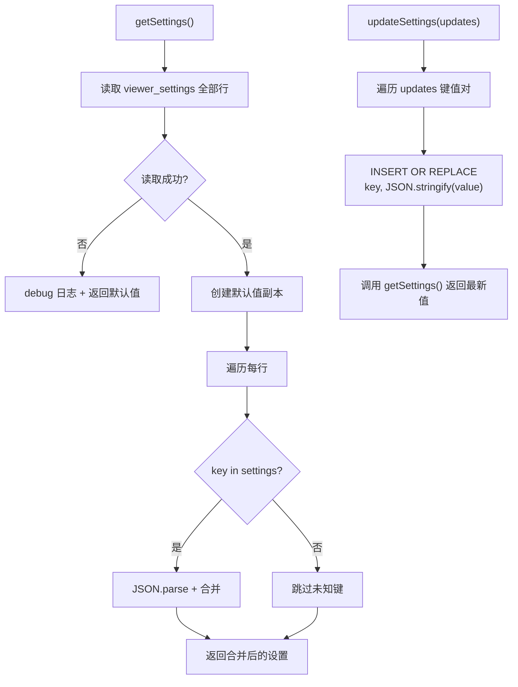

# SettingsManager.ts 需求说明

> 源文件：src/services/worker/SettingsManager.ts ｜ 类型：源码 ｜ 行数：59 ｜ 所属模块：worker ｜ 分析日期：2026-07-23

## 1. 文件定位总述

本文件是 Viewer UI 设置的持久化管理器，负责将用户在 Viewer 前端中的偏好设置（侧边栏状态、选中项目、主题）保存到 SQLite 数据库，并在需要时读取。它使用键值对模式的 `viewer_settings` 表存储，每个设置项独立一行。加载时将数据库行合并到默认值上，确保缺失的设置项有合理的默认值。

## 2. 功能需求

| 编号 | 需求描述（系统应当…） | 触发条件 / 输入 | 处理规则与输出 | 证据 |
|------|----------------------|----------------|---------------|------|
| FR-SM-01 | 系统应当能从数据库加载 Viewer 设置，缺失项使用默认值 | 调用 `getSettings()` | 从 `viewer_settings` 表读取所有键值对，逐项 JSON.parse 后合并到默认值（`sidebarOpen: true, selectedProject: null, theme: 'system'`） | `src/services/worker/SettingsManager.ts:18-42` |
| FR-SM-02 | 系统应当能更新 Viewer 设置并持久化到数据库 | 调用 `updateSettings(updates)` | 逐项执行 `INSERT OR REPLACE`，将值 JSON.stringify 后写入 | `src/services/worker/SettingsManager.ts:44-57` |
| FR-SM-03 | 系统应当在数据库读取失败时降级为默认设置 | `getSettings()` 抛出异常 | 捕获异常并记录 debug 日志，返回默认设置的浅拷贝 | `src/services/worker/SettingsManager.ts:34-41` |

## 3. 业务规则与约束

| 编号 | 规则描述 | 证据 |
|------|---------|------|
| BR-SM-01 | 默认设置：侧边栏打开（`sidebarOpen: true`）、无选中项目（`selectedProject: null`）、跟随系统主题（`theme: 'system'`） | `src/services/worker/SettingsManager.ts:8-12` |
| BR-SM-02 | 设置值以 JSON 字符串形式存储在数据库中 | `src/services/worker/SettingsManager.ts:53` |
| BR-SM-03 | 仅更新传入的字段，未传入的字段保持不变 | `src/services/worker/SettingsManager.ts:52`（遍历 updates 的 keys） |
| BR-SM-04 | 加载时仅接受已知键名（`key in settings` 检查），忽略数据库中的未知键 | `src/services/worker/SettingsManager.ts:28` |

## 4. 对外暴露

| 导出项 | 类型 | 用途 |
|--------|------|------|
| `SettingsManager` | 类 | Viewer 设置持久化管理器 |

**公开方法**：
| 方法 | 用途 |
|------|------|
| `getSettings()` | 加载设置（合并默认值） |
| `updateSettings(updates)` | 更新并持久化设置 |

## 5. 依赖关系

- **上游依赖**：`./DatabaseManager.js`（通过 `getSessionStore().db` 获取数据库连接）、`../../utils/logger.js`、`./worker-types.js`（`ViewerSettings` 类型）
- **下游消费者**：推断被 Worker 的 Viewer UI API 路由引用

## 6. 数据结构

```typescript
interface ViewerSettings {
  sidebarOpen: boolean;
  selectedProject: string | null;
  theme: 'light' | 'dark' | 'system';
}

// 数据库表结构 (推断)
// viewer_settings (key TEXT PRIMARY KEY, value TEXT)
```

## 7. 复杂逻辑图示



图示说明：加载时将数据库值合并到默认值；更新后重新加载返回最新状态。

## 8. 逆向备注

- `updateSettings` 在写入后调用 `getSettings()` 返回最新完整设置，确保 API 返回的设置与数据库状态一致。
- 未知键被静默忽略而非报错，推断是为了向前兼容（数据库中可能存在旧版本设置项）。
