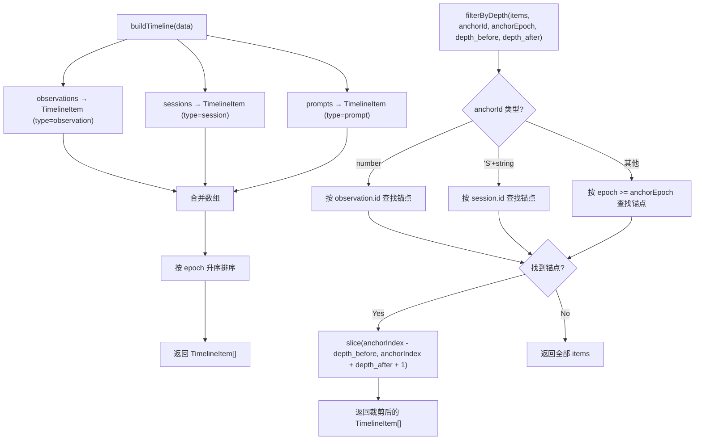

# TimelineService.ts 需求说明

> 源文件：src/services/worker/TimelineService.ts ｜ 类型：源码 ｜ 行数：227 ｜ 所属模块：worker（时间线服务） ｜ 分析日期：2026-07-23

## 1. 文件定位总述

TimelineService 是 claude-mem 早期版本的时间线服务实现，负责将观测记录、会话摘要和用户提示词三类数据合并构建按时间排序的时间线，并支持锚点定位和深度裁剪，最终格式化为 Markdown 文本输出。它与 `search/TimelineBuilder.ts`（新版）功能高度重叠，但实现更直接——所有日期格式化、文件提取和 Token 估算逻辑内联在本文件中，不依赖 `shared/timeline-formatting.js`。此版本将所有观测归入"General"文件分组（不按文件分组），而新版通过 `extractFirstFile` 实现按文件分组。推断此文件为逐步重构为 TimelineBuilder 的前身。

## 2. 功能需求

| 编号 | 需求描述（系统应当…） | 触发条件 / 输入 | 处理规则与输出 | 证据 |
|------|----------------------|----------------|---------------|------|
| FR-tls-01 | 系统应当将三类数据合并为按时间排序的时间线 | 调用 `buildTimeline(data: TimelineData)` | 将 observations、sessions、prompts 三类数据各自映射为 `TimelineItem`（含 epoch），然后按 epoch 升序排序返回 | `src/services/worker/TimelineService.ts:19-27` |
| FR-tls-02 | 系统应当支持基于锚点的深度裁剪 | 调用 `filterByDepth(items, anchorId, anchorEpoch, depth_before, depth_after)` | 支持三种锚点类型：数字 ID（观测）、字符串 "S"+数字（会话）、epoch 值（时间定位）；返回锚点前 N 条 + 锚点后 N 条的子集 | `src/services/worker/TimelineService.ts:29-54` |
| FR-tls-03 | 系统应当将时间线格式化为 Markdown 文本 | 调用 `formatTimeline(items, anchorId, query?, depth_before?, depth_after?)` | 输出包含标题（含锚点和窗口信息）、Legend、按日期分组的表格；会话和提示词以独立标题块展示，观测以表格行展示；锚点项目标记 `**ANCHOR**` | `src/services/worker/TimelineService.ts:56-187` |
| FR-tls-04 | 系统应当将所有观测归入"General"文件分组 | formatTimeline 渲染观测时 | 硬编码 `file = 'General'`，不根据 files_modified 或 files_read 字段分组 | `src/services/worker/TimelineService.ts:151` |

## 3. 业务规则与约束

1. **三类数据等权合并**：observations、sessions、prompts 在时间线中统一排序，类型仅影响渲染格式，不影响排序权重。`src/services/worker/TimelineService.ts:21-26`
2. **锚点定位回退**：当 anchorId 不是数字也不是 "S" 前缀字符串时，使用 epoch 定位——找到第一个 `epoch >= anchorEpoch` 的项目作为锚点；若全部早于 anchorEpoch，则取最后一个项目。`src/services/worker/TimelineService.ts:45-47`
3. **时间压缩显示**：相邻观测的时间列，若与上一行相同则用 `″`（双撇号）代替，减少视觉冗余。`src/services/worker/TimelineService.ts:173`
4. **提示词截断**：用户提示词超过 100 字符时截断并追加 `...`。`src/services/worker/TimelineService.ts:144`
5. **Token 估算**：使用 `text.length / 4` 的粗略估算，与新版 `shared/timeline-formatting.js` 中的实现一致。`src/services/worker/TimelineService.ts:222-225`
6. **空结果处理**：无时间线项目时，根据是否有查询词返回不同提示文本。`src/services/worker/TimelineService.ts:63-66`

## 4. 对外暴露

| 名称 | 类型 | 签名 | 说明 |
|------|------|------|------|
| `TimelineItem` | interface | `{ type: 'observation' \| 'session' \| 'prompt', data, epoch: number }` | 时间线条目 |
| `TimelineData` | interface | `{ observations, sessions, prompts }` | 时间线输入数据 |
| `TimelineService` | class | — | 时间线服务类 |
| `buildTimeline` | method | `(data: TimelineData) => TimelineItem[]` | 构建排序时间线 |
| `filterByDepth` | method | `(items, anchorId, anchorEpoch, depth_before, depth_after) => TimelineItem[]` | 锚点深度裁剪 |
| `formatTimeline` | method | `(items, anchorId?, query?, depth_before?, depth_after?) => string` | 格式化为 Markdown |

## 5. 依赖关系

- **上游依赖**：`ObservationSearchResult`、`SessionSummarySearchResult`、`UserPromptSearchResult` 类型（来自 `../sqlite/types.js`）
- **上游依赖**：`ModeManager`（获取类型图标 `getTypeIcon`）
- **上游依赖**：`logger`（在 import 中声明但在函数体中未使用）

## 6. 数据结构

- **TimelineItem** (`src/services/worker/TimelineService.ts:6-10`)：`type`（条目类型）、`data`（实际数据对象）、`epoch`（创建时间戳毫秒）
- **TimelineData** (`src/services/worker/TimelineService.ts:12-16`)：`observations`（观测列表）、`sessions`（会话摘要列表）、`prompts`（用户提示词列表）

## 7. 复杂逻辑图示

上图左侧为时间线构建流程，右侧为锚点深度裁剪流程。两类流程独立运作——先构建完整时间线，再根据锚点裁剪。

## 8. 逆向备注

1. **与 TimelineBuilder 高度重叠**：本文件与 `search/TimelineBuilder.ts` 在数据结构和核心逻辑上几乎相同，但此版本：(a) 所有格式化逻辑内联；(b) 观测不按文件分组（硬编码 "General"）；(c) Legend 硬编码 emoji 而非从 ModeManager 获取。推断此为旧版实现，新版 TimelineBuilder 已提取公共工具函数到 `shared/timeline-formatting.js`。
2. **logger 未使用**：顶部导入 `logger` 但函数体中无调用。`src/services/worker/TimelineService.ts:4`
3. **Legend 硬编码**：`formatTimeline` 中的 Legend 行硬编码了 emoji（`🎯 🔴 🟣 🔄 ✅ 🔵 🧠`），而新版 TimelineBuilder 未在 `formatTimeline` 中输出 Legend 行。`src/services/worker/TimelineService.ts:89`
4. **ANCHOR 标记符号差异**：此版本使用 `← **ANCHOR**`（含 Unicode 左箭头），新版使用 `<- **ANCHOR**`（纯 ASCII）。`src/services/worker/TimelineService.ts:132`
