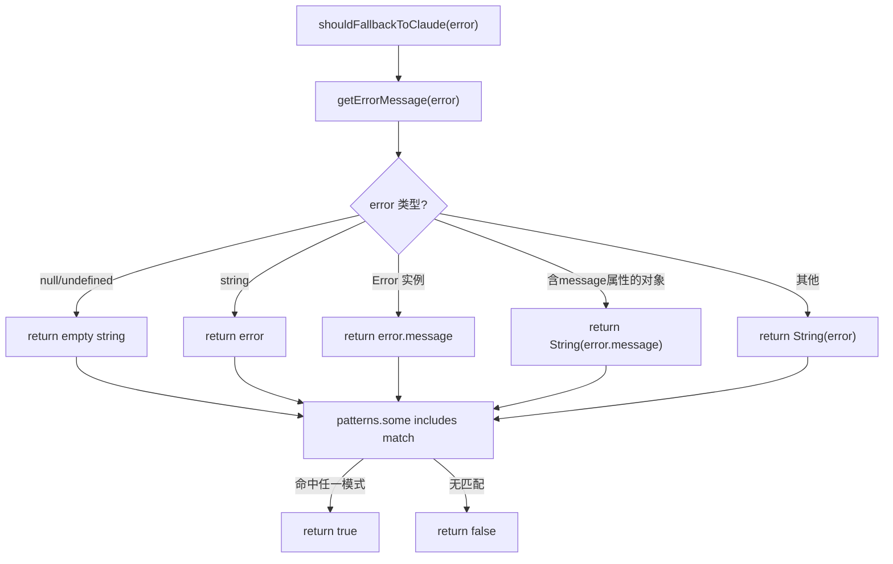

# FallbackErrorHandler.ts 需求说明

> 源文件：src/services/worker/agents/FallbackErrorHandler.ts ｜ 类型：源码 ｜ 行数：46 ｜ 所属模块：worker/agents ｜ 分析日期：2026-07-23

## 1. 文件定位总述

本文件是 Worker AI 提供商调用层的错误判断工具，提供两个核心能力：判断当前错误是否应触发从非 Claude 提供商回退到 Claude 作为备选（`shouldFallbackToClaude`），以及判断错误是否为用户主动中止（`isAbortError`）。回退判断基于预定义的错误模式字符串匹配列表，涵盖 HTTP 4xx/5xx 状态码和网络连接错误等常见故障场景。

## 2. 功能需求

| 编号 | 需求描述（系统应当…） | 触发条件 / 输入 | 处理规则与输出 | 证据 |
|------|----------------------|----------------|---------------|------|
| FR-FEH-01 | 系统应当能判断当前错误是否需要回退到 Claude 提供商 | 调用 `shouldFallbackToClaude(error)` | 将错误消息与 `FALLBACK_ERROR_PATTERNS` 逐一 `includes` 匹配，任一命中返回 true | `src/services/worker/agents/FallbackErrorHandler.ts:5-9` |
| FR-FEH-02 | 系统应当从任意类型的错误对象中安全提取错误消息字符串 | 内部 `getErrorMessage(error)` 调用 | 依次尝试：null/undefined 返回空串、string 直接返回、Error 取 `.message`、含 message 属性对象取 `.message`、兜底 `String()` | `src/services/worker/agents/FallbackErrorHandler.ts:11-29` |
| FR-FEH-03 | 系统应当判断错误是否为用户主动中止操作 | 调用 `isAbortError(error)` | 检查 Error 实例或含 `name` 属性的对象，`name === 'AbortError'` 则返回 true | `src/services/worker/agents/FallbackErrorHandler.ts:31-45` |

## 3. 业务规则与约束

| 编号 | 规则描述 | 证据 |
|------|---------|------|
| BR-FEH-01 | 回退模式列表定义在 `agents/types.ts`，包含 `429`, `500`, `502`, `503`, `ECONNREFUSED`, `ETIMEDOUT`, `fetch failed` | `src/services/worker/agents/types.ts:93-101` |
| BR-FEH-02 | 匹配使用 `String.includes`，错误消息包含模式字符串即可触发 | `src/services/worker/agents/FallbackErrorHandler.ts:8` |
| BR-FEH-03 | `getErrorMessage` 为未导出的内部函数 | `src/services/worker/agents/FallbackErrorHandler.ts:11`（无 export） |

## 4. 对外暴露

| 导出项 | 类型 | 用途 |
|--------|------|------|
| `shouldFallbackToClaude` | 函数 | 判断错误是否触发提供商回退 |
| `isAbortError` | 函数 | 判断错误是否为用户中止 |

## 5. 依赖关系

- **上游依赖**：`./types.js`（`FALLBACK_ERROR_PATTERNS`）、`../../../utils/logger.js`（已引入未使用）
- **下游消费者**：推断被 Worker 的 AI 提供商调用逻辑引用

## 6. 数据结构

不适用（纯判断函数）。

## 7. 复杂逻辑图示

图示说明：安全提取错误消息后与预定义模式列表逐一子串匹配。

## 8. 逆向备注

- `logger` 已导入但函数体内未调用，推断为预留或重构遗留。
- 回退判断基于消息子串匹配，可能存在误判（如错误消息中恰好含 "500" 但非 HTTP 状态码）。
