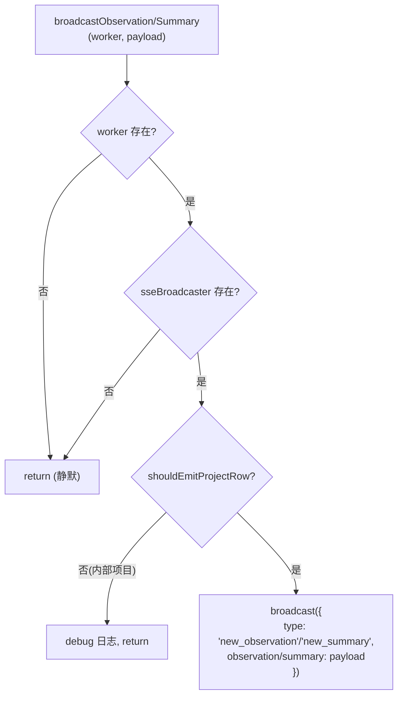

# ObservationBroadcaster.ts 需求说明

> 源文件：src/services/worker/agents/ObservationBroadcaster.ts ｜ 类型：源码 ｜ 行数：49 ｜ 所属模块：worker/agents ｜ 分析日期：2026-07-23

## 1. 文件定位总述

本文件是 Worker 实时推送（SSE）的广播网关，负责在观测记录和摘要持久化后将数据通过 SSE 推送给已连接的前端客户端。它提供了两个独立广播函数：`broadcastObservation` 推送新观测记录，`broadcastSummary` 推送新摘要。两个函数均执行前置检查（Worker 引用是否存在、SSE 广播器是否可用、项目是否为内部项目），确保仅在合法条件下推送数据。

## 2. 功能需求

| 编号 | 需求描述（系统应当…） | 触发条件 / 输入 | 处理规则与输出 | 证据 |
|------|----------------------|----------------|---------------|------|
| FR-OB-01 | 系统应当在观测记录产生后，通过 SSE 广播给前端客户端 | 调用 `broadcastObservation(worker, payload)`，worker 引用和 sseBroadcaster 均存在，且项目非内部项目 | 向 sseBroadcaster 发送 `{ type: 'new_observation', observation: payload }` | `src/services/worker/agents/ObservationBroadcaster.ts:6-26` |
| FR-OB-02 | 系统应当在摘要产生后，通过 SSE 广播给前端客户端 | 调用 `broadcastSummary(worker, payload)`，worker 引用和 sseBroadcaster 均存在，且项目非内部项目 | 向 sseBroadcaster 发送 `{ type: 'new_summary', summary: payload }` | `src/services/worker/agents/ObservationBroadcaster.ts:28-48` |
| FR-OB-03 | 系统应当在 Worker 引用缺失或 SSE 广播器不可用时静默跳过广播 | `worker` 为 undefined 或 `worker.sseBroadcaster` 为 undefined | 直接 return，不抛异常 | `src/services/worker/agents/ObservationBroadcaster.ts:10-12` |
| FR-OB-04 | 系统应当过滤内部项目的 SSE 推送 | `payload.project` 匹配内部项目标识 | 记录 debug 日志后跳过，不推送 | `src/services/worker/agents/ObservationBroadcaster.ts:14-20` |

## 3. 业务规则与约束

| 编号 | 规则描述 | 证据 |
|------|---------|------|
| BR-OB-01 | 内部项目过滤使用 `shouldEmitProjectRow` 函数，该函数排除观察者会话目录对应的项目标识 | `src/services/worker/agents/ObservationBroadcaster.ts:14` |
| BR-OB-02 | 广播操作为同步（void），不等待客户端接收确认 | `src/services/worker/agents/ObservationBroadcaster.ts:6` |
| BR-OB-03 | 两个广播函数结构完全对称，仅在 SSE event type 和 payload 字段名上有差异 | `src/services/worker/agents/ObservationBroadcaster.ts:22-26` 与 `:44-48` |

## 4. 对外暴露

| 导出项 | 类型 | 用途 |
|--------|------|------|
| `broadcastObservation` | 函数 | 广播新观测记录到 SSE 客户端 |
| `broadcastSummary` | 函数 | 广播新摘要到 SSE 客户端 |

## 5. 依赖关系

- **上游依赖**：`./types.js`（`WorkerRef`, `ObservationSSEPayload`, `SummarySSEPayload`）、`../../../utils/logger.js`、`../../../shared/should-track-project.js`（`shouldEmitProjectRow`）
- **下游消费者**：推断被 Worker 的观测/摘要持久化流程在写入数据库后调用

## 6. 数据结构

不适用（使用上游类型）。

## 7. 复杂逻辑图示

图示说明：三层门控（Worker 存在、广播器存在、非内部项目）后执行 SSE 推送。

## 8. 逆向备注

- 两个广播函数逻辑高度对称，理论上可抽取为通用函数，但当前分离实现便于独立控制日志和未来差异化处理。
