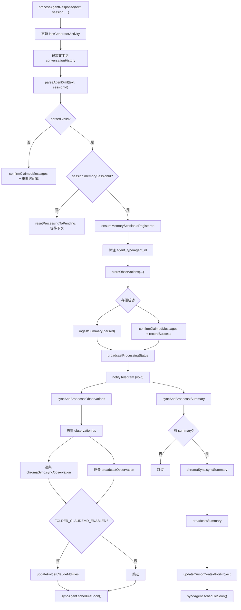

# ResponseProcessor.ts 需求说明

> 源文件：`src/services/worker/agents/ResponseProcessor.ts` ｜ 类型：源码 ｜ 行数：339 ｜ 所属模块：worker/agents ｜ 分析日期：2026-07-23

## 1. 文件定位总述

ResponseProcessor 是 claude-mem AI Agent 响应的后处理器，负责将 AI 模型返回的 XML 格式文本解析为结构化观测记录和会话摘要，持久化到数据库，并触发后续同步链路。它是 AI 处理管线中"存储与分发"环节的核心协调者：向上承接 Agent 的 XML 响应，向下驱动 Chroma 向量同步、SSE 事件广播、SyncAgent 上游推送、Telegram 通知、Cursor 上下文更新和文件夹 CLAUDE.md 索引更新等多个下游动作。

## 2. 功能需求

| 编号 | 需求描述（系统应当…） | 触发条件 / 输入 | 处理规则与输出 | 证据 |
|------|----------------------|----------------|---------------|------|
| FR-RP-01 | 系统应当处理 AI Agent 的 XML 响应并提取观测与摘要 | 调用 `processAgentResponse(text, session, ...)` | 更新会话最后活跃时间；将响应文本追加到会话对话历史；调用 `parseAgentXml` 解析 XML | `ResponseProcessor.ts:31-37` |
| FR-RP-02 | 系统应当忽略无效的 Agent 响应 | parseAgentXml 返回 valid=false | 输出 warn 日志，确认已 claim 的消息，重置最早待处理时间戳，返回不重试 | `ResponseProcessor.ts:39-49` |
| FR-RP-03 | 系统应当延迟处理 memorySessionId 尚未就绪的响应 | session.memorySessionId 为 falsy | 输出 warn 日志，将已处理中的消息重置为 pending 状态，返回等待下次 pass | `ResponseProcessor.ts:51-59` |
| FR-RP-04 | 系统应当将解析出的观测和摘要存储到数据库 | 解析成功且 memorySessionId 就绪 | 确保 memorySessionId 注册；标注 agent_type/agent_id；调用 `storeObservations` 持久化；清理 pendingAgentId/Type | `ResponseProcessor.ts:62-98` |
| FR-RP-05 | 系统应当将已存储的摘要通过 ingest 管线通知下游 | 存储成功且有摘要（含 skipped） | 调用 `ingestSummary({ kind: 'parsed', ... })` 发送摘要存储事件 | `ResponseProcessor.ts:107-115` |
| FR-RP-06 | 系统应当对每个去重后的观测记录同步到 Chroma 向量库 | 观测存储成功 | 对 observationIds 去重后逐条调用 `chromaSync.syncObservation`（异步 fire-and-forget）；失败仅记录 error 日志不中断 | `ResponseProcessor.ts:187-224` |
| FR-RP-07 | 系统应当广播每条观测记录的 SSE 事件 | 观测存储成功 | 调用 `broadcastObservation(worker, ...)` 推送实时事件 | `ResponseProcessor.ts:226-247` |
| FR-RP-08 | 系统应当在 CLAUDE_MEM_FOLDER_CLAUDEMD_ENABLED 启用时更新文件夹级 CLAUDE.md | 配置启用且观测涉及文件操作 | 收集所有观测的 files_read 和 files_modified；调用 `updateFolderClaudeMdFiles`（异步 fire-and-forget） | `ResponseProcessor.ts:249-270` |
| FR-RP-09 | 系统应当触发 SyncAgent 快速推送 | 观测或摘要存储完成 | 调用 `worker?.syncAgent?.scheduleSoon()`（2 秒去抖） | `ResponseProcessor.ts:274,338` |
| FR-RP-10 | 系统应当将摘要同步到 Chroma 向量库 | 摘要存储成功且有 summaryId | 调用 `chromaSync.syncSummary`（异步 fire-and-forget）；失败仅记录 error 日志 | `ResponseProcessor.ts:291-313` |
| FR-RP-11 | 系统应当广播摘要的 SSE 事件 | 摘要存储成功 | 调用 `broadcastSummary(worker, ...)` 推送实时事件 | `ResponseProcessor.ts:315-331` |
| FR-RP-12 | 系统应当在摘要存储后更新 Cursor 项目上下文 | 摘要存储成功 | 调用 `updateCursorContextForProject(project)`（异步 fire-and-forget） | `ResponseProcessor.ts:333-335` |
| FR-RP-13 | 系统应当发送 Telegram 通知 | 观测存储成功 | 调用 `notifyTelegram`（void 异步，不等待结果） | `ResponseProcessor.ts:122-128` |

## 3. 业务规则与约束

- **无效响应不重试**：plain-text 或空响应被有意忽略，不重新入队，防止观测者循环（`ResponseProcessor.ts:43-45` 注释说明）。
- **memorySessionId 延迟策略**：未就绪时将消息从 processing 重置回 pending，而非丢弃，确保下次 generator pass 重新处理（`ResponseProcessor.ts:56-58`）。
- **观测去重后再同步**：`storeObservations` 可能通过 content_hash 合并多条解析结果到同一行，导致 observationIds 包含重复 ID；去重后再逐条同步 Chroma 和广播，避免重复推送（`ResponseProcessor.ts:183-187` 注释说明 issue #2240）。
- **Chroma 同步为 fire-and-forget**：所有 Chroma 同步操作使用 `.then()/.catch()` 异步处理，不阻塞主流程（`ResponseProcessor.ts:202-224,293-313`）。
- **agent 标注清理**：在 `storeObservations` 的 finally 块中清理 `pendingAgentId` 和 `pendingAgentType`（`ResponseProcessor.ts:95-98`），确保即使存储失败也不影响下次处理。
- **restartGuard 成功记录**：存储成功后调用 `session.restartGuard?.recordSuccess()`（`ResponseProcessor.ts:119`），重置重启计数器。
- **文件夹 CLAUDE.md 默认禁用**：需通过 `CLAUDE_MEM_FOLDER_CLAUDEMD_ENABLED` 设置显式启用（`ResponseProcessor.ts:251`）。

## 4. 对外暴露

| 公开函数 | 签名 | 说明 |
|---------|------|------|
| `processAgentResponse` | `(text, session, dbManager, sessionManager, worker, discoveryTokens, originalTimestamp, agentName, projectRoot?, modelId?) => Promise<void>` | 处理 Agent 响应的主入口 |

## 5. 依赖关系

**内部依赖**：
- `src/sdk/parser.ts` → `parseAgentXml`/`ParsedObservation`/`ParsedSummary`（`ResponseProcessor.ts:3`）
- `src/services/worker/http/shared.ts` → `ingestSummary`（`ResponseProcessor.ts:4`）
- `src/services/integrations/CursorHooksInstaller.ts` → `updateCursorContextForProject`（`ResponseProcessor.ts:5`）
- `src/services/integrations/TelegramNotifier.ts` → `notifyTelegram`（`ResponseProcessor.ts:6`）
- `src/utils/claude-md-utils.ts` → `updateFolderClaudeMdFiles`（`ResponseProcessor.ts:7`）
- `src/shared/worker-utils.ts` → `getWorkerPort`（`ResponseProcessor.ts:8`）
- `src/shared/SettingsDefaultsManager.ts` → `SettingsDefaultsManager`（`ResponseProcessor.ts:9`）
- `src/shared/paths.ts` → `USER_SETTINGS_PATH`（`ResponseProcessor.ts:10`）
- `src/services/worker-types.ts` → `ActiveSession`（`ResponseProcessor.ts:11`）
- `src/shared/os-user.ts` → `getOsUserName`（`ResponseProcessor.ts:12`）
- `src/shared/user-label.ts` → `resolveUserLabel`（`ResponseProcessor.ts:13`）
- `src/services/worker/DatabaseManager.ts` → `DatabaseManager`（`ResponseProcessor.ts:14`）
- `src/services/worker/SessionManager.ts` → `SessionManager`（`ResponseProcessor.ts:15`）
- `src/services/worker/agents/types.ts` → `WorkerRef`/`StorageResult`（`ResponseProcessor.ts:16`）
- `src/services/worker/agents/ObservationBroadcaster.ts` → `broadcastObservation`/`broadcastSummary`（`ResponseProcessor.ts:17`）

## 6. 数据结构

**processAgentResponse 参数**：
- `text: string` — AI Agent 返回的 XML 文本
- `session: ActiveSession` — 活跃会话对象
- `dbManager: DatabaseManager` — 数据库管理器
- `sessionManager: SessionManager` — 会话管理器
- `worker: WorkerRef | undefined` — Worker 引用（含 syncAgent、broadcastProcessingStatus 等）
- `discoveryTokens: number` — 发现令牌数
- `originalTimestamp: number | null` — 原始时间戳
- `agentName: string` — Agent 名称（用于日志）
- `projectRoot?: string` — 项目根目录（用于文件夹 CLAUDE.md）
- `modelId?: string` — 模型 ID

## 7. 复杂逻辑图示

上图展示了 ResponseProcessor 的完整处理流程：解析 XML → 校验会话状态 → 持久化 → 分发到多个下游（Chroma、SSE、SyncAgent、Telegram、Cursor、CLAUDE.md）。每个下游动作独立异步执行，互不阻塞。

## 8. 逆向备注

- `processAgentResponse` 的参数多达 10 个（`ResponseProcessor.ts:19-30`），函数签名较长，推断：（参数过多可能应封装为配置对象，但受限于 ActiveSession 的生命周期管理）。
- `normalizeSummaryForStorage` 将 `summary.notes` 字段保留但 Observation 的 `StorageResult` 类型中未在代码中看到 notes 字段的写入——推断：（notes 可能通过 storeObservations 内部处理或为未来扩展）。
- 去重使用 `[...new Set(result.observationIds)]`（`ResponseProcessor.ts:187`）但后续通过 `indexOf` 查找原始索引（`ResponseProcessor.ts:190`），当 content_hash 合并导致 IDs 重复时，`indexOf` 返回第一个匹配的索引——该行为是有意设计（每个唯一 ID 只处理一次）。
- `syncAgent?.scheduleSoon()` 使用可选链调用（`ResponseProcessor.ts:274,338`），说明 Worker 可能在无 SyncAgent 的模式下运行（如 server 角色）。
