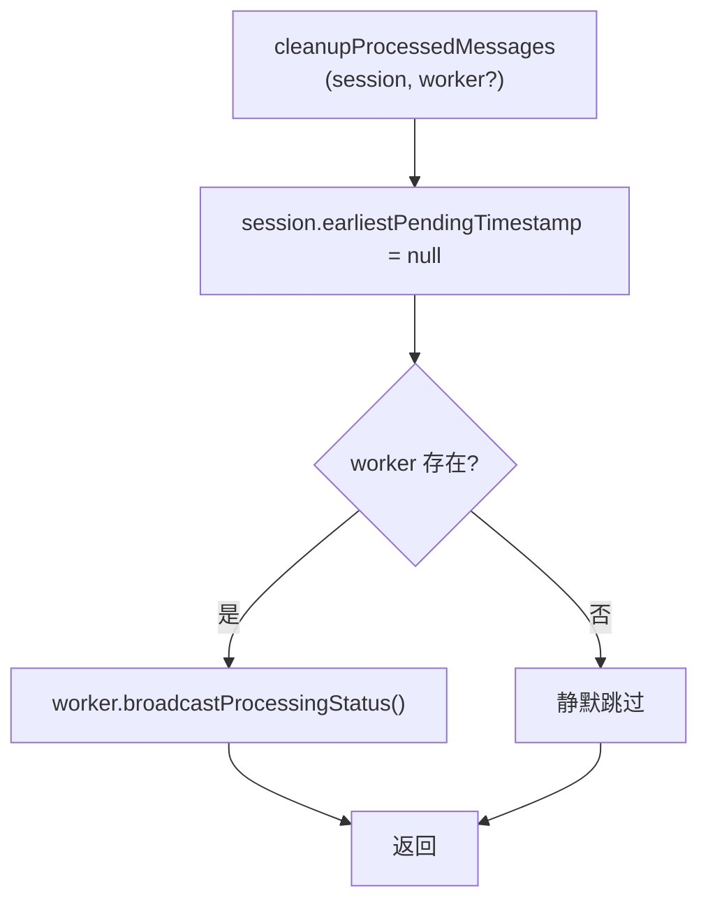

# SessionCleanupHelper.ts 需求说明

> 源文件：src/services/worker/agents/SessionCleanupHelper.ts ｜ 类型：源码 ｜ 行数：13 ｜ 所属模块：worker/agents ｜ 分析日期：2026-07-23

## 1. 文件定位总述

本文件提供一个轻量级的会话清理辅助函数，用于在消息处理完成后重置会话的待处理时间戳并通知外部监听者。它是 Agent 处理流水线中的收尾环节，确保会话状态在处理完成后被正确重置。

## 2. 功能需求

| 编号 | 需求描述（系统应当…） | 触发条件 / 输入 | 处理规则与输出 | 证据 |
|------|----------------------|----------------|---------------|------|
| FR-SessCleanup-01 | 系统应当在消息处理完成后将会话的 earliestPendingTimestamp 重置为 null | cleanupProcessedMessages 被调用 | 设置 `session.earliestPendingTimestamp = null` | `src/services/worker/agents/SessionCleanupHelper.ts:10` |
| FR-SessCleanup-02 | 系统应当在清理时通过 Worker 引用广播处理状态变更（如果 Worker 可用） | cleanupProcessedMessages 被调用，worker 不为 undefined | 调用 `worker?.broadcastProcessingStatus?.()` | `src/services/worker/agents/SessionCleanupHelper.ts:11` |

## 3. 业务规则与约束

- **安全的可选链调用**：对 worker 使用可选链 `?.` 操作，允许在 Worker 引用不存在时静默跳过广播（`src/services/worker/agents/SessionCleanupHelper.ts:11`）
- **无返回值**：函数返回 void，纯副作用操作（`src/services/worker/agents/SessionCleanupHelper.ts:6`）

## 4. 对外暴露

| 类别 | 名称 | 类型 | 说明 |
|------|------|------|------|
| 函数 | cleanupProcessedMessages | `(session: ActiveSession, worker?: WorkerRef) => void` | 重置会话待处理状态并广播通知 |

## 5. 依赖关系

- **上游**：`../../worker-types.js`（ActiveSession 类型）、`../../../utils/logger.js`、`./types.js`（WorkerRef 类型）
- **下游**：Agent 处理流水线中的响应处理器（ResponseProcessor）在处理完消息后调用

## 6. 数据结构

```typescript
// 输入参数
interface ActiveSession {
  earliestPendingTimestamp: number | null;  // 将被重置为 null
  // ...其他字段
}
interface WorkerRef {
  broadcastProcessingStatus?: () => void;  // 可选广播方法
}
```

## 7. 复杂逻辑图示



上图展示了清理逻辑的两个步骤：先重置时间戳，再条件性地通知 Worker。

## 8. 逆向备注

推断：`earliestPendingTimestamp` 用于跟踪会话中最早未处理消息的时间点，重置为 null 表示所有消息已处理完毕。`broadcastProcessingStatus` 可能用于通过 SSE 向前端推送处理状态变更。
