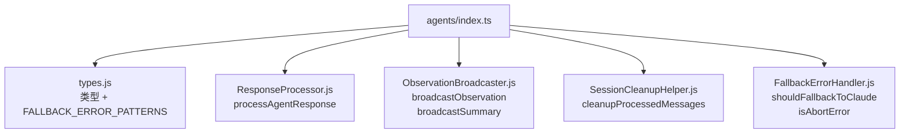

# agents/index.ts 需求说明

> 源文件：src/services/worker/agents/index.ts ｜ 类型：源码（桶文件） ｜ 行数：21 ｜ 所属模块：worker/agents ｜ 分析日期：2026-07-23

## 1. 文件定位总述

本文件是 Agent 处理子模块的桶导出文件，统一导出 Agent 系统的核心类型、响应处理器、观察广播器、会话清理辅助函数和错误回退处理器。这些组件共同构成 Agent 的消息处理、结果分发和异常处理管道。

## 2. 功能需求

| 编号 | 需求描述（系统应当…） | 触发条件 / 输入 | 处理规则与输出 | 证据 |
|------|----------------------|----------------|---------------|------|
| FR-AgentsIdx-01 | 系统应当统一导出 Agent 系统的全部类型定义和常量 | 外部模块导入 | 重导出 types.js 中的 WorkerRef、SSE 载荷类型、存储结果类型、Agent 配置类型及 FALLBACK_ERROR_PATTERNS 常量 | `src/services/worker/agents/index.ts:2-14` |
| FR-AgentsIdx-02 | 系统应当导出 processAgentResponse 响应处理函数 | 外部模块导入 | 导出自 ResponseProcessor.js | `src/services/worker/agents/index.ts:16` |
| FR-AgentsIdx-03 | 系统应当导出 broadcastObservation 和 broadcastSummary 广播函数 | 外部模块导入 | 导出自 ObservationBroadcaster.js | `src/services/worker/agents/index.ts:18` |
| FR-AgentsIdx-04 | 系统应当导出 cleanupProcessedMessages 会话清理函数 | 外部模块导入 | 导出自 SessionCleanupHelper.js | `src/services/worker/agents/index.ts:19` |
| FR-AgentsIdx-05 | 系统应当导出 shouldFallbackToClaude 和 isAbortError 错误处理函数 | 外部模块导入 | 导出自 FallbackErrorHandler.js | `src/services/worker/agents/index.ts:21` |

## 3. 业务规则与约束

无。本文件是纯桶导出。

## 4. 对外暴露

| 类别 | 名称 | 类型 | 来源 |
|------|------|------|------|
| 重导出 | WorkerRef, ObservationSSEPayload, SummarySSEPayload 等 | 类型 | `./types.js` |
| 重导出 | FALLBACK_ERROR_PATTERNS | 常量 | `./types.js` |
| 导出 | processAgentResponse | 函数 | `./ResponseProcessor.js` |
| 导出 | broadcastObservation, broadcastSummary | 函数 | `./ObservationBroadcaster.js` |
| 导出 | cleanupProcessedMessages | 函数 | `./SessionCleanupHelper.js` |
| 导出 | shouldFallbackToClaude, isAbortError | 函数 | `./FallbackErrorHandler.js` |

## 5. 依赖关系

- **上游**：`./types.js`、`./ResponseProcessor.js`、`./ObservationBroadcaster.js`、`./SessionCleanupHelper.js`、`./FallbackErrorHandler.js`
- **下游**：Worker 服务层的会话管理、AI 处理流程

## 6. 数据结构

不适用（具体类型定义见 `./types.ts`）。

## 7. 复杂逻辑图示

上图展示了 Agent 子模块的五个核心组件，分别负责类型定义、响应处理、事件广播、会话清理和错误回退。

## 8. 逆向备注

推断：`FALLBACK_ERROR_PATTERNS` 常量用于识别 AI 模型返回的错误响应模式（如速率限制、内容过滤等），`shouldFallbackToClaude` 决定是否从备用模型回退到 Claude 主模型。`ObservationBroadcaster` 通过 SSE（Server-Sent Events）将观察和摘要结果推送到前端 UI。
