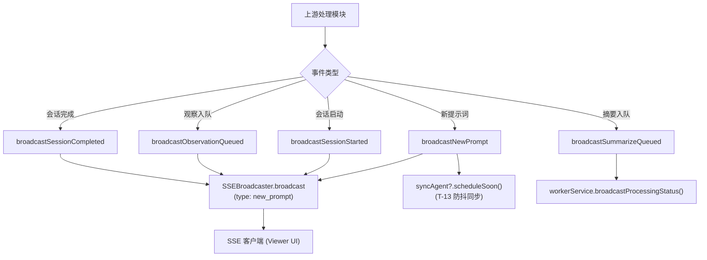

# SessionEventBroadcaster.ts 需求说明

> 源文件：src/services/worker/events/SessionEventBroadcaster.ts | 类型：源码 | 行数：61 | 所属模块：worker/events | 分析日期：2026-07-23

## 1. 文件定位总述

SessionEventBroadcaster 是会话事件广播器，负责将工作进程中的关键会话生命周期事件（新提示词、会话启动、观察入队、会话完成、摘要入队）通过 SSE（Server-Sent Events）推送给订阅的客户端（如 Viewer UI）。它充当 Worker 内部各处理模块与外部实时消费者之间的桥梁，同时在新提示词事件触发时联动 SyncAgent 进行上游数据同步。

## 2. 功能需求

| 编号 | 需求描述（系统应当…） | 触发条件 / 输入 | 处理规则与输出 | 证据 |
|------|----------------------|----------------|---------------|------|
| FR-Broadcast-01 | 系统应当在收到新用户提示词时广播 `new_prompt` 事件 | 调用 `broadcastNewPrompt`，传入包含 id、content_session_id、project、platform_source、prompt_number、prompt_text、created_at_epoch 的 prompt 对象 | 通过 SSEBroadcaster 广播事件，附带当前 OS 用户名（`getOsUserName()`）和用户标签（`resolveUserLabel()`）；随后调用 `syncAgent?.scheduleSoon()` 触发 2 秒防抖的上游同步 | `src/services/worker/events/SessionEventBroadcaster.ts:13-32` |
| FR-Broadcast-02 | 系统应当广播 `session_started` 事件 | 调用 `broadcastSessionStarted`，传入 sessionDbId 和 project | 通过 SSEBroadcaster 广播包含 sessionDbId 和 project 的事件 | `src/services/worker/events/SessionEventBroadcaster.ts:34-40` |
| FR-Broadcast-03 | 系统应当广播 `observation_queued` 事件 | 调用 `broadcastObservationQueued`，传入 sessionDbId | 通过 SSEBroadcaster 广播包含 sessionDbId 的事件 | `src/services/worker/events/SessionEventBroadcaster.ts:42-47` |
| FR-Broadcast-04 | 系统应当广播 `session_completed` 事件 | 调用 `broadcastSessionCompleted`，传入 sessionDbId | 通过 SSEBroadcaster 广播包含当前时间戳和 sessionDbId 的事件 | `src/services/worker/events/SessionEventBroadcaster.ts:49-55` |
| FR-Broadcast-05 | 系统应当在摘要压缩任务入队时通知处理状态变更 | 调用 `broadcastSummarizeQueued` | 委托给 `workerService.broadcastProcessingStatus()` 进行处理状态广播 | `src/services/worker/events/SessionEventBroadcaster.ts:57-59` |

## 3. 业务规则与约束

- **同步联动规则**：`broadcastNewPrompt` 是唯一一个会触发 SyncAgent 调度的广播方法（`T-13` 任务要求），其他广播方法不触发同步。`src/services/worker/events/SessionEventBroadcaster.ts:31`
- **单机假设**：`user_name` 取自当前 OS 用户，基于 claude-mem 是单机工具的前提。`src/services/worker/events/SessionEventBroadcaster.ts:23`
- **可选依赖**：`syncAgent` 为可选属性（`?.`），当同步功能未启用或角色为 server 时不执行同步操作。`src/services/worker/events/SessionEventBroadcaster.ts:31`

## 4. 对外暴露

| 名称 | 类型 | 说明 |
|------|------|------|
| `broadcastNewPrompt(prompt)` | 方法 | 广播新提示词事件并触发同步 |
| `broadcastSessionStarted(sessionDbId, project)` | 方法 | 广播会话启动事件 |
| `broadcastObservationQueued(sessionDbId)` | 方法 | 广播观察入队事件 |
| `broadcastSessionCompleted(sessionDbId)` | 方法 | 广播会话完成事件 |
| `broadcastSummarizeQueued()` | 方法 | 广播摘要入队状态 |

## 5. 依赖关系

- **SSEBroadcaster**（`../SSEBroadcaster.js`）：底层 SSE 推送通道，所有广播都委托给它
- **WorkerService**（`../../worker-service.js`）：提供 syncAgent 和 broadcastProcessingStatus 方法
- **getOsUserName**（`../../../shared/os-user.js`）：获取当前 OS 用户名
- **resolveUserLabel**（`../../../shared/user-label.js`）：获取用户标签

## 6. 数据结构

**Prompt 参数对象**（`broadcastNewPrompt` 输入）：
```typescript
{
  id: number;
  content_session_id: string;
  project: string;
  platform_source: string;
  prompt_number: number;
  prompt_text: string;
  created_at_epoch: number;
}
```

## 7. 复杂逻辑图示



广播器接收上游模块的事件调用，除 `new_prompt` 额外触发同步外，所有事件统一通过 SSEBroadcaster 推送至客户端。

## 8. 逆向备注

- `broadcastSummarizeQueued` 的实现与其他方法不同，不直接调用 `sseBroadcaster.broadcast()`，而是委托给 `workerService.broadcastProcessingStatus()`。推断：（设计上摘要入队属于处理状态变更，由 WorkerService 统一管理处理状态广播逻辑）。
