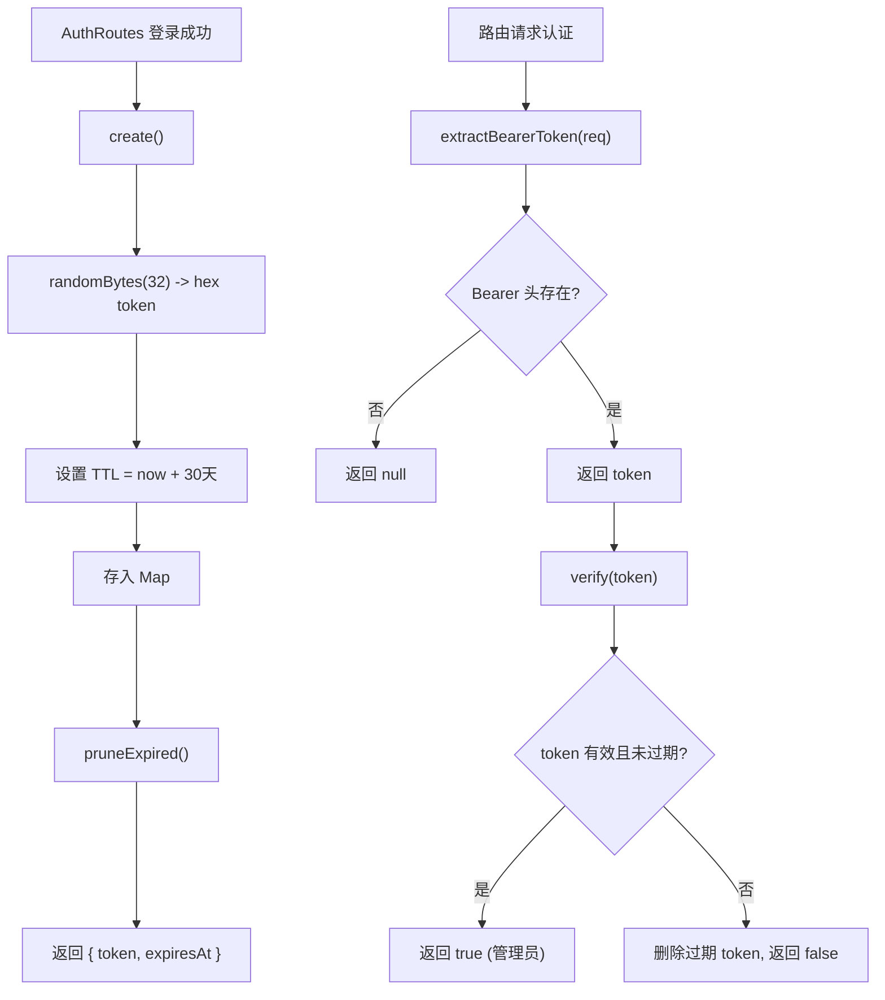

# AdminSessionStore.ts 需求说明

> 源文件：src/services/worker/http/AdminSessionStore.ts | 类型：源码 | 行数：69 | 所属模块：worker/http | 分析日期：2026-07-23

## 1. 文件定位总述

AdminSessionStore 是 Worker HTTP 层的管理员登录会话存储，采用内存 Map 维护管理员认证令牌的生命周期。它提供令牌创建（含随机生成）、验证（含过期清理）和销毁三个核心操作，以及从 HTTP 请求中提取 Bearer 令牌的工具函数。系统采用"单管理员身份"模型，验证通过即代表管理员身份，无需区分不同管理员账号。

## 2. 功能需求

| 编号 | 需求描述（系统应当…） | 触发条件 / 输入 | 处理规则与输出 | 证据 |
|------|----------------------|----------------|---------------|------|
| FR-AdminSession-01 | 系统应当创建新的管理员登录会话令牌 | 调用 `create(now?)` | 使用 `crypto.randomBytes(32)` 生成 64 位十六进制令牌；TTL 为 30 天；创建后执行过期令牌清理（pruneExpired）；返回 token 和 expiresAt | `src/services/worker/http/AdminSessionStore.ts:27-33` |
| FR-AdminSession-02 | 系统应当验证管理员令牌的有效性 | 调用 `verify(token, now?)` | null 或空 token 返回 false；token 不存在返回 false；token 已过期则删除并返回 false；有效 token 返回 true | `src/services/worker/http/AdminSessionStore.ts:39-48` |
| FR-AdminSession-03 | 系统应当销毁管理员令牌 | 调用 `destroy(token)` | 从 Map 中删除指定令牌；null 令牌为空操作 | `src/services/worker/http/AdminSessionStore.ts:51-53` |
| FR-AdminSession-04 | 系统应当从 HTTP 请求中提取 Bearer 令牌 | 调用 `extractBearerToken(req)` | 从 `Authorization` 头中提取 `Bearer ` 前缀后的令牌字符串；非 Bearer 格式或缺失返回 null | `src/services/worker/http/AdminSessionStore.ts:63-69` |

## 3. 业务规则与约束

- **TTL 固定**：会话有效期硬编码为 30 天（`30 * 24 * 60 * 60 * 1000` 毫秒），不可配置。`src/services/worker/http/AdminSessionStore.ts:4`
- **纯内存存储**：会话数据仅存在于进程内存中，Worker 重启后所有会话失效。注释说明 Viewer 会通过存储的令牌自动重新认证。`src/services/worker/http/AdminSessionStore.ts:19-21`
- **单管理员模型**：系统只有一个管理员身份，验证通过即代表"管理员"，不区分不同账号。`src/services/worker/http/AdminSessionStore.ts:18`
- **惰性清理**：过期令牌的清理在 `create` 时触发（`pruneExpired`），`verify` 时仅清理被访问到的过期令牌。推断：（非定时清理，依赖访问频率控制 Map 大小）。`src/services/worker/http/AdminSessionStore.ts:31,39-48`

## 4. 对外暴露

| 名称 | 类型 | 说明 |
|------|------|------|
| `AdminSessionStore` | 类 | 管理员会话存储（内存 Map） |
| `AdminSessionStore.create(now?)` | 方法 | 创建令牌 |
| `AdminSessionStore.verify(token, now?)` | 方法 | 验证令牌 |
| `AdminSessionStore.destroy(token)` | 方法 | 销毁令牌 |
| `extractBearerToken(req)` | 函数 | 从 HTTP 请求提取 Bearer 令牌 |

## 5. 依赖关系

- **crypto**（Node.js 内置模块）：`randomBytes` 用于令牌生成
- **express**（Request 类型）：用于 `extractBearerToken` 的请求对象

## 6. 数据结构

**SessionEntry**（内部结构）：
```typescript
{
  createdAt: number;   // 创建时间戳
  expiresAt: number;    // 过期时间戳
}
```

## 7. 复杂逻辑图示



令牌生命周期从 create 开始，经过 Bearer 提取和 verify 验证，destroy 或过期后失效。create 时触发批量清理，verify 时触发单条清理。

## 8. 逆向备注

- 无逆向备注。
