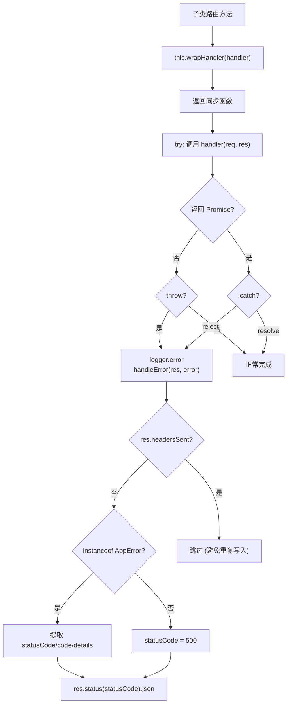

# BaseRouteHandler.ts 需求说明

> 源文件：src/services/worker/http/BaseRouteHandler.ts | 类型：源码 | 行数：64 | 所属模块：worker/http | 分析日期：2026-07-23

## 1. 文件定位总述

BaseRouteHandler 是所有 HTTP 路由处理器的抽象基类，提供统一的错误处理、参数解析和快捷响应方法。它通过 `wrapHandler` 高阶函数将异步路由处理器的异常统一捕获并转化为结构化的 JSON 错误响应，同时封装了 `parseIntParam`、`badRequest`、`notFound`、`unauthorized` 等常用工具方法，是 Worker HTTP 层的公共基础设施。

## 2. 功能需求

| 编号 | 需求描述（系统应当…） | 触发条件 / 输入 | 处理规则与输出 | 证据 |
|------|----------------------|----------------|---------------|------|
| FR-BaseRoute-01 | 系统应当将异步路由处理器的异常统一捕获并转化为 JSON 错误响应 | 子类通过 `this.wrapHandler(handler)` 包装路由函数 | wrapHandler 返回同步函数，try-catch 捕获同步和异步异常；同步异常直接处理，异步 rejection 通过 `.catch()` 捕获；统一调用 `handleError` 处理 | `src/services/worker/http/BaseRouteHandler.ts:7-22` |
| FR-BaseRoute-02 | 系统应当提供 URL 参数的整数解析工具 | 调用 `parseIntParam(req, res, paramName)` | 从 `req.params` 获取参数值（兼容数组和字符串），解析为整数；解析失败时返回 400 错误并返回 null | `src/services/worker/http/BaseRouteHandler.ts:24-33` |
| FR-BaseRoute-03 | 系统应当提供 HTTP 错误快捷响应方法 | 调用 badRequest/notFound/unauthorized | `badRequest` 返回 400，`notFound` 返回 404，`unauthorized` 返回 401，响应体均为 `{ error: message }` | `src/services/worker/http/BaseRouteHandler.ts:35-45` |
| FR-BaseRoute-04 | 系统应当统一处理路由错误响应 | `handleError` 被调用 | 检查 `res.headersSent` 避免重复写入；AppError 提取 statusCode/code/details，普通 Error 默认 500；通过 `logger.failure` 记录日志 | `src/services/worker/http/BaseRouteHandler.ts:47-63` |

## 3. 业务规则与约束

- **headersSent 保护**：`handleError` 在发送响应前检查 `res.headersSent`，防止在已发送响应后再次写入导致 Node.js "headers already sent" 异常。`src/services/worker/http/BaseRouteHandler.ts:49`
- **日志级别**：wrapHandler 中同步异常使用 `logger.error`，handleError 使用 `logger.failure`（两者日志级别可能不同）。`src/services/worker/http/BaseRouteHandler.ts:18,48`
- **抽象类约束**：`setupRoutes` 方法未在基类中定义（由子类实现），但通过 abstract 关键字声明为抽象方法——实际上未使用 abstract 关键字，而是依赖子类的 `setupRoutes` 约定。`src/services/worker/http/BaseRouteHandler.ts:6`

## 4. 对外暴露

| 名称 | 类型 | 说明 |
|------|------|------|
| `wrapHandler(handler)` | protected 方法 | 异步路由错误处理包装器 |
| `parseIntParam(req, res, paramName)` | protected 方法 | URL 参数整数解析 |
| `badRequest(res, message)` | protected 方法 | 返回 400 响应 |
| `notFound(res, message)` | protected 方法 | 返回 404 响应 |
| `unauthorized(res, message)` | protected 方法 | 返回 401 响应 |
| `handleError(res, error, context?)` | protected 方法 | 统一错误处理 |

## 5. 依赖关系

- **express**（Request, Response）：Express 类型
- **logger**（`../../../utils/logger.js`）：结构化日志
- **AppError**（`../../server/ErrorHandler.js`）：自定义错误类，用于提取状态码等属性

## 6. 数据结构

不适用（工具类，不定义新数据结构）。

## 7. 复杂逻辑图示

wrapHandler 的双层异常捕获机制：外层 try-catch 捕获同步异常，内层 Promise.catch 捕获异步异常，最终统一进入 handleError 进行响应处理。

## 8. 逆向备注

- 基类使用 `abstract class` 关键字但 `setupRoutes` 方法未标记为 `abstract`。推断：（TypeScript abstract class 不强制要求有 abstract 成员，此处使用 abstract 仅为防止直接实例化，子类的 setupRoutes 是通过约定而非类型系统强制实现的）。
