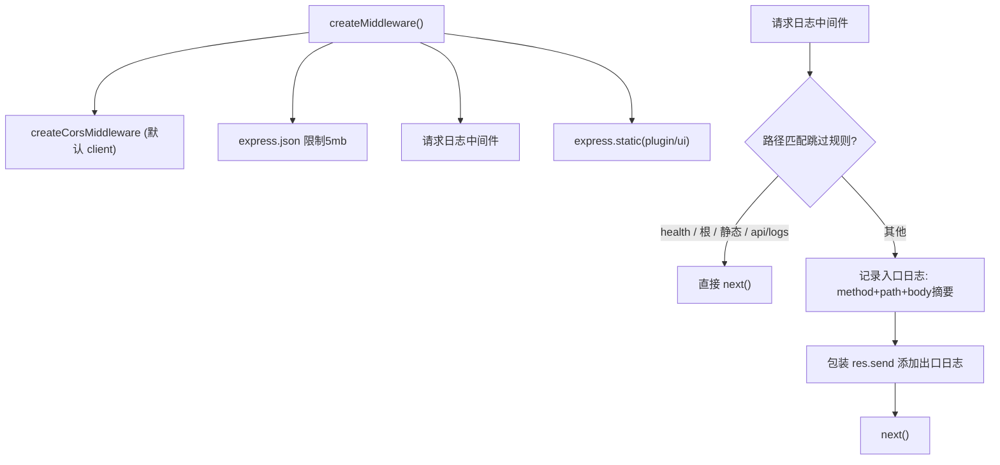
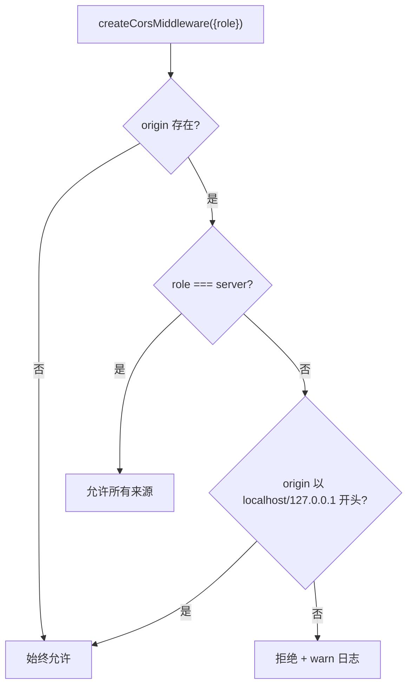

# middleware.ts 需求说明

> 源文件：src/services/worker/http/middleware.ts ｜ 类型：源码 ｜ 行数：190 ｜ 所属模块：worker/http ｜ 分析日期：2026-07-23

## 1. 文件定位总述

middleware.ts 是 worker HTTP 服务的中间件层，提供请求日志、CORS 控制、静态文件服务、本地访问限制和自动登录判断等基础设施能力。该模块区分 client（standalone）和 server（LAN/WAN）两种运行角色，client 模式下严格限制 CORS 为回环地址，server 模式下允许所有来源（安全由认证层保障）。它还提供请求体摘要日志、本地请求检测、管理端点 localhost 强制限制等安全工具函数。

## 2. 功能需求

| 编号 | 需求描述（系统应当…） | 触发条件 / 输入 | 处理规则与输出 | 证据 |
|------|----------------------|----------------|---------------|------|
| FR-mw-01 | 系统应当创建完整的中间件链 | 调用 `createMiddleware(summarizeRequestBody, options?)` | 按序添加：CORS（默认启用）→ JSON body 解析（5mb 限制）→ 请求日志（跳过健康检查/静态/轮询端点）→ 静态文件服务（plugin/ui 目录） | `middleware.ts:8-49` |
| FR-mw-02 | 系统应当跳过特定路径的请求日志 | 请求路径为 /health、/、静态资源扩展名、/api/logs | 不记录请求和响应日志，直接 next() | `middleware.ts:20-26` |
| FR-mw-03 | 系统应当记录非跳过路径的请求/响应日志 | 其他 API 请求 | 记录方法+路径+requestId+body 摘要（入口），响应时记录状态码+路径+耗时（出口） | `middleware.ts:28-42` |
| FR-mw-04 | 系统应当根据运行角色控制 CORS 策略 | 调用 `createCorsMiddleware({role})` | client 模式：仅允许 localhost/127.0.0.1 来源；server 模式：允许所有来源；无 origin 头（非浏览器）时始终允许 | `middleware.ts:57-89` |
| FR-mw-05 | 系统应当检测请求是否来自本机回环 | 调用 `isLoopbackRequest(req)` | 同时检查 express 解析的 clientIp 和原始 socket peerAddress 是否均为回环地址 | `middleware.ts:99-103` |
| FR-mw-06 | 系统应当判断是否允许自动登录 | 调用 `isAutoLoginAllowed(req)` | 三条件全满足：1) 无 X-Forwarded-For/X-Real-IP 代理头 2) Host 为 127.0.0.1 或 localhost 3) clientIp 和 socketIp 均为 127.0.0.1（IPv4-mapped IPv6 形式也算） | `middleware.ts:125-144` |
| FR-mw-07 | 系统应当限制管理端点仅 localhost 访问 | 调用 `requireLocalhost(req, res, next)` | 非 localhost IP 返回 403 JSON 响应 | `middleware.ts:146-168` |
| FR-mw-08 | 系统应当生成请求体摘要用于日志 | 内部调用 `summarizeRequestBody` | /init 路径返回空；/observations 路径返回 tool 摘要；/summarize 返回固定文本；其他返回空 | `middleware.ts:170-189` |

## 3. 业务规则与约束

- **JSON body 限制**：5MB。`middleware.ts:18`
- **CORS 允许方法**：GET, HEAD, POST, PUT, PATCH, DELETE。`middleware.ts:85`
- **CORS 允许头**：Content-Type, Authorization, X-Requested-With。`middleware.ts:86`
- **CORS credentials**：始终为 false（不支持 cookie 认证）。`middleware.ts:87`
- **静态文件目录**：`<packageRoot>/plugin/ui`。`middleware.ts:44-46`
- **静态扩展名白名单**：.html, .js, .css, .svg, .png, .jpg, .jpeg, .webp, .woff, .woff2, .ttf, .eot。`middleware.ts:21`
- **自动登录 IP 范围**：仅 127.0.0.1 和 ::ffff:127.0.0.1（排除 ::1 和 localhost 以避免歧义）。`middleware.ts:109`
- **安全分层**：CORS 是纵深防御层，server 模式下认证层（admin password + sync token）是真正的安全边界。注释说明。`middleware.ts:52-56`
- **请求日志截断**：/observations 路径的日志仅输出工具名和输入摘要，避免敏感信息泄露。`middleware.ts:177-181`

## 4. 对外暴露

| 名称 | 类型 | 说明 |
|------|------|------|
| `createMiddleware(summarizeRequestBody, options?)` | function | 创建中间件链，返回 RequestHandler[] |
| `createCorsMiddleware(opts?)` | function | 创建 CORS 中间件，支持 client/server 角色 |
| `isLoopbackRequest(req)` | function | 判断请求是否来自本机回环 |
| `isAutoLoginAllowed(req)` | function | 判断是否允许自动登录 |
| `requireLocalhost(req, res, next)` | function | localhost 强制限制中间件 |
| `summarizeRequestBody(method, path, body)` | function | 请求体摘要生成（用于日志） |

## 5. 依赖关系

- **内部依赖**：`express`、`cors`、`path`、`../../../shared/paths.js`、`../../../utils/logger.js`
- **被依赖**：worker HTTP 服务主入口（路由挂载前的中间件配置）

## 6. 数据结构

无自定义数据结构。

**回环地址集合**：
- LOOPBACK_ADDRESSES：`127.0.0.1`, `::1`, `::ffff:127.0.0.1`, `localhost`（用于 isLoopbackRequest）
- AUTO_LOGIN_IPS：`127.0.0.1`, `::ffff:127.0.0.1`（用于 isAutoLoginAllowed，更严格）

## 7. 复杂逻辑图示

中间件链创建和 CORS 策略路由逻辑。

## 8. 逆向备注

- `isAutoLoginAllowed` 比 `isLoopbackRequest` 更严格：排除 ::1、排除有代理头的情况、排除非 localhost 域名。注释说明目的是区分"本地控制台"和"通过反向代理的远程访问"。`middleware.ts:92-144`
- `summarizeRequestBody` 对 /init 路径返回空字符串，推断 init 请求体可能包含敏感的上下文信息。`middleware.ts:173-174`
- `res.send` 的包装方式（`const originalSend = res.send.bind(res)`）是一种 monkey-patch 模式，会在每次请求时创建闭包，在高并发场景下可能有性能影响。
