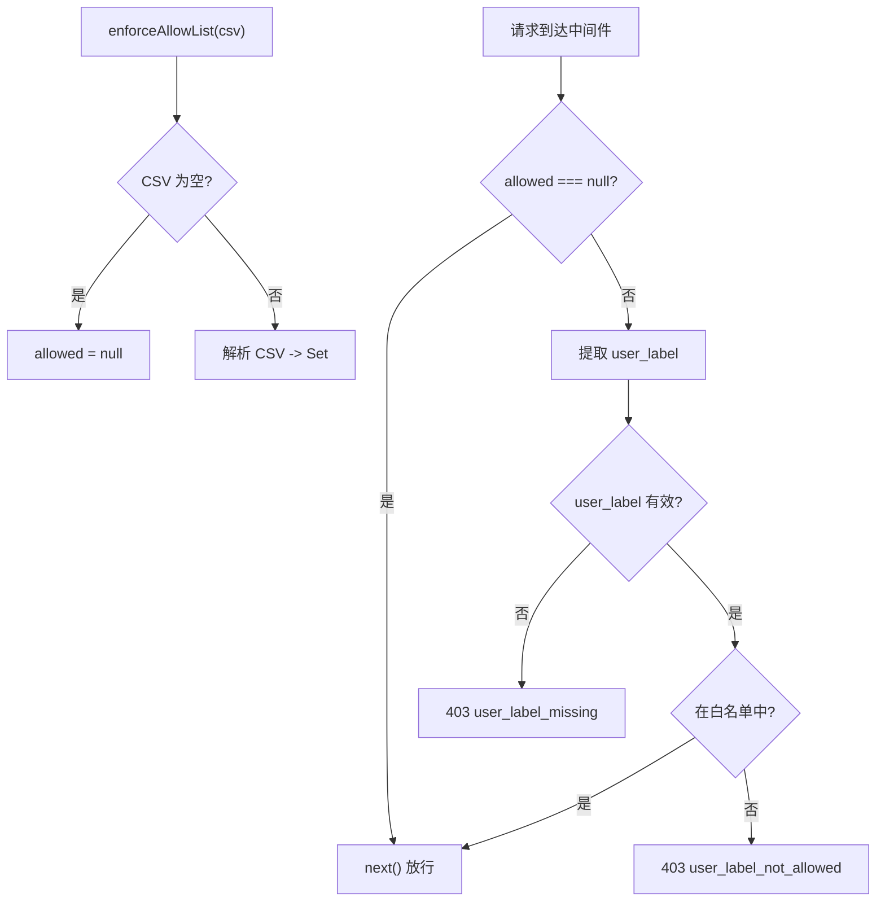

# enforceAllowList.ts 需求说明

> 源文件：src/services/worker/http/middleware/enforceAllowList.ts | 类型：源码 | 行数：70 | 所属模块：worker/http/middleware | 分析日期：2026-07-23

## 1. 文件定位总述

enforceAllowList 是 Server 模式下的 HTTP 中间件工厂函数，用于在数据同步摄入请求上强制执行用户白名单策略。它读取 `CLAUDE_MEM_SERVER_ALLOWED_USERS` 配置，对入站请求的 `user_label` 进行校验——空列表放行所有请求（开发者/单用户模式），非空列表严格拒绝未授权用户。它是独立于认证策略的"第二道防线"，专注于应用层的数据注入防护。

## 2. 功能需求

| 编号 | 需求描述（系统应当…） | 触发条件 / 输入 | 处理规则与输出 | 证据 |
|------|----------------------|----------------|---------------|------|
| FR-AllowList-01 | 系统应当创建白名单中间件 | 调用 `enforceAllowList(allowedCsv)` | 解析 CSV 字符串为 Set（空字符串解析为 null，表示允许所有）；返回 Express 中间件函数 | `src/services/worker/http/middleware/enforceAllowList.ts:21-31` |
| FR-AllowList-02 | 系统应当在白名单为空时放行所有请求 | allowedCsv 为空或 null | 中间件直接调用 `next()`，不做任何检查 | `src/services/worker/http/middleware/enforceAllowList.ts:34-37` |
| FR-AllowList-03 | 系统应当在请求缺少 user_label 时拒绝 | 请求 body 和 `X-Sync-User` 头中均无 user_label | 返回 403 `{ error: 'user_label_missing', detail: '...' }` | `src/services/worker/http/middleware/enforceAllowList.ts:45-52` |
| FR-AllowList-04 | 系统应当在 user_label 不在白名单中时拒绝 | user_label 不在 allowed Set 中 | 返回 403 `{ error: 'user_label_not_allowed', detail: '...' }` | `src/services/worker/http/middleware/enforceAllowList.ts:54-65` |
| FR-AllowList-05 | 系统应当从请求的 body 或 header 中提取 user_label | 入站请求到达中间件 | 优先使用 `body.user_label`（非空字符串）；回退到 `X-Sync-User` header；均无效则视为缺失 | `src/services/worker/http/middleware/enforceAllowList.ts:40-43` |

## 3. 业务规则与约束

- **双重来源**：user_label 从 `body.user_label` 和 `X-Sync-User` header 两个位置提取，body 优先。`src/services/worker/http/middleware/enforceAllowList.ts:41-43`
- **结构化拒绝响应**：返回的 403 响应包含 `error` 和 `detail` 字段，便于客户端 SyncAgent 记录精确原因。`src/services/worker/http/middleware/enforceAllowList.ts:50,60-64`
- **空白白名单的语义**：`allowedCsv` 为空字符串时 `allowed` 为 null，表示"允许所有"（开发者/单用户模式），而非"拒绝所有"。`src/services/worker/http/middleware/enforceAllowList.ts:23-24`
- **日志记录**：拒绝请求时记录 warn 级别日志，包含路径、user_label 和客户端 IP。`src/services/worker/http/middleware/enforceAllowList.ts:46-49,55-59`

## 4. 对外暴露

| 名称 | 类型 | 说明 |
|------|------|------|
| `enforceAllowList(allowedCsv)` | 函数（中间件工厂） | 返回 Express 中间件 |

## 5. 依赖关系

- **express**（Request, Response, NextFunction）：Express 类型

## 6. 数据结构

不适用（中间件，不定义新数据结构）。

## 7. 复杂逻辑图示

中间件工厂在创建时解析白名单，运行时按"空名单放行 -> 提取标签 -> 检查存在 -> 检查白名单"的顺序逐层守卫。

## 8. 逆向备注

- 无逆向备注。
