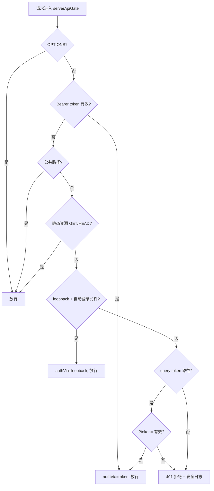

# serverApiGate.ts 需求说明

> 源文件：src/services/worker/http/middleware/serverApiGate.ts ｜ 类型：源码 ｜ 行数：114 ｜ 所属模块：worker/http/middleware ｜ 分析日期：2026-07-23

## 1. 文件定位总述

serverApiGate 是 server 模式下的默认拒绝（default-deny）认证网关中间件，在 server 角色部署时挂载于所有路由之前，要求每个请求必须通过至少一种认证方式才能继续。它实现了五种放行路径：Bearer token 认证、公共路径白名单、静态资源放行、loopback 本地自动登录、以及针对 SSE/报告页面等无法设置 Authorization 头的场景提供的 query parameter token 认证。该中间件仅在 server 模式下挂载，client/standalone 模式不使用。

## 2. 功能需求

| 编号 | 需求描述（系统应当…） | 触发条件 / 输入 | 处理规则与输出 | 证据 |
|------|----------------------|----------------|---------------|------|
| FR-GATE-TOKEN-01 | 系统应当接受有效的 Bearer token | 请求头包含 `Authorization: Bearer <token>` | token 与 serverToken 或 admin session token 匹配（恒定时间比较）则放行，设置 `res.locals.authVia = 'token'` | `serverApiGate.ts:62-66` |
| FR-GATE-PUBLIC-01 | 系统应当放行公共路径 | 请求路径在 PUBLIC_PATHS 白名单中 | 无需认证直接放行 | `serverApiGate.ts:23-32,69-71` |
| FR-GATE-STATIC-01 | 系统应当放行静态资源 GET/HEAD 请求 | GET/HEAD 请求非 /api/ 路径且匹配静态资源扩展名正则 | 无需认证直接放行 | `serverApiGate.ts:34,77-84` |
| FR-GATE-LOOPBACK-01 | 系统应当在 loopback 请求时允许本地自动登录 | loopback 来源且 `CLAUDE_MEM_SERVER_LOCAL_AUTO_LOGIN` 不为 `'false'` | 每次检查实时读取设置（支持热更新），设置 `res.locals.authVia = 'loopback'` | `serverApiGate.ts:86-96` |
| FR-GATE-QTOKEN-01 | 系统应当为特定路径接受 query parameter token | 请求路径在 QUERY_TOKEN_PATHS 且 `?token=` 有效 | 用于 EventSource 和新标签页导航无法设置 Authorization 头的场景 | `serverApiGate.ts:40-46,98-105` |
| FR-GATE-REJECT-01 | 系统应当拒绝所有未通过认证的请求 | 上述条件均不满足 | 返回 401 状态码，记录 warn 级安全日志（含路径、方法、IP） | `serverApiGate.ts:107-113` |
| FR-GATE-OPTIONS-01 | 系统应当放行 CORS 预检请求 | 请求方法为 OPTIONS | 直接放行 | `serverApiGate.ts:57-59` |

## 3. 业务规则与约束

- **公共路径白名单**：`/`、`/health`、`/favicon.ico`、`/api/health`、`/api/readiness`、`/api/admin/login`、`/api/admin/session`、`/api/admin/role` (`serverApiGate.ts:23-32`)
- **query token 路径**：`/stream`、`/report`、`/daily-report`、`/api/reports/download`、`/api/daily-reports/download` (`serverApiGate.ts:40-46`)
- **静态资源扩展名**：js、css、map、webp、png、jpg/jpeg、svg、gif、ico、woff2、ttf (`serverApiGate.ts:34`)
- **恒定时间比较**：使用 `timingSafeEqual` 防止时序侧信道攻击泄露 token 长度信息 (`serverApiGate.ts:48-53`)
- **本地自动登录热更新**：每次请求实时从 settings.json 读取配置，无需重启 worker (`serverApiGate.ts:91`)
- **代理穿透防护**：`isAutoLoginAllowed(req)` 在 loopback 判断中已包含代理头检测（X-Forwarded-For / X-Real-IP），参见 middleware.ts 导出

## 4. 对外暴露

| 导出函数 | 签名 | 说明 |
|---------|------|------|
| `serverApiGate` | `(adminSessions, serverToken) => RequestHandler` | 创建 server 模式默认拒绝认证网关 |

## 5. 依赖关系

- **依赖模块**：`AdminSessionStore`（admin session 验证）、`extractBearerToken`（token 提取）、`isAutoLoginAllowed`（loopback + 代理检测）、`SettingsDefaultsManager`（实时读取设置）
- **上游**：Worker HTTP 服务在 server 模式下将其作为全局中间件挂载
- **下游影响**：设置 `res.locals.authVia` 供下游路由判断认证方式

## 6. 数据结构

`res.locals.authVia` 可选值：`'token'`（Bearer token 认证通过）、`'loopback'`（本地自动登录通过）。

## 7. 复杂逻辑图示

## 8. 逆向备注

- `STATIC_ASSET_RE` 正则中未包含 `.html` 扩展名，但 `/` 路径已在 PUBLIC_PATHS 中，所以 viewer.html 主页通过公共路径放行而非静态资源规则 (`serverApiGate.ts:34`)。
- query token 路径列表包含报告下载端点，注释说明这些页面在新标签页中打开，无法携带 Authorization 头 (`serverApiGate.ts:38-39`)。
- `serverApiGate` 是高优先级的安全组件，设计上采用"default-deny"原则，任何不在白名单中的路径必须携带有效凭证。
