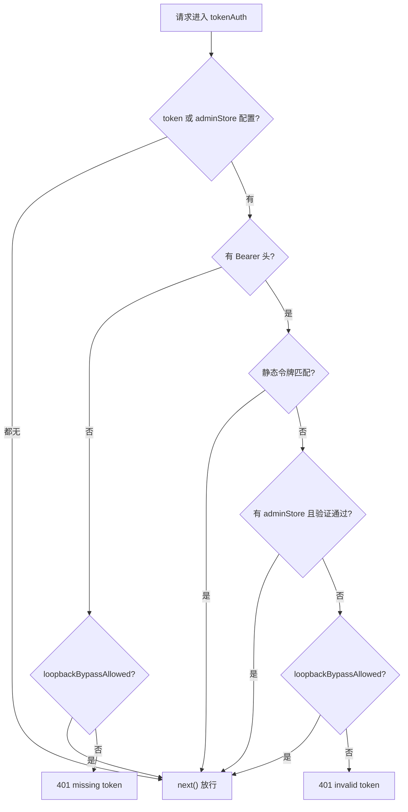

# tokenAuth.ts 需求说明

> 源文件：src/services/worker/http/middleware/tokenAuth.ts ｜ 类型：源码 ｜ 行数：124 ｜ 所属模块：worker/http/middleware ｜ 分析日期：2026-07-23

## 1. 文件定位总述

tokenAuth 是共享访问令牌（shared-access-token）中间件，为 LAN 部署场景提供简单但安全的认证机制。服务端设置一个共享令牌，所有客户端在 Authorization 头中携带同一令牌。中间件采用恒定时间比较防止时序侧信道攻击，同时支持 AdminSessionStore 回退（允许 viewer UI 通过登录会话认证）和 loopback 本地自动登录旁路。令牌为空时中间件为无操作（standalone/client 模式默认行为）。

## 2. 功能需求

| 编号 | 需求描述（系统应当…） | 触发条件 / 输入 | 处理规则与输出 | 证据 |
|------|----------------------|----------------|---------------|------|
| FR-AUTH-01 | 系统应当验证共享访问令牌 | 请求包含 Authorization: Bearer token | 使用 timingSafeEqual 进行恒定时间比较；匹配则放行 | `tokenAuth.ts:82-89` |
| FR-NOOP-01 | 系统应当在无令牌配置时放行所有请求 | serverToken 为空且无 AdminSessionStore | 直接调用 next()，无操作中间件 | `tokenAuth.ts:55-57` |
| FR-ADMIN-FB-01 | 系统应当回退到 admin session token | 静态令牌不匹配但有 AdminSessionStore 且 admin session 有效 | 调用 adminSessions.verify() 验证 | `tokenAuth.ts:92-94` |
| FR-LOOPBACK-01 | 系统应当在 loopback 请求中旁路认证 | loopback 来源且本地自动登录允许 | 调用 loopbackBypassAllowed() 判断，每次实时读取设置支持热更新 | `tokenAuth.ts:66-69,98-100` |
| FR-REJECT-01 | 系统应当拒绝无效认证请求 | 所有认证方式均失败 | 返回 401 状态码，记录 warn 日志（含路径和远程地址） | `tokenAuth.ts:103-110` |
| FR-MISSING-01 | 系统应当拒绝缺少 Authorization 头的请求 | 无 Bearer 头且非 loopback | 返回 401 和 missing access token 错误信息 | `tokenAuth.ts:70-78` |
| FR-LENLIMIT-01 | 系统应当拒绝过长的令牌 | token 长度超过 256 字符 | extractBearer 中直接返回 null | `tokenAuth.ts:122` |

## 3. 业务规则与约束

- **恒定时间比较**：使用 crypto.timingSafeEqual，所有比较操作固定 256 字节长度（不足补零）防止时序攻击 (`tokenAuth.ts:59-61,84-85`)
- **认证优先级**：静态令牌 → admin session token → loopback 旁路 (`tokenAuth.ts:82-100`)
- **热更新支持**：loopbackBypassAllowed 每次请求实时读取 CLAUDE_MEM_SERVER_LOCAL_AUTO_LOGIN 设置 (`tokenAuth.ts:27-28`)
- **代理穿透防护**：isAutoLoginAllowed 检测 X-Forwarded-For / X-Real-IP 代理头和 Host 非回环值，防止通过代理伪装本地请求 (`tokenAuth.ts:20-24`)
- **向后兼容**：默认无令牌配置时中间件为 no-op，不影响 standalone/client 模式 (`tokenAuth.ts:55-57`)
- **loopbackBypassAllowed 导出**：该函数被导出供报告路由的 authorized() 检查复用，确保各路由的 loopback 判断逻辑一致 (`tokenAuth.ts:25`)

## 4. 对外暴露

| 导出函数 | 签名 | 说明 |
|---------|------|------|
| tokenAuth | (serverToken: string, adminSessions?: AdminSessionStore) => RequestHandler | 创建共享令牌认证中间件 |
| loopbackBypassAllowed | (req: Request): boolean | 判断 loopback 旁路是否允许（导出供其他路由复用） |

## 5. 依赖关系

- **依赖模块**：AdminSessionStore（admin session 验证）、extractBearerToken（token 提取）、isAutoLoginAllowed（loopback+代理检测）、SettingsDefaultsManager（实时设置读取）
- **上游**：Worker HTTP 服务在 server/LAN 模式下挂载
- **与 serverApiGate 的关系**：serverApiGate 是 server 模式的 default-deny 网关（更严格），tokenAuth 是 LAN 部署的共享令牌中间件（更简单）；二者互补但不重叠

## 6. 数据结构

无自定义数据结构。

## 7. 复杂逻辑图示

## 8. 逆向备注

- `extractBearer` 函数被定义在 tokenAuth.ts 模块内部（非从 AdminSessionStore 导入），与 serverApiGate.ts 中使用的 `extractBearerToken`（从 AdminSessionStore 导入）是两个独立实现，逻辑相似但有细微差异——本模块额外检查 token 长度上限 256 (`tokenAuth.ts:114-124`)。
- 注释中明确标注 loopbackBypassAllowed 被导出的原因：报告路由需要使用完全相同的 loopback 判断规则，避免不同路由的认证行为不一致 (`tokenAuth.ts:20-24`)。
- 静态令牌比较使用 256 字节固定长度 Buffer + timingSafeEqual，即使实际令牌只有 20 字节也始终比较 256 字节，这是标准的安全实践 (`tokenAuth.ts:59-61`)。
