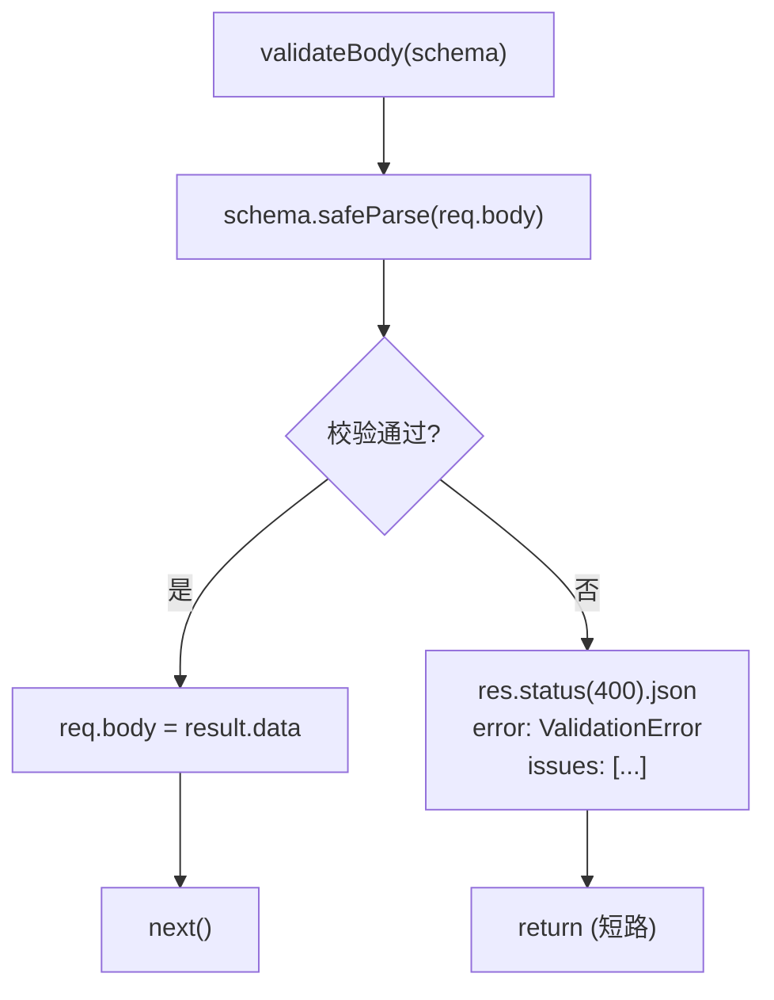

# validateBody.ts 需求说明

> 源文件：src/services/worker/http/middleware/validateBody.ts ｜ 类型：源码（中间件） ｜ 行数：22 ｜ 所属模块：worker/http/middleware ｜ 分析日期：2026-07-23

## 1. 文件定位总述

本文件提供一个基于 Zod schema 的 Express 请求体验证中间件工厂函数。它将 Zod 的 `safeParse` 能力封装为标准 Express 中间件，在请求到达路由处理器之前对 body 进行结构校验，校验失败时直接返回 400 错误并附带详细的字段级错误信息。

## 2. 功能需求

| 编号 | 需求描述（系统应当…） | 触发条件 / 输入 | 处理规则与输出 | 证据 |
|------|----------------------|----------------|---------------|------|
| FR-ValidateBody-01 | 系统应当根据传入的 Zod schema 验证请求体，校验通过时用解析后的数据替换 req.body 并传递给下一个中间件 | 请求到达，schema.safeParse 成功 | `req.body = result.data`，调用 `next()` | `src/services/worker/http/middleware/validateBody.ts:18-19` |
| FR-ValidateBody-02 | 系统应当在请求体验证失败时返回 400 状态码及结构化的 ValidationError 响应 | 请求到达，schema.safeParse 失败 | 返回 `{ error: 'ValidationError', issues: [...] }`，每个 issue 包含 path、message、code | `src/services/worker/http/middleware/validateBody.ts:8-16` |

## 3. 业务规则与约束

- **短路返回**：校验失败时调用 `res.status(400).json()` 后直接 return，不调用 next()（`src/services/worker/http/middleware/validateBody.ts:8-17`）
- **数据替换**：校验成功后将 Zod 解析后的数据（经过转换和 strip）写回 req.body，确保下游处理器使用的是经过 schema 规范化的数据（`src/services/worker/http/middleware/validateBody.ts:19`）
- **错误结构**：每个验证错误包含 path（字段路径数组）、message（Zod 错误消息）、code（Zod 错误码如 `too_small`、`invalid_type` 等）（`src/services/worker/http/middleware/validateBody.ts:11-15`）

## 4. 对外暴露

| 类别 | 名称 | 类型 | 说明 |
|------|------|------|------|
| 函数 | validateBody | `<S extends ZodTypeAny>(schema: S) => RequestHandler` | Zod schema 验证中间件工厂 |

## 5. 依赖关系

- **上游**：`express`（RequestHandler 类型）、`zod`（ZodTypeAny 类型）
- **下游**：Worker HTTP 路由中需要请求体验证的所有端点

## 6. 数据结构

```typescript
// 验证失败响应结构
interface ValidationErrorResponse {
  error: 'ValidationError';
  issues: Array<{
    path: (string | number)[];  // Zod 字段路径
    message: string;            // 人类可读错误消息
    code: string;               // Zod 错误码
  }>;
}
```

## 7. 复杂逻辑图示



上图展示了验证中间件的核心决策逻辑：Zod 校验通过时替换 body 并放行，失败时返回结构化错误并短路。

## 8. 逆向备注

推断：此中间件是 Worker HTTP API 中 POST 端点的通用验证层，可能被用于 `/api/corpus`、`/api/observations/batch` 等需要结构化输入的端点。
