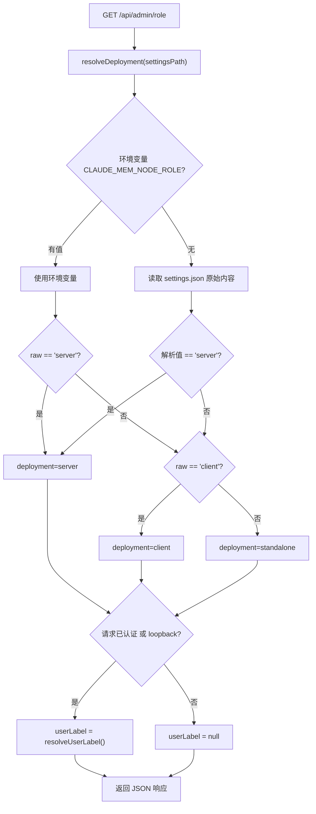

# AdminRoutes.ts 需求说明

> 源文件：src/services/worker/http/routes/AdminRoutes.ts ｜ 类型：源码 ｜ 行数：88 ｜ 所属模块：worker/http/routes ｜ 分析日期：2026-07-23

## 1. 文件定位总述

AdminRoutes 是管理元数据路由，当前仅暴露一个端点 `/api/admin/role`，供查看器前端在启动时判断当前 Worker 的部署模式（client/server/standalone）。该端点对身份信息做了分级披露：公共端点本身不需要认证即可访问，但 `userLabel` 字段仅在请求经过认证网关或来自 loopback 时才返回。`resolveDeployment` 函数直接解析 settings.json 原始内容，绕过 SettingsDefaultsManager 的默认值合并机制，以区分"未配置"和"显式配置为 client"两种状态。

## 2. 功能需求

| 编号 | 需求描述（系统应当…） | 触发条件 / 输入 | 处理规则与输出 | 证据 |
|------|----------------------|----------------|---------------|------|
| FR-ROLE-01 | 系统应当返回当前 Worker 的角色信息 | GET `/api/admin/role` | 返回 role（client/server）、deployment（client/server/standalone）、userLabel（有条件） | `AdminRoutes.ts:66-68,70-86` |
| FR-DEPLOY-01 | 系统应当区分三种部署模式 | settings.json 中 CLAUDE_MEM_NODE_ROLE 的值 | `server` → server，`client` → client，空/缺失/其他 → `standalone`；环境变量优先于配置文件 | `AdminRoutes.ts:24-41` |
| FR-IDENTITY-01 | 系统应当在已认证或 loopback 请求中披露用户标签 | `res.locals.authVia` 存在或 `isLoopbackRequest(req)` 为 true | userLabel 字段返回当前用户标签值；否则返回 null | `AdminRoutes.ts:79-85` |

## 3. 业务规则与约束

- **role 字段降级**：`role` 字段仅区分 `client` 和 `server`（standalone 映射为 client），而 `deployment` 字段额外提供 `standalone` 精确区分 (`AdminRoutes.ts:74`)
- **配置读取绕过**：`resolveDeployment` 直接解析 settings.json 原始 JSON，避免 SettingsDefaultsManager 的默认值合并将 `standalone` 误判为 `client` (`AdminRoutes.ts:22`)
- **环境变量优先级**：`process.env.CLAUDE_MEM_NODE_ROLE` 优先于 settings.json 中的值 (`AdminRoutes.ts:25-26`)
- **公共端点**：`/api/admin/role` 被设计为无需认证即可访问，因为查看器需要在登录前知道 UI 形态 (`AdminRoutes.ts:77-78`)
- **可测试性**：构造函数接受 `settingsPathResolver` 函数参数，测试中可注入临时路径 (`AdminRoutes.ts:62`)

## 4. 对外暴露

| 端点 | 方法 | 路径 | 说明 |
|------|------|------|------|
| 获取角色 | GET | `/api/admin/role` | 返回 {role, deployment, userLabel} |

## 5. 依赖关系

- **继承**：`BaseRouteHandler`
- **依赖模块**：`SettingsDefaultsManager`（读取设置）、`resolveUserLabel`（用户标签）、`isLoopbackRequest`（loopback 判断）
- **环境变量**：`CLAUDE_MEM_NODE_ROLE`

## 6. 数据结构

响应体结构：
```typescript
{ role: 'client' | 'server', deployment: 'client' | 'server' | 'standalone', userLabel: string | null }
```

## 7. 复杂逻辑图示



## 8. 逆向备注

- 注释中标注了 `TODO T-18 / S-doc §11`，表明该端点属于待完善的设计项 (`AdminRoutes.ts:44`)。
- `resolveDeployment` 函数在 settings.json 中查找 `CLAUDE_MEM_NODE_ROLE` 时，先尝试展平 `env` 子对象（`{...parsed, ...parsed.env}`），说明设置文件支持 `env` 嵌套结构 (`AdminRoutes.ts:30`)。
- `role` 和 `deployment` 的语义差异值得注意：role 仅用于功能门控（client vs server），deployment 用于 UI 展示区分（含 standalone）。
