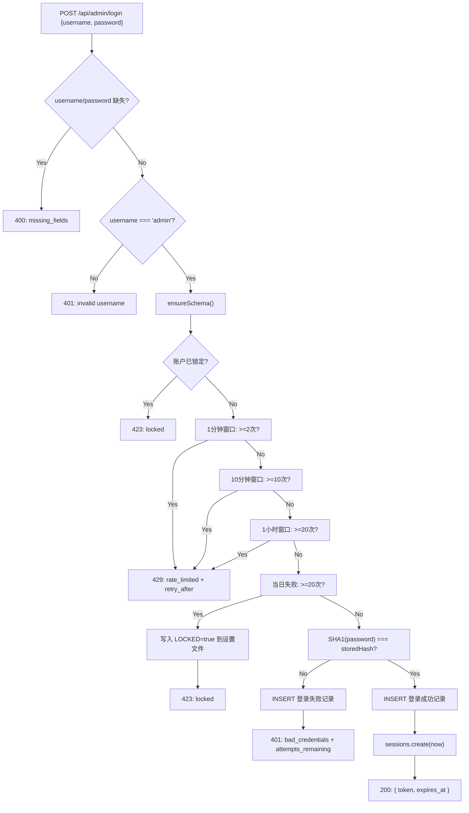
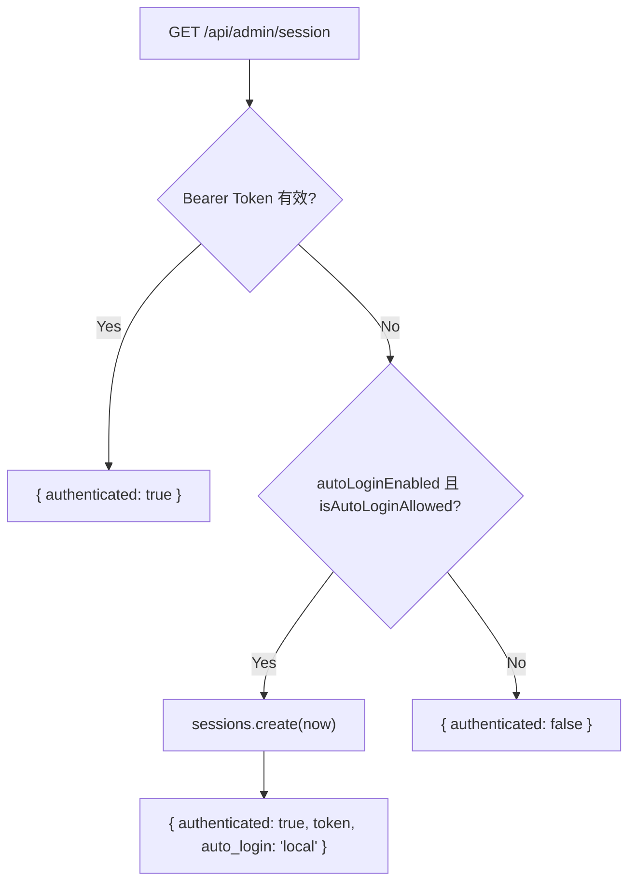

# AuthRoutes.ts 需求说明

> 源文件：src/services/worker/http/routes/AuthRoutes.ts ｜ 类型：源码 ｜ 行数：223 ｜ 所属模块：worker/http/routes（认证 API 路由） ｜ 分析日期：2026-07-23

## 1. 文件定位总述

AuthRoutes 是 claude-mem Worker HTTP API 的管理员认证路由控制器，提供登录、登出和会话状态检查三个端点。它实现了多层速率限制防护（1 分钟/2 次、10 分钟/10 次、1 小时/20 次）和每日失败锁定机制（20 次失败后永久锁定），并支持本地回环请求的自动登录（X-005 特性）。密码使用 SHA-1 哈希存储和比对，默认密码硬编码为特定哈希值。认证成功后通过 `AdminSessionStore` 生成会话 Token。该模块还负责自动创建 `admin_login_attempts` 表（ensureSchema），确保数据库表在首次使用时存在。

## 2. 功能需求

| 编号 | 需求描述（系统应当…） | 触发条件 / 输入 | 处理规则与输出 | 证据 |
|------|----------------------|----------------|---------------|------|
| FR-auth-01 | 系统应当提供管理员登录端点 | POST `/api/admin/login`，请求体包含 username 和 password | 先检查账号锁定状态，再执行多层速率限制检查，最后验证密码 SHA-1 哈希；成功返回 token + expires_at，失败返回错误信息 | `src/services/worker/http/routes/AuthRoutes.ts:82,87-189` |
| FR-auth-02 | 系统应当仅允许 "admin" 用户名登录 | login 请求中 username 非 "admin" | 直接返回 401，不检查密码也不记录登录尝试 | `src/services/worker/http/routes/AuthRoutes.ts:96-99` |
| FR-auth-03 | 系统应当对密码进行 SHA-1 哈希比对 | login 请求中 username 为 "admin" | 对输入密码执行 `sha1()` 哈希，与存储在设置文件中的 `CLAUDE_MEM_ADMIN_PASSWORD` 比对；未配置时使用默认哈希值 `94a0c82eed3ba3039400f0f7bda6a602af533166` | `src/services/worker/http/routes/AuthRoutes.ts:101-103` |
| FR-auth-04 | 系统应当实现多层速率限制保护登录端点 | login 请求通过用户名验证后 | 四层检查按顺序执行：(1) 1 分钟内 max 2 次；(2) 10 分钟内 max 10 次；(3) 1 小时内 max 20 次；(4) 当日失败 max 20 次触发永久锁定；超限返回 429 + retry_after_sec | `src/services/worker/http/routes/AuthRoutes.ts:117-168` |
| FR-auth-05 | 系统应当在每日失败达到 20 次时永久锁定账户 | login 请求中当日失败计数 >= 20 | 将 `CLAUDE_MEM_ADMIN_LOCKED` 设置写入用户设置文件，返回 423；锁定后需通过 CLI 重置密码 | `src/services/worker/http/routes/AuthRoutes.ts:160-168` |
| FR-auth-06 | 系统应当提供管理员登出端点 | POST `/api/admin/logout`，Header 中携带 Bearer Token | 从 Authorization 头提取 Token 并销毁会话 | `src/services/worker/http/routes/AuthRoutes.ts:83,191-194` |
| FR-auth-07 | 系统应当提供会话状态检查端点 | GET `/api/admin/session` | 先验证 Bearer Token；验证通过返回 `{ authenticated: true }`；验证失败则检查是否为本地回环请求且自动登录开启——是则自动签发会话并返回 `{ authenticated: true, token, auto_login: 'local' }` | `src/services/worker/http/routes/AuthRoutes.ts:84,196-214` |
| FR-auth-08 | 系统应当自动创建登录尝试记录表 | 首次调用 login 时 | 通过 `ensureSchema()` 创建 `admin_login_attempts` 表和索引；若数据库未初始化则静默跳过 | `src/services/worker/http/routes/AuthRoutes.ts:65-79` |

## 3. 业务规则与约束

1. **固定用户名 "admin"**：系统仅支持单一管理员用户 "admin"，非 admin 用户名直接拒绝，不计入速率限制。`src/services/worker/http/routes/AuthRoutes.ts:96-99`
2. **密码存储方式**：使用 SHA-1 哈希（40 位十六进制），存储在 `~/.claude-mem/settings.json` 的 `env.CLAUDE_MEM_ADMIN_PASSWORD` 字段中。默认密码哈希值硬编码。`src/services/worker/http/routes/AuthRoutes.ts:102`
3. **速率限制为滑动窗口**：所有窗口基于 `attempted_at_epoch` 字段查询，记录包含成功和失败的尝试。`src/services/worker/http/routes/AuthRoutes.ts:117-157`
4. **retry_after_sec 计算**：基于当前时间到窗口起点的剩余毫秒数除以 1000 向上取整，最小为 1 秒。`src/services/worker/http/routes/AuthRoutes.ts:122-123`
5. **本地自动登录**：GET `/api/admin/session` 对回环请求（由 `isAutoLoginAllowed` 判断）自动签发会话，受 `CLAUDE_MEM_SERVER_LOCAL_AUTO_LOGIN` 设置控制（默认启用，设为 "false" 关闭）。`src/services/worker/http/routes/AuthRoutes.ts:205-209`
6. **锁定为持久化状态**：账户锁定通过 `saveSetting('CLAUDE_MEM_ADMIN_LOCKED', 'true')` 写入设置文件，跨 Worker 重启持久存在。`src/services/worker/http/routes/AuthRoutes.ts:164`
7. **锁定检查在速率限制之前**：login 流程先检查锁定状态，再执行速率限制检查，最后才验证密码。锁定状态优先级最高。`src/services/worker/http/routes/AuthRoutes.ts:106-109`

## 4. 对外暴露

| 端点 | 方法 | 请求体/参数 | 响应 | 说明 |
|------|------|------------|------|------|
| `/api/admin/login` | POST | `{ username, password }` | `{ token, expires_at }` 或 400/401/423/429 | 管理员登录 |
| `/api/admin/logout` | POST | Bearer Token | `{ success: true }` | 管理员登出 |
| `/api/admin/session` | GET | Bearer Token（可选） | `{ authenticated }` 或 `{ authenticated, token, expires_at, auto_login }` | 会话状态检查 |

共 3 个 HTTP 端点。

## 5. 依赖关系

- **上游依赖**：`BaseRouteHandler`（路由基类）
- **上游依赖**：`AdminSessionStore`（会话管理，提供 `create`、`destroy`、`verify`、`extractBearerToken`）
- **上游依赖**：`isAutoLoginAllowed`（来自 `../middleware.js`，判断是否为回环请求）
- **上游依赖**：`DatabaseManager`（获取数据库连接）
- **上游依赖**：`SettingsDefaultsManager`、`USER_SETTINGS_PATH`（加载/保存用户设置）
- **运行时依赖**：`crypto.createHash`（SHA-1 密码哈希）
- **运行时依赖**：`fs.existsSync / readFileSync / writeFileSync`（设置文件读写）

## 6. 数据结构

- **admin_login_attempts 表** (`src/services/worker/http/routes/AuthRoutes.ts:68-74`)：`id`（自增主键）、`attempted_at_epoch`（尝试时间戳毫秒）、`success`（0/1 是否成功）
- **DAY_START** (`src/services/worker/http/routes/AuthRoutes.ts:12-16`)：函数，返回当天 0 点的 epoch 毫秒
- **设置文件中的相关键**：`CLAUDE_MEM_ADMIN_PASSWORD`（密码哈希）、`CLAUDE_MEM_ADMIN_LOCKED`（锁定状态）、`CLAUDE_MEM_SERVER_LOCAL_AUTO_LOGIN`（自动登录开关）

## 7. 复杂逻辑图示

上图展示了 login 端点的完整决策链。安全检查按优先级从高到低执行：缺失参数 → 用户名 → 锁定 → 速率限制 → 密码验证。

上图展示了 session 状态检查端点的逻辑，突出本地自动登录的降级路径。

## 8. 逆向备注

1. **SHA-1 密码哈希**：使用 SHA-1 进行密码哈希，安全性低于 bcrypt/argon2。这是项目范围内的设计决策（遵循全局规则"密码存储必须采用 shasum 生成的 40 位哈希值"），适用于本地管理场景。`src/services/worker/http/routes/AuthRoutes.ts:18-20`
2. **默认密码存在**：默认哈希值 `94a0c82eed3ba3039400f0f7bda6a602af533166` 硬编码在代码中，意味着未配置时存在默认密码。`src/services/worker/http/routes/AuthRoutes.ts:102`
3. **saveSetting/deleteSideEffect 使用同步文件操作**：设置文件读写使用 `readFileSync/writeFileSync`，在请求处理中同步执行可能影响性能。`src/services/worker/http/routes/AuthRoutes.ts:32-55`
4. **loadSettings 的双重解析**：先尝试 `raw.env`，回退到 `raw` 本身。推断设置文件可能使用 `env` 嵌套结构，也可能直接平铺。`src/services/worker/http/routes/AuthRoutes.ts:26`
5. **锁定不可通过 API 解锁**：锁定后 API 返回 423 并提示"reset password via CLI"，没有通过 API 解锁的端点。`src/services/worker/http/routes/AuthRoutes.ts:108`
6. **`ensureSchema` 的异常被静默吞没**：`catch {}` 空块意味着数据库初始化失败不会报错，依赖后续调用重试。`src/services/worker/http/routes/AuthRoutes.ts:76-78`
