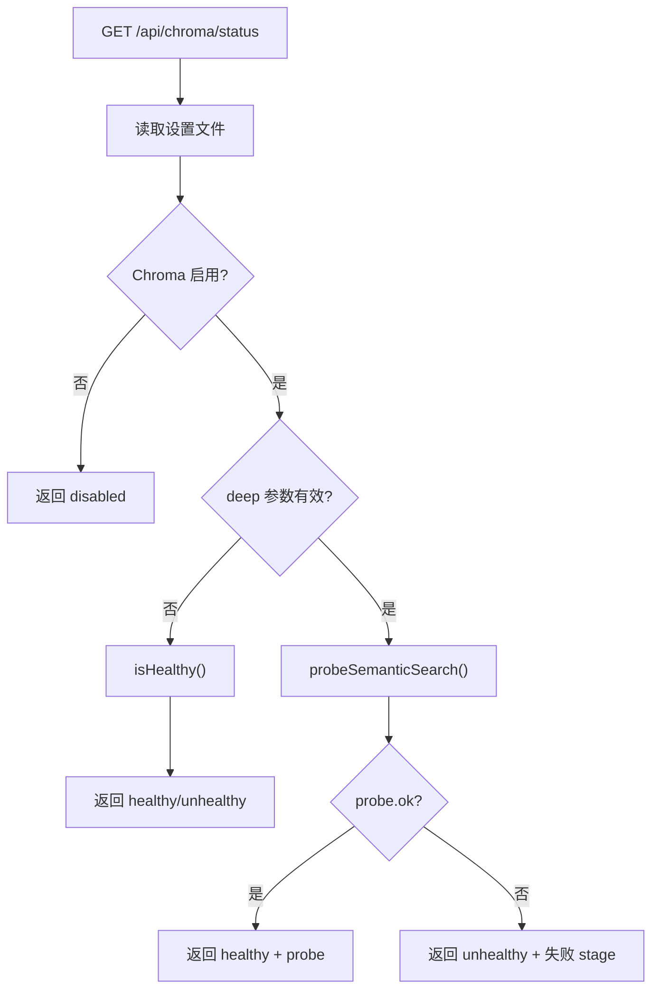

# ChromaRoutes.ts 需求说明

> 源文件：src/services/worker/http/routes/ChromaRoutes.ts | 类型：源码 | 行数：63 | 所属模块：worker/http/routes | 分析日期：2026-07-23

## 1. 文件定位总述

ChromaRoutes 是 Chroma 向量数据库健康检查的 HTTP 路由处理器，提供 `/api/chroma/status` 端点。该端点支持两种探测深度：浅层检查（仅判断 chroma-mcp 进程是否存活）和深层检查（执行实际的语义搜索往返测试）。它为 Viewer UI 和运维诊断提供 Chroma 服务可用性的实时反馈。

## 2. 功能需求

| 编号 | 需求描述（系统应当…） | 触发条件 / 输入 | 处理规则与输出 | 证据 |
|------|----------------------|----------------|---------------|------|
| FR-ChromaRoutes-01 | 系统应当提供 Chroma 状态查询接口 | HTTP GET `/api/chroma/status`，可选 query 参数 `deep` | 根据 Chroma 是否启用和 deep 参数值返回不同级别的状态信息 | `src/services/worker/http/routes/ChromaRoutes.ts:11-12` |
| FR-ChromaRoutes-02 | 系统应当在 Chroma 禁用时返回 disabled 状态 | Chroma 设置为 `CLAUDE_MEM_CHROMA_ENABLED=false` | 返回 `{ status: 'disabled', connected: false, details: '...' }` | `src/services/worker/http/routes/ChromaRoutes.ts:24-33` |
| FR-ChromaRoutes-03 | 系统应当支持浅层健康检查 | `deep` 参数未设置或为 false/0 | 调用 `chromaMcp.isHealthy()` 进行存活检查，返回 `{ status: 'healthy'/'unhealthy', connected, details, deep: false }` | `src/services/worker/http/routes/ChromaRoutes.ts:38-47` |
| FR-ChromaRoutes-04 | 系统应当支持深层语义搜索探测 | `deep` 参数为非 false/0 值 | 调用 `chromaMcp.probeSemanticSearch()` 执行完整语义搜索往返，返回含 probe 详情的响应。失败时在 details 中报告失败的 stage | `src/services/worker/http/routes/ChromaRoutes.ts:49-62` |

## 3. 业务规则与约束

- **deep 参数判断**：`deep` 为 undefined、'false'、'0' 时视为浅层检查，其他任何值（包括 'true'、'1'、空字符串等）均视为深层检查。`src/services/worker/http/routes/ChromaRoutes.ts:18-22`
- **配置热读取**：每次请求都重新从文件加载设置（`SettingsDefaultsManager.loadFromFile`），不做缓存。推断：（确保设置变更即时生效）。`src/services/worker/http/routes/ChromaRoutes.ts:15`
- **Chroma 禁用优先**：无论 deep 参数如何，Chroma 禁用时直接返回 disabled，不执行健康检查。`src/services/worker/http/routes/ChromaRoutes.ts:24`

## 4. 对外暴露

| 名称 | 类型 | 说明 |
|------|------|------|
| `GET /api/chroma/status?deep=` | HTTP 端点 | Chroma 状态/健康检查，支持浅层和深层两种模式 |

## 5. 依赖关系

- **BaseRouteHandler**（`../BaseRouteHandler.js`）：提供路由注册和错误处理基类
- **ChromaMcpManager**（`../../../sync/ChromaMcpManager.js`）：提供 isHealthy() 和 probeSemanticSearch() 方法
- **SettingsDefaultsManager**（`../../../../shared/SettingsDefaultsManager.js`）：读取 Chroma 启用设置
- **USER_SETTINGS_PATH**（`../../../../shared/paths.js`）：设置文件路径常量

## 6. 数据结构

不适用（使用 ChromaMcpManager 返回的 probe 结果结构）。

## 7. 复杂逻辑图示

状态检查流程遵循"配置检查 -> 启用判断 -> 深度选择 -> 探测执行"的分支链，deep 参数控制是否执行完整的语义搜索测试。

## 8. 逆向备注

- 无逆向备注。
