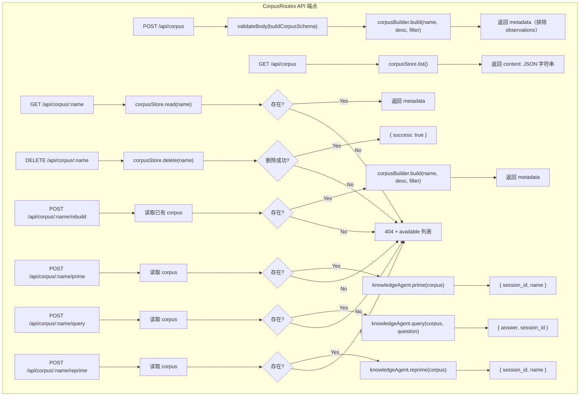

# CorpusRoutes.ts 需求说明

> 源文件：src/services/worker/http/routes/CorpusRoutes.ts ｜ 类型：源码 ｜ 行数：215 ｜ 所属模块：worker/http/routes（语料库 API 路由） ｜ 分析日期：2026-07-23

## 1. 文件定位总述

CorpusRoutes 是 claude-mem Worker HTTP API 的语料库管理路由控制器，提供语料库（Corpus）的完整 CRUD 生命周期管理端点以及 AI 驱动的 prime（装载）、query（问答）和 reprime（重新装载）操作。它将 CorpusStore（持久化）、CorpusBuilder（构建）和 KnowledgeAgent（AI 代理）三个服务组合起来，通过 Express 路由对外暴露 RESTful API。所有端点继承自 `BaseRouteHandler` 的错误处理和响应标准化机制，请求体通过 Zod schema 验证。语料库类型限定为 8 种预定义类型：decision、bugfix、feature、refactor、discovery、change、security_alert、security_note。

## 2. 功能需求

| 编号 | 需求描述（系统应当…） | 触发条件 / 输入 | 处理规则与输出 | 证据 |
|------|----------------------|----------------|---------------|------|
| FR-cr-01 | 系统应当提供构建新语料库的端点 | POST `/api/corpus`，请求体包含 name（必需）、description、project、types、concepts、files、query、date_start、date_end、limit | 验证请求体后，将 filter 参数传递给 `corpusBuilder.build()`；返回语料库元数据（排除 observations 字段）；types 必须为预定义 8 种类型的子集 | `src/services/worker/http/routes/CorpusRoutes.ts:74,84-102` |
| FR-cr-02 | 系统应当提供列出所有已存语料库的端点 | GET `/api/corpus` | 调用 `corpusStore.list()` 返回列表；响应包装在 `{ content: [{ type: 'text', text: JSON }] }` 结构中 | `src/services/worker/http/routes/CorpusRoutes.ts:75,104-109` |
| FR-cr-03 | 系统应当提供获取单个语料库的端点 | GET `/api/corpus/:name` | 从 `corpusStore.read(name)` 读取；不存在返回 404 + 可用语料库列表；存在则返回元数据（排除 observations） | `src/services/worker/http/routes/CorpusRoutes.ts:76,111-126` |
| FR-cr-04 | 系统应当提供删除语料库的端点 | DELETE `/api/corpus/:name` | 调用 `corpusStore.delete(name)`；不存在返回 404；存在返回 `{ success: true }` | `src/services/worker/http/routes/CorpusRoutes.ts:77,128-142` |
| FR-cr-05 | 系统应当提供重建语料库的端点 | POST `/api/corpus/:name/rebuild` | 先读取已有语料库获取 description 和 filter，然后调用 `corpusBuilder.build()` 重建；不存在返回 404 | `src/services/worker/http/routes/CorpusRoutes.ts:78,144-161` |
| FR-cr-06 | 系统应当提供装载语料库到 AI 会话的端点 | POST `/api/corpus/:name/prime` | 读取语料库后调用 `knowledgeAgent.prime(corpus)`；返回 `session_id` 和 `name` | `src/services/worker/http/routes/CorpusRoutes.ts:79,163-178` |
| FR-cr-07 | 系统应当提供对已装载语料库提问的端点 | POST `/api/corpus/:name/query`，请求体包含 question（必需） | 读取语料库后调用 `knowledgeAgent.query(corpus, question)`；返回 `answer` 和 `session_id` | `src/services/worker/http/routes/CorpusRoutes.ts:80,180-196` |
| FR-cr-08 | 系统应当提供重新装载语料库的端点 | POST `/api/corpus/:name/reprime` | 读取语料库后调用 `knowledgeAgent.reprime(corpus)`；返回新的 `session_id` 和 `name` | `src/services/worker/http/routes/CorpusRoutes.ts:81,198-213` |

## 3. 业务规则与约束

1. **语料库类型白名单**：仅允许 8 种类型：decision、bugfix、feature、refactor、discovery、change、security_alert、security_note。`src/services/worker/http/routes/CorpusRoutes.ts:11`
2. **灵活的类型/概念输入**：`types` 和 `concepts` 参数支持多种输入格式——JSON 数组字符串、逗号分隔字符串、原生数组。通过 Zod preprocess 统一处理。`src/services/worker/http/routes/CorpusRoutes.ts:14-27`
3. **observations 字段过滤**：所有返回语料库的端点都通过解构 `{ observations, ...metadata } = corpus` 排除 observations 字段，避免返回大量原始数据。`src/services/worker/http/routes/CorpusRoutes.ts:100,124,159`
4. **404 响应含补救信息**：当语料库不存在时，404 响应包含 `fix`（操作建议）和 `available`（当前可用语料库列表）字段。`src/services/worker/http/routes/CorpusRoutes.ts:116-120`
5. **Zod passthrough**：所有 schema 使用 `.passthrough()`，允许请求体包含未声明的额外字段而不报错。`src/services/worker/http/routes/CorpusRoutes.ts:52,56,58`
6. **路由参数安全提取**：`routeParam` 函数处理 Express 可能返回数组或字符串的 params。`src/services/worker/http/routes/CorpusRoutes.ts:60-62`

## 4. 对外暴露

| 端点 | 方法 | 请求体验证 | 响应 | 说明 |
|------|------|-----------|------|------|
| `/api/corpus` | POST | `buildCorpusSchema`（Zod） | 语料库元数据 JSON | 构建新语料库 |
| `/api/corpus` | GET | 无 | `{ content: [{ type, text }] }` | 列出所有语料库 |
| `/api/corpus/:name` | GET | 无 | 语料库元数据 JSON 或 404 | 获取单个语料库 |
| `/api/corpus/:name` | DELETE | 无 | `{ success: true }` 或 404 | 删除语料库 |
| `/api/corpus/:name/rebuild` | POST | `emptyBodySchema` | 语料库元数据 JSON 或 404 | 重建语料库 |
| `/api/corpus/:name/prime` | POST | `emptyBodySchema` | `{ session_id, name }` 或 404 | 装载到 AI 会话 |
| `/api/corpus/:name/query` | POST | `queryCorpusSchema` | `{ answer, session_id }` 或 404 | 对语料库提问 |
| `/api/corpus/:name/reprime` | POST | `emptyBodySchema` | `{ session_id, name }` 或 404 | 重新装载 |

共 8 个 HTTP 端点。

## 5. 依赖关系

- **上游依赖**：`BaseRouteHandler`（路由基类，提供 `wrapHandler` 和 `setupRoutes` 模式）
- **上游依赖**：`validateBody` 中间件（Zod schema 验证）
- **上游依赖**：`CorpusStore`（语料库持久化存储）
- **上游依赖**：`CorpusBuilder`（语料库构建服务）
- **上游依赖**：`KnowledgeAgent`（AI 代理服务）
- **上游依赖**：`CorpusFilter`、`CorpusFile` 类型（来自 `../../knowledge/types.js`）

## 6. 数据结构

- **ALLOWED_CORPUS_TYPES** (`src/services/worker/http/routes/CorpusRoutes.ts:11`)：8 种预定义语料库类型
- **buildCorpusSchema** (`src/services/worker/http/routes/CorpusRoutes.ts:38-52`)：Zod 验证 schema，包含 name（必需）、description、project、types（白名单校验）、concepts、files、query、date_start、date_end、limit
- **queryCorpusSchema** (`src/services/worker/http/routes/CorpusRoutes.ts:54-56`)：仅 question（必需，trim + min(1)）

## 7. 复杂逻辑图示

上图展示了 CorpusRoutes 的 8 个 API 端点及其处理流程。大部分端点共享相同的"读取 → 存在性检查 → 执行操作"模式。

## 8. 逆向备注

1. **列表端点的特殊响应格式**：GET `/api/corpus` 返回 `{ content: [{ type: 'text', text: JSON }] }` 结构，与其他端点的直接 JSON 响应不同。推断这是为了兼容某种 MCP 工具的响应格式。`src/services/worker/http/routes/CorpusRoutes.ts:106-108`
2. **positiveIntegerLike 预处理器**：`limit` 参数的 Zod 预处理器尝试将字符串转为数字，如果 `Number.isNaN` 则保留原值让 Zod 自然报错。这种设计允许前端发送 `"10"` 这样的字符串。`src/services/worker/http/routes/CorpusRoutes.ts:29-36`
3. **rebuild 保留原始 filter**：重建语料库时使用原有语料库的 description 和 filter，不支持更新这些字段。`src/services/worker/http/routes/CorpusRoutes.ts:157`
4. **构造函数注入三个服务**：CorpusRoutes 的构造函数需要 CorpusStore、CorpusBuilder 和 KnowledgeAgent 三个依赖，体现了控制器模式。`src/services/worker/http/routes/CorpusRoutes.ts:65-71`
