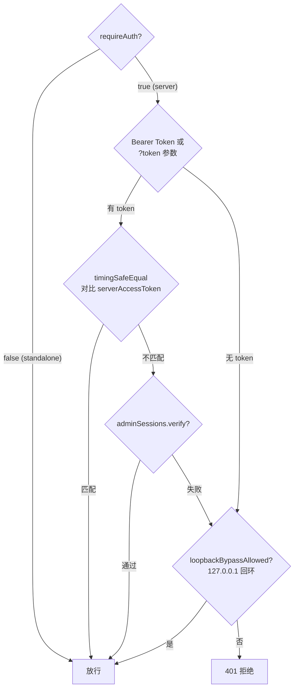
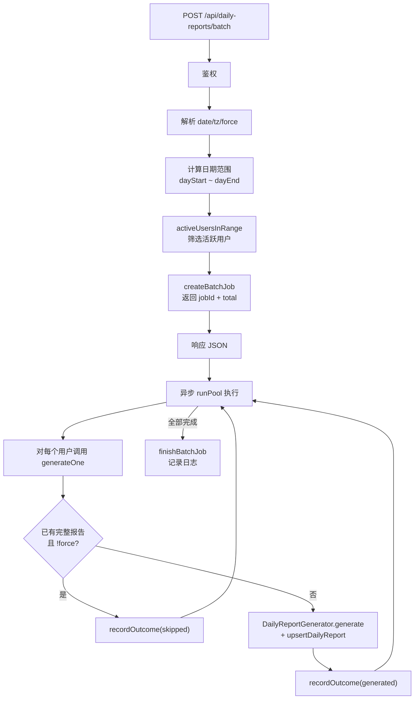

# DailyReportRoutes.ts 需求说明

> 源文件：src/services/worker/http/routes/DailyReportRoutes.ts ｜ 类型：源码 ｜ 行数：351 ｜ 所属模块：worker/http/routes ｜ 分析日期：2026-07-23

## 1. 文件定位总述

本文件是 claude-mem Worker 的日报功能路由控制器，提供日报的生成、删除、下载、批量处理和整页 HTML 渲染的完整 HTTP API。它继承 BaseRouteHandler，注册 7 条路由端点，覆盖从单用户生成到全量批量异步生成的工作流。鉴权机制支持 Bearer Token、查询参数 Token、AdminSession 验证和本地回环免密四种方式，与周报模块保持一致的认证模型。该控制器同时负责服务端渲染日报浏览页面（左右双列对比昨天与今天），内含完整的 CSS 主题系统和内联 JavaScript 交互逻辑。

## 2. 功能需求

| 编号 | 需求描述（系统应当…） | 触发条件 / 输入 | 处理规则与输出 | 证据 |
|------|----------------------|----------------|---------------|------|
| FR-DR-01 | 系统应当提供日报概览接口，返回指定日期（默认今天）每个用户的日报生成状态（最新日期、是否已生成、是否有当日内容、是否完整） | GET /api/daily-reports/overview，可选 ?date=YYYY-MM-DD、?tz=时区偏移 | 查询 daily_reports 表按 user_label 聚合；联合 activeUsersInRange 判断用户活跃状态；构建 roster（所有已知用户并集报告用户）返回 JSON | `src/services/worker/http/routes/DailyReportRoutes.ts:49,97-150` |
| FR-DR-02 | 系统应当支持同步生成或强制重算某用户某天的日报（UPSERT 语义），已有完整报告且未强制时跳过 | POST /api/daily-reports/generate，body: {user, date, tz, force} | 校验必填参数；调用 DailyReportGenerator.generate + upsertDailyReport；返回 outcome（generated/skipped） | `src/services/worker/http/routes/DailyReportRoutes.ts:50,157-181` |
| FR-DR-03 | 系统应当支持异步批量生成所有活跃用户某天的日报，立即返回 jobId 供客户端轮询进度 | POST /api/daily-reports/batch，body: {date, tz, force} | 筛选当日活跃用户创建批量任务；通过线程池并发执行；返回 {jobId, total} | `src/services/worker/http/routes/DailyReportRoutes.ts:51,187-205` |
| FR-DR-04 | 系统应当提供批量任务状态查询接口，返回任务的完成进度、跳过数、生成数等 | GET /api/daily-reports/batch/:jobId | 查询内存中的批量任务状态，返回 JSON | `src/services/worker/http/routes/DailyReportRoutes.ts:52,208-213` |
| FR-DR-05 | 系统应当支持删除指定用户指定日期的日报 | POST /api/daily-reports/delete，body: {user, date} | 校验必填参数；执行 DELETE；返回删除行数 | `src/services/worker/http/routes/DailyReportRoutes.ts:53,216-227` |
| FR-DR-06 | 系统应当支持下载指定用户指定日期的原始 Markdown 日报文件，文件名格式为"日报-<date>-<user>.md" | GET /api/daily-reports/download?user=&date= | 设置 Content-Disposition 为 attachment；返回 markdown 文本 | `src/services/worker/http/routes/DailyReportRoutes.ts:54,230-241` |
| FR-DR-07 | 系统应当提供服务端渲染的日报浏览页面，左右双列布局展示前一日和当日日报，无报告时显示生成按钮 | GET /daily-report?user=&date=&token= | 内联 CSS（支持 light/dark 主题）+ 内联 JS（生成按钮 POST 交互）；mdToHtml 渲染 Markdown 内容 | `src/services/worker/http/routes/DailyReportRoutes.ts:55,244-349` |

## 3. 业务规则与约束

1. **鉴权四级策略**：(1) standalone 模式直通免鉴权；(2) server 模式校验 Bearer Token 或查询参数 token（timingSafeEqual 防时序攻击）；(3) AdminSession 验证；(4) loopback 本地回环免密。`src/services/worker/http/routes/DailyReportRoutes.ts:59-74`
2. **时区处理**：所有日期计算基于客户端传入的时区偏移（?tz 参数，单位分钟），默认取客户端本地时区偏移。`src/services/worker/http/routes/DailyReportRoutes.ts:76-80`
3. **日期格式校验**：所有日期参数必须匹配 `^\d{4}-\d{2}-\d{2}$` 正则，否则返回 400。`src/services/worker/http/routes/DailyReportRoutes.ts:30`
4. **跳过完整报告**：generateOne 中除非 force=true，已存在且 isPeriodComplete 的报告不会被重新生成。`src/services/worker/http/routes/DailyReportRoutes.ts:158-161`
5. **用户名大小写不敏感**：SQL 查询使用 COLLATE NOCASE 进行用户名匹配。`src/services/worker/http/routes/DailyReportRoutes.ts:90,223`
6. **日期语义兼容**：overview 接口中虽然接受 ?date 参数指向过去日期，但返回字段仍命名为 today/has_today（向后兼容），实际语义为"所选日期"。`src/services/worker/http/routes/DailyReportRoutes.ts:101-105`
7. **模型配置**：日报生成使用的模型从 settings.json 中 CLAUDE_MEM_WEEKLY_REPORT_MODEL 读取，默认 'qwen-plus'。`src/services/worker/http/routes/DailyReportRoutes.ts:82-86`
8. **批量任务内存管理**：批量任务状态保存在内存中（createBatchJob/getBatchJob），不持久化，Worker 重启后丢失。`src/services/worker/http/routes/DailyReportRoutes.ts:198,204`

## 4. 对外暴露

### HTTP 端点

| 方法 | 路径 | 功能 | 主要参数 |
|------|------|------|---------|
| GET | /api/daily-reports/overview | 日报概览（每用户状态） | ?date, ?tz |
| POST | /api/daily-reports/generate | 单用户生成/重算 | body: {user, date, tz, force} |
| POST | /api/daily-reports/batch | 批量异步生成 | body: {date, tz, force} |
| GET | /api/daily-reports/batch/:jobId | 批量任务状态 | 路径参数 jobId |
| POST | /api/daily-reports/delete | 删除日报 | body: {user, date} |
| GET | /api/daily-reports/download | 下载 Markdown | ?user, ?date |
| GET | /daily-report | 整页 HTML 浏览 | ?user, ?date, ?token, ?tz |

### 响应结构示例

- **overview**: `{ today: string, yesterday: string, users: Record<string, { latest_date, has_today, has_yesterday, hasContent, complete }> }`
- **generate**: `{ ok: true, outcome: 'generated'|'skipped', skipped: boolean, report_date: string }`
- **batch**: `{ jobId: string, total: number }`

## 5. 依赖关系

- **上游依赖**：
  - `../BaseRouteHandler.js`（BaseRouteHandler）— 路由基类，提供 wrapHandler、badRequest、unauthorized、notFound
  - `../../DatabaseManager.js`（DatabaseManager）— 数据库连接
  - `../AdminSessionStore.js`（AdminSessionStore, extractBearerToken）— 管理会话验证
  - `../middleware/tokenAuth.js`（loopbackBypassAllowed）— 回环免密
  - `../../reports/DailyReportGenerator.js`（DailyReportGenerator, upsertDailyReport, dayOf）— 日报生成与持久化
  - `../../reports/mdToHtml.js`（mdToHtml）— Markdown 转 HTML
  - `../../reports/batch.js`（runPool, batchConcurrency, createBatchJob, recordOutcome, finishBatchJob, getBatchJob, dayEndEpoch, isPeriodComplete, rosterAllUsers, activeUsersInRange）— 批量任务管理
  - `../../../../shared/SettingsDefaultsManager.js` — 配置读取
  - `../../../../shared/paths.js`（USER_SETTINGS_PATH）— 路径常量

- **下游消费者**：被 Worker HTTP 服务器注册到 Express 应用，供前端 Viewer UI 和 mem-search skill 调用

## 6. 数据结构

### DailyRow 接口

```
DailyRow {
  user_label: string          // 用户标识
  report_date: string          // 报告日期 (YYYY-MM-DD)
  markdown: string             // Markdown 正文
  stats: string | null         // 统计信息 JSON
  model: string | null         // 生成模型
  generated_at_epoch: number  // 生成时间戳
}
```

### Overview 用户状态

```
UserStatus {
  latest_date: string          // 最近日报日期
  has_today: boolean           // 当天是否有日报
  has_yesterday: boolean       // 前一天是否有日报
  hasContent: boolean           // 当天是否有活跃内容
  complete: boolean            // 当天日报是否完整（生成时间在当天结束前）
}
```

## 7. 复杂逻辑图示

下图展示 DailyReportRoutes 的鉴权决策流程：



批量生成工作流：



## 8. 逆向备注

1. **"today" 语义漂移**：overview 接口支持 ?date 指定过去日期，但返回字段名仍为 today/has_today，注释解释为向后兼容。前端需理解 "today" 实际指 "所选日期"。`src/services/worker/http/routes/DailyReportRoutes.ts:101-105`
2. **yesterday 计算方式特殊**：不是简单的 today - 1天，而是从所选日期的日历部件推算 UTC 午夜再减一天，以确保跨 DST（夏令时）边界时日期计算正确。`src/services/worker/http/routes/DailyReportRoutes.ts:111-112`
3. **single 列变量被硬编码为 false**：renderPage 中 `const single = false` 硬编码，HTML 模板中条件渲染代码 `single ? '' : column(...)` 永远执行双列布局。推断 single 模式是为未来预留（如仅显示今天），但当前未启用。`src/services/worker/http/routes/DailyReportRoutes.ts:292`
4. **下载文件名双重编码**：Content-Disposition 中同时设置 filename（ASCII 回退）和 filename*（UTF-8 编码），以兼容不同浏览器对中文文件名的处理。`src/services/worker/http/routes/DailyReportRoutes.ts:239`
5. **batch 端点 void 异步**：handleBatch 中 `void runPool(...).then(...)` 使用 fire-and-forget 模式，异步执行在响应返回后继续，异常不会被捕获到 HTTP 响应中。推断批量任务的错误仅通过 job status 反映。`src/services/worker/http/routes/DailyReportRoutes.ts:201-204`
6. **模型配置复用周报设置**：日报生成模型从 CLAUDE_MEM_WEEKLY_REPORT_MODEL 读取（周报模型配置），而非独立的日报模型配置。推断日报与周报共用同一个模型配置项。`src/services/worker/http/routes/DailyReportRoutes.ts:84`
