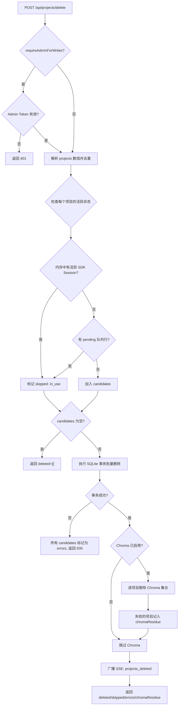
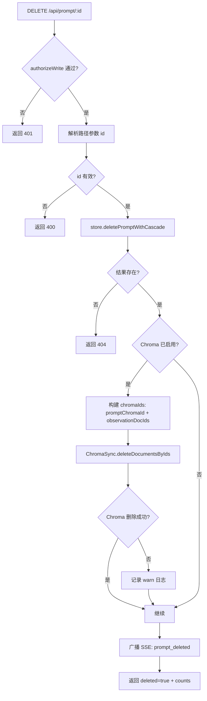
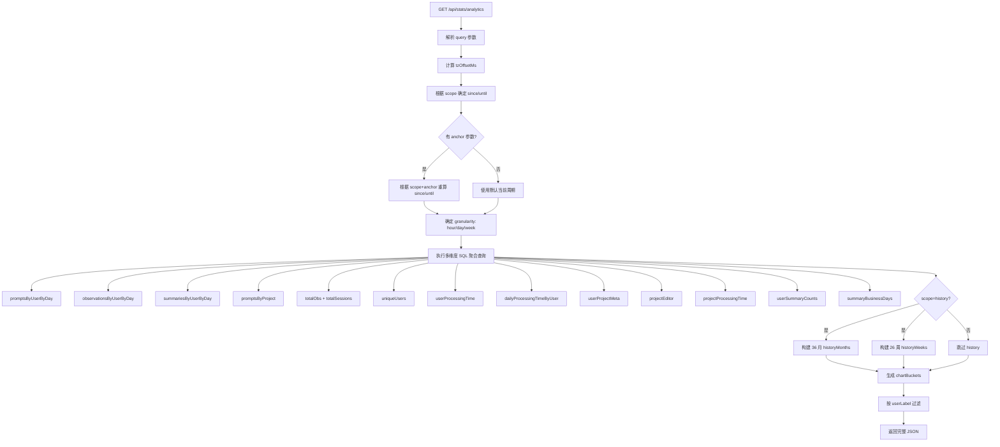

# DataRoutes.ts 需求说明

> 源文件：src/services/worker/http/routes/DataRoutes.ts ｜ 类型：源码 ｜ 行数：1501 ｜ 所属模块：Worker HTTP API（数据路由层） ｜ 分析日期：2026-07-23

## 1. 文件定位总述

DataRoutes 是 Claude-mem Worker HTTP 服务的核心数据路由处理器，继承自 `BaseRouteHandler`，负责将所有面向前端 Viewer UI 及外部客户端的数据读写 API 注册到 Express 应用上。该类以构造函数注入的方式持有分页助手（PaginationHelper）、数据库管理器（DatabaseManager）、会话管理器（SessionManager）、SSE 广播器（SSEBroadcaster）、Worker 服务实例、启动时间戳、管理员会话存储及服务模式配置等关键依赖，是 Worker 服务层与 HTTP 传输层之间的桥梁。

其注册的端点覆盖三大能力域：**数据查询**（observations/summaries/prompts/sessions 的分页列表、单条详情、批量查询、按文件路径检索）、**运维与管理**（全局统计、项目目录、项目统计、处理状态、数据导入、项目批量删除、单条 Prompt 级联删除、分析报表）以及**权限控制**（服务端模式下通过 AdminSessionStore 对写操作实施 Admin 认证，通过 tokenAuth 中间件对 analytics 端点实施共享访问令牌认证）。删除类操作均采用"SQLite 事务优先提交 + Chroma 向量库尽力清除"的策略，确保关系数据的一致性不被向量库的故障所阻塞。

## 2. 功能需求

### 2.1 数据查询端点

| 编号 | 需求描述（系统应当…） | 触发条件 / 输入 | 处理规则与输出 | 证据 |
|------|----------------------|----------------|---------------|------|
| FR-OBS-LIST-01 | 系统应当提供 observations 分页列表查询接口 | GET /api/observations | 从 query 解析 offset/limit/project/platformSource/dateStartEpoch/dateEndEpoch/userLabel，limit 上限 100；委托 PaginationHelper 执行查询并返回 JSON | `src/services/worker/http/routes/DataRoutes.ts:276-280` |
| FR-SUM-LIST-01 | 系统应当提供 summaries 分页列表查询接口 | GET /api/summaries | 同 observations 的分页参数体系，委托 PaginationHelper 查询 session_summaries 表 | `src/services/worker/http/routes/DataRoutes.ts:282-286` |
| FR-PRM-LIST-01 | 系统应当提供 prompts 分页列表查询接口，并可选地在服务端预计算处理时长展示字段 | GET /api/prompts | 基础分页同上；当 CLAUDE_MEM_PROMPT_SHOW_PROCESSING_TIME 设置值 >0 时，为每条 prompt 计算并附加 processing_time_display 字段（格式 A/HiHmmSs 或 H 标识人工思考时间，level>=2 含 think_time_ms） | `src/services/worker/http/routes/DataRoutes.ts:288-332` |
| FR-OBS-ID-01 | 系统应当提供按 ID 获取单条 observation 的接口 | GET /api/observation/:id | 从路径参数解析整数 ID，查询数据库；不存在返回 404 | `src/services/worker/http/routes/DataRoutes.ts:334-347` |
| FR-OBS-FILE-01 | 系统应当提供按文件路径查询关联 observations 的接口 | GET /api/observations/by-file?path=... | 必须携带 path 查询参数（缺失返回 400）；可选 projects 数组和 limit；调用 getObservationsByFilePath SQLite 函数 | `src/services/worker/http/routes/DataRoutes.ts:349-364` |
| FR-OBS-BATCH-01 | 系统应当提供按 ID 批量获取 observations 的接口 | POST /api/observations/batch | 请求体经 Zod 校验（ids 为整数数组，可选 orderBy/limit/project）；ids 为空时直接返回空数组 | `src/services/worker/http/routes/DataRoutes.ts:366-378` |
| FR-SES-ID-01 | 系统应当提供按 ID 获取单条 session summary 的接口 | GET /api/session/:id | 整数 ID 参数；查不到返回 404 | `src/services/worker/http/routes/DataRoutes.ts:380-393` |
| FR-SDK-BATCH-01 | 系统应当提供按 memory_session_id 批量获取 SDK sessions 的接口 | POST /api/sdk-sessions/batch | 请求体中 memorySessionIds（支持旧字段名 sdkSessionIds 的自动映射）为字符串数组；委托 store.getSdkSessionsBySessionIds | `src/services/worker/http/routes/DataRoutes.ts:395-401` |
| FR-PRM-ID-01 | 系统应当提供按 ID 获取单条 prompt 的接口 | GET /api/prompt/:id | 整数 ID 参数；查不到返回 404 | `src/services/worker/http/routes/DataRoutes.ts:403-416` |

### 2.2 数据删除端点

| 编号 | 需求描述（系统应当…） | 触发条件 / 输入 | 处理规则与输出 | 证据 |
|------|----------------------|----------------|---------------|------|
| FR-PRM-DEL-01 | 系统应当提供按 ID 级联删除单条 prompt 及其全部关联数据的接口 | DELETE /api/prompt/:id | 服务端模式下需 Admin 认证；执行 SQLite 级联删除（observation/pending/sync_inbox/chroma 记录）；SQLite 提交后再尽力清除 Chroma 向量；成功后广播 prompt_deleted SSE 事件 | `src/services/worker/http/routes/DataRoutes.ts:436-478` |
| FR-PRJ-DEL-01 | 系统应当提供按项目名批量永久删除项目的接口 | POST /api/projects/delete | 请求体 projects 为字符串数组（1~200）；服务端模式下需 Admin 认证；拒绝正在使用（内存活跃 SDK session 或有 pending 队列行）的项目；SQLite 事务整体删除；Chroma 集合尽力清除；广播 projects_deleted SSE 事件 | `src/services/worker/http/routes/DataRoutes.ts:172-274` |

### 2.3 运维与统计端点

| 编号 | 需求描述（系统应当…） | 触发条件 / 输入 | 处理规则与输出 | 证据 |
|------|----------------------|----------------|---------------|------|
| FR-STATS-01 | 系统应当提供全局统计信息接口 | GET /api/stats | 返回 worker（版本/运行时间/活跃会话数/SSE 客户端数/端口）和 database（路径/大小/observations 总数/sessions 总数/summaries 总数/首次 observation 时间） | `src/services/worker/http/routes/DataRoutes.ts:480-520` |
| FR-PROJ-01 | 系统应当提供项目列表接口 | GET /api/projects | 可选 platformSource 筛选；有筛选时返回 filtered 列表及 sources 映射；无筛选时返回完整项目目录（含 projects/sources/projectsBySource） | `src/services/worker/http/routes/DataRoutes.ts:522-538` |
| FR-PROJ-STAT-01 | 系统应当提供每个项目的 observations/summaries/prompts 行计数及最新时间戳的接口 | GET /api/projects/stats | 可选 dateStart/dateEnd 半开区间、userLabel 筛选；worktree 合并行归属于父项目；返回 projects 对象（keyed by project）及 projectUsers | `src/services/worker/http/routes/DataRoutes.ts:556-676` |
| FR-ANLYT-01 | 系统应当提供聚合分析报表接口 | GET /api/stats/analytics | 需 tokenAuth 认证；支持 project/userLabel/tz/scope/anchor 等查询参数；scope 支持 24h/day/week/month/quarter/history；返回 promptsByUserByDay、observationsByUserByDay、summariesByUserByDay、promptsByProject、全局总量、uniqueUsers、用户处理时长、项目处理时长、chartBuckets、historyMonths、historyWeeks 等多维度聚合数据 | `src/services/worker/http/routes/DataRoutes.ts:691-1333` |
| FR-PROC-STAT-01 | 系统应当提供处理状态查询接口 | GET /api/processing-status | 返回 isProcessing（是否有 session 正在处理）和 queueDepth（队列深度） | `src/services/worker/http/routes/DataRoutes.ts:1335-1339` |
| FR-PROC-SET-01 | 系统应当提供处理状态设置接口（当前为状态快照返回） | POST /api/processing | 返回当前 isProcessing/queueDepth/activeSessions 状态快照 | `src/services/worker/http/routes/DataRoutes.ts:1341-1347` |
| FR-IMPORT-01 | 系统应当提供数据批量导入接口 | POST /api/import | 接受 sessions/summaries/observations/prompts 可选数组；逐条导入到 SQLite（重复跳过）；observation 导入后重建 FTS 索引并异步同步到 Chroma（并发度 8）；返回各类 imported/skipped 计数 | `src/services/worker/http/routes/DataRoutes.ts:1386-1499` |

## 3. 业务规则与约束

### 3.1 分页参数规则

- offset 默认 0，limit 默认 20，limit 上限硬编码为 100。`src/services/worker/http/routes/DataRoutes.ts:1358-1359`
- dateStart/dateEnd 为毫秒级 epoch 值，由客户端在本地时区计算（本地零点 = start，次日零点 = end），非数值的输入静默丢弃而非 400。`src/services/worker/http/routes/DataRoutes.ts:1364-1374`
- userLabel 空字符串视为无筛选；非空时 trim 后使用。`src/services/worker/http/routes/DataRoutes.ts:1377-1381`

### 3.2 写操作权限控制

- `requireAdminForWrites` 标志控制是否启用 Admin 认证门控；客户端/单机模式下该标志为 false，写操作无需认证。`src/services/worker/http/routes/DataRoutes.ts:99-100,118-123`
- 服务端模式下，写操作（DELETE /api/prompt/:id、POST /api/projects/delete）需通过 AdminSessionStore 验证 Bearer Token，失败返回 401。`src/services/worker/http/routes/DataRoutes.ts:118-123`
- analytics 端点使用独立的 tokenAuth 中间件，支持共享访问令牌和管理员会话令牌双重认证。`src/services/worker/http/routes/DataRoutes.ts:141`

### 3.3 删除操作的 SQLite-Chroma 一致性策略

- 删除操作始终先提交 SQLite 事务，再尽力清除 Chroma 向量。`src/services/worker/http/routes/DataRoutes.ts:227-229,450-453`
- Chroma 清除失败不影响删除操作的成功判定，仅记录日志并作为 chromaResidue 返回。`src/services/worker/http/routes/DataRoutes.ts:230-231,242-249`
- Chroma 禁用时（CLAUDE_MEM_CHROMA_ENABLED=false）跳过清除逻辑，避免触发 ChromaMcpManager 强制实例化。`src/services/worker/http/routes/DataRoutes.ts:237-255,454`

### 3.4 项目删除安全约束

- 请求的 projects 数组去重处理。`src/services/worker/http/routes/DataRoutes.ts:176`
- projects 数组长度限制为 1~200。`src/services/worker/http/routes/DataRoutes.ts:85-86`
- 内存中有活跃 SDK session 或 pending 队列行的项目不可删除（标记为 skipped）。`src/services/worker/http/routes/DataRoutes.ts:182-201`
- SQLite 删除事务整体成功或整体失败，不存在部分删除的情况。`src/services/worker/http/routes/DataRoutes.ts:213-225`

### 3.5 分析报表时间窗口规则

- 所有时间聚合查询使用半开区间 `[since, until)`（左闭右开），避免相邻周期边界行重复计数。`src/services/worker/http/routes/DataRoutes.ts:733-737`
- scope 默认值 `week`；支持 24h/day/week/month/quarter/history 六种粒度。`src/services/worker/http/routes/DataRoutes.ts:718`
- 时区通过 ?tz= 查询参数指定（分钟偏移量），默认使用 worker 本地时区。`src/services/worker/http/routes/DataRoutes.ts:699-706`
- anchor 参数允许查看任意历史周期（day 格式 YYYY-MM-DD，week 格式 YYYY-MM-DD 即该周周一，month 格式 YYYY-MM，quarter 格式 YYYY-Q）。`src/services/worker/http/routes/DataRoutes.ts:766-786`
- history scope 覆盖最近 36 个日历月及最近 26 个 ISO 周（周一起始）。`src/services/worker/http/routes/DataRoutes.ts:730,1062`
- 商务天数计算从 since 的本地零点到 min(until-1, 今天)，跳过周日(0)和周六(6)，结果保底为 1（避免除零）。`src/services/worker/http/routes/DataRoutes.ts:962-976`

### 3.6 处理时长计算规则

- AI 处理时长优先使用 `active_ms`（Stop hook 基于活跃度计算的真实时长，已剔除挂起时间），回落使用墙钟差 `completed_at_epoch - created_at_epoch`。`src/services/worker/http/routes/DataRoutes.ts:885-887`
- 人工思考时间通过 `think_time_ms` 字段叠加。`src/services/worker/http/routes/DataRoutes.ts:887`
- 未完成的 prompt（completed_at_epoch 为空）标记为 `cancelled`。`src/services/worker/http/routes/DataRoutes.ts:300-304`
- CLAUDE_MEM_PROMPT_SHOW_PROCESSING_TIME 兼容旧值 `true`（映射为 level 2）。`src/services/worker/http/routes/DataRoutes.ts:297`

### 3.7 数据导入规则

- 导入逐条执行，重复数据跳过（imported=false）。`src/services/worker/http/routes/DataRoutes.ts:1403-1411`
- observation 导入成功后重建 FTS 全文索引。`src/services/worker/http/routes/DataRoutes.ts:1437-1438`
- Chroma 同步在异步 fire-and-forget 模式中执行，并发度硬编码为 8。`src/services/worker/http/routes/DataRoutes.ts:1442,1473-1481`
- 同步失败的 observation 不影响整体导入成功的判定。`src/services/worker/http/routes/DataRoutes.ts:1468-1470`

## 4. 对外暴露

### 4.1 HTTP 端点清单

| 方法 | 路径 | 认证 | 用途 |
|------|------|------|------|
| GET | /api/observations | 无 | 分页查询 observations 列表 |
| GET | /api/summaries | 无 | 分页查询 summaries 列表 |
| GET | /api/prompts | 无 | 分页查询 prompts 列表（可选含处理时长） |
| GET | /api/observation/:id | 无 | 按 ID 查询单条 observation |
| GET | /api/observations/by-file | 无 | 按文件路径查询 observations |
| POST | /api/observations/batch | Zod 校验 | 按 ID 批量查询 observations |
| GET | /api/session/:id | 无 | 按 ID 查询单条 session summary |
| POST | /api/sdk-sessions/batch | Zod 校验 | 按 session_id 批量查询 SDK sessions |
| GET | /api/prompt/:id | 无 | 按 ID 查询单条 prompt |
| DELETE | /api/prompt/:id | Admin(服务端) | 级联删除单条 prompt 及关联数据 |
| GET | /api/stats | 无 | 全局统计（worker + database） |
| GET | /api/projects | 无 | 项目列表/目录 |
| GET | /api/projects/stats | 无 | 各项目行计数统计 |
| GET | /api/stats/analytics | tokenAuth | 聚合分析报表 |
| GET | /api/processing-status | 无 | 处理状态查询 |
| POST | /api/processing | Zod 校验 | 处理状态快照 |
| POST | /api/import | Zod 校验 | 数据批量导入 |
| POST | /api/projects/delete | Admin(服务端) + Zod 校验 | 项目批量删除 |

### 4.2 SSE 事件广播

DataRoutes 通过 SSEBroadcaster 向所有已连接客户端广播以下事件：

| 事件类型 | 触发场景 | 载荷 |
|----------|---------|------|
| `projects_deleted` | 项目批量删除成功后 | `{ type: 'projects_deleted', projects: string[] }` |
| `prompt_deleted` | 单条 prompt 级联删除成功后 | `{ type: 'prompt_deleted', id: number }` |

## 5. 依赖关系

### 5.1 上游依赖（注入的协作对象）

| 依赖 | 来源模块 | 用途 |
|------|---------|------|
| PaginationHelper | `../../PaginationHelper.ts` | observations/summaries/prompts 的分页查询 |
| DatabaseManager | `../../DatabaseManager.ts` | 获取 SessionStore 及 ChromaSync 实例 |
| SessionManager | `../../SessionManager.ts` | 会话处理状态查询、活跃会话计数、in-use 项目判定 |
| SSEBroadcaster | `../../SSEBroadcaster.ts` | 删除事件广播、客户端连接计数 |
| WorkerService | `../../../worker-service.ts` | 构造注入（推断：Worker 生命周期管理） |
| AdminSessionStore | `../AdminSessionStore.ts` | 服务端模式下写操作 Admin 认证 |
| BaseRouteHandler | `../BaseRouteHandler.ts` | wrapHandler 错误包装、parseIntParam/badRequest/notFound/unauthorized 工具方法 |

### 5.2 外部工具/库依赖

| 依赖 | 用途 |
|------|------|
| express | HTTP 路由框架 |
| zod | 请求体校验 schema 定义 |
| ChromaSync | 向量库同步/删除 |
| getObservationsByFilePath / getFirstObservationCreatedAt | SQLite 预编译查询函数 |
| getPackageRoot / paths / USER_SETTINGS_PATH | 路径解析 |
| SettingsDefaultsManager | 设置文件读取 |
| normalizeStringArrayQuery | 查询参数数组化 |
| normalizePlatformSource | 平台来源标准化 |
| getUptimeSeconds | 运行时间计算 |
| getWorkerPort | Worker 端口获取 |

## 6. 数据结构

### 6.1 Zod 校验 Schema

| Schema 名 | 字段 | 约束 | 证据 |
|-----------|------|------|------|
| `observationsBatchSchema` | ids | integerArrayLike（整数数组，支持 JSON/逗号分隔） | `src/services/worker/http/routes/DataRoutes.ts:55-60` |
| | orderBy | 可选，枚举 date_desc/date_asc | |
| | limit | 可选，正整数 | |
| | project | 可选，字符串 | |
| `sdkSessionsBatchSchema` | memorySessionIds | stringArrayLike（支持旧字段名 sdkSessionIds 自动映射） | `src/services/worker/http/routes/DataRoutes.ts:62-73` |
| `setProcessingSchema` | 空对象 | passthrough 允许任意附加字段 | `src/services/worker/http/routes/DataRoutes.ts:75` |
| `importSchema` | sessions/summaries/observations/prompts | 均为 z.array(z.unknown()).optional() | `src/services/worker/http/routes/DataRoutes.ts:77-82` |
| `deleteProjectsSchema` | projects | z.array(z.string().min(1)).min(1).max(200) | `src/services/worker/http/routes/DataRoutes.ts:84-86` |

### 6.2 自定义 Zod 预处理器

- `integerArrayLike`：接受原生数组、JSON 字符串数组或逗号分隔的数字字符串，统一转为 `number[]`。`src/services/worker/http/routes/DataRoutes.ts:27-39`
- `stringArrayLike`：接受原生数组、JSON 字符串数组或逗号分隔字符串，trim 并过滤空值。`src/services/worker/http/routes/DataRoutes.ts:41-53`

### 6.3 关键响应结构

**项目删除响应** (`POST /api/projects/delete`)：`src/services/worker/http/routes/DataRoutes.ts:160-161`
```
{ deleted: string[], skipped: Array<{ project, reason: 'in_use', detail }>, errors: Array<{ project, error }>, chromaResidue: string[] }
```

**项目统计响应** (`GET /api/projects/stats`)：`src/services/worker/http/routes/DataRoutes.ts:558-559`
```
{ projects: Record<project, { observations, summaries, prompts, total, latest }>, projectUsers }
```

**analytics 响应** (`GET /api/stats/analytics`)：包含 18 个字段（promptsByUserByDay、observationsByUserByDay、summariesByUserByDay、promptsByProject、totalDiscoveryTokens、totalObservations、totalSessions、uniqueUsers、userProcessingTime、userProjectMeta、projectProcessingTime、dailyProcessingTimeByUser、projectEditor、userSummaryCounts、summaryBusinessDays、granularity、chartBuckets、historyMonths、historyWeeks）。`src/services/worker/http/routes/DataRoutes.ts:1308-1333`

## 7. 复杂逻辑图示

### 7.1 项目批量删除流程



图 7.1 展示了项目批量删除的完整流程，核心设计理念是"SQLite 优先提交、Chroma 尽力清除"，确保关系数据一致性不受向量库故障影响。

### 7.2 Prompt 级联删除流程



图 7.2 展示了单条 Prompt 的级联删除流程。SQLite 级联删除在事务中完成后才进入 Chroma 清理阶段，Chroma 异常不会回滚已提交的 SQLite 变更。

### 7.3 Analytics 端点时间窗口计算



图 7.3 展示了 analytics 端点的数据聚合流程。该端点是文件中最复杂的处理器（约 640 行），涉及多维度 SQL 聚合、时区感知的窗口计算、history scope 的月度/周度聚合生成，以及前端图表 X 轴的 gap-filled bucket 生成。

## 8. 逆向备注

1. **handleSetProcessing 实质为状态快照查询**：尽管路径为 POST /api/processing 且 schema 名为 setProcessingSchema，但 handler 内部并未修改任何处理状态，仅返回当前 isProcessing/queueDepth/activeSessions 快照。推断：该端点可能最初设计为设置处理开关，后改为只读查询，但路径和 schema 未同步更新。`src/services/worker/http/routes/DataRoutes.ts:1341-1347`

2. **handleGetProcessingStatus 与 handleSetProcessing 功能重叠**：两者均返回 isProcessing 和 queueDepth，但前者使用 getTotalActiveWork 获取 queueDepth，后者使用 getTotalQueueDepth。两者的语义差异未在代码中明确注释。`src/services/worker/http/routes/DataRoutes.ts:1335-1339,1341-1347`

3. **analytics 端点直接内联大量 SQL**：该端点在 handler 内部直接编写了约 20 条 SQL 查询（而非委托给 PaginationHelper 或 SessionStore），这与其他端点"委托 store 查询"的模式不一致。推断：该端点的聚合查询高度定制化（含时区偏移、半开区间、worktree 归属等），不适合抽象为通用方法。`src/services/worker/http/routes/DataRoutes.ts:801-1007`

4. **history scope 中的 aggregateRange 闭包重复查询**：36 个月 + 26 周的 history 聚合会产生约 62 次独立的 aggregateRange 调用，每次包含 6 条 SQL 查询，总计约 372 条 SQL 语句。推断：在大数据量场景下该端点可能有性能瓶颈，但当前场景（单用户 Worker）下可接受。`src/services/worker/http/routes/DataRoutes.ts:1097-1241`

5. **import 端点的 Chroma 同步为 fire-and-forget**：Chroma 同步在异步 IIFE 中执行（`.catch` 仅记录日志），导入响应在 Chroma 同步完成前就已返回。这意味着客户端无法得知 Chroma 同步是否成功。`src/services/worker/http/routes/DataRoutes.ts:1473-1481`

6. **sdkSessionsBatchSchema 的字段名兼容**：preprocess 层自动将旧字段名 `sdkSessionIds` 映射为 `memorySessionIds`，保留了向后兼容性。`src/services/worker/http/routes/DataRoutes.ts:62-73`
