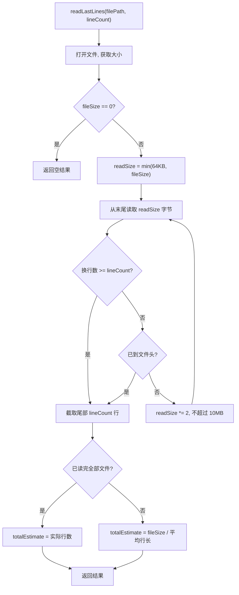

# LogsRoutes.ts 需求说明

> 源文件：src/services/worker/http/routes/LogsRoutes.ts ｜ 类型：源码 ｜ 行数：137 ｜ 所属模块：worker/http/routes ｜ 分析日期：2026-07-23

## 1. 文件定位总述

LogsRoutes 是日志查看与管理路由，提供当日日志文件的尾部读取和清空功能。它导出的 `readLastLines` 函数实现了高效的文件尾部读取算法（从文件末尾逐步扩展读取窗口，避免读取整个大文件），同时估算文件总行数供前端展示进度。路由层面提供 GET `/api/logs` 获取日志和 POST `/api/logs/clear` 清空日志两个端点。

## 2. 功能需求

| 编号 | 需求描述（系统应当…） | 触发条件 / 输入 | 处理规则与输出 | 证据 |
|------|----------------------|----------------|---------------|------|
| FR-GETLOGS-01 | 系统应当返回当日日志文件的尾部内容 | GET `/api/logs`，可选 `?lines=N`（默认 1000） | 从当日日志文件读取最后 N 行（上限 10000）；返回 logs 文本、文件路径、是否存在、总行数估算、实际返回行数 | `LogsRoutes.ts:88-113` |
| FR-CLEARLOGS-01 | 系统应当清空当日日志文件 | POST `/api/logs/clear` | 将当日日志文件写入空字符串；记录 info 日志标记"UI 清空"；文件不存在也返回成功 | `LogsRoutes.ts:115-136` |
| FR-READLAST-01 | 系统应当支持从文件末尾高效读取指定行数 | 调用 `readLastLines(filePath, lineCount)` | 从文件末尾开始逐步扩大读取窗口（64KB → 128KB → ... → 最大 10MB），直到收集到足够行数或到达文件头；返回行内容和总行数估算 | `LogsRoutes.ts:9-68` |
| FR-ESTIMATE-01 | 系统应当估算日志文件总行数 | 读取日志时 | 若已读完整个文件则用实际行数；否则用 `文件大小 / 平均行长度` 估算 | `LogsRoutes.ts:53-59` |

## 3. 业务规则与约束

- **日志文件路径**：`{CLAUDE_MEM_DATA_DIR}/logs/claude-mem-{YYYY-MM-DD}.log`，即每天一个日志文件 (`LogsRoutes.ts:71-76`)
- **行数上限硬编码**：请求行数上限 10000，超出部分被截断 (`LogsRoutes.ts:101`)
- **读取窗口扩展策略**：初始 64KB，每次翻倍，上限 10MB (`LogsRoutes.ts:19-20,42`)
- **空文件处理**：文件大小为 0 时返回空字符串和 totalEstimate=0 (`LogsRoutes.ts:15-16`)
- **清空操作幂等**：文件不存在时清空操作仍返回 success=true (`LogsRoutes.ts:118-124`)

## 4. 对外暴露

| 端点 | 方法 | 路径 | 说明 |
|------|------|------|------|
| 获取日志 | GET | `/api/logs?lines=N` | 返回当日日志尾部 |
| 清空日志 | POST | `/api/logs/clear` | 清空当日日志文件 |

| 导出函数 | 签名 | 说明 |
|---------|------|------|
| `readLastLines` | `(filePath, lineCount): {lines, totalEstimate}` | 高效文件尾部读取（可被其他模块复用） |

## 5. 依赖关系

- **继承**：`BaseRouteHandler`
- **配置依赖**：`SettingsDefaultsManager.get('CLAUDE_MEM_DATA_DIR')`（数据目录）
- **无数据库依赖**：纯文件系统操作

## 6. 数据结构

GET `/api/logs` 响应体：
```typescript
{ logs: string, path: string, exists: boolean, totalLines?: number, returnedLines?: number }
```
POST `/api/logs/clear` 响应体：
```typescript
{ success: boolean, message: string, path: string }
```

## 7. 复杂逻辑图示



## 8. 逆向备注

- `readLastLines` 被导出为模块级函数（非类方法），表明设计上预期被其他模块直接调用复用 (`LogsRoutes.ts:9`)。
- 读取窗口扩展使用倍增策略（64KB → 128KB → 256KB...），对大日志文件的尾部读取效率较高，避免了整体读取。
- 清空日志时使用 `writeFileSync(filePath, '', 'utf-8')` 而非 `unlinkSync`，保留了文件句柄以便正在写入的日志进程继续使用 (`LogsRoutes.ts:127`)。
