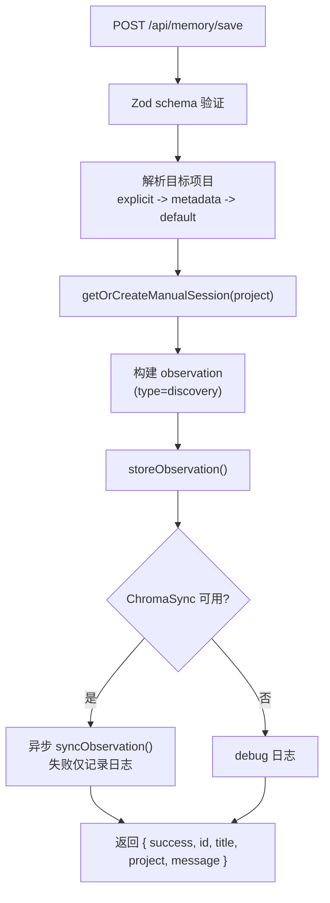

# MemoryRoutes.ts 需求说明

> 源文件：src/services/worker/http/routes/MemoryRoutes.ts | 类型：源码 | 行数：100 | 所属模块：worker/http/routes | 分析日期：2026-07-23

## 1. 文件定位总述

MemoryRoutes 是 Worker HTTP 层的手动记忆保存端点，提供 `POST /api/memory/save` 路由，允许外部系统（如 Viewer UI 或其他客户端）手动保存文本内容为观察记录。该端点经过 Zod schema 验证，支持指定项目名称和元数据，存储后可选同步到 Chroma 向量数据库。

## 2. 功能需求

| 编号 | 需求描述（系统应当…） | 触发条件 / 输入 | 处理规则与输出 | 证据 |
|------|----------------------|----------------|---------------|------|
| FR-Memory-01 | 系统应当提供手动保存记忆的 HTTP 端点 | HTTP POST `/api/memory/save`，body 经 Zod 验证 | 接收 `{ text (必填), title?, project?, metadata? }`，将文本保存为 type='discovery' 的观察记录 | `src/services/worker/http/routes/MemoryRoutes.ts:25-26` |
| FR-Memory-02 | 系统应当解析目标项目名称 | 请求 body 中的 project 或 metadata.project | 优先使用 body.project（显式指定），回退到 metadata.project，最后使用构造函数传入的 defaultProject | `src/services/worker/http/routes/MemoryRoutes.ts:30-36` |
| FR-Memory-03 | 系统应当自动生成标题 | title 未指定 | 取 text 前 60 个字符作为标题，超过 60 字符追加 '...' | `src/services/worker/http/routes/MemoryRoutes.ts:45` |
| FR-Memory-04 | 系统应当在存储成功后可选同步到 Chroma | ChromaSync 可用 | 异步调用 `chromaSync.syncObservation()`；Chroma 不可用时记录 debug 日志；同步失败仅记录 error 日志不阻断响应 | `src/services/worker/http/routes/MemoryRoutes.ts:69-90` |
| FR-Memory-05 | 系统应当返回存储结果 | 存储完成 | 返回 `{ success: true, id, title, project, message }` | `src/services/worker/http/routes/MemoryRoutes.ts:71-78,92-98` |

## 3. 业务规则与约束

- **输入验证**：使用 Zod schema 严格验证（`.strict()`），text 必须为非空白字符串。`src/services/worker/http/routes/MemoryRoutes.ts:9-14`
- **固定类型**：手动保存的观察固定使用 `type: 'discovery'`，subtitle 固定为 `'Manual memory'`。`src/services/worker/http/routes/MemoryRoutes.ts:44,46`
- **promptNumber 和 discoveryTokens 固定为 0**：手动保存无关联的 prompt 和 token 信息。`src/services/worker/http/routes/MemoryRoutes.ts:59`
- **Chroma 同步异步化**：Chroma 同步使用 `.catch()` 静默处理，不影响 HTTP 响应。`src/services/worker/http/routes/MemoryRoutes.ts:88-90`
- **元数据处理**：metadata 对象通过 `JSON.stringify` 转为字符串后存储在 observation 的 metadata 字段中。`src/services/worker/http/routes/MemoryRoutes.ts:52`

## 4. 对外暴露

| 名称 | 类型 | 说明 |
|------|------|------|
| `POST /api/memory/save` | HTTP 端点 | 手动保存记忆（body: `{ text, title?, project?, metadata? }`） |

## 5. 依赖关系

- **BaseRouteHandler**（`../BaseRouteHandler.js`）：路由基类
- **validateBody**（`../middleware/validateBody.js`）：Zod schema 验证中间件
- **DatabaseManager**（`../../DatabaseManager.js`）：提供 SessionStore 和 ChromaSync 访问
- **zod**：Schema 验证库

## 6. 数据结构

**请求 Body Schema**（Zod）：
```typescript
{
  text: string;               // 必填，非空白
  title?: string;
  project?: string;
  metadata?: Record<string, unknown>;
}
```

## 7. 复杂逻辑图示



手动保存流程经过输入验证、项目解析、会话创建、观察存储、可选 Chroma 同步五个步骤，最终返回存储结果。

## 8. 逆向备注

- `storeObservation` 调用时第 5、6 参数（promptNumber 和 discoveryTokens）均硬编码为 0，但 `syncObservation` 调用时也传入 0。这确保手动保存的观察在搜索结果中与其他自动观察的元数据格式一致。
