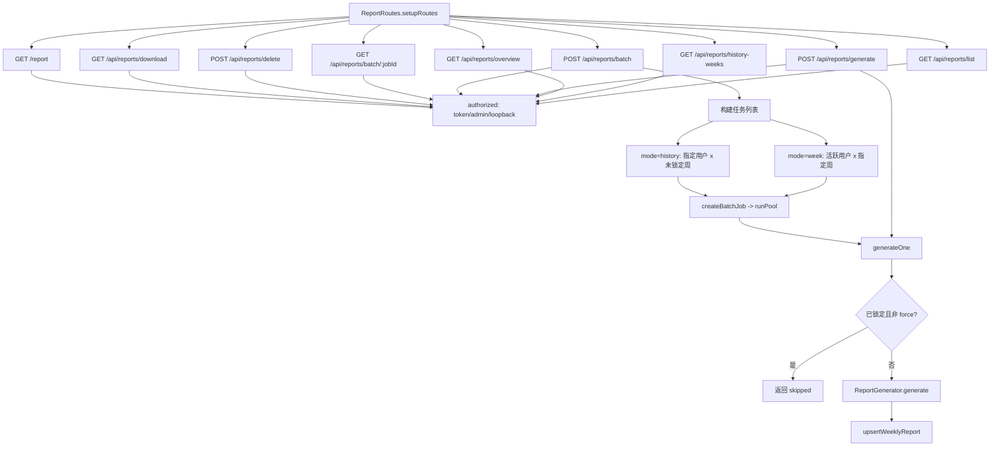

# ReportRoutes.ts 需求说明
> 源文件：src/services/worker/http/routes/ReportRoutes.ts ｜ 类型：源码 ｜ 行数：404 ｜ 所属模块：worker/http/routes ｜ 分析日期：2026-07-23

## 1. 文件定位总述

ReportRoutes 是 claude-mem 周报系统的后端接口层，提供周报的列表查询、单人生成/刷新、批量生成、删除、Markdown 下载以及服务端渲染的双栏 HTML 阅读页。它封装了从 ReportGenerator 到 batch 并发池的完整周报生成链路，支持按用户、按周维度操作，并集成了 timingSafeEqual 时间安全比较、AdminSession 管理以及 loopback 免认证等多层鉴权机制，服务于管理员统计页和用户周报阅读页两大前端视图。

## 2. 功能需求

| 编号 | 需求描述 | 触发条件 | 处理规则与输出 | 证据 `path:line` |
|------|---------|---------|---------------|-----------------|
| FR-01 | 周报列表查询 | `GET /api/reports/list?user=&tz=` | 查询该用户最近 12 份周报，返回 week_start、week_end、generated_at_epoch、complete（是否已锁定）、stats（解析 JSON）；需要鉴权 | `src/services/worker/http/routes/ReportRoutes.ts:51,99-119` |
| FR-02 | 历史周格查询 | `GET /api/reports/history-weeks?user=&tz=` | 查询该用户最近 26 周的周网格数据，每周标注 hasContent（是否有实际活动）、has_report（是否已生成）、complete（是否已锁定）、stats；需要鉴权 | `src/services/worker/http/routes/ReportRoutes.ts:52,208-247` |
| FR-03 | 用户周报总览 | `GET /api/reports/overview?week=&tz=` | 查询所有用户在指定周的周报状态（latest_week、has_current、hasContent、complete），支持 roster 全员列表（含无活动用户）；默认当前周，可通过 ?week= 指定；需要鉴权 | `src/services/worker/http/routes/ReportRoutes.ts:53,123-164` |
| FR-04 | 单人周报生成/刷新 | `POST /api/reports/generate` | Body: { user, week?, tz?, force? }；除非 force=true，已锁定（complete）的周报跳过不重新生成；调用 ReportGenerator.generate() 后 UPSERT 到数据库；返回 { ok, outcome, skipped, week_start }；需要鉴权 | `src/services/worker/http/routes/ReportRoutes.ts:54,191-262` |
| FR-05 | 批量周报生成 | `POST /api/reports/batch` | Body: { mode, week?, user?, tz?, force? }；mode=week 生成该周所有活跃用户周报；mode=history 生成该用户所有未锁定的历史周报；返回 { jobId, total } 供客户端轮询；需要鉴权 | `src/services/worker/http/routes/ReportRoutes.ts:55,269-298` |
| FR-06 | 批量任务状态查询 | `GET /api/reports/batch/:jobId` | 返回指定批量任务的状态（id、total、completed、skipped、results 等）；任务不存在返回 404；需要鉴权 | `src/services/worker/http/routes/ReportRoutes.ts:56,300-306` |
| FR-07 | 周报删除 | `POST /api/reports/delete` | Body: { user, week }；按 user_label + week_start 删除周报，返回 { ok, deleted }；需要鉴权 | `src/services/worker/http/routes/ReportRoutes.ts:57,173-184` |
| FR-08 | Markdown 下载 | `GET /api/reports/download?user=&week=&token=` | 返回原始 Markdown 内容，Content-Type 为 text/markdown，文件名格式"周报-YYYY-MM-DD-user.md"；需要鉴权（支持 query 参数 token） | `src/services/worker/http/routes/ReportRoutes.ts:58,309-320` |
| FR-09 | 周报整页渲染 | `GET /report?user=&week=&token=` | 服务端渲染完整 HTML 页面：双栏布局（左=上一周、右=当周），支持暗色/亮色主题跟随系统、Markdown 转 HTML 渲染、下载按钮；需要鉴权（支持 query 参数 token） | `src/services/worker/http/routes/ReportRoutes.ts:59,323-403` |
| FR-10 | 鉴权控制 | 所有端点请求时 | standalone 模式直通；server 模式依次尝试：Bearer token（timingSafeEqual 256字节比较）、AdminSession 验证、loopback 免认证（127.0.0.1 自动登录） | `src/services/worker/http/routes/ReportRoutes.ts:63-78` |
| FR-11 | 时区偏移计算 | 涉及周计算的端点 | 从 ?tz= 查询参数解析（分钟数），默认使用服务器本地时区偏移；用于将日期转换为 UTC epoch 区间 | `src/services/worker/http/routes/ReportRoutes.ts:80-84` |
| FR-12 | 周报锁定判断 | 列表/总览/历史格查询时 | 调用 isPeriodComplete(generated_at_epoch, weekEndEpoch) 判断周报生成时间是否在周结束后（已锁定=不可刷新） | `src/services/worker/http/routes/ReportRoutes.ts:115,192-194,231,160` |

## 3. 业务规则与约束

1. **列表限制**：周报列表最多返回 12 条记录（LIST_LIMIT = 12）（`ReportRoutes.ts:31`）。
2. **历史格范围**：History 页面枚举最近 26 周（HISTORY_WEEKS = 26）（`ReportRoutes.ts:33`）。
3. **周格式校验**：所有涉及 week 参数的端点使用正则 `/^\d{4}-\d{2}-\d{2}$/` 校验日期格式（`ReportRoutes.ts:30`）。
4. **批量任务异步执行**：POST /api/reports/batch 立即返回 jobId，实际生成在后台通过 runPool 并发执行，不阻塞 HTTP 响应（`ReportRoutes.ts:291-298`）。
5. **空内容周过滤**：批量生成时，activeUsersInRange 只选取有实际活动的用户；历史模式中 hasContent=false 的周不进入任务队列（`ReportRoutes.ts:282-289`）。
6. **周报模型配置**：AI 模型从 settings.json 的 CLAUDE_MEM_WEEKLY_REPORT_MODEL 读取，默认 qwen-plus（`ReportRoutes.ts:86-90`）。
7. **Roster 全员列表**：overview 端点合并数据库中所有有周报记录的用户和 rosterAllUsers 返回的全员集合，确保无活动用户也能在表格中显示（灰化）（`ReportRoutes.ts:151`）。
8. **双栏始终渲染**：即使上一周无周报，仍渲染左栏空内容区（`ReportRoutes.ts:357`）。
9. **鉴权 401 返回 HTML**：/report 端点鉴权失败时返回 HTML 格式错误页而非 JSON（`ReportRoutes.ts:324`）。

## 4. 对外暴露

| 类别 | 名称 | 类型 | 说明 |
|------|------|------|------|
| HTTP 端点 | `GET /api/reports/list` | REST API | 周报列表（最近12条） |
| HTTP 端点 | `GET /api/reports/history-weeks` | REST API | 历史26周网格数据 |
| HTTP 端点 | `GET /api/reports/overview` | REST API | 用户周报总览（供统计页） |
| HTTP 端点 | `POST /api/reports/generate` | REST API | 单人周报生成/刷新 |
| HTTP 端点 | `POST /api/reports/batch` | REST API | 批量周报生成 |
| HTTP 端点 | `GET /api/reports/batch/:jobId` | REST API | 批量任务状态 |
| HTTP 端点 | `POST /api/reports/delete` | REST API | 删除周报 |
| HTTP 端点 | `GET /api/reports/download` | REST API | Markdown 下载 |
| HTTP 端点 | `GET /report` | HTML Page | 周报双栏阅读页 |
| 导出类 | `ReportRoutes` | class | 继承 BaseRouteHandler |

## 5. 依赖关系

**上游导入**：
- `express`, `timingSafeEqual` from `crypto` -- Web 框架与安全比较（`ReportRoutes.ts:1-2`）
- `logger` -- 日志（`ReportRoutes.ts:3`）
- `BaseRouteHandler` -- 路由基类（`ReportRoutes.ts:4`）
- `DatabaseManager` -- 数据库连接（`ReportRoutes.ts:5`）
- `AdminSessionStore`, `extractBearerToken` -- 管理员会话与 token 提取（`ReportRoutes.ts:6`）
- `SettingsDefaultsManager`, `USER_SETTINGS_PATH` -- 配置读取（`ReportRoutes.ts:7-8`）
- `ReportGenerator`, `upsertWeeklyReport`, `weekMondayOf` -- 周报生成器（`ReportRoutes.ts:9`）
- `mdToHtml` -- Markdown 转 HTML（`ReportRoutes.ts:10`）
- `loopbackBypassAllowed` -- loopback 免认证（`ReportRoutes.ts:11`）
- `runPool`, `batchConcurrency`, `createBatchJob`, `recordOutcome`, `finishBatchJob`, `getBatchJob`, `weekEndEpoch`, `isPeriodComplete`, `rosterAllUsers`, `activeUsersInRange`, `userHasActivity` -- 批量处理工具集（`ReportRoutes.ts:12-15`）

**下游调用方**：由 Worker Service 在 setupRoutes 阶段注册到 Express app，前端统计页和周报阅读页调用。

## 6. 数据结构

**ReportRow**（数据库行映射）：
```
{ user_label: string, week_start: string, week_end: string, markdown: string, stats: string|null(JSON), model: string|null, generated_at_epoch: number }
```

**周报列表项**（API 返回）：
```
{ week_start, week_end, generated_at_epoch, complete: boolean, stats: DailyReportStats|null }
```

**overview 用户条目**：
```
{ latest_week: string, has_current: boolean, hasContent: boolean, complete: boolean }
```

**历史周格条目**：
```
{ week_start, week_end, hasContent: boolean, complete: boolean, has_report: boolean, generated_at_epoch: number|null, stats: unknown }
```

## 7. 复杂逻辑图示



## 8. 逆向备注

1. **鉴权方式不一致**：大部分端点鉴权失败使用 this.unauthorized(res) 方法，但 /report 端点直接内联 HTML 返回 401 页面，绕过了基类的标准错误处理（`ReportRoutes.ts:324`）。
2. **/report 无分栏切换**：single 变量硬编码为 false（`ReportRoutes.ts:357`），模板中虽支持单栏布局但永远不触发。
3. **overview has_current 语义偏差**：字段名为 has_current 但实际含义是"指定周是否有周报"而非字面的"当前周"，注释中解释了向后兼容原因（`ReportRoutes.ts:133-134`）。
4. **HTML 模板内联**：整页 HTML（含 CSS 样式）以模板字符串硬编码在 renderPage 方法中，超过 50 行，维护性和可读性较差（`ReportRoutes.ts:338-403`）。
