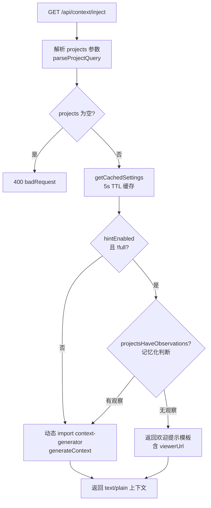
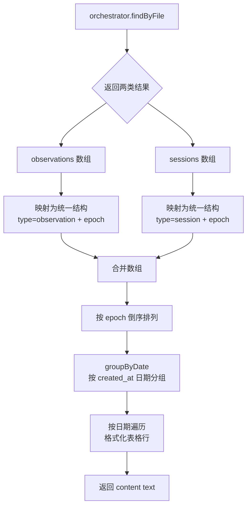

# SearchRoutes.ts 需求说明

> 源文件：src/services/worker/http/routes/SearchRoutes.ts ｜ 类型：源码 ｜ 行数：576 ｜ 所属模块：worker/http/routes ｜ 分析日期：2026-07-23

## 1. 文件定位总述

本文件是 claude-mem Worker 的搜索与上下文注入路由控制器，注册 18 条 GET/POST 端点，构成系统的记忆检索 API 层。它承担三组核心能力：统一搜索（观察/会话/提示词的全文检索与多维筛选）、上下文管理（最近上下文、时间线、预览、注入、语义匹配），以及引导帮助（how-it-works、API help）。该控制器是 Worker HTTP 服务器中端点数量最多的路由模块，是前端 Viewer UI、mem-search skill、context-inject hook 以及外部集成调用记忆数据的主要入口。文件内还包含带 TTL 缓存的设置读取器、项目活跃度记忆化判断、LAN IP 发现等工具函数。

## 2. 功能需求

### 2.1 统一搜索

| 编号 | 需求描述（系统应当…） | 触发条件 / 输入 | 处理规则与输出 | 证据 |
|------|----------------------|----------------|---------------|------|
| FR-SR-01 | 系统应当提供统一搜索入口，支持跨类型（观察/会话/提示词）的全文检索 | GET /api/search?q=&type=&project=&limit=&format= | 委托 searchManager.search 处理，返回 JSON | `src/services/worker/http/routes/SearchRoutes.ts:132,156-159` |
| FR-SR-02 | 系统应当提供统一时间线接口，按时间排序返回记忆事件 | GET /api/timeline?anchor=&depth_before=&depth_after=&project= | 委托 searchManager.timeline 处理，返回 JSON | `src/services/worker/http/routes/SearchRoutes.ts:133,161-164` |
| FR-SR-03 | 系统应当提供决策记录搜索接口 | GET /api/decisions | 委托 searchManager.decisions 处理 | `src/services/worker/http/routes/SearchRoutes.ts:134,166-169` |
| FR-SR-04 | 系统应当提供变更记录搜索接口 | GET /api/changes | 委托 searchManager.changes 处理 | `src/services/worker/http/routes/SearchRoutes.ts:135,171-174` |
| FR-SR-05 | 系统应当提供系统工作原理说明接口 | GET /api/how-it-works | 委托 searchManager.howItWorks 处理 | `src/services/worker/http/routes/SearchRoutes.ts:136,176-179` |

### 2.2 细分搜索

| 编号 | 需求描述（系统应当…） | 触发条件 / 输入 | 处理规则与输出 | 证据 |
|------|----------------------|----------------|---------------|------|
| FR-SR-06 | 系统应当支持按观察类型搜索，返回匹配的观察列表 | GET /api/search/observations?q=&limit=&project= | 委托 searchManager.searchObservations | `src/services/worker/http/routes/SearchRoutes.ts:138,181-184` |
| FR-SR-07 | 系统应当支持按会话摘要搜索 | GET /api/search/sessions?q=&limit= | 委托 searchManager.searchSessions | `src/services/worker/http/routes/SearchRoutes.ts:139,186-189` |
| FR-SR-08 | 系统应当支持按用户提示词搜索 | GET /api/search/prompts?q=&limit=&project= | 委托 searchManager.searchUserPrompts | `src/services/worker/http/routes/SearchRoutes.ts:140,191-194` |
| FR-SR-09 | 系统应当支持按概念标签搜索观察，支持多值输入时取首值 | GET /api/search/by-concept?concepts=&limit=&project= | 从 orchestrator.findByConcept 获取结果，格式化为文本表格返回 | `src/services/worker/http/routes/SearchRoutes.ts:141,196-223` |
| FR-SR-10 | 系统应当支持按文件路径搜索，合并观察和会话结果按时间倒序排列，按日期分组 | GET /api/search/by-file?filePath=&limit=&project= | orchestrator.findByFile 返回 observations + sessions；合并排序后按日期分组输出 | `src/services/worker/http/routes/SearchRoutes.ts:142,225-296` |
| FR-SR-11 | 系统应当支持按观察类型（discovery/bugfix/feature 等）搜索，支持逗号分隔多类型 | GET /api/search/by-type?type=&limit=&project= | 类型参数支持逗号分隔字符串或数组；orchestrator.findByType 查询 | `src/services/worker/http/routes/SearchRoutes.ts:143,298-329` |

### 2.3 上下文管理

| 编号 | 需求描述（系统应当…） | 触发条件 / 输入 | 处理规则与输出 | 证据 |
|------|----------------------|----------------|---------------|------|
| FR-SR-12 | 系统应当提供最近上下文查询接口，返回最近会话的摘要和观察 | GET /api/context/recent?project=&limit= | 委托 searchManager.getRecentContext | `src/services/worker/http/routes/SearchRoutes.ts:145,331-334` |
| FR-SR-13 | 系统应当提供上下文时间线接口，以锚点为中心返回前后事件 | GET /api/context/timeline?anchor=&depth_before=&depth_after=&project= | 委托 searchManager.getContextTimeline | `src/services/worker/http/routes/SearchRoutes.ts:146,336-339` |
| FR-SR-14 | 系统应当提供上下文预览接口，以指定项目名生成纯文本上下文供预览 | GET /api/context/preview?project= | 动态 import context-generator，生成上下文以 text/plain 返回 | `src/services/worker/http/routes/SearchRoutes.ts:147,341-364` |
| FR-SR-15 | 系统应当提供上下文注入接口，根据配置和项目观察数量决定返回欢迎提示还是实际上下文 | GET /api/context/inject?projects=&project=&colors=&full= | 当 CLAUDE_MEM_WELCOME_HINT_ENABLED 且项目无观察时返回欢迎提示；否则调用 context-generator 生成真实上下文 | `src/services/worker/http/routes/SearchRoutes.ts:148,366-409` |
| FR-SR-16 | 系统应当提供语义上下文匹配接口，通过查询关键词检索相关观察并格式化为 Markdown | POST /api/context/semantic, body: {q, project, limit} | 查询长度 < 20 字符直接返回空；委托 searchManager.search 做 observations 类型检索；格式化为 Markdown 标题列表 | `src/services/worker/http/routes/SearchRoutes.ts:149,411-448` |

### 2.4 引导与帮助

| 编号 | 需求描述（系统应当…） | 触发条件 / 输入 | 处理规则与输出 | 证据 |
|------|----------------------|----------------|---------------|------|
| FR-SR-17 | 系统应当提供入门引导说明文档接口，返回缓存的 onboarding-explainer.md | GET /api/onboarding/explainer | 启动时一次性读取文件并缓存；文件不存在则 404 | `src/services/worker/http/routes/SearchRoutes.ts:150,450-457` |
| FR-SR-18 | 系统应当提供基于查询的时间线接口，先搜索最佳匹配再围绕匹配点展开时间线 | GET /api/timeline/by-query?query=&mode=&depth_before=&depth_after=&project= | 委托 searchManager.getTimelineByQuery | `src/services/worker/http/routes/SearchRoutes.ts:152,459-462` |
| FR-SR-19 | 系统应当提供 API 帮助文档接口，返回所有搜索端点的路径、方法、参数和使用示例 | GET /api/search/help | 构建静态 JSON 响应，包含所有端点描述和 curl 示例 | `src/services/worker/http/routes/SearchRoutes.ts:153,464-574` |

## 3. 业务规则与约束

1. **设置缓存 TTL**：settings.json 读取带 5 秒 TTL 缓存，避免高频调用（PostToolUse 在每次 Read/Edit 后触发）时重复磁盘 I/O。`src/services/worker/http/routes/SearchRoutes.ts:42-60`
2. **项目活跃度记忆化**：projectsKnownNonEmpty Set 缓存"项目有观察"的判断结果——一旦某项目有观察则永久缓存为 true（观察只增不减），零计数结果每次重新查询。`src/services/worker/http/routes/SearchRoutes.ts:66-81`
3. **欢迎提示开关**：context/inject 在 settings 中 CLAUDE_MEM_WELCOME_HINT_ENABLED=true 且项目无观察时返回引导提示而非实际上下文；full=true 跳过欢迎提示直接生成上下文。`src/services/worker/http/routes/SearchRoutes.ts:377-389`
4. **语义查询最小长度**：context/semantic 要求查询文本长度 >= 20，短查询直接返回空结果。`src/services/worker/http/routes/SearchRoutes.ts:416-417`
5. **语义查询限流**：limit 参数被钳制在 [1, 20] 范围，默认 5。`src/services/worker/http/routes/SearchRoutes.ts:414`
6. **多值参数处理**：by-concept 取数组首值；by-file 取数组首值或逗号分隔的首项；by-type 支持逗号分隔多类型。`src/services/worker/http/routes/SearchRoutes.ts:201,231-234,303-306`
7. **onboarding 文件缓存**：onboarding-explainer.md 在 Worker 启动时一次性读入内存，后续请求直接返回缓存内容，文件不存在时启动时记录 debug 日志，请求时返回 404。`src/services/worker/http/routes/SearchRoutes.ts:20-35`
8. **LAN IP 发现**：buildViewerUrl 函数自动发现非内部 IPv4 地址用于生成局域网访问 URL，供欢迎提示中显示。`src/services/worker/http/routes/SearchRoutes.ts:83-102`
9. **context-inject 的 projects 参数**：支持 ?projects=proj1,proj2 或 ?project=xxx 两种传参方式，由 parseProjectQuery 统一处理。`src/services/worker/http/routes/SearchRoutes.ts:369`

## 4. 对外暴露

### HTTP 端点（共 18 个）

| 方法 | 路径 | 功能 | 主要参数 |
|------|------|------|---------|
| GET | /api/search | 统一搜索 | q, type, project, limit, format |
| GET | /api/timeline | 统一时间线 | anchor, depth_before, depth_after, project |
| GET | /api/decisions | 决策搜索 | (继承 searchManager 参数) |
| GET | /api/changes | 变更搜索 | (继承 searchManager 参数) |
| GET | /api/how-it-works | 工作原理 | (继承 searchManager 参数) |
| GET | /api/search/observations | 观察搜索 | query, limit, project |
| GET | /api/search/sessions | 会话搜索 | query, limit |
| GET | /api/search/prompts | 提示词搜索 | query, limit, project |
| GET | /api/search/by-concept | 按概念搜索 | concepts/concept, limit, project |
| GET | /api/search/by-file | 按文件搜索 | filePath/files, limit, project |
| GET | /api/search/by-type | 按类型搜索 | type, limit, project |
| GET | /api/context/recent | 最近上下文 | project, limit |
| GET | /api/context/timeline | 上下文时间线 | anchor, depth_before, depth_after, project |
| GET | /api/context/preview | 上下文预览 | project |
| GET | /api/context/inject | 上下文注入 | projects/project, colors, full |
| POST | /api/context/semantic | 语义匹配 | body: {q, project, limit} |
| GET | /api/onboarding/explainer | 入门说明 | — |
| GET | /api/timeline/by-query | 基于查询的时间线 | query, mode, depth_before, depth_after, project |
| GET | /api/search/help | API 帮助 | — |

### 模块级导出

| 导出项 | 类型 | 说明 |
|--------|------|------|
| `SearchRoutes` | class | 搜索路由控制器 |
| `resetSettingsCache` | function | 重置设置缓存（供测试使用） | `src/services/worker/http/routes/SearchRoutes.ts:46-50` |

## 5. 依赖关系

- **上游依赖**：
  - `../../SearchManager.js`（SearchManager）— 核心搜索业务委托对象
  - `../BaseRouteHandler.js`（BaseRouteHandler）— 路由基类
  - `../middleware/validateBody.js`（validateBody）— Zod schema 校验中间件
  - `../../../context/ObservationCompiler.js`（countObservationsByProjects）— 观察计数
  - `../../../context-generator.js`（generateContext，动态 import）— 上下文生成
  - `../../../../shared/timeline-formatting.js`（groupByDate）— 时间线分组
  - `../../../../shared/SettingsDefaultsManager.js` — 配置读取
  - `../../../../shared/query-utils.js`（parseProjectQuery）— 项目查询解析
  - `../../../../shared/paths.js`（USER_SETTINGS_PATH）— 路径常量
  - `../../../sqlite/types.js`（ObservationSearchResult, SessionSummarySearchResult）— 类型定义
  - `zod` — schema 校验

- **下游消费者**：被 Worker HTTP 服务器注册，供前端 Viewer UI、mem-search skill、context-inject hook、PostToolUse hook 调用

## 6. 数据结构

### semanticContextSchema（Zod）

```
{
  q: string (optional),        // 搜索查询
  project: string (optional),  // 项目过滤
  limit: string|number (optional) // 结果数量
}
// 使用 .passthrough() 允许额外字段
```

### 语义上下文响应

```
{
  context: string,  // Markdown 格式的相关记忆
  count: number     // 匹配观察数
}
```

### by-file 响应（合并结果排序后按日期分组）

```
{
  content: [{
    type: 'text',
    text: string  // 格式化文本：标题 + 按日期分组的表格行
  }]
}
```

## 7. 复杂逻辑图示

下图展示 /api/context/inject 端点的完整决策流程，包含欢迎提示分支和实际上下文生成分支：



by-file 搜索结果合并与分组流程：



## 8. 逆向备注

1. **context-generator 动态 import**：handleContextPreview 和 handleContextInject 均使用 `await import('../../../context-generator.js')` 动态导入，推断是为了避免循环依赖或减少启动时的模块加载量。`src/services/worker/http/routes/SearchRoutes.ts:349,392`
2. **handleContextInject 的 forHuman 参数命名混淆**：URL 参数名 colors=true 实际含义是"为人类渲染（带颜色）"，而非纯粹的颜色控制，映射到 forHuman 变量。`src/services/worker/http/routes/SearchRoutes.ts:367`
3. **by-file 和 by-concept 返回格式不一致**：by-concept 返回 `{ content: [{ type: 'text', text: ... }] }` Claude 工具格式；by-file 也返回相同格式；而统一搜索端点（/api/search）直接返回 searchManager 的原始 JSON。推断统一搜索面向 Viewer UI，而 by-* 端点面向 Claude Code skill 的工具调用格式。`src/services/worker/http/routes/SearchRoutes.ts:207-223,249-295`
4. **handleSearchHelp 的 baseUrl 硬编码 http**：构建 curl 示例时使用 `http://${req.headers.host}`，未考虑 HTTPS 代理场景。推断 Viewer 通常通过本地 HTTP 访问，故无需 HTTPS。`src/services/worker/http/routes/SearchRoutes.ts:465`
5. **projectsKnownNonEmpty 永不缩减**：该 Set 只增不减，如果项目数据被清除（如数据库重置），缓存会导致错误的"有观察"判断。resetSettingsCache 中虽清除了该 Set，但仅在被显式调用时生效。`src/services/worker/http/routes/SearchRoutes.ts:49,66-81`
6. **handleSemanticContext 的 query 来源**：同时检查 req.body.q 和 req.query.q，支持 GET 和 POST 两种传参方式。但路由注册为 POST，推断 GET 参数可能用于调试或向后兼容。`src/services/worker/http/routes/SearchRoutes.ts:412-413`
7. **search/help 中缺少 context/semantic、context/inject、context/preview、onboarding/explainer、decisions、changes、how-it-works、timeline/by-query 等端点的文档**：help 端点仅记录了 11 个搜索/上下文端点，遗漏了本文件注册的其余 7 个端点。推断 help 文档在新增端点时未同步更新。`src/services/worker/http/routes/SearchRoutes.ts:464-574`
