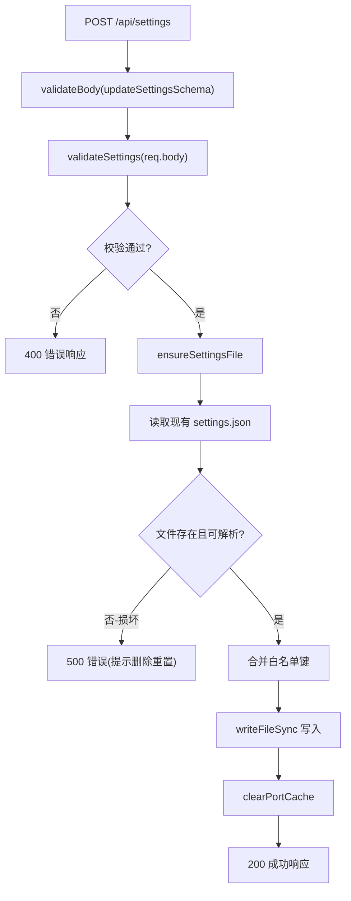
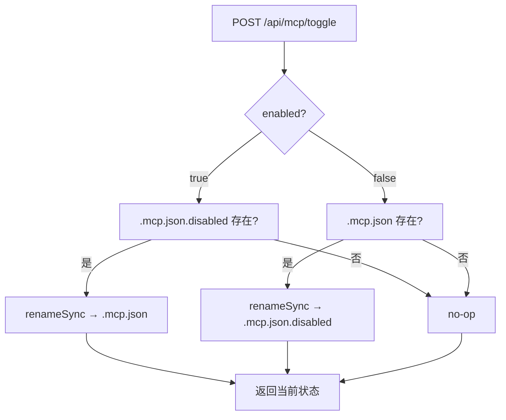

# SettingsRoutes.ts 需求说明

> 源文件：src/services/worker/http/routes/SettingsRoutes.ts ｜ 类型：源码 ｜ 行数：358 ｜ 所属模块：worker/http/routes ｜ 分析日期：2026-07-23

## 1. 文件定位总述

本文件是 Worker HTTP 服务器的设置管理路由控制器，继承自 `BaseRouteHandler`，注册 7 个 API 端点用于读写用户设置、切换 MCP 搜索服务状态、以及管理插件分支切换和更新。它直接操作 `~/.claude-mem/settings.json` 文件进行持久化，并通过 Zod schema 进行请求体校验。设置项涵盖 AI 提供商配置、上下文注入参数、工作端口等 30+ 个键，每个键在更新时均执行独立的格式和范围校验。

## 2. 功能需求

| 编号 | 需求描述（系统应当…） | 触发条件 / 输入 | 处理规则与输出 | 证据 |
|------|----------------------|----------------|---------------|------|
| FR-SR-01 | 系统应当提供 `GET /api/settings` 端点返回当前设置。 | 无参数。 | 若 settings.json 不存在则自动创建含默认值的文件；返回完整设置 JSON。 | `src/services/worker/http/routes/SettingsRoutes.ts:48-53` |
| FR-SR-02 | 系统应当提供 `POST /api/settings` 端点更新设置，仅接受白名单中的键。 | 请求体中包含 30+ 个预定义设置键的子集。 | 仅处理白名单 `settingKeys` 中出现的键（`src/services/worker/http/routes/SettingsRoutes.ts:84-118`）；读取现有 settings 文件并合并更新。 | `src/services/worker/http/routes/SettingsRoutes.ts:55-131` |
| FR-SR-03 | 系统应当在更新设置前对所有键执行格式和范围校验。 | POST /api/settings 请求。 | 校验规则：PROVIDER 枚举、AUTH_METHOD 枚举、GEMINI_MODEL 枚举、数值范围（端口 1024-65535、max_tokens 1000-1000000 等）、布尔格式、URL 合法性、日志级别枚举等。失败返回 400。 | `src/services/worker/http/routes/SettingsRoutes.ts:190-321` |
| FR-SR-04 | 系统应当在设置文件损坏时返回 500 错误并提示用户删除文件重置。 | settings.json 解析失败。 | 返回 `{ success: false, error: "Settings file is corrupted..." }`。 | `src/services/worker/http/routes/SettingsRoutes.ts:73-80` |
| FR-SR-05 | 系统应当在设置更新后清除端口缓存。 | POST /api/settings 成功。 | 调用 `clearPortCache()` 确保下次使用新端口配置。 | `src/services/worker/http/routes/SettingsRoutes.ts:128` |
| FR-SR-06 | 系统应当提供 `GET /api/mcp/status` 端点检查 MCP 搜索服务是否启用。 | 无参数。 | 通过检查 `plugin/.mcp.json` 文件是否存在判断状态。 | `src/services/worker/http/routes/SettingsRoutes.ts:134-137` |
| FR-SR-07 | 系统应当提供 `POST /api/mcp/toggle` 端点启用/禁用 MCP 搜索服务。 | 请求体 `{ enabled: boolean }`。 | 启用时将 `.mcp.json.disabled` 重命名为 `.mcp.json`；禁用时反之。 | `src/services/worker/http/routes/SettingsRoutes.ts:139-144, 329-343` |
| FR-SR-08 | 系统应当提供 `GET /api/branch/status` 端点获取当前分支信息。 | 无参数。 | 调用 `getBranchInfo()` 返回分支详情。 | `src/services/worker/http/routes/SettingsRoutes.ts:146-149` |
| FR-SR-09 | 系统应当提供 `POST /api/branch/switch` 端点切换到指定分支。 | 请求体 `{ branch: string }`。 | 仅允许 `main`、`beta/7.0`、`feature/bun-executable` 三个分支。成功后通过 `flushResponseThen` 刷新响应后重启 worker。 | `src/services/worker/http/routes/SettingsRoutes.ts:151-174` |
| FR-SR-10 | 系统应当提供 `POST /api/branch/update` 端点拉取最新代码。 | 无请求体参数。 | 调用 `pullUpdates()`，成功后通过 `flushResponseThen` 刷新响应后重启 worker。 | `src/services/worker/http/routes/SettingsRoutes.ts:176-188` |

## 3. 业务规则与约束

- **BR-SR-01** 设置键白名单包含 30+ 个键，涵盖：模型选择、提供商配置、上下文参数、工作端口/主机、日志级别、Python 版本等。`src/services/worker/http/routes/SettingsRoutes.ts:84-118`
- **BR-SR-02** 允许的 AI 提供商仅限 `claude`、`gemini`、`openrouter`。`src/services/worker/http/routes/SettingsRoutes.ts:192-195`
- **BR-SR-03** Claude 认证方式仅限 `subscription`、`api-key`、`gateway`、`cli`。`src/services/worker/http/routes/SettingsRoutes.ts:198-203`
- **BR-SR-04** 允许的 Gemini 模型仅限 `gemini-2.5-flash-lite`、`gemini-2.5-flash`、`gemini-3-flash-preview`。`src/services/worker/http/routes/SettingsRoutes.ts:205-210`
- **BR-SR-05** 工作端口范围 1024-65535。`src/services/worker/http/routes/SettingsRoutes.ts:233-238`
- **BR-SR-06** 工作主机仅允许 IP 地址格式（127.0.0.1、0.0.0.0、localhost 或 IPv4 地址）。`src/services/worker/http/routes/SettingsRoutes.ts:241-245`
- **BR-SR-07** 上下文观察数范围 1-200。`src/services/worker/http/routes/SettingsRoutes.ts:227-230`
- **BR-SR-08** MCP 启用/禁用通过文件重命名实现（`.mcp.json` ↔ `.mcp.json.disabled`）。`src/services/worker/http/routes/SettingsRoutes.ts:334-341`
- **BR-SR-09** 分支切换允许列表：`main`、`beta/7.0`、`feature/bun-executable`。`src/services/worker/http/routes/SettingsRoutes.ts:154`
- **BR-SR-10** 所有布尔设置键的值必须是字符串 `'true'` 或 `'false'`。`src/services/worker/http/routes/SettingsRoutes.ts:271-275`

## 4. 对外暴露

| 暴露项 | 类型 | 说明 |
|--------|------|------|
| `SettingsRoutes` | class（extends BaseRouteHandler） | 路由控制器 |
| `GET /api/settings` | HTTP endpoint | 读取设置 |
| `POST /api/settings` | HTTP endpoint | 更新设置 |
| `GET /api/mcp/status` | HTTP endpoint | MCP 状态 |
| `POST /api/mcp/toggle` | HTTP endpoint | MCP 启用/禁用 |
| `GET /api/branch/status` | HTTP endpoint | 分支信息 |
| `POST /api/branch/switch` | HTTP endpoint | 切换分支 |
| `POST /api/branch/update` | HTTP endpoint | 拉取更新 |

## 5. 依赖关系

| 依赖方 | 被依赖方 | 关系 |
|--------|---------|------|
| SettingsRoutes.ts | `BaseRouteHandler` | 基类，提供 `wrapHandler` 方法 |
| SettingsRoutes.ts | `validateBody` middleware | Zod schema 请求体校验 |
| SettingsRoutes.ts | `SettingsManager` | 构造函数注入 |
| SettingsRoutes.ts | `SettingsDefaultsManager` | 加载默认设置和文件 |
| SettingsRoutes.ts | `BranchManager` | 分支切换和更新 |
| SettingsRoutes.ts | `ModeManager` | 导入但未在路由中直接使用 |
| SettingsRoutes.ts | `flushResponseThen` | 分支操作后刷新响应 |
| SettingsRoutes.ts | `worker-utils.ts` (`clearPortCache`) | 端口缓存清理 |

## 6. 数据结构

Zod schemas（`src/services/worker/http/routes/SettingsRoutes.ts:17-27`）：

| Schema | 用途 | 校验规则 |
|--------|------|---------|
| `updateSettingsSchema` | POST /api/settings | `z.object({}).passthrough()` — 透传所有键，由 `validateSettings` 方法做业务校验 |
| `toggleMcpSchema` | POST /api/mcp/toggle | `enabled: z.boolean()` |
| `switchBranchSchema` | POST /api/branch/switch | `branch: z.string().min(1)` |
| `updateBranchSchema` | POST /api/branch/update | `z.object({}).passthrough()` — 无体约束 |

## 7. 复杂逻辑图示

上图展示了设置更新的核心校验链：从 Zod schema 透传到业务级逐键校验，再到文件读写和缓存清理。

上图展示了 MCP 启用/禁用通过文件重命名实现的逻辑。

## 8. 逆向备注

- `ModeManager` 被导入但未在当前路由处理器中使用，推断可能是预留依赖或之前版本遗留。
- 分支切换和更新成功后使用 `flushResponseThen` 而非直接重启，推断是为了确保 HTTP 响应先发送完毕再触发 worker 进程重启，避免连接中断。
- 设置校验采用"方法内逐键 if 判断"模式而非 Zod 细粒度 schema，推断是为了保持单一 schema 的灵活性同时通过代码逻辑控制校验。
