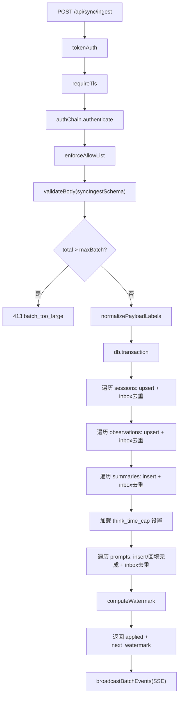

# SyncRoutes.ts 需求说明
> 源文件：src/services/worker/http/routes/SyncRoutes.ts ｜ 类型：源码 ｜ 行数：599 ｜ 所属模块：worker/http/routes ｜ 分析日期：2026-07-23

## 1. 文件定位总述

SyncRoutes 是 claude-mem 服务端数据同步的核心入口，负责接收远程客户端推送的批量记忆数据（会话、观察、总结、提示词），经过多层安全校验后在单事务内完成去重写入，并通过 SSE 实时通知前端刷新。该路由仅暴露 `POST /api/sync/ingest` 一个端点，采用可配置的中间件链（TLS 强制、认证策略、用户白名单、请求体校验）实现运维可控的安全边界，服务于多用户、多客户端、跨设备的数据聚合场景。

## 2. 功能需求

| 编号 | 需求描述 | 触发条件 | 处理规则与输出 | 证据 `path:line` |
|------|---------|---------|---------------|-----------------|
| FR-01 | 批量数据摄入（Ingest） | 客户端发送 `POST /api/sync/ingest`，请求体符合 `syncIngestSchema` 校验 | 验证总记录数不超过 `maxBatch`，在单 SQLite 事务中对四张表（sdk_sessions、observations、session_summaries、user_prompts）执行 upsert + inbox 去重写入，返回 `{ applied, next_watermark }`；事务内任何错误全部回滚 | `src/services/worker/http/routes/SyncRoutes.ts:184-203` |
| FR-02 | TLS 强制校验 | 配置项 `CLAUDE_MEM_SERVER_REQUIRE_TLS=true` | 检查请求协议是否为 HTTPS（支持 `x-forwarded-proto` 代理头），非 HTTPS 返回 400 `{ error: 'tls_required' }` | `src/services/worker/http/routes/SyncRoutes.ts:148-164` |
| FR-03 | 多策略认证 | `CLAUDE_MEM_SERVER_AUTH_MODE` 配置的认证链 | 通过 `buildAuthChain` 构建的认证策略链对请求逐一验证，通过则放行，失败返回 401 `{ error: 'unauthorized', mode, reason }`；认证链内部异常返回 500 | `src/services/worker/http/routes/SyncRoutes.ts:166-182` |
| FR-04 | 用户白名单控制 | 配置了 `CLAUDE_MEM_SERVER_ALLOWED_USERS` 非空 | 通过 `enforceAllowList` 中间件校验请求方是否在允许列表内 | `src/services/worker/http/routes/SyncRoutes.ts:6,142` |
| FR-05 | Token 认证 | 配置了 `CLAUDE_MEM_SERVER_ACCESS_TOKEN` | 通过 `tokenAuth` 中间件校验请求中的 Bearer token | `src/services/worker/http/routes/SyncRoutes.ts:7,139` |
| FR-06 | 批量大小限制 | 请求中 sessions + observations + summaries + prompts 总数超过 `maxBatch` | 返回 413 `{ error: 'batch_too_large', max, received }`，不执行写入 | `src/services/worker/http/routes/SyncRoutes.ts:186-194` |
| FR-07 | 请求体校验 | 每个 ingest 请求 | 通过 Zod schema 校验 `syncIngestSchema`（schema_version=1、user_label、generated_at_epoch、四组数组），校验失败由 `validateBody` 中间件拦截 | `src/services/worker/http/routes/SyncRoutes.ts:96-104,143` |
| FR-08 | Inbox 去重 | 事务内逐行写入前 | 通过 `sync_inbox` 表以 `(user_label, source_table, source_uid)` 为唯一键，已存在的记录跳过并计入 skipped 计数 | `src/services/worker/http/routes/SyncRoutes.ts:259-265` |
| FR-09 | 会话 upsert 策略 | 写入 sdk_sessions | 以 `content_session_id` 为主键 upsert；冲突时用 `COALESCE` 语义合并：新值非空则覆盖，`status` 字段已为 `completed` 则保留不降级 | `src/services/worker/http/routes/SyncRoutes.ts:267-287` |
| FR-10 | 观察 upsert 策略 | 写入 observations | 以 `(memory_session_id, content_hash)` 为唯一约束，冲突时 `DO NOTHING`（不覆盖已有观察） | `src/services/worker/http/routes/SyncRoutes.ts:288-294` |
| FR-11 | 总结 upsert 策略 | 写入 session_summaries | 直接 INSERT（无冲突处理），依靠 inbox 去重避免重复 | `src/services/worker/http/routes/SyncRoutes.ts:295-300` |
| FR-12 | 提示词写入与完成回填 | 首次写入提示词行时 | 首次写入执行 INSERT；已存在且本次携带 `completed_at_epoch` 时执行 UPDATE 回填完成时间和活跃/挂起时长，确保服务端显示完成状态 | `src/services/worker/http/routes/SyncRoutes.ts:301-314,412-445` |
| FR-13 | 思考时间天花板夹紧 | 写入提示词的 think_time_ms 时 | 以服务端配置 `CLAUDE_MEM_THINK_TIME_CAP_MINUTES` 为权威上限，`cap=0` 表示禁用上限透传客户端值；`cap>0` 时将 think_time 夹到 `cap * 60_000ms` 上限 | `src/services/worker/http/routes/SyncRoutes.ts:399-410` |
| FR-14 | 水位线计算 | 每次 ingest 成功后 | 查询 `sync_inbox` 表中该用户每张 source_table 的 `MAX(applied_row_id)`，返回 `{ sessions, observations, summaries, prompts }` 作为客户端下次查询的下界 | `src/services/worker/http/routes/SyncRoutes.ts:467-486` |
| FR-15 | user_label 规范化 | 任何 ingest 请求处理前 | 调用 `normalizeUserLabel` 将 payload 顶层及 sessions、observations、summaries、prompts 中所有 `user_label` 字段统一为标准大写形式 | `src/services/worker/http/routes/SyncRoutes.ts:211-231` |
| FR-16 | SSE 实时广播 | ingest 写入完成后，仅对实际插入（非跳过）的记录 | 通过 SSEBroadcaster 广播 `new_observation`、`new_summary`、`new_prompt` 事件，附带 `shouldEmitProjectRow` 项目过滤和 user_label 解析（优先从 session 映射，fallback 到 payload.user_label） | `src/services/worker/http/routes/SyncRoutes.ts:492-597` |

## 3. 业务规则与约束

1. **事务原子性**：全部四张表的写入在同一个 SQLite 事务中执行，任何一行失败则全部回滚（`src/services/worker/http/routes/SyncRoutes.ts:317-448`）。
2. **观察去重 source_uid 构成**：`memory_session_id:content_hash`，当 content_hash 为空时退化使用 `id-created_at_epoch` 作为兜底标识（`src/services/worker/http/routes/SyncRoutes.ts:344`）。
3. **总结去重 source_uid 构成**：`memory_session_id:prompt_number`，prompt_number 为空时退化为 `memory_session_id:created_at_epoch`（`src/services/worker/http/routes/SyncRoutes.ts:373`）。
4. **会话 upsert 不覆盖 completed 状态**：当服务端已记录 status='completed' 时，客户端推送的任何其他状态均被忽略（`src/services/worker/http/routes/SyncRoutes.ts:281-283`）。
5. **maxBatch 默认值**：配置 `CLAUDE_MEM_SERVER_INGEST_MAX_BATCH` 解析失败或非正整数时默认 1000（`src/services/worker/http/routes/SyncRoutes.ts:132-133`）。
6. **SSE 广播可选**：SSEBroadcaster 注入为可选参数，未注入时静默跳过广播（`src/services/worker/http/routes/SyncRoutes.ts:119,500`）。

## 4. 对外暴露

| 类别 | 名称 | 类型 | 说明 |
|------|------|------|------|
| HTTP 端点 | `POST /api/sync/ingest` | REST API | 批量数据摄入（server-only） |
| 导出类 | `SyncRoutes` | class | 继承 BaseRouteHandler，通过 `setupRoutes(app)` 挂载路由 |
| 导出接口 | `SyncRoutesSettings` | interface | TLS、认证模式、白名单、token、批量上限等配置项 |

## 5. 依赖关系

**上游导入**：
- `express`, `zod` — Web 框架与请求校验（`SyncRoutes.ts:1-2`）
- `BaseRouteHandler` — 路由基类（`SyncRoutes.ts:3`）
- `validateBody`, `enforceAllowList`, `tokenAuth` — 中间件（`SyncRoutes.ts:4,6-7`）
- `buildAuthChain`, `SyncAuthStrategy` — 认证策略链构建（`SyncRoutes.ts:9`）
- `DatabaseManager` — 数据库连接（`SyncRoutes.ts:10`）
- `SSEBroadcaster` — SSE 推送（`SyncRoutes.ts:12`）
- `shouldEmitProjectRow` — 项目过滤（`SyncRoutes.ts:13`）
- `SettingsDefaultsManager`, `USER_SETTINGS_PATH` — 思考时间上限配置（`SyncRoutes.ts:14-15`）
- `normalizeUserLabel` — 用户标签规范化（`SyncRoutes.ts:16`）

**下游调用方**：由 Worker Service 在 `setupRoutes` 阶段注册到 Express app。

## 6. 数据结构

**syncIngestSchema**（Zod schema）：
| 字段 | 类型 | 约束 |
|------|------|------|
| schema_version | literal(1) | 固定为 1 |
| user_label | string | min(1) |
| generated_at_epoch | number | int |
| sessions | sessionSchema[] | 含 id, content_session_id, memory_session_id, project, platform_source 等 |
| observations | observationSchema[] | 含 id, memory_session_id, type, text, content_hash 等 |
| summaries | summarySchema[] | 含 id, memory_session_id, request, completed, learned 等 |
| prompts | promptSchema[] | 含 id, content_session_id, prompt_number, prompt_text 等 |

**applyBatch 返回结构**：
```
{ applied: Record<string, { inserted: number; skipped: number }>, nextWatermark: Record<string, number>, inserted: { observations, summaries, prompts } }
```

## 7. 复杂逻辑图示



## 8. 逆向备注

1. **类型安全不一致**：`promptSchema` 未定义 `user_label` 字段，但 `normalizePayloadLabels` 通过 `as any` 强制断言处理 prompts 的 user_label，注释中承认此为防御性编程（`SyncRoutes.ts:224-228`）。`think_time_ms`、`active_ms`、`idle_ms` 同样未在 schema 中定义但在处理逻辑中通过 `(pr as any)` 访问（`SyncRoutes.ts:402,419-421,439-440`）。
2. **总结表无冲突处理**：`upsertSummary` 实际是纯 INSERT，不处理重复场景，依赖 inbox 去重前置过滤（`SyncRoutes.ts:295-300`）。
3. **SSE 广播中的类型强制**：`broadcastBatchEvents` 对 prompts 事件使用 `as any` 绕过类型检查（`SyncRoutes.ts:595`）。
