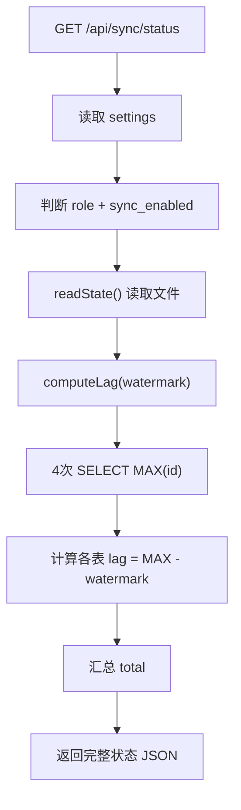

# SyncStatusRoutes.ts 需求说明

> 源文件：src/services/worker/http/routes/SyncStatusRoutes.ts ｜ 类型：源码 ｜ 行数：100 ｜ 所属模块：worker/http/routes ｜ 分析日期：2026-07-23

## 1. 文件定位总述

SyncStatusRoutes 是同步状态查询与手动触发路由，为 Viewer UI 的同步状态徽章提供数据支撑。GET 端点返回同步的最后执行时间、连续失败次数、最后错误、水位线（watermark）和各表的数据滞后量（lag），以及角色和同步开关状态。POST 端点支持手动触发一次同步并等待 3 秒后返回最新状态。所有查询为只读操作，代价极低（4 次 SELECT MAX(id) + 1 次文件读取）。

## 2. 功能需求

| 编号 | 需求描述（系统应当…） | 触发条件 / 输入 | 处理规则与输出 | 证据 |
|------|----------------------|----------------|---------------|------|
| FR-STATUS-01 | 系统应当返回同步状态信息 | GET /api/sync/status | 返回 role、sync_enabled、upstream、last_sync_at、last_success_at、consecutive_failures、last_error、watermark、lag | `SyncStatusRoutes.ts:31-55` |
| FR-LAG-01 | 系统应当计算各表的数据滞后量 | 调用 computeLag(watermark) | 对 sessions/observations/summaries/prompts 四张表分别计算 MAX(id) - watermark，负值钳位为 0；汇总为 total | `SyncStatusRoutes.ts:86-99` |
| FR-TRIGGER-01 | 系统应当支持手动触发同步 | POST /api/sync/trigger | 调用 syncAgent.scheduleSoon(0) 立即调度；等待 3 秒后读取最新状态返回 | `SyncStatusRoutes.ts:58-79` |
| FR-TRIGGER-NA-01 | 系统应当在同步代理不可用时拒绝触发 | syncAgentAccessor 返回 undefined | 返回 400 错误，提示 client mode only | `SyncStatusRoutes.ts:60-63` |
| FR-ROLE-01 | 系统应当在状态中包含角色信息 | 读取设置 | role 根据 CLAUDE_MEM_NODE_ROLE 判断 server/client；sync_enabled 根据 CLAUDE_MEM_SYNC_ENABLED 判断 | `SyncStatusRoutes.ts:37-38` |

## 3. 业务规则与约束

- **滞后量计算**：lag = MAX(id) - watermark，数据库被重置时 MAX(id) 可能小于 watermark，钳位为 0 (`SyncStatusRoutes.ts:94-97`)
- **触发等待策略**：POST /api/sync/trigger 使用固定 3 秒 sleep 等待同步执行，非真正的事件驱动等待 (`SyncStatusRoutes.ts:65`)
- **角色判断**：role 字段仅区分 server 和 client（与 AdminRoutes 一致） (`SyncStatusRoutes.ts:37`)
- **状态文件读取**：通过 readState() 从文件读取同步状态（last_sync_at、failures、watermark），是轻量级文件操作 (`SyncStatusRoutes.ts:41`)
- **可测试性**：构造函数注入 syncAgentAccessor、settingsPathResolver、statePathResolver 函数参数，便于测试 (`SyncStatusRoutes.ts:23-26`)

## 4. 对外暴露

| 端点 | 方法 | 路径 | 说明 |
|------|------|------|------|
| 同步状态 | GET | `/api/sync/status` | 返回完整同步状态 |
| 手动触发 | POST | `/api/sync/trigger` | 触发同步并等待返回状态 |

## 5. 依赖关系

- **继承**：BaseRouteHandler
- **依赖模块**：DatabaseManager（滞后量查询）、readState（同步状态文件读取）、SettingsDefaultsManager（设置读取）
- **可选依赖**：syncAgentAccessor（同步代理，POST 触发用）
- **上游调用**：Viewer UI 同步状态徽章

## 6. 数据结构

GET `/api/sync/status` 响应体：
```typescript
{
  role: 'server' | 'client';
  sync_enabled: boolean;
  upstream: string;
  last_sync_at: number | null;
  last_success_at: number | null;
  consecutive_failures: number;
  last_error: string | null;
  watermark: { sessions: number; observations: number; summaries: number; prompts: number };
  lag: { sessions: number; observations: number; summaries: number; prompts: number; total: number }
}
```

## 7. 复杂逻辑图示



## 8. 逆向备注

- POST /api/sync/trigger 的 3 秒固定等待是一个简单但不可靠的实现——如果同步执行超过 3 秒，返回的状态可能仍不包含最新结果 (`SyncStatusRoutes.ts:65`)。
- 注释标注了 `TODO T-25`，表明该端点属于待完善的设计项 (`SyncStatusRoutes.ts:9`)。
- `computeLag` 是 private 方法但在注释中标注了"Read-only and cheap: 4 SELECT MAX(id) queries + one file read"，强调了该查询的低成本特性 (`SyncStatusRoutes.ts:18,86`)。
