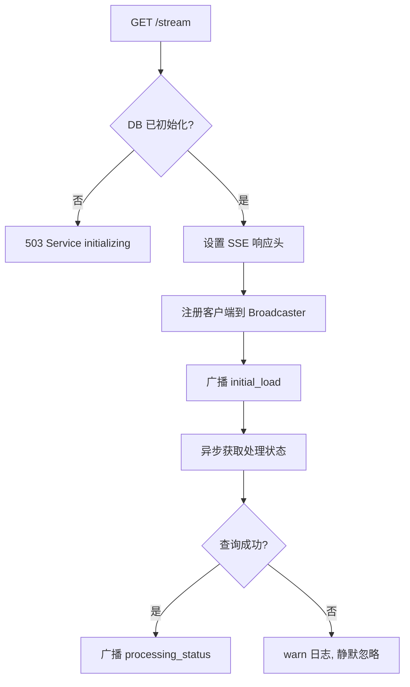

# ViewerRoutes.ts 需求说明

> 源文件：src/services/worker/http/routes/ViewerRoutes.ts ｜ 类型：源码 ｜ 行数：117 ｜ 所属模块：worker/http/routes ｜ 分析日期：2026-07-23

## 1. 文件定位总述

ViewerRoutes 是 Web 查看器 UI 的入口路由处理器，负责托管前端静态资源、提供健康检查端点以及建立 SSE（Server-Sent Events）实时推送通道。它在服务启动时预加载 `viewer.html` 到内存（避免每次请求读磁盘），通过 SSEBroadcaster 向已连接的客户端广播项目目录变更和处理状态变更。该路由是 Worker HTTP 服务最基础的路由组，所有用户交互的前端页面都从这里开始。

## 2. 功能需求

| 编号 | 需求描述（系统应当…） | 触发条件 / 输入 | 处理规则与输出 | 证据 |
|------|----------------------|----------------|---------------|------|
| FR-STATIC-01 | 系统应当托管 UI 静态资源 | GET 请求路径匹配 packageRoot/ui/ 下的静态文件 | 通过 `express.static` 中间件提供静态文件服务 | `ViewerRoutes.ts:49` |
| FR-HEALTH-01 | 系统应当提供健康检查端点 | GET `/health` | 返回 JSON 包含 status、timestamp、activeSessions | `ViewerRoutes.ts:51,56-64` |
| FR-VIEWER-01 | 系统应当在根路径提供查看器 HTML 页面 | GET `/` | 返回预缓存的 `viewer.html` 字节流，Content-Type 为 `text/html; charset=utf-8`；文件不存在则抛异常 | `ViewerRoutes.ts:52,66-72` |
| FR-SSE-01 | 系统应当建立 SSE 实时推送通道 | GET `/stream` | 设置 SSE 响应头（Content-Type、Cache-Control、Connection）；注册客户端到 SSEBroadcaster；广播 initial_load 事件（项目目录数据）；异步广播 processing_status 事件 | `ViewerRoutes.ts:53,74-116` |
| FR-SSE-INIT-01 | SSE 连接成功后系统应当立即推送项目目录 | SSE 客户端连接成功 | 广播 `initial_load` 类型事件，包含 projects、sources、projectsBySource、projectUsers、timestamp | `ViewerRoutes.ts:91-99` |
| FR-SSE-STATUS-01 | SSE 连接后系统应当推送当前处理状态 | SSE 客户端连接成功（异步） | 广播 `processing_status` 类型事件，包含 isProcessing 和 queueDepth；查询失败仅记 warn 日志 | `ViewerRoutes.ts:101-115` |
| FR-SSE-503-01 | 数据库未就绪时系统应当拒绝 SSE 连接 | DB 初始化未完成时请求 `/stream` | 返回 503 状态码和 `{ error: 'Service initializing' }` | `ViewerRoutes.ts:76-82` |
| FR-PRELOAD-01 | 系统应当在启动时预加载 viewer.html | 服务启动时 | 按候选路径顺序（ui/viewer.html → plugin/ui/viewer.html）查找，找到则读入内存 Buffer；找不到记 warn 日志 | `ViewerRoutes.ts:12-36` |

## 3. 业务规则与约束

- **候选路径顺序**：优先 `packageRoot/ui/viewer.html`，回退 `packageRoot/plugin/ui/viewer.html` (`ViewerRoutes.ts:14-17`)
- **内存缓存**：viewer.html 在启动时一次性读入 Buffer，后续请求直接从内存返回，避免磁盘 I/O (`ViewerRoutes.ts:23-25`)
- **SSE 生命周期**：客户端断开连接后由 SSEBroadcaster 管理清理
- **处理状态查询异步化**：`isAnySessionProcessing` 和 `getTotalActiveWork` 的结果通过异步 Promise 获取，不影响 SSE 连接的建立速度 (`ViewerRoutes.ts:101-115`)

## 4. 对外暴露

| 端点 | 方法 | 路径 | 说明 |
|------|------|------|------|
| 健康检查 | GET | `/health` | 返回服务状态和活跃会话数 |
| 查看器页面 | GET | `/` | 返回 viewer.html |
| SSE 流 | GET | `/stream` | 建立实时推送通道 |
| 静态资源 | GET | `ui/*` | 托管前端静态文件 |

## 5. 依赖关系

- **构造注入**：`SSEBroadcaster`（SSE 推送管理）、`DatabaseManager`（数据库访问）、`SessionManager`（会话状态）
- **继承**：`BaseRouteHandler`（提供 wrapHandler 错误处理）
- **上游调用**：Worker HTTP 服务注册路由

## 6. 数据结构

无自定义数据结构，消费 SSEBroadcaster、DatabaseManager、SessionManager 的接口。

## 7. 复杂逻辑图示

## 8. 逆向备注

- 静态资源路径 `express.static` 挂载在 `packageRoot/ui`，而 viewer.html 的候选路径包含 `plugin/ui/viewer.html`，二者存在路径层级差异——静态中间件可能无法服务到 plugin/ui 下的资源 (`ViewerRoutes.ts:14-17,49`)。
- SSE 事件中的 `initial_load` 和 `processing_status` 是前端首次加载所需的关键数据，分同步和异步两个阶段发送以优化连接速度。
