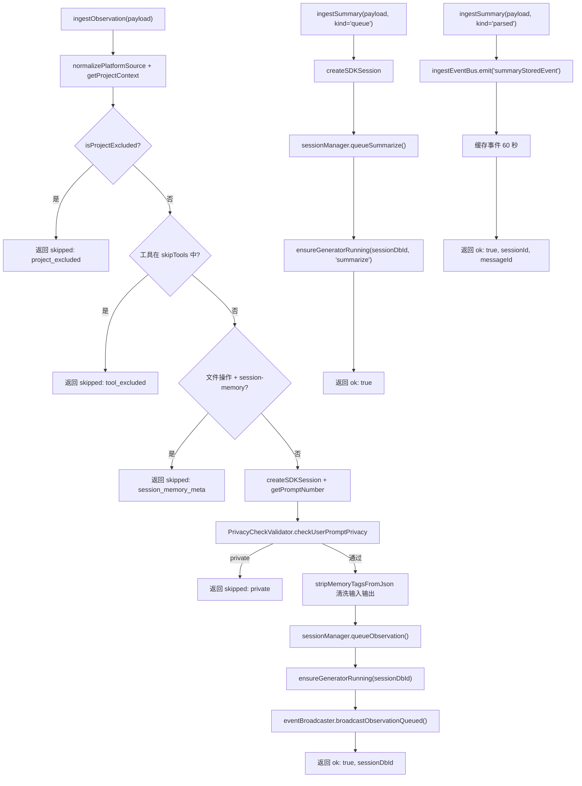

# shared.ts 需求说明

> 源文件：`src/services/worker/http/shared.ts` ｜ 类型：源码 ｜ 行数：273 ｜ 所属模块：worker/http ｜ 分析日期：2026-07-23

## 1. 文件定位总述

shared.ts 是 claude-mem Worker HTTP API 的数据摄入（ingest）核心模块，充当外部调用（MCP 工具调用、HTTP API、转录处理器等）与内部存储之间的中间层。它提供了三种摄入入口——观测记录（ingestObservation）、用户提示（ingestPrompt）和会话摘要（ingestSummary），每种入口在写入数据库前执行完整的前置校验：项目排除、工具排除、隐私检查、标签清洗等。模块还维护一个基于 EventEmitter 的事件总线，用于跨组件传递摘要存储事件，并通过延迟注入的上下文机制解耦与 SessionManager/DatabaseManager 的依赖。

## 2. 功能需求

| 编号 | 需求描述（系统应当…） | 触发条件 / 输入 | 处理规则与输出 | 证据 |
|------|----------------------|----------------|---------------|------|
| FR-INGEST-OBS-01 | 系统应当摄入一条观测记录到处理队列 | 调用 `ingestObservation(payload)`，payload 含 contentSessionId、toolName、toolInput、toolResponse 等 | 标准化 platform_source 和 project；校验项目排除和工具排除；创建/查找 SDK 会话；执行隐私检查；清洗输入输出中的记忆标签；入队处理并触发摘要生成器和事件广播；返回成功或跳过原因 | `shared.ts:97-182` |
| FR-INGEST-OBS-02 | 系统应当排除被配置为排除的项目路径中的观测 | `isProjectExcluded(cwd, settings.CLAUDE_MEM_EXCLUDED_PROJECTS)` 返回 true | 返回 `{ ok: true, status: 'skipped', reason: 'project_excluded' }` | `shared.ts:106-108` |
| FR-INGEST-OBS-03 | 系统应当排除被配置为跳过的工具名称的观测 | `CLAUDE_MEM_SKIP_TOOLS` 配置中包含该工具名 | 返回 `{ ok: true, status: 'skipped', reason: 'tool_excluded' }` | `shared.ts:110-115` |
| FR-INGEST-OBS-04 | 系统应当排除针对 session-memory 元数据的文件操作 | 工具名为 Edit/Write/Read/NotebookEdit 且文件路径含 `session-memory` | 返回 `{ ok: true, status: 'skipped', reason: 'session_memory_meta' }` | `shared.ts:117-124` |
| FR-INGEST-OBS-05 | 系统应当在摄入前检查用户提示的隐私设置 | 通过 PrivacyCheckValidator 检查 | 若提示被标记为 private 则跳过，返回 `{ ok: true, status: 'skipped', reason: 'private' }` | `shared.ts:142-152` |
| FR-INGEST-OBS-06 | 系统应当清洗观测输入/输出中的记忆标签 | toolInput/toolResponse 不为 undefined | 调用 `stripMemoryTagsFromJson` 移除 JSON 中的 `<private>` 等标签 | `shared.ts:154-159` |
| FR-INGEST-OBS-07 | 系统应当记录缺失 cwd 的错误但不中断处理 | cwd 为空字符串且非空字符串检查失败 | 记录 error 级别日志，继续执行 | `shared.ts:166-172` |
| FR-INGEST-PROMPT-01 | 系统应当摄入一条用户提示记录 | 调用 `ingestPrompt(payload)` | 校验 contentSessionId 和 prompt 非空；创建/查找 SDK 会话并关联 prompt 文本；返回成功或错误信息 | `shared.ts:192-214` |
| FR-INGEST-SUM-01 | 系统应当摄入排队中的摘要生成请求 | `ingestSummary` payload 的 kind 为 `'queue'` | 创建/查找会话，排队摘要生成任务，触发生成器；返回成功或错误 | `shared.ts:233-256` |
| FR-INGEST-SUM-02 | 系统应当处理已解析的摘要存储事件 | `ingestSummary` payload 的 kind 为 `'parsed'` | 无论摘要是否 skipped，均通过事件总线发送 `summaryStoredEvent`，携带 sessionId 和 messageId | `shared.ts:258-271` |
| FR-EVT-01 | 系统应当维护摘要存储事件的短期缓存 | `ingestEventBus` 收到 summaryStoredEvent | 将事件缓存 60 秒（RECENT_EVENT_TTL_MS），供下游通过 `takeRecentSummaryStored` 消费；过期自动清理 | `shared.ts:22-49` |
| FR-CTX-01 | 系统应当支持延迟注入依赖上下文 | 模块加载时无上下文 | 通过 `setIngestContext` 注入 SessionManager/DatabaseManager 等；通过 `attachIngestGeneratorStarter` 注入生成器启动函数；未注入时调用 requireContext 抛出异常 | `shared.ts:61-78` |

## 3. 业务规则与约束

- **排除策略为"跳过而非失败"**：项目排除、工具排除、隐私过滤均返回 `ok: true, status: 'skipped'`，不影响调用方（`shared.ts:107,114,123,151`）。
- **平台来源标准化**：所有摄入入口统一通过 `normalizePlatformSource` 处理 platformSource（`shared.ts:100,203,242`）。
- **项目上下文提取**：从 cwd 通过 `getProjectContext(cwd).primary` 提取项目标识（`shared.ts:102,204,244`）。
- **工具排除列表格式**：`CLAUDE_MEM_SKIP_TOOLS` 为逗号分隔字符串（`shared.ts:111`）。
- **session-memory 元数据过滤范围**：仅对 Edit、Write、Read、NotebookEdit 四种文件操作工具生效（`shared.ts:117-118`）。
- **事件缓存 TTL**：摘要存储事件缓存 60 秒后自动过期（`shared.ts:24`）。
- **摘要 skipped 事件处理**：无论 parsed 摘要的 skipped 标志如何，均发送 `summaryStoredEvent`（`shared.ts:258-271`），推断：（skipped 摘要也需要通知下游重置 claimed 消息状态）。

## 4. 对外暴露

| 公开成员 | 类型 | 说明 |
|---------|------|------|
| `ingestObservation` | `(payload: ObservationPayload) => Promise<IngestResult>` | 摄入观测记录 |
| `ingestPrompt` | `(payload: PromptPayload) => IngestResult` | 摄入用户提示 |
| `ingestSummary` | `(payload: SummaryPayload) => Promise<IngestResult>` | 摄入摘要 |
| `ingestEventBus` | `IngestEventBus` 实例 | 摘要存储事件总线 |
| `setIngestContext` | `(next: IngestContext) => void` | 注入依赖上下文 |
| `attachIngestGeneratorStarter` | `(fn) => void` | 注入生成器启动函数 |

**IngestResult 类型**：
```typescript
type IngestResult =
  | { ok: true; sessionDbId: number; messageId?: number }
  | { ok: true; status: 'skipped'; reason: string }
  | { ok: false; reason: string; status?: number }
```

**Payload 类型**：
- `ObservationPayload`：contentSessionId、toolName、toolInput、toolResponse、cwd、platformSource、agentId、agentType、toolUseId
- `PromptPayload`：contentSessionId、prompt、cwd、platformSource、promptNumber
- `SummaryPayload`：联合类型，kind 为 `'queue'` 或 `'parsed'`

## 5. 依赖关系

**内部依赖**：
- `src/services/worker/SessionManager.ts` → `SessionManager`（`shared.ts:3`）
- `src/services/worker/DatabaseManager.ts` → `DatabaseManager`（`shared.ts:4`）
- `src/services/events/SessionEventBroadcaster.ts` → `SessionEventBroadcaster`（`shared.ts:5`）
- `src/sdk/parser.ts` → `ParsedSummary`（`shared.ts:6`）
- `src/utils/tag-stripping.ts` → `stripMemoryTagsFromJson`（`shared.ts:7`）
- `src/utils/project-filter.ts` → `isProjectExcluded`（`shared.ts:8`）
- `src/shared/SettingsDefaultsManager.ts` → `SettingsDefaultsManager`（`shared.ts:9`）
- `src/shared/paths.ts` → `USER_SETTINGS_PATH`（`shared.ts:10`）
- `src/utils/project-name.ts` → `getProjectContext`（`shared.ts:11`）
- `src/shared/platform-source.ts` → `normalizePlatformSource`（`shared.ts:12`）
- `src/services/validation/PrivacyCheckValidator.ts` → `PrivacyCheckValidator`（`shared.ts:13`）

**外部依赖**：
- Node.js `events`（EventEmitter）

## 6. 数据结构

**SummaryStoredEvent**：`{ sessionId: string; messageId: number }`

**IngestContext**（延迟注入的依赖上下文）：
```typescript
interface IngestContext {
  sessionManager: SessionManager;
  dbManager: DatabaseManager;
  eventBroadcaster: SessionEventBroadcaster;
  ensureGeneratorRunning?: (sessionDbId: number, source: string) => void | Promise<void>;
}
```

**IngestEventBus**：扩展 EventEmitter，维护 `recentStored` Map 缓存近期事件。

## 7. 复杂逻辑图示



上图展示了三种摄入入口的处理流程。观测摄入经过多层过滤（项目排除→工具排除→元数据排除→隐私检查）后入队处理；摘要摄入分为"排队"和"已解析"两种模式，后者通过事件总线通知下游。

## 8. 逆向备注

- `IngestEventBus` 的 `setMaxListeners(0)`（`shared.ts:27`）移除了 EventEmitter 的默认监听器数量限制警告，推断：（在大量会话并发场景下可能注册大量临时监听器）。
- `ingestObservation` 中 cwd 的 fallback 逻辑（`shared.ts:166-172`）通过 IIFE 返回空字符串并同时记录 error 日志，这种内联错误处理方式在代码中不常见。
- `ingestSummary` 的 `parsed` 分支中，无论 `summary.skipped` 是否为 true 都发送 `summaryStoredEvent`（`shared.ts:258-271`），说明 skipped 状态也需要触发下游的状态更新。
- `requireContext` 抛出的错误信息为 `'ingest helpers used before setIngestContext() — wiring bug'`（`shared.ts:75`），明确标注为"线路连接错误"，表明这是启动时序问题。
- `ingestPrompt` 是三个摄入函数中唯一的同步函数（`shared.ts:192`），其余两个是 async。
