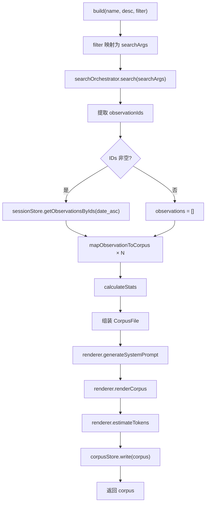

# CorpusBuilder.ts 需求说明

> 源文件：src/services/worker/knowledge/CorpusBuilder.ts ｜ 类型：源码 ｜ 行数：145 ｜ 所属模块：worker/knowledge ｜ 分析日期：2026-07-23

## 1. 文件定位总述

CorpusBuilder.ts 是知识语料库（Corpus）的构建核心类，负责根据用户指定的过滤条件（项目、类型、概念、文件、日期、查询文本）从搜索系统中检索 observations，将其水合成结构化的 CorpusFile 对象，渲染为系统提示词，并持久化到 CorpusStore。该类是"知识构建"功能的入口，下游 CorpusRenderer 负责 Markdown 渲染和 token 估算，上游 SearchOrchestrator 提供统一搜索能力。

## 2. 功能需求

| 编号 | 需求描述（系统应当…） | 触发条件 / 输入 | 处理规则与输出 | 证据 |
|------|----------------------|----------------|---------------|------|
| FR-cb-01 | 系统应当根据过滤条件构建语料库 | 调用 `build(name, description, filter)` | 将 filter 映射为搜索参数（project, type, concepts, files, query, date_start, date_end, limit），调用 SearchOrchestrator 搜索 | `CorpusBuilder.ts:37-50` |
| FR-cb-02 | 系统应当将搜索结果水合为完整的 observation 记录 | 搜索返回 observation ID 列表后 | 以 `date_asc` 排序调用 `sessionStore.getObservationsByIds` 获取完整记录；无 ID 时返回空数组 | `CorpusBuilder.ts:58-68` |
| FR-cb-03 | 系统应当将数据库行映射为语料库 observation 对象 | 水合记录时 | 映射字段：id, type, title, subtitle, narrative, facts/concepts/files_read/files_modified（JSON 数组解析）, project, created_at/epoch | `CorpusBuilder.ts:101-116` |
| FR-cb-04 | 系统应当计算语料库统计数据 | observations 映射完成后 | 统计各类型数量（type_breakdown）、最早/最晚时间（date_range）；token_estimate 初始为 0，渲染后更新 | `CorpusBuilder.ts:118-143` |
| FR-cb-05 | 系统应当渲染语料库并估算 token 数量 | CorpusFile 组装后 | 调用 CorpusRenderer 生成 system_prompt 和 renderedText，用 renderer.estimateTokens 更新 token_estimate | `CorpusBuilder.ts:89-92` |
| FR-cb-06 | 系统应当将语料库写入持久存储 | 渲染完成后 | 调用 `corpusStore.write(corpus)` 持久化 | `CorpusBuilder.ts:94` |
| FR-cb-07 | 系统应当安全解析 JSON 数组字段 | 解析 facts, concepts, files_read, files_modified 时 | 支持 string 和 Array 输入，对非数组/非字符串类型返回空数组；解析失败时 warn 日志并返回空数组 | `CorpusBuilder.ts:10-24` |

## 3. 业务规则与约束

- **排序规则**：水合 observations 时固定使用 `date_asc` 排序。`src/services/worker/knowledge/CorpusBuilder.ts:59`
- **过滤参数传递**：project 和 types/limit 过滤条件同时传递给搜索和水合步骤。`src/services/worker/knowledge/CorpusBuilder.ts:61-63`
- **空结果处理**：搜索返回空 ID 列表时，直接构建空 observations 语料库。`src/services/worker/knowledge/CorpusBuilder.ts:65-67`
- **JSON 数组容错**：facts、concepts 等字段可能以 JSON 字符串或已解析数组形式存储。`src/services/worker/knowledge/CorpusBuilder.ts:10-24`

## 4. 对外暴露

| 名称 | 类型 | 说明 |
|------|------|------|
| `CorpusBuilder` | class | 语料库构建器 |
| `CorpusBuilder.build(name, description, filter)` | async method | 根据过滤条件构建语料库并持久化，返回 CorpusFile |

## 5. 依赖关系

- **内部依赖**：`CorpusRenderer`（渲染）、`CorpusStore`（持久化）、`../search/SearchOrchestrator`（搜索）、`../../sqlite/SessionStore`（水合）
- **被依赖**：知识库构建相关的 HTTP 路由/命令

## 6. 数据结构

**CorpusFile**（由 CorpusStore 类型定义）：`src/services/worker/knowledge/CorpusBuilder.ts:76-88`

| 字段 | 类型 | 说明 |
|------|------|------|
| version | number | 语料库格式版本，固定为 1 |
| name | string | 语料库名称 |
| description | string | 语料库描述 |
| created_at / updated_at | string | ISO 时间戳 |
| filter | CorpusFilter | 构建时使用的过滤条件 |
| stats | CorpusStats | 统计信息 |
| system_prompt | string | 渲染后的系统提示词 |
| session_id | string \| null | 关联会话 ID（语料库构建场景为 null） |
| observations | CorpusObservation[] | 观察记录列表 |

## 7. 复杂逻辑图示

语料库构建流程：过滤条件映射→搜索检索→ID 水合→字段映射→统计计算→渲染提示词→估算 token→持久化存储。

## 8. 逆向备注

- `safeParseJsonArray` 同时处理 string 和 Array 类型，说明同一字段在数据库中存储格式可能不一致。
- 语料库的 `session_id` 字段设为 null，推断语料库构建不关联特定会话。
