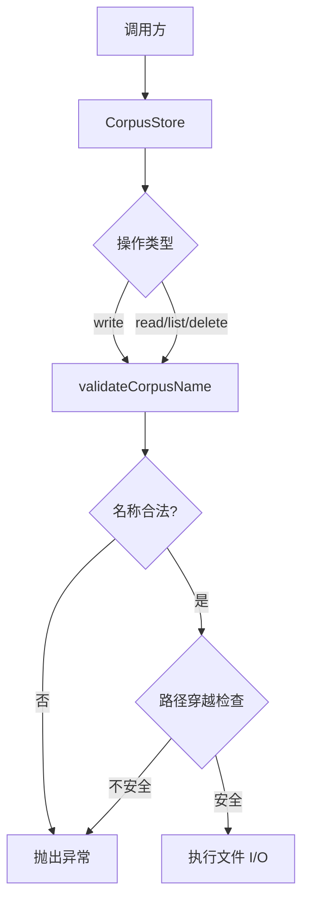

# CorpusStore.ts 需求说明

> 源文件：src/services/worker/knowledge/CorpusStore.ts ｜ 类型：源码 ｜ 行数：103 ｜ 所属模块：worker/knowledge ｜ 分析日期：2026-07-23

## 1. 文件定位总述

CorpusStore 是知识语料库的持久化存储层，负责将 `CorpusFile` 对象以 JSON 文件形式写入磁盘、读取、列举和删除。它作为知识库子系统的底层 I/O 组件，为上层的 CorpusRenderer、知识问答等场景提供数据存取能力。存储目录通过共享路径模块 `paths.corpora()` 统一解析，构造时自动创建目录。所有文件名经过严格校验与路径穿越防护，确保不会逃逸出 corpora 目录。

## 2. 功能需求

| 编号 | 需求描述（系统应当…） | 触发条件 / 输入 | 处理规则与输出 | 证据 |
|------|----------------------|----------------|---------------|------|
| FR-WRITE-01 | 系统应当将语料库文件以 JSON 格式写入磁盘 | 调用 `write(corpus)` 传入 CorpusFile 对象 | 以 `{name}.corpus.json` 命名写入 corpora 目录，JSON 缩进 2 空格；写入后记录 debug 日志含 observation 数量 | `CorpusStore.ts:21-25` |
| FR-READ-01 | 系统应当按名称读取语料库文件 | 调用 `read(name)` 传入语料库名称 | 在 corpora 目录查找 `{name}.corpus.json`，不存在返回 null；解析 JSON 返回 CorpusFile；解析失败记 error 日志并返回 null | `CorpusStore.ts:27-44` |
| FR-LIST-01 | 系统应当列出所有语料库的摘要信息 | 调用 `list()` | 扫描 corpora 目录下所有 `.corpus.json` 后缀文件，提取 name、description、stats、session_id 字段返回数组；单个文件解析失败不影响其余 | `CorpusStore.ts:46-74` |
| FR-DELETE-01 | 系统应当按名称删除语料库文件 | 调用 `delete(name)` 传入语料库名称 | 文件存在则删除并返回 true，不存在返回 false | `CorpusStore.ts:76-85` |
| FR-INIT-01 | 系统应当在构造时自动创建 corpora 存储目录 | CorpusStore 实例化且目录不存在 | 以 `{ recursive: true }` 模式创建目录 | `CorpusStore.ts:15-19` |

## 3. 业务规则与约束

- **命名约束**：语料库名称仅允许 `[a-zA-Z0-9._-]`，否则抛出 `Invalid corpus name` 异常 (`CorpusStore.ts:87-93`)
- **路径穿越防护**：通过 `path.resolve` 计算绝对路径后校验是否以 corpora 目录为前缀，不满足则抛出 `Invalid corpus name` 异常 (`CorpusStore.ts:95-102`)
- **文件格式约束**：所有语料库文件统一使用 `.corpus.json` 后缀 (`CorpusStore.ts:51`)
- **错误隔离**：`list()` 和 `read()` 中单个文件的错误不中断整体操作

## 4. 对外暴露

| 公开方法 | 签名 | 说明 |
|---------|------|------|
| `write` | `(corpus: CorpusFile): void` | 写入语料库 |
| `read` | `(name: string): CorpusFile \| null` | 读取语料库 |
| `list` | `(): Array<{name, description, stats, session_id}>` | 列出所有语料库摘要 |
| `delete` | `(name: string): boolean` | 删除语料库 |

## 5. 依赖关系

- **上游**：`paths.corpora()` (共享路径模块，提供存储目录)
- **下游**：被知识库管理、CorpusRenderer 等上层组件调用
- **类型依赖**：`CorpusFile`、`CorpusStats` (来自 `./types.ts`)

## 6. 数据结构

语料库磁盘文件结构为 `CorpusFile` JSON，详见 `types.ts:35-46`，包含 version、name、description、filter、stats、observations 等字段。

## 7. 复杂逻辑图示

名称校验与路径安全检查是所有操作的前置守卫，确保存储操作不会逃逸出 corpora 目录。

## 8. 逆向备注

- `read()` 方法中错误日志区分了 `instanceof Error` 和非 Error 抛出值两种情况 (`CorpusStore.ts:37-41`)，说明开发者考虑了第三方库可能抛出非标准错误。
- `list()` 方法仅提取部分字段返回摘要，避免将大量 observations 数据加载到内存。
