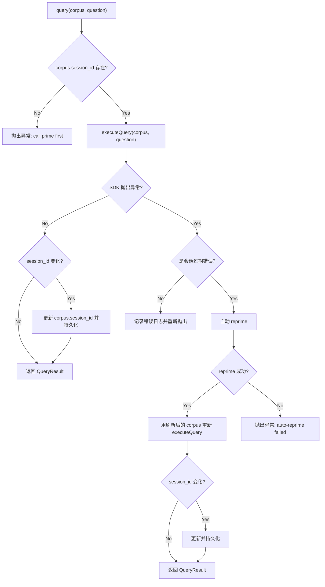
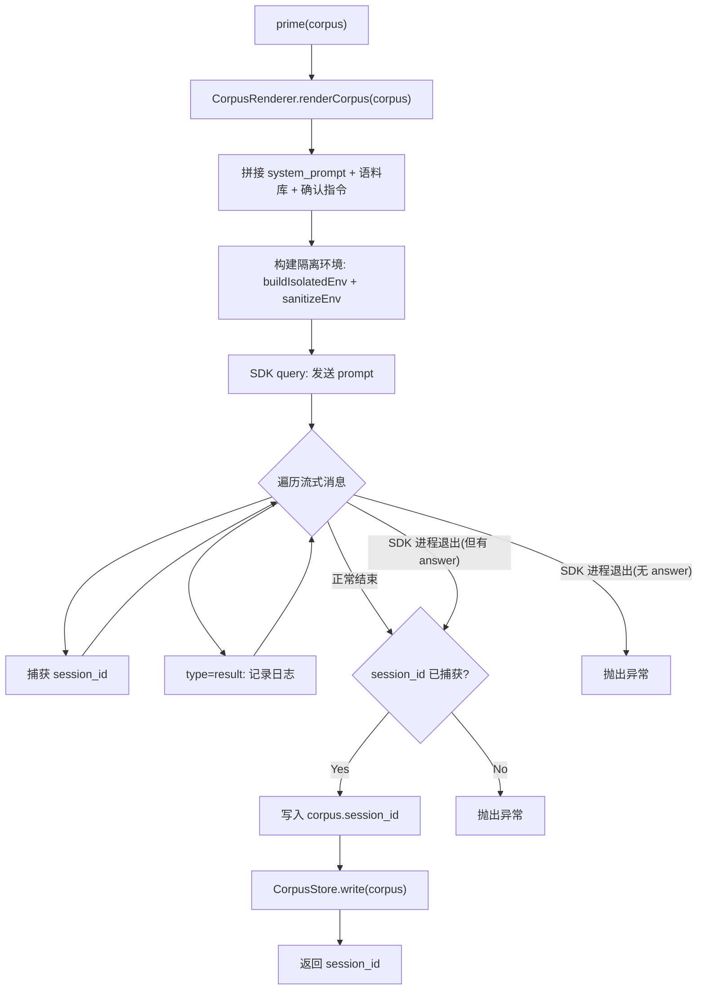

# KnowledgeAgent.ts 需求说明

> 源文件：src/services/worker/knowledge/KnowledgeAgent.ts ｜ 类型：源码 ｜ 行数：199 ｜ 所属模块：worker/knowledge（知识库代理） ｜ 分析日期：2026-07-23

## 1. 文件定位总述

KnowledgeAgent 是 claude-mem 知识库系统的 AI 代理层，负责通过 Claude Agent SDK 将构建好的语料库（Corpus）"装载"到 Claude 会话中，并支持对语料库进行语义问答。其核心机制是利用 SDK 的 `query()` 函数创建一个有状态会话（session），在 prime 阶段将语料库内容一次性灌入，后续 query 阶段通过 session resume 复用该上下文。模块内置了会话过期自动重新装载（reprime）的容错机制，并严格禁止代理使用文件读写、Shell 执行等工具，将其限制为纯问答角色。模型选择由用户设置文件中的 `CLAUDE_MEM_MODEL` 字段驱动。

## 2. 功能需求

| 编号 | 需求描述（系统应当…） | 触发条件 / 输入 | 处理规则与输出 | 证据 |
|------|----------------------|----------------|---------------|------|
| FR-ka-01 | 系统应当将语料库内容装载到 Claude 会话中（prime），并返回会话 ID | 调用 `prime(corpus)`，传入 CorpusFile 对象 | 使用 `CorpusRenderer` 渲染语料库文本；拼接 system_prompt + 语料库 + 确认指令；通过 `@anthropic-ai/claude-agent-sdk` 的 `query()` 发送；禁用 12 种工具（Bash/Read/Write/Edit 等）；捕获流式消息中的 `session_id`；将 session_id 写回 CorpusFile 并持久化到 CorpusStore | `src/services/worker/knowledge/KnowledgeAgent.ts:39-98` |
| FR-ka-02 | 系统应当对已装载的语料库执行语义问答（query），并自动处理会话过期 | 调用 `query(corpus, question)` | 先检查 corpus.session_id 是否存在，不存在则抛异常；调用 `executeQuery` 发送问题并解析 assistant 回答文本；若 SDK 抛出会话过期类错误（正则匹配 session/resume/expired），自动 reprime 后重试查询；若 session_id 发生变化则更新并持久化 | `src/services/worker/knowledge/KnowledgeAgent.ts:100-134` |
| FR-ka-03 | 系统应当支持重新装载语料库（reprime），清除旧会话后重新 prime | 调用 `reprime(corpus)` | 将 corpus.session_id 设为 null，然后调用 prime | `src/services/worker/knowledge/KnowledgeAgent.ts:136-139` |
| FR-ka-04 | 系统应当在 prime 和 query 时使用隔离的运行环境 | 每次调用 SDK query | 通过 `buildIsolatedEnvWithFreshOAuth()` 构建隔离环境变量，再经 `sanitizeEnv()` 清理；设置 `mcpServers: {}`、`settingSources: []`、`strictMcpConfig: true` 确保无外部干扰 | `src/services/worker/knowledge/KnowledgeAgent.ts:54-68` |
| FR-ka-05 | 系统应当根据用户设置动态选择 AI 模型 | SDK 调用时获取模型 ID | 从 `USER_SETTINGS_PATH` 加载设置，读取 `CLAUDE_MEM_MODEL` 字段 | `src/services/worker/knowledge/KnowledgeAgent.ts:194-197` |

## 3. 业务规则与约束

1. **工具禁用白名单**：代理被禁止使用 12 种工具：Bash、Read、Write、Edit、Grep、Glob、WebFetch、WebSearch、Task、NotebookEdit、AskUserQuestion、TodoWrite。这是为了防止代理执行文件操作或递归调用，确保其仅为纯问答角色。`src/services/worker/knowledge/KnowledgeAgent.ts:15-28`
2. **会话过期自动恢复**：当 query 抛出包含 `session`/`resume`/`expired`/`invalid.*session`/`not found` 关键词的错误时，系统自动 reprime 并重试一次。若 reprime 后仍失败则向上抛出异常。`src/services/worker/knowledge/KnowledgeAgent.ts:141-133`
3. **SDK 进程退出容错**：若 SDK 进程在返回结果后退出（抛出 Error），但已捕获到 session_id（prime）或 answer 文本（query），则视为成功继续执行，不中断。`src/services/worker/knowledge/KnowledgeAgent.ts:79-88,180-188`
4. **session_id 管线**：prime 返回的 session_id 被写入 corpus 对象并持久化到 CorpusStore；query 过程中若 SDK 返回新 session_id 也会同步更新。这确保了 session_id 的生命周期由 CorpusStore 管理。`src/services/worker/knowledge/KnowledgeAgent.ts:94-96,107-110`
5. **MCP 完全隔离**：每次 SDK 调用均设置 `mcpServers: {}` 和 `strictMcpConfig: true`，语料库代理不连接任何 MCP 服务。`src/services/worker/knowledge/KnowledgeAgent.ts:64-65`

## 4. 对外暴露

| 名称 | 类型 | 签名 | 说明 |
|------|------|------|------|
| `KnowledgeAgent` | class | 构造函数接收 `CorpusStore` | 知识库代理主类 |
| `prime` | method | `(corpus: CorpusFile) => Promise<string>` | 装载语料库，返回 session_id |
| `query` | method | `(corpus: CorpusFile, question: string) => Promise<QueryResult>` | 对语料库提问，返回回答和 session_id |
| `reprime` | method | `(corpus: CorpusFile) => Promise<string>` | 重新装载语料库 |

## 5. 依赖关系

- **上游依赖**：`CorpusRenderer`（渲染语料库文本）、`CorpusStore`（语料库持久化）、`CorpusFile` / `QueryResult` 类型
- **上游依赖**：`SettingsDefaultsManager`（加载模型设置）、`USER_SETTINGS_PATH`（设置文件路径）
- **上游依赖**：`findClaudeExecutable`（定位 Claude 可执行文件路径）、`buildIsolatedEnvWithFreshOAuth`（构建隔离环境）、`sanitizeEnv`（环境变量清理）
- **上游依赖**：`ensureDir`、`OBSERVER_SESSIONS_DIR`（确保 SDK 工作目录存在）
- **运行时依赖**：`@anthropic-ai/claude-agent-sdk` 的 `query()` 函数
- **运行时依赖**：`logger`（日志记录）

## 6. 数据结构

- **KNOWLEDGE_AGENT_DISALLOWED_TOOLS** (`src/services/worker/knowledge/KnowledgeAgent.ts:15-28`)：字符串数组，列出代理禁止使用的 12 种工具名称
- **QueryResult**（类型来源：`./types.js`）：包含 `answer`（回答文本）和 `session_id`（会话标识）

## 7. 复杂逻辑图示

上图展示了 query 方法的会话过期自动恢复流程。非过期类错误直接向上传播，不触发重试。

上图展示了 prime 操作的流式消息处理流程，包含 SDK 进程退出容错逻辑。

## 8. 逆向备注

1. **会话过期判断为启发式**：`isSessionResumeError` 通过正则 `/session|resume|expired|invalid.*session|not found/i` 匹配错误消息，不是基于 SDK 返回的结构化错误码。`src/services/worker/knowledge/KnowledgeAgent.ts:141-144`
2. **类型声明使用 @ts-ignore**：`@anthropic-ai/claude-agent-sdk` 的类型声明被跳过（`@ts-ignore`），推断该 SDK 可能尚未提供完整的 TypeScript 类型定义。`src/services/worker/knowledge/KnowledgeAgent.ts:13`
3. **execQuery 为私有方法**：query 的实际 SDK 调用逻辑封装在私有方法 `executeQuery` 中，prime 和 query 各自直接调用 SDK，代码有一定重复。`src/services/worker/knowledge/KnowledgeAgent.ts:146-192`
4. **reprime 前置条件**：reprime 不验证 corpus 是否存在于 CorpusStore 中，仅清空 session_id 后调用 prime。`src/services/worker/knowledge/KnowledgeAgent.ts:136-139`
