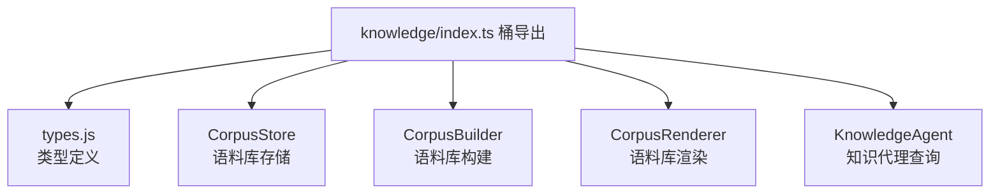

# knowledge/index.ts 需求说明

> 源文件：src/services/worker/knowledge/index.ts ｜ 类型：源码（桶文件） ｜ 行数：8 ｜ 所属模块：worker/knowledge ｜ 分析日期：2026-07-23

## 1. 文件定位总述

本文件是知识语料库子模块的桶导出文件，统一导出语料库的类型定义及四个核心组件：语料库存储（CorpusStore）、语料库构建器（CorpusBuilder）、语料库渲染器（CorpusRenderer）和知识代理（KnowledgeAgent）。这些组件共同支撑从观察数据构建可查询知识库的能力。

## 2. 功能需求

| 编号 | 需求描述（系统应当…） | 触发条件 / 输入 | 处理规则与输出 | 证据 |
|------|----------------------|----------------|---------------|------|
| FR-Knowledge-01 | 系统应当统一导出知识语料库的所有类型、存储、构建器、渲染器和代理组件 | 外部模块导入 | 重导出 types.js 及四个核心类 | `src/services/worker/knowledge/index.ts:2-7` |

## 3. 业务规则与约束

无。本文件是纯桶导出。

## 4. 对外暴露

| 类别 | 名称 | 类型 | 来源 |
|------|------|------|------|
| 重导出 | 语料库相关类型 | 类型 | `./types.js` |
| 导出 | CorpusStore | 类 | `./CorpusStore.js` |
| 导出 | CorpusBuilder | 类 | `./CorpusBuilder.js` |
| 导出 | CorpusRenderer | 类 | `./CorpusRenderer.js` |
| 导出 | KnowledgeAgent | 类 | `./KnowledgeAgent.js` |

## 5. 依赖关系

- **上游**：`./types.js`、`./CorpusStore.js`、`./CorpusBuilder.js`、`./CorpusRenderer.js`、`./KnowledgeAgent.js`
- **下游**：Worker HTTP API 路由中处理 `/api/corpus/*` 端点的模块

## 6. 数据结构

不适用。

## 7. 复杂逻辑图示

上图展示了本模块的四个核心组件：存储负责持久化，构建器负责从观察数据筛选生成语料库，渲染器负责格式化输出，知识代理负责 AI 会话式查询。

## 8. 逆向备注

推断：四个组件构成"存储-构建-渲染-查询"的完整知识语料库生命周期。CorpusBuilder 可能使用 search 模块的过滤能力从观察数据中筛选出符合条件的记录，再由 CorpusRenderer 格式化为可消费的文本。
