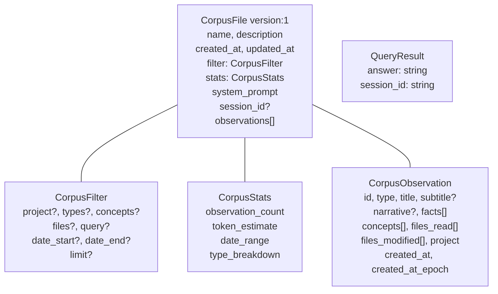

# knowledge/types.ts 需求说明

> 源文件：src/services/worker/knowledge/types.ts ｜ 类型：源码 ｜ 行数：52 ｜ 所属模块：worker/knowledge ｜ 分析日期：2026-07-23

## 1. 文件定位总述

本文件定义了知识语料库（Corpus）模块的完整类型体系，用于支持 Worker 的知识查询（RAG）能力。它涵盖语料过滤条件（`CorpusFilter`）、语料统计信息（`CorpusStats`）、语料观测记录（`CorpusObservation`）、语料文件（`CorpusFile`）以及查询结果（`QueryResult`）五类接口。`CorpusFile` 是语料库的核心聚合结构，包含版本、过滤器、统计、系统提示词和观测记录列表，推断为序列化到磁盘的语料快照格式。

## 2. 功能需求

本文件为纯类型定义文件，无运行时逻辑。核心能力是为 knowledge 模块提供语料库数据结构的类型契约。

## 3. 业务规则与约束

| 编号 | 规则描述 | 证据 |
|------|---------|------|
| BR-KT-01 | `CorpusFilter.types` 的可选值为六种观测类型：`decision`, `bugfix`, `feature`, `refactor`, `discovery`, `change` | `src/services/worker/knowledge/types.ts:4` |
| BR-KT-02 | `CorpusFilter` 支持按项目、类型、概念、文件、全文查询和日期范围组合过滤 | `src/services/worker/knowledge/types.ts:3-11` |
| BR-KT-03 | `CorpusFile.version` 固定为 `1`，推断用于未来格式迁移 | `src/services/worker/knowledge/types.ts:36` |
| BR-KT-04 | `CorpusFile.session_id` 可为 null，表示语料库不绑定特定会话 | `src/services/worker/knowledge/types.ts:44` |
| BR-KT-05 | `CorpusStats.date_range` 包含最早和最晚日期，用于时间跨度展示 | `src/services/worker/knowledge/types.ts:16` |
| BR-KT-06 | `QueryResult` 返回答案文本和会话 ID，关联查询上下文到具体会话 | `src/services/worker/knowledge/types.ts:48-51` |

## 4. 对外暴露

| 导出项 | 类型 | 用途 |
|--------|------|------|
| `CorpusFilter` | 接口 | 语料过滤条件（项目、类型、概念、文件、查询、日期、限制） |
| `CorpusStats` | 接口 | 语料统计信息（观测数、token 估算、日期范围、类型分布） |
| `CorpusObservation` | 接口 | 语料观测记录（含 narrative、facts、concepts、files 等） |
| `CorpusFile` | 接口 | 语料文件聚合结构（版本、描述、过滤器、统计、提示词、观测列表） |
| `QueryResult` | 接口 | 查询结果（答案文本和会话 ID） |

## 5. 依赖关系

- **上游依赖**：无
- **下游消费者**：推断被 knowledge 模块的查询、构建、序列化等逻辑引用

## 6. 数据结构

图示说明：`CorpusFile` 是核心聚合结构，引用 `CorpusFilter`、`CorpusStats` 和 `CorpusObservation`；`QueryResult` 独立于语料结构，为查询输出。

## 7. 复杂逻辑图示

不适用（纯类型定义文件）。

## 8. 逆向备注

- `CorpusFile.version` 硬编码为 `1`，推断未来版本升级时需迁移逻辑。
- 未在代码中证实语料文件的序列化/反序列化逻辑所在位置，推断在同模块其他文件中。
