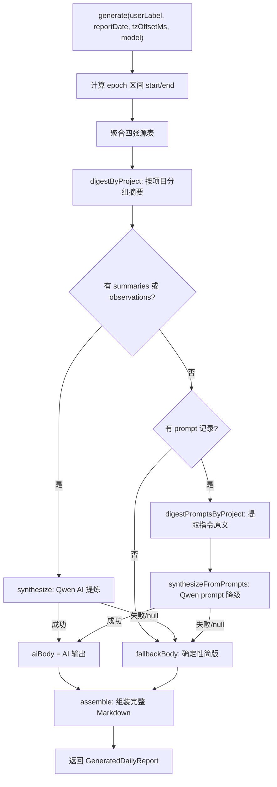

# DailyReportGenerator.ts 需求说明
> 源文件：src/services/worker/reports/DailyReportGenerator.ts ｜ 类型：源码 ｜ 行数：425 ｜ 所属模块：worker/reports ｜ 分析日期：2026-07-23

## 1. 文件定位总述

DailyReportGenerator 是 claude-mem 的用户工作日报生成器，负责从数据库中聚合指定用户某一天的工时、任务、观察记录和会话总结，经三级降级策略（AI 提炼 -> prompt 原文归纳 -> 确定性简版）生成简短中文日报。AI 提炼使用阿里云 DashScope（OpenAI 兼容接口）调用 Qwen 模型，未配置 API Key 时自动降级为纯统计数据拼装。生成的日报以 Markdown 格式 UPSERT 到 `daily_reports` 表，按 `user_label + report_date` 唯一键去重。

## 2. 功能需求

| 编号 | 需求描述 | 触发条件 | 处理规则与输出 | 证据 `path:line` |
|------|---------|---------|---------------|-----------------|
| FR-01 | 生成日报 | 调用 `generate(userLabel, reportDate, tzOffsetMs, model)` | 按用户+日期聚合四张源表数据，经过三级降级（AI提炼/prompt归纳/确定性简版）生成 Markdown 日报，返回 `GeneratedDailyReport` | `src/services/worker/reports/DailyReportGenerator.ts:119-196` |
| FR-02 | 工时聚合（按项目） | generate 执行时 | 从 `user_prompts` JOIN `sdk_sessions` 聚合每个项目当日提示词数与总工时（active_ms + think_time_ms），按总耗时降序排列；active_ms 为零时退化使用 `completed_at_epoch - created_at_epoch` | `src/services/worker/reports/DailyReportGenerator.ts:127-137` |
| FR-03 | 会话统计 | generate 执行时 | 统计当日该用户的会话总数和独立项目数 | `src/services/worker/reports/DailyReportGenerator.ts:139-144` |
| FR-04 | 观察记录聚合 | generate 执行时 | 查询当日 observations（含 merged_into_project 兼容），按 created_at_epoch 升序排列 | `src/services/worker/reports/DailyReportGenerator.ts:146-153` |
| FR-05 | 会话总结聚合 | generate 执行时 | 查询当日 session_summaries（含 merged_into_project 兼容），按 created_at_epoch 升序排列 | `src/services/worker/reports/DailyReportGenerator.ts:155-162` |
| FR-06 | 项目摘要聚合 | 聚合完成后 | 将 observations 和 summaries 按 project 分组，每个项目取 completed（最多10条）、learned（最多4条）、observations（最多6条）形成 ProjectDigest；过滤 AI 工时不足10分钟的项目，按耗时降序排列 | `src/services/worker/reports/DailyReportGenerator.ts:198-216` |
| FR-07 | AI 提炼日报正文 | 有 summaries 或 observations 数据且 Qwen API Key 可用 | 调用 DashScope chat/completions 接口，将项目摘要构造为结构化 prompt，要求 Qwen 输出两章中文日报（概述+重点工作），超时90秒或失败返回 null 降级 | `src/services/worker/reports/DailyReportGenerator.ts:281-324` |
| FR-08 | Prompt 原文降级提炼 | 无 summaries/observations 但有 prompt 记录 | 从 user_prompts 提取原始指令文本，按项目分组去重（前60字符去重、每项目最多15条、过滤以 `/` 或 `<` 开头的指令），构造降级 prompt 让 Qwen 归纳工作任务清单 | `src/services/worker/reports/DailyReportGenerator.ts:330-401` |
| FR-09 | 确定性简版降级 | AI 提炼和 prompt 降级均失败 | 仅用统计数据拼装：概览（一段话）+ 重点项目（最多8个，每个列出 completed/observations 要点，最多6条，每条裁剪至80字） | `src/services/worker/reports/DailyReportGenerator.ts:240-263` |
| FR-10 | 日报组装 | 正文生成后 | 组装完整 Markdown：标题行（`# 日报 · user · date`）+ 数据来源行 + 概览统计表（总AI时长/项目/任务/观察/总结/会话）+ 琐碎忽略说明（如有被过滤的项目）+ 正文 | `src/services/worker/reports/DailyReportGenerator.ts:219-237` |
| FR-11 | 日报持久化 | 日报生成完成后（调用外部 `upsertDailyReport`） | UPSERT 到 `daily_reports` 表，以 `user_label + report_date` 为唯一约束，冲突时覆盖 markdown、stats、model、generated_at_epoch | `src/services/worker/reports/DailyReportGenerator.ts:105-114` |
| FR-12 | Qwen API Key 解析 | 每次 AI 调用时 | 优先读取环境变量 `CLAUDE_MEM_REPORT_QWEN_API_KEY`，缺失则回退 settings.json 同名配置项；两者皆空返回空串（AI 段禁用） | `src/services/worker/reports/DailyReportGenerator.ts:269-275` |
| FR-13 | 日期本地化 | 计算时间区间时 | 根据 `tzOffsetMs` 将 reportDate 转换为 UTC epoch 区间 `[start, end)`，确保跨时区用户的日报日期与本地日历一致 | `src/services/worker/reports/DailyReportGenerator.ts:120-124,65-68` |

## 3. 业务规则与约束

1. **三级降级链路**：有 summaries/observations -> AI 提炼；无 summaries/observations 但有 prompt -> prompt 原文归纳；AI 不可用或无内容 -> 确定性简版（`DailyReportGenerator.ts:181-189`）。
2. **琐碎项目过滤**：AI 工时不足 10 分钟（`MIN_PROJECT_MS = 600000ms`）的项目及其任务在日报正文中直接忽略，概览统计中也只计算实际列出的项目数（`DailyReportGenerator.ts:166-173`）。
3. **AI 提炼 prompt 中项目数上限**：单次送入 AI 的项目最多 10 个（`MAX_PROJECTS_IN_PROMPT = 10`），超过截断（`DailyReportGenerator.ts:20,287`）。
4. **Prompt 去重策略**：以指令文本前 60 字符为去重 key，单项目最多保留 15 条（`MAX_PROMPTS_PER_PROJECT = 15`），过滤以 `/`（斜杠命令）或 `<`（XML 协议）开头的指令（`DailyReportGenerator.ts:340-351`）。
5. **AI 超时**：90 秒硬超时（`AI_TIMEOUT_MS = 90000`），通过 AbortController 实现（`DailyReportGenerator.ts:18,406`）。
6. **AI 调用参数**：temperature=0.4、max_tokens=8192、stream=false（`DailyReportGenerator.ts:411`）。
7. **用户匹配**：所有聚合查询使用 `COALESCE(NULLIF(user_label, ''), 'unknown')` 进行大小写不敏感匹配（`COLLATE NOCASE`），兼容空 user_label 退化为 'unknown' 的场景（`DailyReportGenerator.ts:135,143,151,159`）。
8. **概览统计口径**：项目数和任务数只计入 AI 工时 >= 10 分钟的项目，与正文保持一致（`DailyReportGenerator.ts:168-169`）。
9. **只读源表**：generate 方法只读取 sdk_sessions、user_prompts、observations、session_summaries，不修改采集链路（`DailyReportGenerator.ts:126-163`）。

## 4. 对外暴露

| 类别 | 名称 | 类型 | 说明 |
|------|------|------|------|
| 导出类 | `DailyReportGenerator` | class | 含 `generate(userLabel, reportDate, tzOffsetMs, model)` 方法 |
| 导出函数 | `upsertDailyReport(db, report)` | function | 将 GeneratedDailyReport UPSERT 到 daily_reports 表 |
| 导出函数 | `dayOf(epochMs, tzOffsetMs)` | function | 将 epoch 毫秒转换为本地日期字符串 YYYY-MM-DD |
| 导出接口 | `DailyReportStats` | interface | 日报统计结构（totalMs, projects, prompts, obs, summaries, sessions） |
| 导出接口 | `GeneratedDailyReport` | interface | 完整日报结构（user_label, report_date, markdown, stats, model, generated_at_epoch） |

## 5. 依赖关系

**上游导入**：
- `Database` from `bun:sqlite` — SQLite 数据库连接（`DailyReportGenerator.ts:1`）
- `logger` — 日志（`DailyReportGenerator.ts:2`）
- `SettingsDefaultsManager`, `USER_SETTINGS_PATH` — Qwen API Key 配置（`DailyReportGenerator.ts:3-4`）

**下游调用方**：
- 由 ReportRoutes 或定时调度任务调用 `generate()` 和 `upsertDailyReport()`。
- DashScope API（`https://dashscope.aliyuncs.com/compatible-mode/v1/chat/completions`）作为外部 AI 服务依赖。

## 6. 数据结构

**DailyReportStats**：
```
{ totalMs: number, projects: number, prompts: number, obs: number, summaries: number, sessions: number }
```

**GeneratedDailyReport**：
```
{ user_label: string, report_date: string, markdown: string, stats: DailyReportStats, model: string, generated_at_epoch: number }
```

**ProjectDigest**：
```
{ project: string, totalMs: number, completed: string[], learned: string[], observations: Array<{ type, title }> }
```

**PromptDigest**（降级路径）：
```
{ project: string, totalMs: number, prompts: string[] }
```

## 7. 复杂逻辑图示



## 8. 逆向备注

1. **fallbackBody 未使用参数**：`_excludedMs` 和 `_excludedPct` 参数在 `fallbackBody` 中被声明但未实际使用（前缀 `_` 标记为忽略），概览统计已在 `assemble` 层处理（`DailyReportGenerator.ts:240`）。
2. **硬编码提示词**：AI 系统提示词和用户指令模板以长字符串硬编码在方法内，未抽离为配置项，修改需改源码重新部署（`DailyReportGenerator.ts:304-317,381-393`）。
3. **prompt 降级的 synthesizeFromPrompts 未使用 excludedMs/excludedPct**：与 fallbackBody 同样忽略琐碎过滤说明（`DailyReportGenerator.ts:366`）。
